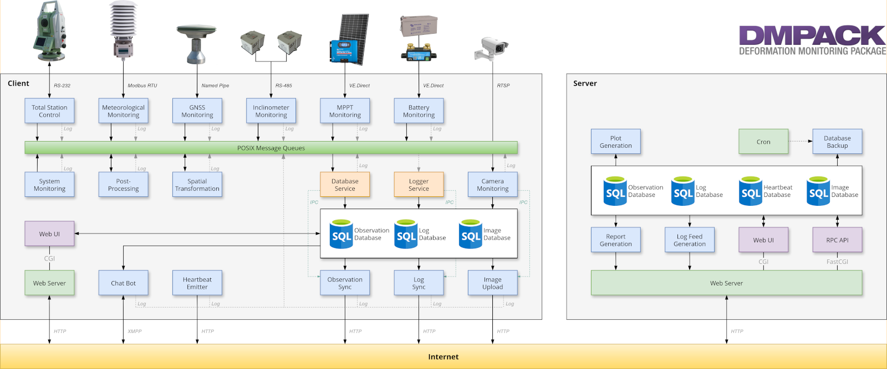

# Deformation Monitoring Package (DMPACK)

[](https://github.com/dabamos/dmpack/actions/workflows/build.yml)

DMPACK is a free and open-source software package for IoT-based automatic
deformation monitoring and distributed control measurements in engineering
geodesy and geotechnics. The project is the successor of
[OpenADMS](https://www.dabamos.de/openadms.html), and in active development.

The library and the accompanying programs are written in Fortran 2018, with
some smaller parts in Lua. At the moment, DMPACK runs on 64-bit Linux and
FreeBSD only.

* [Project Website](https://www.dabamos.de/)
* [User’s Guide](https://www.dabamos.de/dmpack/guide/)
* [Source Code Documentation](https://www.dabamos.de/dmpack/doc/)
* [Source Code Repository](https://github.com/dabamos/dmpack)

## Description

DMPACK is a scientific monitoring system developed for automated control
measurements of buildings, infrastructure, terrain, geodetic nets, and other
objects. The software runs on sensor nodes, usually industrial embedded systems
or single-board computers, and obtains observation data from arbitrary sensors,
like robotic total stations, digital levels, inclinometers, weather stations, or
GNSS receivers. The raw sensor data is then processed, stored, and optionally
transmitted to a server. The software package may be used to monitor objects
like:

* bridges, tunnels, dams
* landslides, cliffs, glaciers
* construction sites, mining areas
* churches, monasteries, and other heritage buildings

DMPACK is built around the relational SQLite database for time series and log
storage on client and server. The server component is optional. It is possible
to run DMPACK on clients only, without data distribution. The client-side
inter-process communications are based on POSIX message queues and POSIX
semaphores.

## System Architecture



## Features

DMPACK includes modules for:

* command-line argument parsing
* configuration file evaluation
* sensor control (RS-232/422/485, 1-Wire, file system, sub-process)
* regular expression matching
* message passing via POSIX message queues
* inter-process communication via POSIX semaphores
* SQLite database access
* data serialisation (ASCII, CSV, JSON, JSON Lines, HDF5, Fortran 95 Namelist)
* HTTP-RPC API for remote procedure calls
* concurrent data synchronisation between client and server
* distributed logging
* client status messages (heartbeats)
* server-side web applications
* GeoCOM API for Fortran and Lua
* time series plotting
* MQTT connectivity
* Lua scripting
* HTML5 reports
* Atom XML web feeds
* e-mail

## Requirements

DMPACK has the following requirements:

* Linux or FreeBSD operating system
* 64-bit platform (x86-64, AArch64)
* Fortran 2018 and ANSI C compiler (GCC, Intel oneAPI)

Third-party dependencies have to be present to build and run the software of
this package:

* FastCGI
* Gnuplot
* HDF5
* LAPACK
* libcurl
* Lua 5.4
* PCRE2
* SQLite 3
* zlib

On Linux, additional development headers are required for the build step. To
generate the [man pages](adoc/README.md), the [user’s guide](guide/README.md),
and the source code documentation, you will need to install:

* [AsciiDoctor](https://asciidoctor.org/), [Pygments](https://pygments.org/), and
  [pygments.rb](https://rubygems.org/gems/pygments.rb/versions/2.2.0)
* [FORD](https://github.com/Fortran-FOSS-Programmers/ford)

## Program Overview

The following programs are based on the DMPACK library.

| Name                           | Description                                                         |
|--------------------------------|---------------------------------------------------------------------|
| [dmapi](adoc/dmapi.adoc)       | FastCGI-based HTTP-RPC API service.                                 |
| [dmbackup](adoc/dmbackup.adoc) | Creates online backups of DMPACK databases.                         |
| [dmbeat](adoc/dmbeat.adoc)     | Sends status messages (heartbeats) periodically to RPC service.     |
| [dmdb](adoc/dmdb.adoc)         | Stores observations received from message queue in database.        |
| [dmdbctl](adoc/dmdbctl.adoc)   | Command-line interface to observation databases.                    |
| [dmexport](adoc/dmexport.adoc) | Exports database records to file.                                   |
| [dmfeed](adoc/dmfeed.adoc)     | Creates Atom feeds in XML format from log messages.                 |
| [dmfs](adoc/dmfs.adoc)         | Reads sensor values from file system (file, named pipe, OWFS).      |
| [dmgraph](adoc/dmgraph.adoc)   | Generates plots from observations in database.                      |
| [dmimport](adoc/dmimport.adoc) | Imports CSV file into database.                                     |
| [dminfo](adoc/dminfo.adoc)     | Prints system and database information as key-value pairs.          |
| [dminit](adoc/dminit.adoc)     | Creates and initialises DMPACK databases.                           |
| [dmlog](adoc/dmlog.adoc)       | Sends log messages to logger via message queue.                     |
| [dmlogger](adoc/dmlogger.adoc) | Stores log messages received from message queue in database.        |
| [dmlua](adoc/dmlua.adoc)       | Runs Lua script to handle observations received from message queue. |
| [dmpipe](adoc/dmpipe.adoc)     | Reads sensor values from sub-process.                               |
| [dmrecv](adoc/dmrecv.adoc)     | Receives logs and observations from message queue.                  |
| [dmreport](adoc/dmreport.adoc) | Creates HTML reports of plots and/or log messages.                  |
| [dmsend](adoc/dmsend.adoc)     | Sends observations and logs to message queue.                       |
| [dmserial](adoc/dmserial.adoc) | Reads sensor values from serial port.                               |
| [dmsync](adoc/dmsync.adoc)     | Synchronises local databases with RPC API (from client to server).  |
| [dmuuid](adoc/dmuuid.adoc)     | Generates UUID4s.                                                   |
| [dmweb](adoc/dmweb.adoc)       | CGI-based web user interface for database access (client, server).  |

## Installation

The DMPACK library and programs have to be built from source by either executing
the provided Makefile, or by using the
[Fortran Package Manager](https://fpm.fortran-lang.org/). See the
[User’s Guide](https://www.dabamos.de/dmpack/guide/#_installation) for complete
installation instructions.

### FreeBSD

First, install the build and run-time dependencies:

```
$ doas pkg install databases/sqlite3 devel/git devel/pcre2 devel/pkgconf ftp/curl lang/gcc \
  lang/lua54 math/gnuplot math/lapack science/hdf5 www/fcgi
```

Instead of `math/gnuplot`, you may want to install `math/gnuplot-lite` which
does not depend on X11 (but lacks raster graphic terminals).

In order to generate the man pages and the User’s Guide, install Pygments and
AsciiDoctor:

```
$ doas pkg install devel/rubygem-pygments.rb textproc/rubygem-asciidoctor
```

The Git repository has to be cloned recursively. Otherwise, your will need to
download the sub-modules manually by executing `fetchvendor.sh`. Then, run the
Makefile:

```
$ git clone --depth 1 --recursive https://github.com/dabamos/dmpack
$ cd dmpack/
$ make freebsd
```

You can change the installation prefix with argument `PREFIX` (by default,
`/usr/local`). To install the library and all programs system-wide, run:

```
$ doas make install PREFIX=/opt
```

For a debug build with AddressSanitizer (ASan) to detect memory errors, run
instead:

```
$ make freebsd_debug DEBUG="-g -fPIE -ffpe-trap=invalid,zero,overflow -fno-omit-frame-pointer" \
  LDLIBS="-pie -static-libasan -fsanitize=address -fno-omit-frame-pointer"
```

### Linux

On Debian, install GCC, GNU Fortran, and the build environment:

```
$ sudo apt install gcc gfortran git make pkg-config
```

The third-party dependencies have to be installed with development headers:

```
$ sudo apt install --no-install-recommends libblas-dev liblapack-dev \
  curl libcurl4 libcurl4-openssl-dev libfcgi-bin libfcgi-dev gnuplot \
  libhdf5-dev lua5.4 liblua5.4 liblua5.4-dev libpcre2-8-0 libpcre2-dev \
  sqlite3 libsqlite3-dev zlib1g zlib1g-dev
```

Instead of package `gnuplot`, you can install the no-X11 flavour `gnuplot-nox`
alternatively, if raster image formats are not desired (SVG output only).

Clone the DMPACK repository recursively, or download the master branch and run
`fetchvendor.sh`, then execute the Makefile:

```
$ git clone --depth 1 --recursive https://github.com/dabamos/dmpack
$ cd dmpack/
$ make linux
```

Install the library and all programs system-wide:

```
$ sudo make install_linux
```

To install to a custom directory, run:

```
$ sudo make install PREFIX=/opt
```

### Updates

Update the cloned source code repository and its submodules with Git:

```
$ git pull
$ git submodule update --remote
$ make purge
$ make [freebsd|linux]
```

## Library

| Name           | Description            |
|----------------|------------------------|
| `libdmpack.a`  | DMPACK static library. |
| `libdmpack.so` | DMPACK shared library. |

Either link your programs against static library `libdmpack.a`, or `-ldmpack` if
`libdmpack.so` is in your library search path, for example:

```
$ gfortran -I/usr/local/include/dmpack -o example example.f90 /usr/local/lib/libdmpack.a
```

Depending on which parts of the DMPACK library are used by third-party
applications, additional shared libraries have to be linked. The directory
containing the DMPACK module files is passed through argument `-I`.

| Module         | Libraries     | Linker Libraries                                      |
|----------------|---------------|-------------------------------------------------------|
| `dm_config`    | Lua 5.4       | `pkg-config --libs lua-5.4`                           |
| `dm_db`        | SQLite 3      | `pkg-config --libs sqlite3`                           |
| `dm_fcgi`      | FastCGI       | `-lfcgi`                                              |
| `dm_hdf5`      | HDF5          | `pkg-config --libs hdf5`, `-lhdf5_fortran`            |
| `dm_la`        | BLAS, LAPACK  | `-llapack`, `-lblas`                                  |
| `dm_lua`       | Lua 5.4       | `pkg-config --libs lua-5.4`                           |
| `dm_mail`      | libcurl       | `curl-config --libs`                                  |
| `dm_mqtt`      | libcurl       | `curl-config --libs`                                  |
| `dm_mqueue`    | POSIX         | `-lrt`                                                |
| `dm_mutex`     | POSIX         | `-lpthread`                                           |
| `dm_regex`     | PCRE2         | `pkg-config --libs libpcre2-8`                        |
| `dm_rpc`       | libcurl, zlib | `curl-config --libs`, `pkg-config --libs zlib`        |
| `dm_sem`       | POSIX         | `-lpthread`                                           |
| `dm_z`         | zlib          | `pkg-config --libs zlib`                              |

## Source Code Structure

| Path       | Description                                          |
|------------|------------------------------------------------------|
| `adoc/`    | AsciiDoc source files of man pages.                  |
| `app/`     | Source of programs based on DMPACK.                  |
| `config/`  | Example configuration files.                         |
| `dist/`    | DMPACK libraries and executables.                    |
| `doc/`     | Source code documentation generated by FORD.         |
| `etc/`     | Init scripts for Linux and FreeBSD.                  |
| `guide/`   | User’s Guide source and output files.                |
| `include/` | Fortran module files (required for linking).         |
| `lib/`     | Fortran interface libraries (required for linking).  |
| `man/`     | Generated man pages (includes HTML and PDF exports). |
| `share/`   | Example files, style sheets, scripts, and so on.     |
| `src/`     | Source of DMPACK library modules.                    |
| `test/`    | Test programs for DMPACK modules.                    |
| `vendor/`  | Third-party dependencies.                            |

## Manual Pages

To create all DMPACK man pages from source, run:

```
$ make man
```

The output files are written to `man/`.

## User’s Guide

To convert the [User’s Guide](guide/guide.adoc) from AsciiDoc to HTML, run:

```
$ make guide
```

The result is written to `guide/guide.html`.

## Source Code Documentation

The source code documentation of the DMPACK library has to be created with
[FORD](https://github.com/Fortran-FOSS-Programmers/ford). Install the Python
package with:

```
$ python3 -m pip install -U ford
```

In the DMPACK repository, run:

```
$ make doc
```

The HTML files will be written to directory `doc/`. Open `index.html` in a web
browser.

## Test Programs

The DMPACK test programs are compiled by default. In order to run the RPC API
program `dmtestrpc`, set the hostname and the credentials of the server first:

```
$ export DM_API_HOST="localhost"
$ export DM_API_USERNAME="dummy-node"
$ export DM_API_PASSWORD="secret"
```

The following environment variables have to be set for `dmtestmail`:

```
$ export DM_MAIL_FROM="from@example.com"
$ export DM_MAIL_TO="to@example.com"
$ export DM_MAIL_HOST="example.com"
$ export DM_MAIL_USERNAME="username"
$ export DM_MAIL_PASSWORD="password"
```

The program `dmtestmqtt` requires host and port of the MQTT server:

```
$ export DM_MQTT_HOST="localhost"
$ export DM_MQTT_PORT="1883"
```

If not set, the affected tests will be skipped. To skip the pipe, plotting, and
message queue tests, set:

```
$ export DM_MQUEUE_SKIP=1
$ export DM_PIPE_SKIP=1
```

You may want to uncomment the variables in `runtest.sh`. Run all test programs
with:

```
$ sh runtests.sh
```

To write the test protocols to file, disable coloured output first by setting
the environment variable `NO_COLOR`:

```
$ export NO_COLOR=1
$ sh runtests.sh &> tests.log
```

## Licence

ISC
