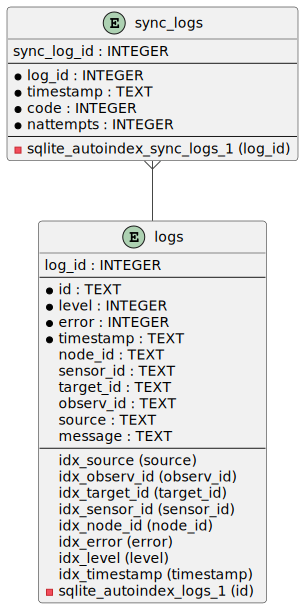

:description: DMPACK User’s Guide
:author: Philipp Engel
:copyright: CC BY 4.0
:orgname: DABAMOS
:revnumber: 0.9.4
:lang: en
:docdate: 2024-02-18
:doctype: book
:url-org: https://dabamos.de/
:url-project: {url-org}dmpack
:imagesdir: resources/images/
:data-uri:
:source-highlighter: pygments
:pygments-style: lovelace
:toc: left
:toclevels: 2
:xrefstyle: short
:table-caption!:

= DMPACK User’s Guide

== Project Description

The *Deformation Monitoring Package* (*DMPACK*) is a free and open source
software package for sensor control and automated time series processing in
geodesy and geotechnics. The package consists of a library _libdmpack_ and
additional programs based on it which serve as a reference implementation of
solutions to various problems in deformation monitoring, such as:

* sensor control
* sensor data parsing and processing
* database access
* remote procedure calls
* data synchronisation and export
* spatial transformations
* time series analysis
* plotting and reporting
* web-based data access
* distributed logging
* MQTT connectivity
* scripting
* e-mail

DMPACK is a scientific monitoring system developed for automated control
measurements of buildings, infrastructure, terrain, geodetic nets, and other
objects. The software runs on sensor nodes, usually industrial embedded systems
or single-board computers, and obtains observation data from arbitrary sensors,
like total stations, digital levels, inclinometers, weather stations, or GNSS
receivers. The raw sensor data is then processed, stored, and optionally
transmitted to a server. The software package may be used to monitor objects
like:

* bridges, tunnels, dams
* landslides, cliffs, glaciers
* construction sites, mining areas
* churches, monasteries, and other heritage buildings

DMPACK is built around the relational SQLite database for time series and log
storage on client and server. The server component is optional. It is possible
to run DMPACK on clients only, without data distribution. The client-side
message passing is based on POSIX message queues and POSIX semaphores.

Currently, only 64-bit Linux and FreeBSD are supported as operating systems.

* link:https://www.dabamos.de/[Project Website]
* link:https://www.dabamos.de/dmpack/guide/[User’s Guide]
* link:https://www.dabamos.de/dmpack/doc/[Source Code Documentation]
* link:https://github.com/dabamos/dmpack[Source Code Repository]

== Software Architecture

.Schematic view of the DMPACK client–server architecture
[#img-schema]
image::schema.png[schema,align="center"]

== Similar Software

There are similar open source projects that provide middleware for autonomous
sensor networks:

link:https://github.com/52North/SOS[52°North Sensor Observation Service]::
The reference implementation of the OGC Sensor Observation Service (SOS) in
Java, by 52°North Spatial Information Research GmbH. Offers an interoperable
interface for publishing and querying sensor data and meta data. Additional
client applications enable analysis and visualisation of the measurement data.
(GPLv2)
link:https://github.com/lpgera/argus[Argus]:: A non-geodetic sensor data
monitoring and alerting solution built with Node.js, MariaDB, and React. (MIT)
link:https://github.com/FraunhoferIOSB[FROST]:: Fraunhofer Open Source
SensorThings (FROST) is the reference implementation of the OGC SensorThings API
in Java. The project provides an HTTP- and MQTT-based message bus for data
transmission between client and server. Developed by Fraunhofer-Institut für
Optronik, Systemtechnik und Bildauswertung (IOSB). (LGPLv3)
link:https://github.com/LSIR/gsn[Global Sensor Networks]:: A Java-based software
middleware designed to facilitate the deployment and programming of sensor
networks, by Distributed Information Systems Laboratory (EPFL), Switzerland.
Further development appears to have been stopped. (GPLv3)
link:http://istsos.org/[istSOS]:: A server implementation of the
OGC Sensor Observation Service in Python, for managing and dispatching
observations from monitoring sensors. The project also provides a graphical user
interface and a RESTful web API to automate administration procedures. Developed
by Istituto Scienze della Terra, University of Applied Sciences and Arts of
Southern Switzerland. (GPLv2)
link:https://github.com/daq-tools/kotori[Kotori]:: A multi-channel,
multi-protocol, telemetry data acquisition and graphing toolkit for time-series
data processing in Python. It supports scientific environmental monitoring
projects, distributed sensor networks, and likewise scenarios. (AGPLv3)
link:https://www.dabamos.de/openadms.html[OpenADMS]:: The Open Automatic
Deformation Monitoring software is an IoT sensor network middleware in Python 3.
The system was developed as a prototype of DMPACK and includes client and server
programs. (BSD)
link:https://github.com/opensensorhub[OpenSensorHub]:: Java-based middleware
for building Sensor Webs in the Internet of Things. Based on OGC standards from
the Sensor Web Enablement (SWE) initiative. (MPLv2)
link:https://github.com/project-mjolnir[Project Mjolnir]:: An open source
client–server IoT architecture for scientific sensor networks written in
Python, by University of Alabama in Huntsville and NASA. Includes a sensor
client for data logging, uplink and control, as well as a server component to
store, serve/display, and monitor data from remote sensors. (MIT)
link:http://www.agt.bme.hu/ulyxes/[Ulyxes]:: An open source project in Python to
control robotic total stations (RTS) and other sensors, and to publish
observation results on web based maps. Developed at the Department of Geodesy
and Surveying of the Budapest University of Technology and Economics. (GPLv2)

== Requirements

DMPACK has the following requirements:

* Linux or FreeBSD operating system
* 64-bit platform (x86-64, AArch64)
* Fortran 2018 and ANSI C compiler (GCC, Intel oneAPI)

Additional dependencies have to be present to build and run the software of this
package:

* FastCGI
* Gnuplot
* HDF5
* LAPACK
* libcurl (≥ 8.5)
* Lua 5.4
* PCRE2
* SQLite 3 (≥ 3.39.0)
* zlib

To generate the man pages, the User’s Guide, and the source code documentation,
you will also need:

* link:https://asciidoctor.org/[AsciiDoctor],
  link:https://pygments.org/[Pygments], and
  link:https://rubygems.org/gems/pygments.rb/versions/2.2.0[pygments.rb]
* link:https://github.com/Fortran-FOSS-Programmers/ford[FORD]

DMPACK depends on the following interface libraries:

* link:https://github.com/interkosmos/fortran-curl[fortran-curl]
* link:https://github.com/interkosmos/fortran-lua54[fortran-lua54]
* link:https://github.com/interkosmos/fortran-pcre2[fortran-pcre2]
* link:https://github.com/interkosmos/fortran-sqlite3[fortran-sqlite3]
* link:https://github.com/interkosmos/fortran-unix[fortran-unix]
* link:https://github.com/interkosmos/fortran-zlib[fortran-zlib]

If the repository is cloned recursively with Git, or if the project is built
using FPM, the submodules will be downloaded automatically. Without Git or FPM,
this step has to be done manually by executing `fetchvendor.sh`, for example:

....
$ curl -L -s -o master.zip https://github.com/dabamos/dmpack/archive/refs/heads/master.zip
$ unzip master.zip
$ cd dmpack-master/
$ sh fetchvendor.sh
$ make [freebsd|linux]
....

The shell script requires _curl(1)_ and _unzip(1)_.

== Installation

This section describes how to build the DMPACK library and programs from source,
with POSIX Make or the link:https://fpm.fortran-lang.org/[Fortran Package Manager]
(FPM). At the moment, support for the Fortran Package Manager is experimental.
The shared libraries `libgfortran.so` and `libquadmath.so` must be present on
the target system if the DMPACK programs have been compiled with GNU Fortran.

Either build with GNU/BSD Make or with the Fortran Package Manager. It is
recommended to use _make(1)_. To display the available build targets, run:

....
$ make help
....

Or, to output the selected build options, run for instance:

....
$ make options PREFIX=/opt
....

See section <<system-configuration>> on how to configure the operating system
after the installation.

=== FreeBSD [[freebsd]]

First, install the build and run-time dependencies:

....
$ doas pkg install databases/sqlite3 devel/git devel/pcre2 devel/pkgconf ftp/curl \
  lang/gcc lang/lua54 math/gnuplot math/lapack science/hdf5 www/fcgi
....

Instead of `math/gnuplot`, you may want to install `math/gnuplot-lite` which
does not depend on X11 (but lacks the raster graphic terminals). Optionally,
install Pygments and AsciiDoctor to generate the man pages and the User’s Guide:

....
$ doas pkg install devel/rubygem-pygments.rb textproc/rubygem-asciidoctor
....

==== Make [[freebsd-make]]

The repository has to be cloned recursively. Execute the Makefile with build
target `freebsd`:

....
$ git clone --depth 1 --recursive https://github.com/dabamos/dmpack
$ cd dmpack/
$ make freebsd
....

Install the library and all programs system-wide to `/usr/local/`:

....
$ doas make install_freebsd
....

You can change the installation prefix with argument `PREFIX`. To install to a
custom directory, run:

....
$ doas make install PREFIX=/opt
....

.Default paths on FreeBSD
[cols="3,6"]
|===
| Path                         | Description

| `/usr/local/bin/`            | DMPACK programs.
| `/usr/local/etc/dmpack/`     | DMPACK configuration files.
| `/usr/local/include/dmpack/` | DMPACK module files.
| `/usr/local/lib/`            | DMPACK libraries.
| `/usr/local/man/man1/`       | DMPACK man pages.
| `/usr/local/share/dmpack/`   | DMPACK examples, scripts, style sheets.
| `/var/dmpack/`               | DMPACK databases.
| `/var/www/`                  | WWW root directory.
|===

==== Fortran Package Manager [[freebsd-fpm]]

Either clone the repository with Git, or download the archive of the
link:https://github.com/dabamos/dmpack/archive/refs/heads/master.zip[master branch].
Then, run:

....
$ cd dmpack/
$ export FFLAGS="-D__FreeBSD__ -I/usr/local/include -ffree-line-length-0"
$ fpm build --profile release --flag "${FFLAGS}"
$ fpm test --flag "${FFLAGS}"
$ fpm install
....

The Fortran Package Manager will fetch all third-party dependencies
automatically, but the configuration and shared files have to be installed
manually. The library and programs will be installed to `~/.local/` by default.

=== Linux [[linux]]

If Intel oneAPI will be used to compile DMPACK, it is necessary to build HDF5
from source as well, as the versions in the Linux package repositories have been
compiled with GNU Fortran and are therefore incompatible.

On Debian, install GCC, GNU Fortran, and the rest of the build environment
first:

....
$ sudo apt install gcc gfortran git make pkg-config
....

The third-party dependencies have to be installed with development headers:

....
$ sudo apt install --no-install-recommends libblas-dev liblapack-dev \
  curl libcurl4 libcurl4-openssl-dev libfcgi-bin libfcgi-dev gnuplot \
  libhdf5 libhdf5-dev lua5.4 liblua5.4 liblua5.4-dev libpcre2-8-0 \
  libpcre2-dev sqlite3 libsqlite3-dev zlib1g zlib1g-dev
....

Instead of package `gnuplot`, you can install the no-X11 flavour `gnuplot-nox`
if raster image formats are not needed (SVG output only). The SQLite 3 package
version must be ≥ 3.39.0. Depending on the package repository, the names of the
HDF5 and Lua packages may differ.

==== Make [[linux-make]]

Clone the DMPACK repository recursively, and execute the Makefile with build
target `linux`:

....
$ git clone --depth 1 --recursive https://github.com/dabamos/dmpack
$ cd dmpack/
$ make linux
....

Install the DMPACK libraries and programs system-wide to `/usr`:

....
$ sudo make install_linux
....

To install to directory `/opt`, run:

....
$ sudo make install PREFIX=/opt
....

[NOTE]
.Custom SQLite 3
====
If the SQLite 3 library has been built from source and installed to
`/usr/local/lib`, overwrite the variable `LIBSQLITE3` to pass the path of shared
library `libsqlite3.so`:

....
$ make OS=linux PREFIX=/usr LIBSQLITE3="-L/usr/local/lib -lsqlite3"
....
====

[NOTE]
.Intel oneAPI Compilers
====
If Intel oneAPI is used instead of GCC, run:

....
$ make CC=icx FC=ifx PPFLAGS= \
  CFLAGS="-mtune=native -O2 -fpic" FFLAGS="-mtune=native -O2 -fpic" \
  LDFLAGS="-module ./include -I./include" \
  INCHDF5="-I/opt/include" \
  LIBHDF5="-Wl,-rpath,/opt/lib -L/opt/lib -lhdf5_fortran -lhdf5"
....

In this case, the HDF5 libraries are installed to `/opt/lib/`, and the HDF5
modules files to `/opt/include/`. Change the paths to the actual locations.
====

==== Fortran Package Manager [[linux-fpm]]

To build DMPACK with the Fortran Package Manager, change to the cloned or
fetched repository, then run:

....
$ cd dmpack/
$ export FFLAGS="-D__linux__ `pkg-config --cflags hdf5` -ffree-line-length-0"
$ fpm build --profile release --flag "${FFLAGS}"
$ fpm test --flag "${FFLAGS}"
$ fpm install
....

The library and programs will be installed to directory `~/.local/` by default.
If the compilation fails with an error message that `-llua-5.4` cannot be
found, update the build manifests first:

....
$ sed -i "s/lua-5/lua5/g" fpm.toml
$ sed -i "s/lua-5/lua5/g" build/dependencies/fortran-lua54/fpm.toml
....

== Deformation Monitoring Entities [[entities]]

The data structures of DMPACK are based on the following entities. The
internally used date and time format is a 32-characters long ISO 8601 time stamp
in microsecond resolution, with time separator `T` and mandatory GMT offset, for
example, `1970-01-01T00:00:00.000000+00:00`.

=== Observation Entities

<<data-node,Node>>:: A unique sensor node within a sensor network. Contains id,
name, description, and optional position.
<<data-sensor,Sensor>>:: A unique sensor attached to a _node_, with id, name,
description, and optional position.
<<data-target,Target>>:: A unique measurement target (point of interest,
location) with id, name, description, and optional position. Multiple nodes and
sensors may share a single target.
<<data-observ,Observation>>:: A single measurement identified by name and unique
UUID4 that contains requests to and responses from a sensor, referencing a
_node_, a _sensor_, and a _target_. An observation can contain up to 8 requests
which will be sent to the sensor in sequential order.
<<data-request,Request>>:: Command to send to the sensor, referencing an
_observation_ and ordered by index. A request can contain up to 16 _responses_.
<<data-response,Response>>:: Floating-point values in the raw response of a
_sensor_ can be matched by regular expression groups. Each matched group is
stored as a response. Responses reference a _request_, and are ordered by index.
They contain name, type, value, unit, and an optional error code.

=== Log Entities

<<data-log,Log>>:: Log message of a sensor node, either of level _debug_,
_info_, _warning_, _error_, or _critical_, and optionally related to a _sensor_,
a _target_, and an _observation_.

=== Beat Entities

<<data-beat,Beat>>:: Short status message (heartbeat, handshake) that contains
node id, client address, client version, time stamp, system uptime, and last
connection error, sent periodically from client to server.

=== RPC Entities

<<data-api,API Status>>:: Short key–value response of the HTTP-RPC API service
in plain-text format.

== Program Overview

DMPACK includes programs for sensor I/O, database management, observation
processing, and other tasks related to automated control measurements. The
programs may be classified into the following categories.

=== Databases

<<dmbackup>>:: Creates an online backup of a database by either using the
SQLite backup API or `VACUUM INTO`.
<<dmdb>>:: Stores observations received from POSIX message queue in a SQLite
database.
<<dmdbctl>>:: A command-line interface to the DMPACK observation database, to
read, add, update, or delete nodes, sensors, and targets.
<<dmexport>>:: Exports beats, nodes, sensors, targets, observations, and
logs from database to file, either in CSV, JSON, or JSON Lines format.
<<dmimport>>:: Imports nodes, sensors, targets, observations, and logs from CSV
file into database.
<<dminit>>:: Creates and initialises SQLite observation, log, and beat
databases.
<<dmlogger>>:: Stores logs received from POSIX message queue in a SQLite
database.

=== Message Passing

<<dmlog>>:: A utility program to send log messages from command-line or
shell script to the POSIX message queue of a <<dmlogger>> process, to be stored
in the log database.
<<dmrecv>>:: Receives logs or observations from POSIX message queue and writes
them to _stdout_, file, or named pipe.
<<dmsend>>:: Sends observations or logs from file to a DMPACK application via
POSIX message queue.

=== Observation Processing

<<dmlua>>:: Runs a custom Lua script to process an observation and forward it
to the next specified receiver.

=== Plots & Reports

<<dmplot>>:: Creates line plots of time series read from database, with output
to file, terminal, or X11 window. Uses _gnuplot(1)_ internally as plotting
backend.
<<dmreport>>:: Creates HTML reports containing plots and optionally log
messages.

=== Remote Procedure Calls

<<dmapi>>:: A FastCGI-based HTTP-RPC service that provides an API for node,
sensor, target, observation, and log synchronisation, as well as heartbeat
transmission. Clients may either send records to be stored in the server
database, or request data of a given time range. Depending on the HTTP Accept
header, the server returns data in CSV, JSON, JSON Lines or Namelist format.
Requires a FastCGI-compatible web server, such as _lighttpd(1)_.
<<dmbeat>>:: Sends short status messages (heartbeats) periodically to a remote
<<dmapi>> instance.
<<dmsync>>:: Synchronises nodes, sensors, targets, observations, and log
messages between client and <<dmapi>> server. Only uni-directional
synchronisation from client to server is supported.

=== Sensor Control

<<dmfs>>:: Reads sensor data from virtual file system, file, or named pipe. The
program be used to read values from sensors connected via 1-Wire (OWFS).
Observations are forwarded via POSIX message queue and/or written to file.
<<dmpipe>>:: Executes a program as a sub-process connected through an anonymous
pipe and forwards the output via POSIX message queue. Optionally, observations
are written to file or _stdout_.
<<dmserial>>:: Connects to a TTY/PTY serial port for sensor communication. The
program sends requests to a connected sensor to receive responses. The program
pre-processes the response data using regular expressions and forwards
observations via POSIX message queue.

=== Utilities

<<dminfo>>:: Prints system and database information as key–value pairs to
standard output.
<<dmuuid>>:: A command-line tool to generate UUID4 identifiers (by default in
hex format without hyphens).

=== Web

<<dmfeed>>:: Creates an
link:https://en.wikipedia.org/wiki/Atom_(web_standard)[Atom] syndication feed
in XML format (RFC 4287) from logs of given sensor node and log level. If the
feed is served by a web server, clients can subscribe to it by using a feed
reader or news aggregator. The program may be executed periodically as a cron
job.
<<dmweb>>:: A CGI-based web user interface for DMPACK database access on
client and server. Requires a web server and _gnuplot(1)_.

== Programs

Some programs read settings from an optional or mandatory configuration file.
Examples of configuration files are provided in directory
`/usr/local/etc/dmpack/`. The configuration file format is based on Lua tables
and is scriptable. Comments in the configuration file start with `--`.

You may want to enable Lua syntax highlighting in your editor (for instance,
`set syntax=lua` in Vim), or use the file ending `.lua` instead of `.conf`.

=== dmapi [[dmapi]]

*dmapi* is an HTTP-RPC API service for remote DMPACK database access. The web
application has to be executed through a FastCGI-compatible web server or a
FastCGI spawner. It is recommended to run _lighttpd(1)_.

The *dmapi* service offers endpoints for clients to insert beats, logs, and
observations into the local SQLite database, and to request data in CSV or JSON
format. Authentication and encryption are independent from *dmapi* and have to
be provided by the web server.

All POST data has to be serialised in Fortran 95 Namelist format, with optional
deflate compression.

If HTTP Basic Auth is enabled, the sensor id of each beat, log, node, sensor,
and observation sent to the HTTP-RPC service must match the name of the
authenticated user. For example, to store an observation of a node with the id
`node-1`, the HTTP Basic Auth user name must equal the node id. If the
observation is sent by any other user, it will be rejected (HTTP 401).

.Environment variables of _dmapi(1)_
[[dmapi-env]]
[cols="4,12"]
|===
| Environment Variable | Description

| `DM_DB_BEAT`         | Path to heartbeat database (required).
| `DM_DB_LOG`          | Path to log database (required).
| `DM_DB_OBSERV`       | Path to observation database (required).
| `DM_READ_ONLY`       | Set to `1` to enable read-only database access.
|===

The web application is configured through environment variables. The web server
or FastCGI spawner must be able to pass environment variables to *dmapi*. See
<<web-rpc-server>> for an example configuration.

The service accepts HTTP GET and POST requests. Section <<rpc-api>> gives an
overview of the available endpoints. The response format depends on the MIME
type set in the HTTP Accept header of the request, either:

* `application/json` (JSON)
* `application/jsonl` (JSON Lines)
* `application/namelist` (Fortran 95 Namelist)
* `text/comma-separated-values` (CSV)

By default, responses are in CSV format. The Namelist format is available only
for single records. Status messages are returned as key–value pairs, signaled by
MIME type `text/plain`.

=== dmbackup [[dmbackup]]

The *dmbackup* utility creates an online backup of a running SQLite database. By
default, the SQLite backup API is used. The program is functional equivalent to
running the _sqlite3(1)_ command-line interface:

....
$ sqlite3 <database> ".backup '<output>'"
....

*dmbackup* does not replace existing backup databases.

==== Command-Line Options

[cols="3,1,1,7"]
|===
| Option              | Short | Default | Description

| `--backup _file_`   | `-b`  | –       | Path of the backup database.
| `--database _file_` | `-d`  | –       | Path of the SQLite database to backup.
| `--help`            | `-h`  | –       | Output available command-line arguments and quit.
| `--vacuum`          | `-U`  | off     | Use `VACUUM INTO` instead of the SQLite backup API.
| `--verbose`         | `-V`  | off     | Print backup progess (not in vacuum mode).
| `--version`         | `-v`  | –       | Output version information and quit.
| `--wal`             | `-W`  | off     | Enable WAL journal for backup database.
|===

==== Examples

Create an online backup of an observation database:

....
$ dmbackup --database /var/dmpack/observ.sqlite --backup /tmp/observ.sqlite
....

=== dmbeat [[dmbeat]]

The *dmbeat* program is a heartbeat emitter that sends <<data-beat,heartbeats>>
or handshakes via HTTP POST to a remote <<dmapi>> service. The heartbeat
messages include time stamp, system uptime, and last connection error. The
server may inspect this data to check if a client is still running and has
network access. The RPC endpoint is expected at
`[http|https]://<host>:<port>/api/v1/beat`.

Passing the server credentials via the command-line arguments `--username` and
`--password` is insecure on multi-user operating systems and only recommended
for testing.

==== Command-Line Options

[cols="3,1,1,7"]
|===
| Option                 | Short | Default  | Description

| `--config _file_`      | `-c`  | –        | Path to configuration file.
| `--count _n_`          | `-C`  | 0        | Maximum number of heartbeats to send (unlimited if `0`).
| `--debug`              | `-D`  | off      | Forward log messages of level _debug_ via IPC (if logger is set).
| `--help`               | `-h`  | –        | Output available command-line arguments and quit.
| `--host _host_`        | `-H`  | –        | IP or FQDN of HTTP-RPC host (for instance, `127.0.0.1` or `iot.example.com`).
| `--interval _seconds_` | `-I`  | 0        | Emit interval in seconds.
| `--logger _name_`      | `-l`  | –        | Optional name of logger. If set, sends logs to <<dmlogger>> process of given name.
| `--name _name_`        | `-n`  | `dmbeat` | Optional name of instance and table in given configuration file.
| `--node _id_`          | `-N`  | –        | Node id.
| `--password _string_`  | `-P`  | –        | HTTP-RPC API password.
| `--port _port_`        | `-p`  | 0        | Port of HTTP-RPC API server. The default `0` selects the port automatically.
| `--tls`                | `-X`  | off      | Use TLS encryption.
| `--username _string_`  | `-U`  | –        | HTTP-RPC API user name. If set, implies HTTP Basic Auth.
| `--verbose`            | `-V`  | off      | Print log messages to _stderr_.
| `--version`            | `-v`  | –        | Output version information and quit.
|===

==== Examples

Send a single heartbeat to a <<dmapi>> service on `localhost`:

....
$ dmbeat --node dummy-node --host 127.0.0.1 --count 1 --verbose
....

A sensor node with id `dummy-node` must exist in the server database. The
web application <<dmweb>> lists the beats received by the server.

=== dmdb [[dmdb]]

The *dmdb* program collects observations from a POSIX message queue and
stores them in a SQLite database. The name of the message queue equals the
given *dmdb* name, by default `dmdb`. The IPC option enables process
synchronisation via POSIX semaphores. The value of the semaphore is changed
from 0 to 1 if a new observation has been received. The name of the semaphore
equals the *dmdb* name. Only a single process may wait for the semaphore.

==== Command-Line Options

[cols="2,1,1,7"]
|===
| Option              | Short | Default | Description

| `--config _file_`   | `-c`  | –       | Path to configuration file.
| `--database _file_` | `-d`  | –       | Path to SQLite observation database.
| `--debug`           | `-D`  | off     | Forward log messages of level _debug_ via IPC (if logger is set).
| `--help`            | `-h`  | –       | Output available command-line arguments and quit.

| `--ipc`
| `-Q`
| off
| Uses a POSIX semaphore for process synchronisation. The name of the semaphore
matches the instance name (with leading `/`). The semaphore is set to 1 whenever
a new observation was received. Only a single process may wait for this
semaphore, otherwise, reading occurs in round-robin fashion.

| `--logger _name_`
| `-l`
| –
| Optional name of logger. If set, sends logs to <<dmlogger>> process of given
name.

| `--name _name_`
| `-n`
| `dmdb`
| Optional name of program instance, configuration, POSIX message queue, and
POSIX semaphore.

| `--node _id_`       | `-N`  | –       | Node id.
| `--verbose`         | `-V`  | off     | Print log messages to _stderr_.
| `--version`         | `-v`  | –       | Output version information and quit.
|===

==== Examples

Create a message queue `/dmdb`, wait for incoming observations, and store them
in the given database:

....
$ dmdb --name dmdb --node dummy-node --database /var/dmpack/observ.sqlite --verbose
....

Log messages and observation ids are printed to _stdout_.

=== dmdbctl [[dmdbctl]]

The *dmdbctl* utility program performs create, read, update, or delete
operations (CRUD) on the observation database.

Create::
  Add nodes, sensors, and targets to the database.

Read::
  Read nodes, sensors, and targets from database. Print the records to standard
  output.

Update::
  Update nodes, sensors, and targets in the database.

Delete::
  Delete nodes, sensors, and targets from the database.

Only nodes, sensors, and targets are supported. All data attributes are passed
through command-line arguments.

==== Command-Line Options

[cols="2,1,1,7"]
|===
| Option              | Short | Default | Description

| `--altitude _z_`    | `-Z`  | –       | Node, sensor, or target altitude (optional).
| `--create _type_`   | `-C`  | –       | Create record of given type (`node`, `sensor`, or `target`).
| `--database _file_` | `-d`  | –       | Path to SQLite observation database (required).
| `--delete _type_`   | `-D`  | –       | Delete record of given type (`node`, `sensor`, or `target`).
| `--easting _x_`     | `-X`  | –       | Node, sensor, or target easting (optional).
| `--help`            | `-h`  | –       | Output available command-line arguments and quit.
| `--id _id_`         | `-I`  | –       | Node, sensor, or target id (required).
| `--meta _meta_`     | `-M`  | –       | Node, sensor, or target meta description (optional).
| `--name _name_`     | `-n`  | –       | Node, sensor, or target name.
| `--node _id_`       | `-N`  | –       | Id of node the sensor is associated with.
| `--northing _y_`    | `-Y`  | –       | Node, sensor, or target northing (optional).
| `--read _type_`     | `-R`  | –       | Read record of given type (`node`, `sensor`, or `target`).
| `--sn _sn_`         | `-Q`  | –       | Serial number of sensor (optional).
| `--state _n_`       | `-S`  | –       | Target state (optional).
| `--type _name_`     | `-t`  | `none`  | <<data-sensor-types,Sensor type>> (`none`, `rts`, `gnss`, …).
| `--update _type_`   | `-U`  | –       | Updates record of given type (`node`, `sensor`, or `target`).
| `--verbose`         | `-V`  | off     | Print additional log messages to _stderr_.
| `--version`         | `-v`  | –       | Output version information and quit.
|===

==== Examples

Add node, sensor, and target to observation database:

....
$ dmdbctl -d observ.sqlite -C node --id node-1 --name "Node 1"
$ dmdbctl -d observ.sqlite -C sensor --id sensor-1 --name "Sensor 1" --node node-1
$ dmdbctl -d observ.sqlite -C target --id target-1 --name "Target 1"
....

Delete a target from the database:

....
$ dmdbctl -d observ.sqlite -D target --id target-1
....

Read attributes of sensor `sensor-1`:

....
$ dmdbctl -d observ.sqlite -R sensor --id sensor-1
sensor.id: sensor-1
sensor.node_id: node-1
sensor.type: virtual
sensor.name: Sensor 1
sensor.sn: 12345
sensor.meta: dummy sensor
sensor.x: 0.000000000000
sensor.y: 0.000000000000
sensor.z: 0.000000000000
....

=== dmexport [[dmexport]]

The *dmexport* program writes beats, logs, nodes, sensors, targets,
observations, and data points from database to file, in ASCII block, CSV, JSON,
or JSON Lines format. The ASCII block format is only available for X/Y data
points. The types data point, log, and observation require a sensor id, a target
id, and a time range in ISO 8601 format.

If no output file is given, the data is printed to standard output. The
output file will be overwritten if it already exists. If no records are found,
an empty file will be created.

.Output file formats
[[dmexport-output]]
[cols="1,5,4"]
|===
| Format  | Supported Types                                           | Description

| `block` | `dp`                                                      | ASCII block format.
| `csv`   | `beat`, `dp`, `log`, `node`, `observ`, `sensor`, `target` | CSV format.
| `json`  | `beat`, `dp`, `log`, `node`, `observ`, `sensor`, `target` | JSON format.
| `jsonl` | `beat`, `dp`, `log`, `node`, `observ`, `sensor`, `target` | JSON Lines format.
|===

==== Command-Line Options

[cols="3,1,1,6"]
|===
| Option               | Short | Default | Description

| `--database _file_`  | `-d`  | –       | Path to SQLite database (required).
| `--format _format_`  | `-f`  | –       | <<dmexport-output,Output file format>> (`block`, `csv`, `json`, `jsonl`).
| `--from _timestamp_` | `-B`  | –       | Start of time range in ISO 8601 (required for types `dp`, `log`, and `observ`).
| `--header`           | `-H`  | off     | Add CSV header.
| `--help`             | `-h`  | –       | Output available command-line arguments and quit.
| `--node _id_`        | `-N`  | –       | Node id (required).
| `--output _file_`    | `-o`  | –       | Path of output file.
| `--response _name_`  | `-R`  | –       | Response name for type `dp`.
| `--sensor _id_`      | `-S`  | –       | Sensor id (requied for types `dp` and `observ`).
| `--separator _char_` | `-s`  | `,`     | CSV separator character.
| `--target _id_`      | `-T`  | –       | Target id (required for types `dp` and `observ`).
| `--to _timestamp_`   | `-E`  | –       | End of time range in ISO 8601 (required for types `dp`, `log`, `observ`).
| `--type _type_`      | `-t`  | –       | Type of record to export: `beat`, `dp`, `log`, `node`, `observ`, `sensor`, `target` (required).
| `--version`          | `-v`  | –       | Output version information and quit.
|===

==== Examples

Export log messages from database to JSON file:

....
$ dmexport --database log.sqlite --type log --format json --node dummy-node \
  --from 2020-01-01 --to 2023-01-01 --output /tmp/log.json
....

Export observations from database to CSV file:

....
$ dmexport --database observ.sqlite --type observ --format csv --node dummy-node \
  --sensor dummy-sensor --target dummy-target --from 2020-01-01 --to 2025-01-01 \
  --output /tmp/observ.csv
....

=== dmfeed [[dmfeed]]

The *dmfeed* program creates a web feed from log messages in Atom Syndication
Format. The log messages are read from database and written as XML to standard
output or file.

The feed id has to be a 36 characters long UUID with hyphens. News aggregators
use the id to identify the feed. Therefore, the id should not be reused among
different feeds. Run <<dmuuid>> to generate a valid UUID4.

The time stamp of the feed in element _updated_ is set to the date and time of
the last log message. If no logs have been added to the database since the last
file modification of the feed, the output file is not updated, unless argument
`--force` is passed. To update the feed periodically, add *dmfeed* to
<<Cron,crontab>>.

If an XSLT style sheet is given, web browsers may be able to display the Atom
feed in HTML format. Set the option to the (relative) path of the public XSL on
the web server. An example style sheet `feed.xsl` is located in
`/usr/local/share/dmpack/`.

==== Command-Line Options

[cols="3,1,1,6"]
|===
| Option                | Short | Default  | Description

| `--author _name_`     | `-A`  | –        | Name of feed author or organisation.
| `--config _file_`     | `-c`  | –        | Path to configuration file.
| `--database _file_`   | `-d`  | –        | Path to SQLite log database.
| `--email _address_`   | `-M`  | –        | E-mail address of feed author.
| `--entries _count_`   | `-E`  | 50       | Maximum number of entries in feed (max. 500).
| `--force`             | `-F`  | –        | Force file output even if no new log records are available.
| `--help`              | `-h`  | –        | Output available command-line arguments and quit.
| `--id _uuid_`         | `-I`  | –        | UUID of the feed, 36 characters long with hyphens.
| `--maxlevel _level_`  | `-K`  | 5        | Select log messages of the given maximum <<data-log-level,log level>> (between 1 and 5). Must be greater or equal the minimum level.
| `--minlevel _level_`  | `-L`  | 1        | Select log messages of the given minimum <<data-log-level,log level>> (between 1 and 5).
| `--name _name_`       | `-n`  | `dmfeed` | Name of instance and table in given configuration file.
| `--node _id_`         | `-N`  | –        | Select log messages of the given node id.
| `--output _file_`     | `-o`  | _stdout_ | Path of the output file. If empty or `-`, the Atom feed will be printed to standard output.
| `--subtitle _string_` | `-G`  | –        | Sub-title of feed.
| `--title _string_`    | `-C`  | –        | Title of feed.
| `--url _url_`         | `-U`  | –        | Public URL of the feed.
| `--version`           | `-v`  | –        | Output version information and quit.
| `--xsl`               | `-X`  | –        | Path to XSLT style sheet.
|===

==== Examples

First, generate a unique feed id:

....
$ dmuuid --hyphens
19c12109-3e1c-422c-ae36-3ba19281f2e
....

Then, write the last 50 log messages in Atom format to file `feed.xml`, and
include a link to the XSLT style sheet `feed.xsl`:

....
$ dmfeed --database /var/dmpack/log.sqlite --output /var/www/feed.xml \
  --id 19c12109-3e1c-422c-ae36-3ba19281f2e --xsl feed.xsl
....

Copy the XSLT style sheet to the directory of the Atom feed:

....
$ cp /usr/local/share/dmpack/feed.xsl /var/www/
....

If `/var/www/` is served by a web server, feed readers can subscribe to the
feed. Additionally, we may translate feed and style sheet into a single HTML
document `feed.html`, using an arbitrary XSLT processor, for instance:

....
$ xsltproc --output feed.html /var/www/feed.xsl /var/www/feed.xml
....

=== dmfs [[dmfs]]

The *dmfs* program reads observations from file system, virtual file, or named
pipe. The program can be used to read sensor data from the 1-Wire File System
(OWFS).

If any receivers are specified, observations are forwarded to the next receiver
via POSIX message queue. *dmfs* can act as a sole data logger if output and
format are set. If the output path is set to `-`, observations are written to
_stdout_ instead of file.

The requests of each observation have to contain the path of the (virtual) file
in attribute `request`. Response values are extracted by named group from the
raw response using the given regular expression pattern. Afterwards, the
observation is forwarded to the next receiver via POSIX message queue.

A configuration file is mandatory to describe the jobs to perform. Each
observation must have a valid target id. Node, sensor, and target have to be
present in the database.

==== Command-Line Options

[cols="2,1,1,7"]
|===
| Option              | Short | Default | Description

| `--config _file_`   | `-c`  | –       | Path to configuration file (required).
| `--debug`           | `-D`  | off     | Forward log messages of level _debug_ via IPC (if logger is set).
| `--format _format_` | `-f`  | –       | Output format, either `csv` or `jsonl`.
| `--help`            | `-h`  | –       | Output available command-line arguments and quit.
| `--logger _name_`   | `-l`  | –       | Optional name of logger. If set, sends logs to <<dmlogger>> process of given name.
| `--name _name_`     | `-n`  | `dmfs`  | Name of instance and table in given configuration file.
| `--node _id_`       | `-N`  | –       | Node id.
| `--output _file_`   | `-o`  | –       | Output file to append observations to (`-` for _stdout_).
| `--sensor _id_`     | `-S`  | –       | Sensor id.
| `--verbose`         | `-V`  | off     | Print log messages to _stderr_.
| `--version`         | `-v`  | –       | Output version information and quit.
|===

==== Examples

First, install the 1-Wire file system package. On FreeBSD, run:

....
# pkg install comms/owfs
....

On Linux, install the package instead with:

....
# apt install owfs
....

Connect a 1-Wire temperature sensor through USB (device `/dev/ttyU0`), and mount
the 1-Wire file system with _owfs(1)_ under `/mnt/1wire/`:

....
# mkdir -p /mnt/1wire
# owfs -C -d /dev/ttyU0 --allow_other -m /mnt/1wire/
....

On Linux, the path to the USB adapter slightly differs:

....
# owfs -C -d /dev/ttyUSB0 --allow_other -m /mnt/1wire/
....

The command-line argument `-C` selects output in °C. The settings can be added
to the _owfs(1)_ configuration file, usually `/usr/local/etc/owfs.conf` or
`/etc/owfs.conf`:

....
device = /dev/ttyU0
mountpoint = /mnt/1wire
allow_other
Celsius
....

The file system is mounted automatically at system start-up if _owfs(1)_ is
configured to run as a service.

Reading a temperature value from the connected sensor:

....
$ cat /mnt/1wire/10.DCA98C020800/temperature
19.12
....

Then, initialise the observation and log databases:

....
$ cd /var/dmpack/
$ dminit --type observ --database observ.sqlite --wal
$ dminit --type log --database log.sqlite --wal
....

Create node `node-1`, sensor `sensor-1`, and target `target-1` in database
`/var/dmpack/observ.sqlite` through <<dmweb>> or <<dmdbctl>>:

....
$ dmdbctl -d observ.sqlite -C node --id node-1 --name "Node 1"
$ dmdbctl -d observ.sqlite -C sensor --id sensor-1 --name "Sensor 1" --node node-1
$ dmdbctl -d observ.sqlite -C target --id target-1 --name "Target 1"
....

Set the program settings in configuration file
`/usr/local/etc/dmpack/dmfs.conf`:

[source,lua]
....
-- dmfs.conf
dmfs = {
  logger = "dmlogger",          -- Logger to send logs to.
  node = "node-1",              -- Node id (required).
  sensor = "sensor-1",          -- Sensor id (required).
  output = "",                  -- Path to output file, or `-` for stdout.
  format = "none",              -- Output format (`csv` or `jsonl`).
  jobs = {                      -- List of jobs to perform.
    {
      disabled = false,         -- Enable to ignore job.
      onetime = false,          -- Run job only once.
      observation = {           -- Observation to execute (required).
        name = "observ-1",      -- Observation name (required).
        target_id = "target-1", -- Target id (required).
        receivers = { "dmdb" }, -- List of receivers (up to 16).
        requests = {            -- List of files to read.
          {
            request = "/mnt/1wire/10.DCA98C020800/temperature", -- File path.
            pattern = "(?<temp>[-+0-9\\.]+)", -- RegEx pattern.
            delay = 500,        -- Delay in mseconds.
            responses = {
              {
                name = "temp",  -- RegEx group name (max. 8 characters).
                unit = "degC"   -- Response unit (max. 8 characters).
              }
            }
          }
        }
      },
      delay = 10 * 1000,        -- Delay in mseconds to wait afterwards.
    }
  },
  debug = false,                -- Forward logs of level DEBUG via IPC.
  verbose = true                -- Print messages to standard output.
}
....

Log messages will be sent to logger `dmlogger`, observations to receiver `dmdb`.

Start the logger process:

....
$ dmlogger --name dmlogger --database /var/dmpack/log.sqlite
....

Start the database process:

....
$ dmdb --name dmdb --database /var/dmpack/observ.sqlite --node node-1 --logger dmlogger
....

Start *dmfs* to execute the configured job:

....
$ dmfs --name dmfs --config /usr/local/etc/dmpack/dmfs.conf
....

=== dminfo [[dminfo]]

The *dminfo* utility program prints build, database, and system information to
standard output. The path to the beat, log, or observation database is passed
through command-line argument `--database`.

The output contains compiler version and options; database PRAGMAs, tables, and
number of rows; as well as system name, version, and host name.

==== Command-Line Options

[cols="2,1,1,7"]
|===
| Option              | Short | Default | Description

| `--database _file_` | `-d`  | –       | Path to SQLite database.
| `--help`            | `-h`  | –       | Output available command-line arguments and quit.
| `--version`         | `-v`  | –       | Output version information and quit.
|===

==== Examples

Print build, database, and system information:

....
$ dminfo --database /var/dmpack/observ.sqlite
build.compiler: GCC version 13.1.0
build.options: -mtune=generic -march=x86-64 -std=f2018
db.application_id: 444D31
db.foreign_keys: T
db.journal_mode: wal
db.path: /var/dmpack/observ.sqlite
db.size: 286720
db.table.beats: F
db.table.beats.rows: 0
...
....

=== dmimport [[dmimport]]

The *dmimport* program reads logs, nodes, sensors, targets, and observations
in CSV format from file and imports them into the database. The database
inserts are transaction-based. If an error occurs, the transaction is rolled
back, and no records are written into the database at all.

The database has to be a valid DMPACK database and must contain the tables
required for the input records. The nodes, sensors, and targets referenced by
input observations must exist in the database. The nodes referenced by input
sensors must exist as well.

==== Command-Line Options

[cols="3,1,1,6"]
|===
| Option               | Short | Default | Description

| `--database _file_`  | `-d`  | –       | Path to SQLite database (required, unless in dry mode).
| `--dry`              | `-y`  | off     | Dry mode. Reads and validates records from file but skips database import.
| `--help`             | `-h`  | –       | Output available command-line arguments and quit.
| `--input _file_`     | `-i`  | –       | Path to input file in CSV format (required).
| `--quote _char_`     | `-q`  | –       | CSV quote character.
| `--separator _char_` | `-s`  | `,`     | CSV separator character.
| `--type _type_`      | `-t`  | –       | Type of record to import: `log`, `node`, `observ`, `sensor`, `target` (required).
| `--verbose`          | `-V`  | off     | Print progress to _stdout_.
| `--version`          | `-v`  | –       | Output version information and quit.
|===

==== Examples

Import observations from CSV file `observ.csv` into database `observ.sqlite`:

....
$ dmimport --type observ --input observ.csv --database observ.sqlite --verbose
....

=== dminit [[dminit]]

The *dminit* utility program creates beat, log, and observation databases. No
action is performed if the specified database already exists. A synchronisation
table is required for observation and log synchronisation with an <<dmapi>>
server. The argument can be omitted if this functionality is not used. The
journal mode Write-Ahead Logging (WAL) should be enabled for databases with
multiple readers.

==== Command-Line Options

[cols="2,1,1,7"]
|===
| Option              | Short | Default | Description

| `--database _file_` | `-d`  | –       | Path of the new SQLite database.
| `--help`            | `-h`  | –       | Output available command-line arguments and quit.
| `--sync`            | `-Y`  | off     | Add synchronisation tables. Enable for data synchronisation between client and server.
| `--type _type_`     | `-t`  | –       | Type of database, either  `beat`, `log`, or `observ`.
| `--version`         | `-v`  | –       | Output version information and quit.
| `--wal`             | `-W`  | off     | Enable journal mode Write-Ahead Logging (WAL).
|===

==== Examples

Create an observation database with remote synchronisation tables (WAL):

....
$ dminit --database /var/dmpack/observ.sqlite --type observ --sync --wal
....

Create a log database with remote synchronisation tables (WAL):

....
$ dminit --database /var/dmpack/log.sqlite --type log --sync --wal
....

Create a heartbeat database (WAL):

....
$ dminit --database /var/dmpack/beat.sqlite --type beat --wal
....

=== dmlog [[dmlog]]

The *dmlog* utility forwards a log message to the message queue of a
<<dmlogger>> instance. The argument `--message` is mandatory. The default log
level is INFO. Pass the name of the _dmlogger_ instance through argument
`--logger`. The program terminates after log transmission.

The following log levels are accepted:

[cols="1,3"]
|===
| Level | Name

| 1     | debug
| 2     | info
| 3     | warning
| 4     | error
| 5     | critical
|===

==== Command-Line Options

[cols="2,1,1,5"]
|===
| Option               | Short | Default    | Description

| `--error _n_`        | `-e`  | 0          | DMPACK <<error-codes,error code>> (optional).
| `--help`             | `-h`  | –          | Output available command-line arguments and quit.
| `--level _n_`        | `-L`  | 2          | <<data-log-level,Log level>>, from 1 to 5.
| `--logger _name_`    | `-l`  | `dmlogger` | Name of logger instance and POSIX message queue.
| `--message _string_` | `-m`  | –          | Log message (max. 512 characters).
| `--node _id_`        | `-N`  | –          | Node id (optional).
| `--observ _id_`      | `-O`  | –          | Observation id (optional).
| `--sensor _id_`      | `-S`  | –          | Sensor id (optional).
| `--source _source_`  | `-Z`  | –          | Source of the log message (optional).
| `--target _id_`      | `-T`  | –          | Target id (optional).
| `--verbose`          | `-V`  | off        | Print log to _stderr_.
| `--version`          | `-v`  | –          | Output version information and quit.
|===

==== Examples

Send a log message to the message queue of logger `dmlogger`:

....
$ dmlog --level 3 --message "low battery" --source dmlog --verbose
2022-12-09T22:50:44.161000+01:00 [WARNING] dmlog - low battery
....

The `dmlogger` process will receive the log message and store it in the log
database (if the log level is ≥ the minimum log level):

....
$ dmlogger --node dummy-node --database /var/dmpack/log.sqlite --verbose
2022-12-09T22:50:44.161000+01:00 [WARNING] dmlog - low battery
....

=== dmlogger [[dmlogger]]

The *dmlogger* program collects log messages from a POSIX message queue and
stores them in a SQLite database. The name of the message queue equals the
given *dmlogger* name with leading `/`, by default `/dmlogger`.

If a minimum log level is selected, only logs of a level greater equal the
minimum are stored in the database. Log messages with lower level are printed to
standard output before being discarded (if verbose mode is enabled).

The IPC option allows process synchronisation via POSIX semaphores. The value of
the semaphore is changed from `0` to `1` whenever a new log was received. The
name of the semaphore equals the *dmlogger* name with leading `/`. Only a
single process should wait for the semaphore unless round-robin passing is
desired.

This feature may be used to automatically synchronise incoming log messages with
a remote HTTP-RPC API server. <<dmsync>> will wait for new logs before starting
synchronisation if the *dmlogger* instance name has been passed through
command-line argument `--wait`.

The following log levels are accepted:

[cols="1,3"]
|===
| Level | Name

| 1     | debug
| 2     | info
| 3     | warning
| 4     | error
| 5     | critical
|===

==== Command-Line Options

[cols="2,1,1,5"]
|===
| Option              | Short | Default | Description

| `--config _file_`   | `-c`  | –       | Path to configuration file.
| `--database _file_` | `-d`  | –       | Path to SQLite log database.
| `--help`            | `-h`  | –       | Output available command-line arguments and quit.

| `--ipc`
| `-Q`
| off
| Use POSIX semaphore for process synchronisation. The name of the semaphore
matches the instance name (with leading slash). The semaphore is set to 1
whenever a new log message was received. Only a single process may wait for
this semaphore.

| `--minlevel _level_`
| `-L`
| 3
| Minimum level for a log to be stored in the database, from 1 to 5.

| `--name _name_`
| `-n`
| `dmlogger`
| Name of logger instance, configuration, POSIX message queue, and POSIX
semaphore.

| `--node _id_`       | `-N`  | –       | Node id.
| `--verbose`         | `-V`  | off     | Print received logs to _stderr_.
| `--version`         | `-v`  | –       | Output version information and quit.
|===

==== Examples

Create a message queue `/dmlogger`, wait for incoming logs, and store them in
the given database if logs are of level 4 (ERROR) or higher:

....
$ dmlogger --node dummy-node --database log.sqlite --minlevel 4
....

Push semaphore `/dmlogger` each time a log has been received:

....
$ dmlogger --node dummy-node --database log.sqlite --ipc
....

Let <<dmsync>> wait for semaphore `/dmlogger` before synchronising the log
database with host `192.168.1.100`, then repeat:

....
$ dmsync --type log --database log.sqlite --host 192.168.1.100 --wait dmlogger
....

=== dmlua [[dmlua]]

The *dmlua* program runs a custom Lua script to process observations received
from message queue. Each observation is passed as a Lua table to the function of
the name given in option `procedure`. If the option is not set, function name
`process` is assumed by default. The Lua function must return the (modified)
observation table on exit.

The observation returned from the Lua function is forwarded to the next receiver
specified in the receivers list of the observation. If no receivers are left,
the observation will be discarded.

==== Command-Line Options

[cols="2,1,1,6"]
|===
| Option               | Short | Default  | Description

| `--config _file_`    | `-c`  | –         | Path to configuration file (optional).
| `--debug`            | `-D`  | off       | Forward log messages of level _debug_ via IPC (if logger is set).
| `--help`             | `-h`  | –         | Output available command-line arguments and quit.
| `--logger _name_`    | `-l`  | –         | Optional name of logger. If set, sends logs to <<dmlogger>> process of given name.
| `--name _name_`      | `-n`  | `dmlua`   | Name of instance and table in given configuration file.
| `--node _id_`        | `-N`  | –         | Node id.
| `--procedure _name_` | `-p`  | `process` | Name of Lua function to call.
| `--script _file_`    | `-s`  | –         | Path to Lua script to run.
| `--verbose`          | `-V`  | off       | Print log messages to _stderr_.
| `--version`          | `-v`  | –         | Output version information and quit.
|===

==== Examples

The following Lua script `script.lua` just prints observation table `observ` to
standard output, before returning it to *dmlua* unmodified:

[source,lua]
....
-- script.lua
function process(observ)
    print(dump(observ))
    return observ
end

function dump(o)
   if type(o) == 'table' then
      local s = '{\n'
      for k, v in pairs(o) do
         if type(k) ~= 'number' then k = '"' .. k .. '"' end
         s = s .. '[' .. k .. '] = ' .. dump(v) .. ',\n'
      end
      return s .. '}'
   else
      return tostring(o)
   end
end
....

Any observation sent to receiver `dmlua` will be passed to the Lua function
`process()` in `script.lua`, then forwarded to the next receiver (if any):

....
$ dmlua --name dmlua --node dummy-node --script script.lua --verbose
....

=== dmpipe [[dmpipe]]

The *dmpipe* program reads responses from processes connected via pipe.

All requests of an observation have to contain the process in attribute
`request`. Response values are extracted by group from the raw response using
the given regular expression pattern.

If any receivers are specified, observations are forwarded to the next receiver
via POSIX message queue. The program can act as a sole data logger if output and
format are set. If the output path is set to `-`, observations are printed to
_stdout_.

A configuration file is mandatory to configure the jobs to perform. Each
observation must have a valid target id. Node id, sensor id, and observation id
are added by *dmpipe*. Node, sensor, and target have to be present in the
database for the observation to be stored.

==== Command-Line Options

[cols="2,1,1,7"]
|===
| Option              | Short | Default  | Description

| `--config _file_`   | `-c`  | –        | Path to configuration file (required).
| `--debug`           | `-D`  | off      | Forward log messages of level _debug_ via IPC (if logger is set).
| `--format _format_` | `-f`  | –        | Output format, either `csv` or `jsonl`.
| `--help`            | `-h`  | –        | Output available command-line arguments and quit.
| `--logger _name_`   | `-l`  | –        | Optional name of logger. If set, sends logs to <<dmlogger>> process of given name.
| `--name _name_`     | `-n`  | `dmpipe` | Name of instance and table in given configuration file.
| `--node _id_`       | `-N`  | –        | Node id.
| `--output _file_`   | `-o`  | –        | Output file to append observations to (`-` for _stdout_).
| `--sensor _id_`     | `-S`  | –        | Sensor id.
| `--verbose`         | `-V`  | off      | Print log messages to _stderr_.
| `--version`         | `-v`  | –        | Output version information and quit.
|===

==== Examples

The example reads the remaining battery life returned by the _sysctl(8)_ tool
(available on FreeBSD):

....
$ sysctl hw.acpi.battery.life
hw.acpi.battery.life: 100
....

On Linux, the battery life can be read with <<dmfs>> from
`/sys/class/power_supply/BAT0/capacity` instead.

The regular expression pattern describes the response and defines the group
`battery` for extraction. The name of one of the responses in the `responses`
table must equal the group name. The observation will be forwarded to the
message queue of a <<dmdb>> process.

Backslash characters in the string values have to be escaped with `\`.

[source,lua]
....
-- dmpipe.conf
dmpipe = {
  logger = "dmlogger",              -- Logger to send logs to.
  node = "dummy-node",              -- Node id (required).
  sensor = "dummy-sensor",          -- Sensor id (required).
  output = "",                      -- Path to output file, `-` for stdout.
  format = "none",                  -- Output format (`csv` or `jsonl`).
  jobs = {                          -- Jobs to perform.
    {
      disabled = false,             -- Enable to ignore job.
      onetime = false,              -- Run job only once.
      observation = {               -- Observation to execute.
        name = "dummy-observ",      -- Observation name (required).
        target_id = "dummy-target", -- Target id (required).
        receivers = { "dmdb" },     -- List of receivers (up to 16).
        requests = {                -- Pipes to open.
          {
            request = "sysctl hw.acpi.battery.life", -- Command to execute.
            pattern = "hw\\.acpi\\.battery\\.life: (?<battery>[0-9]+)", -- RegEx.
            delay = 0,              -- Delay in mseconds.
            responses = {
              {
                name = "battery",   -- RegEx group name (max. 8 characters).
                unit = "%"          -- Response unit (max. 8 characters).
              }
            }
          }
        }
      },
      delay = 60 * 1000,            -- Delay to wait afterwards in mseconds.
    }
  },
  debug = false,                    -- Forward logs of level DEBUG via IPC.
  verbose = true                    -- Print messages to standard output.
}
....

Pass the path of the configuration file to *dmpipe*:

....
$ dmpipe --name dmpipe --config /usr/local/etc/dmpipe.conf
....

The result returned by _sysctl(8)_ will be formatted according to the current
locale (decimal separator). You may have to change the locale first to match the
regular expression pattern:

....
$ export LANG=C
$ dmpipe --name dmpipe --config /usr/local/etc/dmpipe.conf
....

=== dmplot [[dmplot]]

The *dmplot* program is a front-end to _gnuplot(1)_ that creates plots of
observations read from database. Plots are either written to file or displayed
in terminal or X11 window.

Depending on the selected terminal backend, you may have to set the environment
variable `GDFONTPATH` to the local font directory first:

....
$ export GDFONTPATH="/usr/local/share/fonts/webfonts/"
....

The output file is ignored when using the terminals `sixelgd` and `x11`.
Plotting parameters passed via command-line have priority over those from
configuration file.

.Terminals supported by *dmplot*
[[dmplot-format]]
[cols="1,7"]
|===
| Terminal   | Description

| `ansi`     | ASCII format, in ANSI colours.
| `ascii`    | ASCII format.
| `gif`      | GIF format (_libgd_).
| `png`      | PNG format (_libgd_).
| `pngcairo` | PNG format (_libcairo_), created from vector graphics.
| `sixelgd`  | Sixel format (_libgd_), originally for DEC terminals.
| `svg`      | W3C Scalable Vector Graphics (SVG) format.
| `x11`      | Persistent X11 window (_libX11_).
|===

.Format descriptors allowed in the output file name
[[dmplot-descript]]
[cols="1,7"]
|===
| Descriptor | Description (Format)

| `%Y`       | year (YYYY)
| `%M`       | month (MM)
| `%D`       | day of month (DD)
| `%h`       | hour (hh)
| `%m`       | minute (mm)
| `%s`       | second (ss)
|===

==== Command-Line Options

[cols="3,1,1,6"]
|===
| Option                  | Short | Default   | Description

| `--background _color_`  | `-G`  | –         | Background colour (for example, `#ffffff` or `white`).
| `--config _file_`       | `-c`  | –         | Path to configuration file.
| `--database _file_`     | `-d`  | –         | Path to SQLite observation database.
| `--font _name_`         | `-A`  | –         | Font name or file path (for example, `Open Sans`, `arial.ttf`, `monospace`).
| `--foreground _color_`  | `-P`  | `#3b4cc0` | Foreground colour (for example, `#ff0000` or `red`).
| `--from _timestamp_`    | `-B`  | –         | Start of time range in ISO 8601.
| `--height _n_`          | `-H`  | 400       | Plot height.
| `--help`                | `-h`  | –         | Output available command-line arguments and quit.
| `--name _name_`         | `-n`  | `dmplot`  | Name of table in configuration file.
| `--node _id_`           | `-N`  | –         | Node id.
| `--output _file_`       | `-o`  | –         | File path of plot image. May include <<dmplot-descript,format descriptors>>.
| `--response _name_`     | `-R`  | –         | Response name.
| `--sensor _id_`         | `-S`  | –         | Sensor id.
| `--target _id_`         | `-T`  | –         | Target id.
| `--terminal _terminal_` | `-m`  | –         | <<dmplot-format,Plot format>>.
| `--title _title_`       | `-C`  | –         | Plot title.
| `--to _timestamp_`      | `-E`  | –         | End of time range in ISO 8601.
| `--version`             | `-v`  | –         | Output version information and quit.
| `--width _n_`           | `-W`  | 1000      | Plot width.
|===

==== Examples

Create a plot of observations selected from database `observ.sqlite` in PNG
format, and write the file to `/tmp/plot.png`:

....
$ dmplot --node dummy-node --sensor dummy-sensor --target dummy-target \
  --response dummy --from 2020 --to 2024 --database observ.sqlite \
  --terminal pngcairo --output /tmp/plot.png
....

Output the plot directly to terminal, using the configuration in `dmplot.conf`:

....
$ dmplot --name dmplot --config dmplot.conf --terminal sixelgd
....

The `sixelgd` format requires a terminal emulator with Sixel support, such as
_xterm(1)_ or _mlterm(1)_.

.Plotting time series directly in XTerm
[#img-dmplot]
image::dmplot.png[dmplot,align="center"]

=== dmrecv [[dmrecv]]

The *dmrecv* program listens to the POSIX message queue of its name and writes
received logs or observations to _stdout_, file, or named pipe; in CSV, JSON
Lines, or Namelist format. By default, the serialised data is appended to the
end of the output file. If argument `--replace` is passed, the file will be
replaced consecutively.

Received observations are not forwarded to the next specified receiver unless
argument `--forward` is set. If no receivers are defined or left, the
observation will be discarded after output.

The output format `block` is only available for observation data and requires
a response name to be set. Observations will be searched for this response name
and converted to data point type if found. The data point is printed in ASCII
block format.

If the JSON Lines output format is selected, logs and observations are written
as JSON objects to file or _stdout_, separated by new line (`\n`). Use _jq(1)_
to convert records in JSON Lines file `input.jsonl` into a valid JSON array in
`output.json`:

....
$ jq -s '.' input.jsonl > output.json
....

The program settings are passed through command-line arguments or an optional
configuration file. The arguments overwrite settings from file.

.Output formats of logs and observations
[[dmrecv-output]]
[cols="2,4,12"]
|===
| Format  | Type            | Description

| `block` | `observ`        | ASCII block format (time stamp and response value).
| `csv`   | `log`, `observ` | CSV format.
| `jsonl` | `log`, `observ` | JSON Lines format.
| `nml`   | `log`, `observ` | Fortran 95 Namelist format.
|===

==== Command-Line Options

[cols="2,1,1,7"]
|===
| Option              | Short | Default  | Description

| `--config _file_`   | `-c`  | –        | Path to configuration file.
| `--debug`           | `-D`  | off      | Forward log messages of level _debug_ via IPC (if logger is set).
| `--format _format_` | `-f`  | –        | <<dmrecv-output,Output format>> (`block`, `csv`, `jsonl`, `nml`).
| `--forward`         | `-F`  | off      | Forward observations to the next specified receiver.
| `--help`            | `-h`  | –        | Output available command-line arguments and quit.
| `--logger _name_`   | `-l`  | –        | Optional name of logger. If set, sends logs to <<dmlogger>> process of given name.
| `--name _name_`     | `-n`  | `dmrecv` | Name of table in configuration file and POSIX message queue to subscribe to.
| `--node _id_`       | `-N`  | –        | Optional node id.
| `--output _file_`   | `-o`  | _stdout_ | Output file to append observations to (`-` for _stdout_).
| `--replace`         | `-r`  | off      | Replace output file instead of appending data.
| `--response _name_` | `-R`  | –        | Name of observation response to output (required for format `block`).
| `--type _type_`     | `-t`  | –        | Data type to receive: `log` or `observ`.
| `--verbose`         | `-V`  | off      | Print log messages to _stderr_.
| `--version`         | `-v`  | –        | Output version information and quit.
|===

==== Examples

Write log messages received from POSIX message queue `/dmrecv` to file
`/tmp/logs.csv` in CSV format:

....
$ dmrecv --name dmrecv --type log --format csv --output /tmp/logs.csv
....

Output observations in JSON Lines format to _stdout_:

....
$ dmrecv --name dmrecv --type observ --format jsonl
....

Write the observations serialised in JSON Lines format to named pipe
`/tmp/dmrecv_pipe`:

....
$ mkfifo /tmp/dmrecv_pipe
$ dmrecv --name dmrecv --type observ --format jsonl --output /tmp/dmrecv_pipe
....

Another process can now read the observations from `/tmp/dmrecv_pipe`:

....
$ tail -f /tmp/dmrecv_pipe
....

=== dmreport [[dmreport]]

The *dmreport* program creates reports in HTML5 format, containing plots of
observations and/or log messages selected from database. Plots are created by
calling _gnuplot(1)_ and inlining the returned image (GIF, PNG, SVG) as a
base64-encoded data URI. Any style sheet file with classless CSS can be
included to alter the presentation of the report. The output of *dmreport* is a
single HTML file.

A configuration file is mandatory to create reports. Only a few parameters can
be set through command-line arguments. Passed command-line arguments have
priority over settings in the configuration file.

.Format descriptors allowed in the output file name
[[dmreport-descript]]
[cols="1,7"]
|===
| Descriptor | Description (Format)

| `%Y`       | year (YYYY)
| `%M`       | month (MM)
| `%D`       | day of month (DD)
| `%h`       | hour (hh)
| `%m`       | minute (mm)
| `%s`       | second (ss)
|===

==== Command-Line Options

[cols="2,1,1,5"]
|===
| Option                 | Short | Default    | Description

| `--config _file_`      | `-c`  | –          | Path to configuration file (required).
| `--from _timestamp_`   | `-B`  | –          | Start of time range in ISO 8601.
| `--help`               | `-h`  | –          | Output available command-line arguments and quit.
| `--name _name_`        | `-n`  | `dmreport` | Name of program instance and configuration.
| `--node _id_`          | `-N`  | –          | Sensor node id.
| `--output _path_`      | `-o`  | –          | Path of the HTML output file. May include <<dmreport-descript,format descriptors>>.
| `--style _path_`       | `-C`  | –          | Path to the CSS file to inline.
| `--to _timestamp_`     | `-E`  | –          | End of time range in ISO 8601.
| `--version`            | `-v`  | –          | Output version information and quit.
|===

==== Examples

The settings are stored in Lua table `dmreport` in the configuration file. The
observations are read from database `observ.sqlite`, the log messages from
`log.sqlite`.

[source,lua]
....
-- dmreport.conf
dmreport = {
  node = "dummy-node",
  from = "1970-01-01T00:00:00.000000+00:00",
  to = "2070-01-01T00:00:00.000000+00:00",
  output = "%Y-%M-%D_dummy-report.html",
  style = "/usr/local/share/dmpack/dmreport.min.css",
  title = "Monitoring Report",
  subtitle = "Project",
  meta = "",
  plots = {
    disabled = false,            -- Disable plots.
    database = "observ.sqlite",  -- Path to observation database.
    title = "Plots",             -- Overwrite default heading.
    meta = "",                   -- Optional description.
    observations = {             -- List of plots to generate.
      {
        sensor = "dummy-sensor", -- Sensor id (required).
        target = "dummy-target", -- Target id (required).
        response = "tz0",        -- Response name (required).
        unit = "deg C",          -- Response unit.
        format = "svg",          -- Plot format (gif, png, pngcairo, svg).
        title = "Temperature",   -- Plot title.
        subtitle = "tz0",        -- Plot sub-title.
        meta = "",               -- Optional description.
        color = "#ff0000",       -- Graph colour.
        width = 1000,            -- Plot width.
        height = 300,            -- Plot height.
      }
    }
  },
  logs = {
    disabled = false,            -- Disable logs.
    database = "log.sqlite",     -- Path to log database.
    minlevel = LVL_WARNING,      -- Minimum log level (default: LVL_WARNING).
    maxlevel = LVL_CRITICAL,     -- Maximum log level (default: LVL_CRITICAL).
    title = "Logs",              -- Overwrite default heading.
    meta = "",                   -- Optional description.
  }
}
....

Write a report to file `report.html` based on settings in `dmreport.conf`:

....
$ dmreport --name dmreport --config dmreport.conf --output report.html
....

The command-line arguments overwrite the settings of the configuration file.

In order to create monthly reports, we may customise the shell script
`/usr/local/share/dmpack/mkreport.sh` to determine the timestamps of the last
and the current month, which will then be passed to *dmreport*. Modify the
script `mkreport.sh` to your set-up:

[source,sh]
....
dmreport="/usr/local/bin/dmreport"
name="dmreport"
config="/usr/local/etc/dmpack/dmreport.conf"
output="/var/www/reports/"
....

Executing the shell script creates two reports, one for time
series of the previous month (in case some observations have arrived late), and
one for those of the current month, for example:

....
$ sh /usr/local/share/dmpack/mkreport.sh
--- Writing report of 2023-08 to file /var/www/reports/2023-08_report.html ...
--- Writing report of 2023-09 to file /var/www/reports/2023-09_report.html ...
....

To run the report generation periodically, simply add the script to your
<<Cron,crontab>>.

=== dmsend [[dmsend]]

The *dmsend* program reads observations or logs in CSV or Fortran 95 Namelist
format, and sends them sequentially to the POSIX message queue of the given
receiver. The data is either read from file or from standard input. If the input
data is of type `observ` and the argument `--forward` is passed, each
observation will be sent to its next specified receiver in the receivers list.
If no receivers are declared, or if the end of the receivers list is reached,
the observation will not be forwarded.

The program settings are passed through command-line arguments or an optional
configuration file. The arguments overwrite settings from file.

==== Command-Line Options

[cols="2,1,1,7"]
|===
| Option              | Short | Default  | Description

| `--config _file_`   | `-c`  | –        | Path to configuration file.
| `--debug`           | `-D`  | off      | Forward log messages of level _debug_ via IPC (if logger is set).
| `--format _format_` | `-f`  | –        | Input format: `csv` or `nml`.
| `--input _file_`    | `-i`  | _stdin_  | Path to input file (empty or `-` for _stdin_).
| `--forward`         | `-F`  | off      | Forward observations to the next specified receiver.
| `--help`            | `-h`  | –        | Output available command-line arguments and quit.
| `--logger _name_`   | `-l`  | –        | Optional name of logger. If set, sends logs to <<dmlogger>> process of given name.
| `--name _name_`     | `-n`  | `dmsend` | Name of instance and table in configuration file.
| `--node _id_`       | `-N`  | –        | Optional node id.
| `--receiver _name_` | `-r`  | –        | Name of receiver/message queue.
| `--type _type_`     | `-t`  | –        | Input data type: `log` or `observ`.
| `--verbose`         | `-V`  | off      | Print log messages to _stderr_.
| `--version`         | `-v`  | –        | Output version information and quit.
|===

==== Examples

Read observation from Namelist file `observ.nml` and send it to the next
specified receiver:

....
$ dmsend --type observ --format nml --input observ.nml --forward
....

Send logs in CSV file `logs.csv` sequentially to process `dmrecv`:

....
$ dmsend --receiver dmrecv --type log --format csv --input logs.csv
....

=== dmserial [[dmserial]]

The *dmserial* program sends requests to a sensor or actor connected via
USB/RS-232/RS-422/RS-485. Sensor commands and responses are sent/received
through a teletype (TTY) device provided by the operating system. A
pseudo-terminal (PTY) may be used to connect a virtual sensor.

Each request of an observation must contains the raw request intended for the
sensor in attribute `request`. Response values are extracted by group from the
raw response using the given regular expression pattern. Each group name must
match a response name. Response names are limited to eight characters.

Observations will be forwarded to the next receiver via POSIX message queue if
any receiver is specified. The program can act as a sole data logger if output
and format are set. If the output path is set to `-`, observations are printed
to _stdout_, else to file.

A configuration file is required to configure the jobs to perform. Each
observation must have a valid target id. The database must contain the specified
node, sensor, and targets.

The following baud rates are supported: 50, 75, 110, 134, 150, 200, 300, 600,
1200, 1800, 2400, 4800, 9600, 19200, 38400, 57600, 115200, 230400, 460800,
921600.

==== Command-Line Options

[cols="2,1,1,5"]
|===
| Option              | Short | Default    | Description

| `--baudrate _n_`    | `-B`  | 9600       | Number of symbols transmitted per second (4800, 9600, 115200, …).
| `--bytesize _n_`    | `-Z`  | 8          | Byte size (5, 6, 7, 8).
| `--config _file_`   | `-c`  | –          | Path to configuration file (required).
| `--debug`           | `-D`  | off        | Forward log messages of level _debug_ via IPC (if logger is set).
| `--dtr`             | `-Q`  | off        | Enable Data Terminal Ready (DTR).
| `--format _format_` | `-f`  | –          | Output format, either `csv` or `jsonl`.
| `--help`            | `-h`  | –          | Output available command-line arguments and quit.
| `--logger _name_`   | `-l`  | –          | Optional name of logger. If set, sends logs to <<dmlogger>> process of given name.
| `--name _name_`     | `-n`  | `dmserial` | Name of instance and table in given configuration file.
| `--node _id_`       | `-N`  | –          | Node id.
| `--output _file_`   | `-o`  | –          | Output file to append observations to (`-` for _stdout_).
| `--parity _name_`   | `-P`  | `none`     | Parity bits (`none`, `even`, or `odd`).
| `--rts`             | `-R`  | off        | Enable Request To Send (RTS).
| `--sensor _id_`     | `-S`  | –          | Sensor id.
| `--stopbits _n_`    | `-O`  | 1          | Number of stop bits (1, 2).
| `--timeout _n_`     | `-T`  | 0          | Connection timeout in seconds (max. 25).
| `--tty _path_`      | `-Y`  | –          | Path to TTY/PTY device (for example, `/dev/ttyU0`).
| `--verbose`         | `-V`  | off        | Print log messages to _stderr_.
| `--version`         | `-v`  | –          | Output version information and quit.
|===

==== Examples

Read the jobs to perform from configuration file and execute them sequentially:

....
$ dmserial --name dmserial --config /usr/local/etc/dmpack/dmserial.conf --verbose
....

=== dmsync [[dmsync]]

The *dmsync* program synchronises logs, nodes, observations, sensors, and
targets from local database concurrently with a remote <<dmapi>> server. The
synchronisation may be started only once if no interval is set (to transfer
nodes, sensors, and targets from client to server), periodically as a cron job,
or by waiting for a POSIX semaphore.

The nodes, sensors, and targets referenced by observations in the local database
must also exist in the remote server database. They can be created either with
<<dmdbctl>> or <<dmweb>>, but also synchronised with *dmsync*. Logs and targets
do not require any additional database entries on server-side.

The client databases must contain synchronisation tables. The tables are created
automatically by <<dminit>> if command-line argument `--sync` is passed.
Alternatively, start *dmsync* with argument `--create` once.

If the RPC server uses HTTP Basic Auth for authentication, the RPC user name
must match the _node id_ of the transmitted node, sensor, observation, log, or
beat record. Otherwise, the server will reject the record and return HTTP 401
(Unauthorized).

The database records are send in compressed Fortran 95 Namelist format via HTTP
to the server. The program uses libcurl for data transfer. The accessed RPC API
endpoints are expected under URL `[http|https]://<host>:<port>/api/v1/<endpoint>`.

The result of each synchronisation attempt is stored in the local database.
Records are marked as synchronised only if the server returns HTTP 201
(Created).

Passing the server credentials via the command-line arguments `--username` and
`--password` is insecure on multi-user operating systems and only recommended
for testing.

==== Command-Line Options

[cols="3,1,1,6"]
|===
| Option                 | Short | Default  | Description

| `--config _file_`      | `-c`  | –        | Path to configuration file.
| `--create`             | `-C`  | off      | Create database synchronisation tables if they do not exist.
| `--database _file_`    | `-d`  | –        | Path to log or observation database, depending on `--type`.
| `--debug`              | `-D`  | off      | Forward log messages of level _debug_ via IPC (if logger is set).
| `--help`               | `-h`  | –        | Output available command-line arguments and quit.
| `--host _host_`        | `-H`  | –        | IP address or FQDN of HTTP-RPC host (for instance, `127.0.0.1` or `iot.example.com`).
| `--interval _seconds_` | `-I`  | 60       | Synchronisation interval in seconds. If `0`, synchronisation is executed only once.
| `--logger _name_`      | `-l`  | –        | Name of logger. If set, sends logs to <<dmlogger>> process of given name.
| `--name _name_`        | `-n`  | `dmsync` | Name of program instance and configuration.
| `--node _id_`          | `-N`  | –        | Node id, required for types `sensor` and `observ`.
| `--password _string_`  | `-P`  | –        | HTTP-RPC API password.
| `--port _port_`        | `-p`  | 0        | Port of HTTP-RPC API server (set to `0` for automatic selection).
| `--tls`                | `-X`  | off      | Use TLS-encrypted connection.

| `--type _type_`
| `-t`
| –
| Type of data to sychronise, either `log`, `node`, `observ`, `sensor`, or
`target`. Type `log` requires a log database, all other an observation database.

| `--username _string_`  | `-U`  | –        | HTTP-RPC API user name. If set, implies HTTP Basic Auth.
| `--verbose`            | `-V`  | off      | Print log messages to _stderr_.
| `--version`            | `-v`  | –        | Output version information and quit.
| `--wait _name_`        | `-w`  | –        | Name of POSIX semaphore to wait for. Synchronises databases if semaphore is > 0.
|===

==== Examples

Synchronise nodes, sensors, and targets in the local observation database with
an HTTP-RPC server (without authentication):

....
$ dmsync --database observ.sqlite --type node --host 192.168.1.100
$ dmsync --database observ.sqlite --type sensor --node dummy-node --host 192.168.1.100
$ dmsync --database observ.sqlite --type target --host 102.168.1.100
....

Synchronise observations:

....
$ dmsync --database observ.sqlite --type observ --host 192.168.1.100
....

Synchronise log messages:

....
$ dmsync --database log.sqlite --type log --host 192.168.1.100
....

=== dmuuid [[dmuuid]]

The *dmuuid* program is a command-line tool to generate pseudo-random UUID4s. By
default, DMPACK uses 32 characters long UUID4s in hexadecimal format (without
hyphens). Hyphens can be added by a command-line flag. The option `--convert`
expects UUID4s to be passed via standard input. Invalid UUID4s will be replaced
with the default UUID4.

==== Command-Line Options

[cols="2,1,1,7"]
|===
| Option        | Short | Default | Description

| `--convert`   | `-C`  | off     | Add hyphens to 32 characters long hexadecimal UUIDs passed via _stdin_.
| `--count _n_` | `-n`  | 1       | Number of UUIDs to generate.
| `--help`      | `-h`  | –       | Output available command-line arguments and quit.
| `--hyphens`   | `-H`  | off     | Return 36 characters long UUIDs with hyphens.
| `--version`   | `-v`  | –       | Output version information and quit.
|===

==== Examples

Create three identifiers:

....
$ dmuuid --count 3
6827049760c545ad80d4082cc50203e8
ad488d0b8edd4c6c94582e702a810ada
3d3eee7ae1fb4259b5df72f854aaa369
....

Create a UUID4 with hyphens:

....
$ dmuuid --hyphens
d498f067-d14a-4f98-a9d8-777a3a131d12
....

Add hyphens to a hexadecimal UUID4:

....
$ echo '3d3eee7ae1fb4259b5df72f854aaa369' | dmuuid --convert
3d3eee7a-e1fb-4259-b5df-72f854aaa369
....

=== dmweb [[dmweb]]

*dmweb* is a CGI-based web user interface for DMPACK database access on client
and server. The web application has to be executed through a CGI-compatible web
server. It is recommended to run _lighttpd(1)_. Any other server must be able to
pass environment variables to the CGI application. _gnuplot(1)_ is required for
the plotting backend (no-X11 flavour is sufficient).

The web application provides the following pages:

Dashboard:: Lists heartbeats, logs, and observations that have been added to the
databases most recently.
Nodes:: Lists all sensor nodes, and allows to add new ones.
Sensors:: Lists all sensors, and allows to add new ones.
Targets:: Lists all targets, and allows to add new ones.
Observations:: Lists observations in database, selected by filter.
Plots:: Creates plots in SVG format from observation responses in database.
Logs:: Lists log messages stored in database, with optional filter.
Beats:: Lists received heartbeat messages, sorted by node id. The beat view
shows the time the heartbeat was sent and received, as well as the time passed
since then, additionally in
link:https://en.wikipedia.org/wiki/Swatch_Internet_Time[Swatch Internet Time].

The style sheet of *dmweb* is based on https://missing.style/[missing.css].
It may be replaced with any other classless CSS theme. For best experience, the
link:https://github.com/IBM/plex/releases[IBM Plex] font family should be
installed locally.

.Environment variables of _dmweb(1)_
[[dmweb-env]]
[cols="4,12"]
|===
| Environment Variable | Description

| `DM_DB_BEAT`         | Path to heartbeat database (server).
| `DM_DB_LOG`          | Path to log database (client, server).
| `DM_DB_OBSERV`       | Path to observation database (client, server).
| `DM_READ_ONLY`       | Set to `1` to enable read-only database access.
|===

Copy the style sheet `dmpack.min.css` manually to the WWW root directory, or
create a symlink. Environment variables are used to configure *dmweb*. Transport
security and authentication have to be provided by the web server. See section
<<web-web-ui>> for an example configuration.

.Plotting of time series through the *dmweb* user interface
[#img-dmweb]
image::dmweb.png[dmweb,align="center"]

== Web Applications

.Comparision of DMPACK web applications
[[web-services-comp]]
[cols="2,4,4"]
|===
|                | dmapi                                 | dmweb

| Description    | HTTP-RPC API                          | Web UI
| Base Path      | `/api/v1/`                            | `/dmpack/`
| Protocol       | FastCGI                               | CGI
| Location       | server                                | client, server
| Configuration  | environment variables                 | environment variables
| Authentication | HTTP Basic Auth                       | HTTP Basic Auth
| Content-Types  | CSV, JSON, JSON Lines, Namelist, Text | HTML5
| HTTP Methods   | GET, POST                             | GET, POST
| Database       | SQLite 3                              | SQLite 3
| Read-Only Mode | Yes                                   | Yes
|===

The following web applications are part of DMPACK:

<<dmapi>>:: HTTP-RPC API for data synchronisation, timeseries access, and
heartbeat collection.
<<dmweb>>:: Web user interface for database configuration, data access, and
plotting.

Both applications may be served by the same web server. It is recommended to run
them in _lighttpd(1)_. On FreeBSD, install the package with:

....
# pkg install www/lighttpd
....

The web server is configured through `/usr/local/etc/lighttpd/lighttpd.conf`.

In the listed examples, the DMPACK executables are assumend to be in
`/usr/local/bin/`, but you may copy the programs to `/var/www/cgi-bin/` or any
other directory. Set appropriate owner and access rights.

=== Authentication [[web-auth]]

In the _lighttpd(1)_ configuration file, set `auth.backend.htpasswd.userfile` to
the path of the file that contains the HTTP Basic Auth credentials, or remove
the related lines from the configuration if authentication is not desired. You
can run _openssl(1)_ to add credentials to the _htpasswd_ user file:

....
# printf "<user>:`openssl passwd -crypt '<password>'`\n" >> /usr/local/etc/lighttpd/htpasswd
....

Replace `<user>` and `<password>` with real values. Instead of a _htpasswd_
file, we may select a different authentication backend, for example, LDAP,
MySQL/MariaDB, PostgreSQL, or SQLite 3. See the _lighttpd(1)_ auth module
documentation for further instructions.

=== Cross-Origin Resource Sharing [[web-cors]]

If the HTTP-RPC API will be accessed by a client-side application running in the
browser, the web server has to be configured to send the appropriate
link:https://en.wikipedia.org/wiki/Cross-origin_resource_sharing[Cross-Origin Resource Sharing]
(CORS) headers. By default, asynchronous JavaScript requests are forbidden by
the same-origin security policy. Refer to the documentation of the web server on
how to set the `Access-Control-*` headers. For _lighttpd(1)_, load the module
`mod_setenv` and add response headers for OPTION requests:

[source,lighttpd]
....
$HTTP["request-method"] =~ "^(OPTIONS)$" {
  setenv.add-response-header = (
    "Access-Control-Allow-Origin"   => "*",
    "Access-Control-Allow-Headers"  =>
        "accept, origin, x-requested-with, content-type, x-transmission-session-id",
    "Access-Control-Expose-Headers" => "X-Transmission-Session-Id",
    "Access-Control-Allow-Methods"  => "GET, POST, OPTIONS"
  )
}
....

If the web server is behind a reverse proxy, CORS headers should be set by the
proxy instead.

=== Databases [[web-db]]

The databases are expected to be in directory `/var/dmpack/`. Change the
environment variables in the web server configuration to the actual paths. The
observation, log, and beat databases the web applications will access must be
created and initialised beforehand:

....
# dminit --type observ --database /var/dmpack/observ.sqlite --wal
# dminit --type log --database /var/dmpack/log.sqlite --wal
# dminit --type beat --database /var/dmpack/beat.sqlite --wal
....

Make sure the web server has read and write access to the directory and all
databases inside:

....
# chown -R www:www /var/dmpack
....

Change `www:www` to the user and the group the web server is running as.

=== RPC Server [[web-rpc-server]]

The snippet in this section may be added to the _lighttpd(1)_ configuration to
run the <<dmapi>> service. The _lighttpd(1)_ web server does not require an
additional FastCGI spawner. The following server modules have to be imported:

* `mod_authn_file` (HTTP Basic Auth)
* `mod_extforward` (real IP, only if the server is behind a reverse proxy)
* `mod_fastcgi` (FastCGI)

Add the IP address of the proxy server to the list of trusted forwarders to have
access to the real IP of a client.

[source,lighttpd]
....
$SERVER["socket"] == "0.0.0.0:80" { }

# Load lighttpd modules.
server.modules += (
  "mod_authn_file",
  "mod_extforward",
  "mod_fastcgi"
)

# Set authentication backend and path of password file.
auth.backend = "htpasswd"
auth.backend.htpasswd.userfile = "/usr/local/etc/lighttpd/htpasswd"

# Real IP of client in case the server is behind a reverse proxy. Set one or
# more trusted proxies.
# extforward.headers = ( "X-Real-IP" )
# extforward.forwarder = ( "<PROXY IP>" => "trust" )

# FastCGI configuration. Run 4 worker processes, and pass the database paths
# through environment variables.
fastcgi.server = (
  "/api/v1" => ((
    "socket"      => "/var/lighttpd/sockets/dmapi.sock",
    "bin-path"    => "/usr/local/bin/dmapi",
    "max-procs"   => 4,
    "check-local" => "disable",
    "bin-environment" => (
      "DM_DB_BEAT"   => "/var/dmpack/beat.sqlite",
      "DM_DB_LOG"    => "/var/dmpack/log.sqlite",
      "DM_DB_OBSERV" => "/var/dmpack/observ.sqlite",
      "DM_READ_ONLY" => "0"
    )
  ))
)

# URL routing.
$HTTP["url"] =^ "/api/v1" {
  # Enable HTTP Basic Auth.
  auth.require = ( "" => (
    "method"  => "basic",
    "realm"   => "dmpack",
    "require" => "valid-user"
  ))
}
....

The FastCGI socket will be written to `/var/run/lighttpd/sockets/dmapi.sock`.
Change `max-procs` to the desired number of FastCGI processes. Set the
environment variables to the locations of the databases. The databases must
exist prior start.

On FreeBSD, add the service to the system rc file `/etc/rc.conf` and start the
server manually:

....
# sysrc lighttpd_enable="YES"
# service lighttpd start
....

If served locally, access the RPC API at http://127.0.0.1/api/v1/.

=== Web UI [[web-web-ui]]

The _lighttpd(1)_ web server has to be configured to run the CGI
application under base path `/dmpack/`. The following server modules are
required:

* `mod_alias` (URL rewrites)
* `mod_authn_file` (HTTP Basic Auth)
* `mod_cgi` (Common Gateway Interface)
* `mod_setenv` (CGI environment variables)

The example configuration may be appended to your `lighttpd.conf`:

[source,lighttpd]
....
$SERVER["socket"] == "0.0.0.0:80" { }

# Load lighttpd modules.
server.modules += (
  "mod_alias",
  "mod_authn_file",
  "mod_cgi",
  "mod_setenv"
)

# Set maximum number of concurrent connections and maximum
# HTTP request size of 8192 KiB (optional).
server.max-connections  = 32
server.max-request-size = 8192

# Pass the database paths through environment variables.
setenv.add-environment = (
  "DM_DB_BEAT"   => "/var/dmpack/beat.sqlite",
  "DM_DB_LOG"    => "/var/dmpack/log.sqlite",
  "DM_DB_OBSERV" => "/var/dmpack/observ.sqlite",
  "DM_READ_ONLY" => "0"
)

# Set authentication backend and path of password file.
auth.backend = "htpasswd"
auth.backend.htpasswd.userfile = "/usr/local/etc/lighttpd/htpasswd"

# URL routing.
$HTTP["url"] =^ "/dmpack/" {
  # Map URL to CGI executable.
  alias.url += ( "/dmpack" => "/usr/local/bin/dmweb" )

  # Enable HTTP Basic Auth.
  auth.require = ( "" => (
    "method"  => "basic",
    "realm"   => "dmpack",
    "require" => "valid-user"
  ))

  # CGI settings. Do not assign file endings to script interpreters,
  # execute only applications with execute bit set, enable write and
  # read timeouts of 30 seconds.
  cgi.assign = ( "" => "" )
  cgi.execute-x-only = "enable"
  cgi.limits = (
    "write-timeout"     => 30,
    "read-timeout"      => 30,
    "tcp-fin-propagate" => "SIGTERM"
  )
}
....

Copy the CSS file `dmpack.min.css` from `/usr/local/share/dmpack`
(`/usr/share/dmpack/` on Linux) to the WWW root directory, in this case,
`/var/www/`, or simply create a symlinks:

....
# cd /var/www/
# ln -s /usr/local/share/dmpack/dmpack.min.css dmpack.min.css
....

If the files have to be served from a path other than the root path, add a
rewrite rule or alias to the web server configuration. On FreeBSD, add the
service to the system rc file `/etc/rc.conf` and start the web server manually:

....
# sysrc lighttpd_enable="YES"
# service lighttpd start
....

If served locally, access the web application at http://127.0.0.1/dmpack/.

== RPC API [[rpc-api]]

All database records are returned in CSV format by default, with content type
`text/comma-separated-values`. Status and error messages are returned as
key–values pairs, with content type `text/plain`.

The following HTTP endpoints are provided by the RPC API:

[cols="3,2,7"]
|===
| Endpoint             | HTTP Method | Description

| `/api/v1/`           | GET         | <<api-root,Read service status>>.
| `/api/v1/beats`      | GET         | <<api-beats,Read beats>>.
| `/api/v1/logs`       | GET         | <<api-logs,Read logs>>.
| `/api/v1/nodes`      | GET         | <<api-nodes,Read nodes>>.
| `/api/v1/observs`    | GET         | <<api-observs,Read observations>>.
| `/api/v1/sensors`    | GET         | <<api-sensors,Read sensors>>.
| `/api/v1/targets`    | GET         | <<api-targets,Read targets>>.
| `/api/v1/timeseries` | GET         | <<api-timeseries,Read time series>>.
| `/api/v1/beat`       | GET, POST   | <<api-beat,Read or update beat>>.
| `/api/v1/log`        | GET, POST   | <<api-log,Read or create log>>.
| `/api/v1/node`       | GET, POST   | <<api-node,Read or create node>>.
| `/api/v1/observ`     | GET, POST   | <<api-observ,Read or create observation>>.
| `/api/v1/sensor`     | GET, POST   | <<api-sensor,Read or create sensor>>.
| `/api/v1/target`     | GET, POST   | <<api-target,Read or create target>>
|===

=== Read Service Status [[api-root]]

Returns <<data-api-text,service status>> in API status format as `text/plain`.

==== Endpoint

* `/api/v1/`

==== HTTP Methods

* GET

==== Responses

.GET
[cols="1,9"]
|===
| Status | Description

| `200`  | Default response.
| `401`  | Unauthorised.
| `500`  | Server error.
|===

==== Example

Return the HTTP-RPC service status:

....
$ curl -s -u <username>:<password> --header "Accept: text/plain" \
  "http://localhost/api/v1/"
....

=== Read Beats [[api-beats]]

Returns all heartbeats in <<data-beat-csv,CSV>>, <<data-beat-json,JSON>>, or
JSON Lines format from database.

==== Endpoint

* `/api/v1/beats`
* `/api/v1/beats?header=<0|1>`

==== HTTP Methods

* GET

==== Request Parameters

[cols="3,2,5"]
|===
| GET Parameter | Type    | Description

| `header`      | integer | Add CSV header (0 or 1).
|===

==== Request Headers

.GET
[cols="1,9"]
|===
| Name   | Values

| Accept | `application/json`, `application/jsonl`, `text/comma-separated-values`
|===

==== Responses

.GET
[cols="1,9"]
|===
| Status | Description

| `200`  | Beats are returned.
| `401`  | Unauthorised.
| `404`  | No beats found.
| `500`  | Server error.
| `503`  | Database error.
|===

==== Example

Return beats of all nodes in JSON format, pretty-print the result with _jq(1)_:

....
$ curl -s -u <username>:<password> --header "Accept: application/json" \
  "http://localhost/api/v1/beats" | jq
....

=== Read Logs [[api-logs]]

Returns logs of a given node and time range in <<data-log-csv,CSV>>,
<<data-log-json,JSON>>, or JSON Lines format from database. Node id and time
range are mandatory.

==== Endpoint

* `/api/v1/logs?node_id=<id>&from=<timestamp>&to=<timestamp>`

==== HTTP Methods

* GET

==== Request Parameters

[cols="3,2,5"]
|===
| GET Parameter | Type    | Description

| `node_id`     | string  | Node id.
| `from`        | string  | Start of time range (ISO 8601).
| `to`          | string  | End of time range (ISO 8601).
| `header`      | integer | Add CSV header (0 or 1).
|===

==== Request Headers

.GET
[cols="1,9"]
|===
| Name   | Values

| Accept | `application/json`, `application/jsonl`, `text/comma-separated-values`
|===

==== Responses

.GET
[cols="1,9"]
|===
| Status | Description

| `200`  | Nodes are returned.
| `400`  | Invalid request.
| `401`  | Unauthorised.
| `404`  | No nodes found.
| `500`  | Server error.
| `503`  | Database error.
|===

==== Example

Return all logs of node `dummy-node` and year 2023 in CSV format:

....
$ curl -s -u <username>:<password> --header "Accept: text/comma-separated-values" \
  "http://localhost/api/v1/logs?node_id=dummy-node&from=2023&to=2024"
....

=== Read Nodes [[api-nodes]]

Returns all nodes in <<data-node-csv,CSV>>, <<data-node-json,JSON>>, or JSON
Lines format from database.

==== Endpoint

* `/api/v1/nodes`
* `/api/v1/nodes?header=<0|1>`

==== HTTP Methods

* GET

==== Request Parameters

[cols="3,2,5"]
|===
| GET Parameter | Type    | Description

| `header`      | integer | Add CSV header (0 or 1).
|===

==== Request Headers

.GET
[cols="1,9"]
|===
| Name   | Values

| Accept | `application/json`, `application/jsonl`, `text/comma-separated-values`
|===

==== Responses

.GET
[cols="1,9"]
|===
| Status | Description

| `200`  | Nodes are returned.
| `401`  | Unauthorised.
| `404`  | No nodes found.
| `500`  | Server error.
| `503`  | Database error.
|===

==== Example

Return all nodes in database as JSON array:

....
$ curl -s -u <username>:<password> --header "Accept: application/json" \
  "http://localhost/api/v1/nodes"
....

=== Read Observations [[api-observs]]

Returns observations of given node, sensor, target, and time range from
database, in <<data-observ-csv,CSV>>, <<data-observ-json,JSON>>, or JSON Lines
format.

==== Endpoint

* `/api/v1/observs?<parameters>`

==== HTTP Methods

* GET

==== Request Parameters

[cols="3,2,5"]
|===
| GET Parameter | Type    | Description

| `node_id`     | string  | Node id.
| `sensor_id`   | string  | Sensor id.
| `target_id`   | string  | Target id.
| `response`    | string  | Response name.
| `from`        | string  | Start of time range (ISO 8601).
| `to`          | string  | End of time range (ISO 8601).
| `limit`       | integer | Max. number of results (optional).
| `header`      | integer | Add CSV header (0 or 1).
|===

==== Request Headers

.GET
[cols="1,9"]
|===
| Name   | Values

| Accept | `application/json`, `application/jsonl`, `text/comma-separated-values`
|===

==== Responses

.GET
[cols="1,9"]
|===
| Status | Description

| `200`  | Observations are returned.
| `400`  | Invalid request.
| `401`  | Unauthorised.
| `404`  | No observations found.
| `500`  | Server error.
| `503`  | Database error.
|===

==== Example

Return all observations related to node `dummy-node`, sensor `dummy-sensor`, and
target `dummy-target` of a single month in JSON format, pretty-print the result
with _jq(1)_:

....
$ curl -s -u <username>:<password> --header "Accept: application/json" \
  "http://localhost/api/v1/observs?node_id=dummy-node&sensor_id=dummy-sensor\
&target_id=dummy-target&from=2023-01&to=2024-01" | jq
....

=== Read Sensors [[api-sensors]]

Returns all sensors in <<data-sensor-csv,CSV>>, <<data-sensor-json,JSON>>, or
JSON Lines format from database.

==== Endpoint

* `/api/v1/sensors`
* `/api/v1/sensors?header=<0|1>`

==== HTTP Methods

* GET

==== Request Parameters

[cols="3,2,5"]
|===
| GET Parameter | Type    | Description

| `header`      | integer | Add CSV header (0 or 1).
|===

==== Request Headers

.GET
[cols="1,9"]
|===
| Name   | Values

| Accept | `application/json`, `application/jsonl`, `text/comma-separated-values`
|===

==== Responses

.GET
[cols="1,9"]
|===
| Status | Description

| `200`  | Sensors are returned.
| `401`  | Unauthorised.
| `404`  | No sensors found.
| `500`  | Server error.
| `503`  | Database error.
|===

==== Example

Return all sensors of node `dummy-node` in JSON format:

....
$ curl -s -u <username>:<password> --header "Accept: application/json" \
  "http://localhost/api/v1/sensors?node_id=dummy-node"
....

=== Read Targets [[api-targets]]

Returns all targets in <<data-target-csv,CSV>>, <<data-target-json,JSON>>, or
JSON Lines format from database.

==== Endpoint

* `/api/v1/targets`
* `/api/v1/targets?header=<0|1>`

==== HTTP Methods

* GET

==== Request Parameters

[cols="3,2,5"]
|===
| GET Parameter | Type    | Description

| `header`      | integer | Add CSV header (0 or 1).
|===

==== Request Headers

.GET
[cols="1,9"]
|===
| Name   | Values

| Accept | `application/json`, `application/jsonl`, `text/comma-separated-values`
|===

==== Responses

.GET
[cols="1,9"]
|===
| Status | Description

| `200`  | Targets are returned.
| `401`  | Unauthorised.
| `404`  | No targets found.
| `500`  | Server error.
| `503`  | Database error.
|===

==== Example

Return all targets in CSV format:

....
$ curl -s -u <username>:<password> --header "Accept: text/comma-separated-values" \
  "http://localhost/api/v1/targets"
....

=== Read Time Series [[api-timeseries]]

Returns time series as observation views or <<data-dp-csv,data points>> (X/Y
records) in CSV format from database. In comparison to the
<<api-observs,observation endpoint>>, the time series include only a single
response, selected by name.

==== Endpoint

* `/api/v1/timeseries?<parameters>`

==== HTTP Methods

* GET

==== Request Parameters

[cols="3,2,5"]
|===
| GET Parameter | Type    | Description

| `node_id`     | string  | Node id.
| `sensor_id`   | string  | Sensor id.
| `target_id`   | string  | Target id.
| `response`    | string  | Response name.
| `from`        | string  | Start of time range (ISO 8601).
| `to`          | string  | End of time range (ISO 8601).
| `limit`       | integer | Max. number of results (optional).
| `header`      | integer | Add CSV header (0 or 1).
| `view`        | integer | Return observation views instead of data points (0 or 1).
|===

==== Request Headers

.GET
[cols="1,9"]
|===
| Name   | Values

| Accept | `text/comma-separated-values`
|===

==== Responses

.GET
[cols="1,9"]
|===
| Status | Description

| `200`  | Observations are returned.
| `400`  | Invalid request.
| `401`  | Unauthorised.
| `404`  | No observations found.
| `500`  | Server error.
| `503`  | Database error.
|===

==== Example

Return time series of responses `dummy` related to node `dummy-node`, sensor
`dummy-sensor`, and target `dummy-sensor`, from 2023 to 2024, as X/Y data in CSV
format:

....
$ curl -s -u <username>:<password> --header "Accept: text/comma-separated-values" \
  "http://localhost/api/v1/timeseries?node_id=dummy-node&sensor_id=dummy-sensor\
&target_id=dummy-target&response=dummy&from=2023&to=2024"
....

For additional meta information, add the parameter `view=1`.

=== Read or Update Beat [[api-beat]]

Returns heartbeat of a given node in <<data-beat-csv,CSV>>,
<<data-beat-json,JSON>>, or <<data-beat-nml,Namelist>> format from database.

On POST, adds or updates heartbeat given in Namelist format. Optionally, the
payload may be deflate compressed. The API returns HTTP 201 Created if the beat
was accepted.

If HTTP Basic Auth is used, the user name must match the `node_id` attribute of
the beat, otherwise, the request will be rejected as unauthorised (HTTP 401).

==== Endpoint

* `/api/v1/beat`
* `/api/v1/beat?node_id=<id>`

==== HTTP Methods

* GET
* POST

==== Request Parameters

[cols="3,2,5"]
|===
| GET Parameter | Type   | Description

| `node_id`     | string | Node id.
|===

==== Request Headers

.GET
[cols="1,9"]
|===
| Name   | Values

| Accept | `application/json`, `application/namelist`, `text/comma-separated-values`
|===

.POST
[cols="2,8"]
|===
| Name             | Values

| Content-Encoding | `deflate` (optional)
| Content-Type     | `application/namelist`
|===

==== Responses

.GET
[cols="1,9"]
|===
| Status | Description

| `200`  | Beat is returned.
| `400`  | Invalid request.
| `401`  | Unauthorised.
| `404`  | Beat not found.
| `500`  | Server error.
| `503`  | Database error.
|===

.POST
[cols="1,9"]
|===
| Status | Description

| `201`  | Beat was accepted.
| `400`  | Invalid request or payload.
| `401`  | Unauthorised.
| `413`  | Payload too large.
| `415`  | Invalid payload format.
| `500`  | Server error.
| `503`  | Database error.
|===

==== Example

Return the heartbeat of node `dummy-node` in JSON format:

....
$ curl -s -u <username>:<password> --header "Accept: application/json" \
  "http://localhost/api/v1/beat?node_id=dummy-node"
....

=== Read or Create Log [[api-log]]

Returns single log of passed id in <<data-log-csv,CSV>>,
<<data-log-json,JSON>>, or <<data-log-nml,Namelist>> format from database.

On POST, adds log in Namelist format to database. Optionally, the payload may
be deflate compressed. The API returns HTTP 201 Created if the log was
accepted.

If HTTP Basic Auth is used, the user name must match the `node_id` attribute of
the log, otherwise, the request will be rejected as unauthorised (HTTP 401).

==== Endpoint

* `/api/v1/log`
* `/api/v1/log?id=<id>`

==== HTTP Methods

* GET
* POST

==== Request Parameters

[cols="3,2,5"]
|===
| GET Parameter | Type   | Description

| `id`          | string | Log id (UUID4).
|===

==== Request Headers

.GET
[cols="1,9"]
|===
| Name   | Values

| Accept | `application/json`, `application/namelist`, `text/comma-separated-values`
|===

.POST
[cols="2,8"]
|===
| Name             | Values

| Content-Encoding | `deflate` (optional)
| Content-Type     | `application/namelist`
|===

==== Responses

.GET
[cols="1,9"]
|===
| Status | Description

| `200`  | Log is returned.
| `400`  | Invalid request.
| `401`  | Unauthorised.
| `404`  | Log not found.
| `500`  | Server error.
| `503`  | Database error.
|===

.POST
[cols="1,9"]
|===
| Status | Description

| `201`  | Log was accepted.
| `400`  | Invalid request or payload.
| `401`  | Unauthorised.
| `409`  | Log exists in database.
| `413`  | Payload too large.
| `415`  | Invalid payload format.
| `500`  | Server error.
| `503`  | Database error.
|===

==== Example

Return a specific log in JSON format:

....
$ curl -s -u <username>:<password> --header "Accept: application/json" \
  "http://localhost/api/v1/log?id=51adca2f1d4e42a5829fd1a378c8b6f1"
....

=== Read or Create Node [[api-node]]

Returns node of given id in <<data-node-csv,CSV>>, <<data-node-json,JSON>>, or
<<data-node-nml,Namelist>> format from database.

On POST, adds node in Namelist format to database. Optionally, the payload may
be deflate compressed. The API returns HTTP 201 Created if the node was
accepted.

If HTTP Basic Auth is used, the user name must match the `node_id` attribute of
the node, otherwise, the request will be rejected as unauthorised (HTTP 401).

==== Endpoint

* `/api/v1/node`
* `/api/v1/node?id=<id>`

==== HTTP Methods

* GET
* POST

==== Request Parameters

[cols="3,2,5"]
|===
| GET Parameter | Type   | Description

| `id`          | string | Node id.
|===

==== Request Headers

.GET
[cols="1,9"]
|===
| Name   | Values

| Accept | `application/json`, `application/namelist`, `text/comma-separated-values`
|===

.POST
[cols="2,8"]
|===
| Name             | Values

| Content-Encoding | `deflate` (optional)
| Content-Type     | `application/namelist`
|===

==== Responses

.GET
[cols="1,9"]
|===
| Status | Description

| `200`  | Node is returned.
| `400`  | Invalid request.
| `401`  | Unauthorised.
| `404`  | Node not found.
| `500`  | Server error.
| `503`  | Database error.
|===

.POST
[cols="1,9"]
|===
| Status | Description

| `201`  | Node was accepted.
| `400`  | Invalid request or payload.
| `401`  | Unauthorised.
| `409`  | Node exists in database.
| `413`  | Payload too large.
| `415`  | Invalid payload format.
| `500`  | Server error.
| `503`  | Database error.
|===

==== Example

Return node `dummy-node` in JSON format:

....
$ curl -s -u <username>:<password> --header "Accept: application/json" \
  "http://localhost/api/v1/node?node_id=dummy-node"
....

=== Read or Create Observation [[api-observ]]

Returns observation of given id from database, in <<data-observ-csv,CSV>>,
<<data-observ-json,JSON>>, or <<data-observ-nml,Namelist>> format.

On POST, adds observation in Namelist format to database. Optionally, the
payload may be deflate compressed. The API returns HTTP 201 Created if the
observation was accepted.

If HTTP Basic Auth is used, the user name must match the `node_id` attribute of
the observation, otherwise, the request will be rejected as unauthorised (HTTP
401).

==== Endpoint

* `/api/v1/observ`
* `/api/v1/observ?id=<id>`

==== HTTP Methods

* GET
* POST

==== Request Parameters

[cols="3,2,5"]
|===
| GET Parameter | Type   | Description

| `id`          | string | Observation id (UUID4).
|===

==== Request Headers

.GET
[cols="1,9"]
|===
| Name   | Values

| Accept | `application/json`, `application/namelist`, `text/comma-separated-values`
|===

.POST
[cols="2,8"]
|===
| Name             | Values

| Content-Encoding | `deflate` (optional)
| Content-Type     | `application/namelist`
|===

==== Responses

.GET
[cols="1,9"]
|===
| Status | Description

| `200`  | Observation is returned.
| `400`  | Invalid request.
| `401`  | Unauthorised.
| `404`  | Observation not found.
| `500`  | Server error.
| `503`  | Database error.
|===

.POST
[cols="1,9"]
|===
| Status | Description

| `201`  | Observation was accepted.
| `400`  | Invalid request or payload.
| `401`  | Unauthorised.
| `409`  | Observation exists in database.
| `413`  | Payload too large.
| `415`  | Invalid payload format.
| `500`  | Server error.
| `503`  | Database error.
|===

==== Example

Return a specific observation in JSON format:

....
$ curl -s -u <username>:<password> --header "Accept: application/json" \
  "http://localhost/api/v1/observ?id=7b98ae11d80b4ee392fe1a74d2c05809"
....

=== Read or Create Sensor [[api-sensor]]

Returns sensor of given id in <<data-sensor-csv,CSV>>,
<<data-sensor-json,JSON>>, or <<data-sensor-nml,Namelist>> format from
database.

On POST, adds node in Namelist format to database. Optionally, the payload may
be deflate compressed. The API returns HTTP 201 Created if the sensor was
accepted.

If HTTP Basic Auth is used, the user name must match the `node_id` attribute of
the sensor, otherwise, the request will be rejected as unauthorised (HTTP 401).

==== Endpoint

* `/api/v1/sensor`
* `/api/v1/sensor?id=<id>`

==== HTTP Methods

* GET
* POST

==== Request Parameters

[cols="3,2,5"]
|===
| GET Parameter | Type   | Description

| `id`          | string | Sensor id.
|===

==== Request Headers

.GET
[cols="1,9"]
|===
| Name   | Values

| Accept | `application/json`, `application/namelist`, `text/comma-separated-values`
|===

.POST
[cols="2,8"]
|===
| Name             | Values

| Content-Encoding | `deflate` (optional)
| Content-Type     | `application/namelist`
|===

==== Responses

.GET
[cols="1,9"]
|===
| Status | Description

| `200`  | Sensor is returned.
| `400`  | Invalid request.
| `401`  | Unauthorised.
| `404`  | Sensor not found.
| `500`  | Server error.
| `503`  | Database error.
|===

.POST
[cols="1,9"]
|===
| Status | Description

| `201`  | Sensor was accepted.
| `400`  | Invalid request or payload.
| `401`  | Unauthorised.
| `409`  | Sensor exists in database.
| `413`  | Payload too large.
| `415`  | Invalid payload format.
| `500`  | Server error.
| `503`  | Database error.
|===

==== Example

Return sensor `dummy-sensor` in JSON format:

....
$ curl -s -u <username>:<password> --header "Accept: application/json" \
  "http://localhost/api/v1/sensor?id=dummy-sensor"
....

=== Read or Create Target [[api-target]]

Returns target of given id in <<data-target-csv,CSV>>,
<<data-target-json,JSON>>, or <<data-target-nml,Namelist>> format from
database.

On POST, adds target in Namelist format to database. Optionally, the payload
may be deflate compressed. The API returns HTTP 201 Created if the target was
accepted.

==== Endpoint

* `/api/v1/target`
* `/api/v1/target?id=<id>`

==== HTTP Methods

* GET
* POST

==== Request Parameters

[cols="3,2,5"]
|===
| GET Parameter | Type   | Description

| `id`          | string | Target id.
|===

==== Request Headers

.GET
[cols="1,9"]
|===
| Name   | Values

| Accept | `application/json`, `application/namelist`, `text/comma-separated-values`
|===

.POST
[cols="2,8"]
|===
| Name             | Values

| Content-Encoding | `deflate` (optional)
| Content-Type     | `application/namelist`
|===

==== Responses

.GET
[cols="1,9"]
|===
| Status | Description

| `200`  | Target is returned.
| `400`  | Invalid request.
| `401`  | Unauthorised.
| `404`  | Target not found.
| `500`  | Server error.
| `503`  | Database error.
|===

.POST
[cols="1,9"]
|===
| Status | Description

| `201`  | Target was accepted.
| `400`  | Invalid request or payload.
| `409`  | Target exists in database.
| `413`  | Payload too large.
| `415`  | Invalid payload format.
| `500`  | Server error.
| `503`  | Database error.
|===

==== Example

Return target `dummy-target` in JSON format:

....
$ curl -s -u <username>:<password> --header "Accept: application/json" \
  "http://localhost/api/v1/target?id=dummy-target"
....

== Data Serialisation

DMPACK supports the following data serialisation formats:

Atom XML:: Export of log messages in
link:https://en.wikipedia.org/wiki/Atom_(web_standard)[Atom Syndication Format]
(RFC 4287), with optional XSLT style sheet.
Block:: Export of observation responses as X/Y data points in ASCII block
format, consisting of time stamp (ISO 8601) and real value.
CSV:: Export and import of beat, log, node, observation, sensor, and target
data, with custom field separator and quote character. A CSV header is added
optionally.
HDF5:: Export and import of node, observation, sensor, and target data as HDF5
compound data types.
JSON:: Export of beat, log, node, observation, sensor, and target data as
JSON objects or JSON arrays.
JSON Lines:: Export of beat, log, node, observation, sensor, and target data in
link:https://jsonlines.org/[JSON Lines] /
link:http://ndjson.org/[Newline Delimited JSON] format.
Lua:: Converting observations from and to Lua tables. Import of observations
from Lua file or stack-based data exchange between Fortran and Lua.
Namelist:: Import from and export to Fortran 95 Namelist format of single beat,
log, node, observation, sensor, and target data. The syntax is
case-insensitive, line-breaks are optional. Default values are assumed for
omitted attributes of data in Namelist format.
Text:: Status messages of the HTTP-RPC API are returned as key–value pairs in
plain text format

The JSON Lines format equals the JSON format, except that multiple records are
separated by new line. The HDF5 format description for observations is omitted
due to length. You can output the format from the command-line. For example, if
the file `observ.hdf5` contains DMPACK observations:

....
$ h5dump -H -A 0 observ.hdf5
....

=== API Status [[data-api]]

.API status derived type
[cols="3,2,2,14"]
|===
| Attribute   | Type    | Size | Description

| `version`   | string  | 32   | DMPACK application version.
| `dmpack`    | string  | 32   | DMPACK library version.
| `host`      | string  | 32   | Server host name.
| `server`    | string  | 32   | Server software (web server).
| `timestamp` | string  | 32   | Server date and time in ISO 8601.
| `message`   | string  | 32   | Server status message (optional).
| `error`     | integer | 4    | <<error-codes,Error code>>.
|===

.Text [[data-api-text]]
....
version=1.0
dmpack=1.0
host=localhost
server=lighttpd/1.4.70
timestamp=1970-01-01T00:00:00.000000+00:00
message=online
error=0
....

=== Beat [[data-beat]]

.Beat derived type
[cols="3,2,2,14"]
|===
| Attribute   | Type    | Size | Description

| `node_id`   | string  | 32   | Node id (`-0-9A-Z_a-z`).
| `address`   | string  | 45   | IPv4/IPv6 address of client.
| `client`    | string  | 32   | Client software name and version.
| `time_sent` | string  | 32   | Date and time heartbeat was sent (ISO 8601).
| `time_recv` | string  | 32   | Date and time heartbeat was received (ISO 8601).
| `error`     | integer | 4    | Last client connection <<error-codes,error>>.
| `interval`  | integer | 4    | Emit interval in seconds.
| `uptime`    | integer | 4    | Client uptime in seconds.
|===

.CSV [[data-beat-csv]]
[cols="2,3,15"]
|===
| Column | Attribute   | Description

| 1      | `node_id`   | Node id.
| 2      | `address`   | IP address of client.
| 3      | `client`    | Client software name and version.
| 4      | `time_sent` | Date and time heartbeat was sent.
| 5      | `time_recv` | Date and time heartbeat was received.
| 6      | `error`     | Error code.
| 7      | `interval`  | Emit interval in seconds.
| 8      | `uptime`    | Client uptime in seconds.
|===

.JSON [[data-beat-json]]
[source,json]
....
{
  "node_id": "dummy-node",
  "address": "127.0.0.1",
  "client": "dmbeat 1.0.0 (DMPACK 1.0.0)",
  "time_sent": "1970-01-01T00:00:00.000000+00:00",
  "time_recv": "1970-01-01T00:00:00.000000+00:00",
  "error": 0,
  "interval": 0,
  "uptime": 0
}
....

.Namelist [[data-beat-nml]]
....

&DMBEAT
BEAT%NODE_ID="dummy-node",
BEAT%ADDRESS="127.0.0.1",
BEAT%CLIENT="dmbeat 1.0.0 (DMPACK 1.0.0)",
BEAT%TIME_SENT="1970-01-01T00:00:00.000000+00:00",
BEAT%TIME_RECV="1970-01-01T00:00:00.000000+00:00",
BEAT%ERROR=0,
BEAT%INTERVAL=0,
BEAT%UPTIME=0,
/
....

=== Data Point [[data-dp]]

.Data point derived type
[cols="3,2,2,14"]
|===
| Attribute | Type   | Size | Description

| `x`       | string | 32   | X value (ISO 8601).
| `y`       | double | 8    | Y value.
|===

.Block [[data-dp-block]]
....
1970-01-01T00:00:00.000000+00:00               0.00000000
....

.CSV [[data-dp-csv]]
[cols="2,3,15"]
|===
| Column | Attribute | Description

| 1      | `x`       | X value.
| 2      | `y`       | Y value.
|===

.JSON [[data-dp-json]]
[source,json]
....
{
  "x": "1970-01-01T00:00:00.000000+00:00",
  "y": 0.0
}
....

=== Log [[data-log]]

.Log derived type
[cols="3,2,2,14"]
|===
| Attribute   | Type    | Size | Description

| `id`        | string  | 32   | Log id (UUID4).
| `level`     | integer | 4    | <<data-log-level,Log level>>.
| `error`     | integer | 4    | <<error-codes,Error code>>.
| `timestamp` | string  | 32   | Date and time (ISO 8601).
| `node_id`   | string  | 32   | Node id (optional).
| `sensor_id` | string  | 32   | Sensor id (optional).
| `target_id` | string  | 32   | Target id (optional).
| `observ_id` | string  | 32   | Observation id (optional).
| `source`    | string  | 32   | Log source (optional).
| `message`   | string  | 512  | Log message.
|===

.Log level [[data-log-level]]
[cols="1,3"]
|===
| Level | Name

| 1     | debug
| 2     | info
| 3     | warning
| 4     | error
| 5     | critical
|===

.Atom XML [[data-log-atom]]
[source,xml]
....
<?xml version="1.0" encoding="utf-8"?>
<feed xmlns="http://www.w3.org/2005/Atom">
<generator version="1.0">DMPACK</generator>
<title>DMPACK Logs</title>
<subtitle>Log Messages Feed</subtitle>
<id>urn:uuid:a6baaf1a-43b7-4e59-a18c-653e6ee61dfa</id>
<updated>1970-01-01T00:00:00.000000+00:00</updated>
<entry>
<title>DEBUG: dummy log message</title>
<id>urn:uuid:26462d27-d7ff-4ef1-b10e-0a2e921e638b</id>
<published>1970-01-01T00:00:00.000000+00:00</published>
<updated>1970-01-01T00:00:00.000000+00:00</updated>

DEBUG: dummy log message

<content type="xhtml">

<table>
<tbody>
<tr><th>ID</th><td><code>26462d27d7ff4ef1b10e0a2e921e638b</code></td></tr>
<tr><th>Timestamp</th><td>1970-01-01T00:00:00.000000+00:00</td></tr>
<tr><th>Level</th><td>DEBUG (1)</td></tr>
<tr><th>Error</th><td>dummy error (2)</td></tr>
<tr><th>Node ID</th><td>dummy-node</td></tr>
<tr><th>Sensor ID</th><td>dummy-sensor</td></tr>
<tr><th>Target ID</th><td>dummy-target</td></tr>
<tr><th>Observation ID</th><td><code>9bb894c779e544dab1bd7e7a07ae507d</code></td></tr>
<tr><th>Source</th><td>dummy</td></tr>
<tr><th>Message</th><td>dummy log message</td></tr>
</tbody>
</table>

</content>
<author>
<name>dummy</name>
</author>
</entry>
</feed>
....

.CSV [[data-log-csv]]
[cols="2,3,15"]
|===
| Column | Attribute   | Description

| 1      | `id`        | Log id.
| 2      | `level`     | Log level.
| 3      | `error`     | Error code.
| 4      | `timestamp` | Date and time.
| 5      | `node_id`   | Node id.
| 6      | `sensor_id` | Sensor id.
| 7      | `target_id` | Target id.
| 8      | `observ_id` | Observation id.
| 9      | `source`    | Log source.
| 10     | `message`   | Log message.
|===

.JSON [[data-log-json]]
[source,json]
....
{
  "id": "26462d27d7ff4ef1b10e0a2e921e638b",
  "level": 1,
  "error": 2,
  "timestamp": "1970-01-01T00:00:00.000000+00:00",
  "node_id": "dummy-node",
  "sensor_id": "dummy-sensor",
  "target_id": "dummy-target",
  "observ_id": "9bb894c779e544dab1bd7e7a07ae507d",
  "message": "dummy log message"
}
....

.Namelist [[data-log-nml]]
....
&DMLOG
LOG%ID="26462d27d7ff4ef1b10e0a2e921e638b",
LOG%LEVEL=1,
LOG%ERROR=2,
LOG%TIMESTAMP="1970-01-01T00:00:00.000000+00:00",
LOG%NODE_ID="dummy-node",
LOG%SENSOR_ID="dummy-sensor",
LOG%TARGET_ID="dummy-target",
LOG%OBSERV_ID="9bb894c779e544dab1bd7e7a07ae507d",
LOG%SOURCE="dummy",
LOG%MESSAGE="dummy log message",
/
....

=== Node [[data-node]]

.Node derived type
[cols="3,2,2,14"]
|===
| Attribute | Type    | Size | Description

| `id`      | string  | 32   | Node id (`-0-9A-Z_a-z`).
| `name`    | string  | 32   | Node name.
| `meta`    | string  | 32   | Node description (optional).
| `x`       | double  | 8    | Node x or easting (optional).
| `y`       | double  | 8    | Node y or northing (optional).
| `z`       | double  | 8    | Node z or altitude (optional).
|===

.CSV [[data-node-csv]]
[cols="2,3,15"]
|===
| Column | Attribute | Description

| 1      | `id`      | Node id.
| 2      | `name`    | Node name.
| 3      | `meta`    | Node description.
| 4      | `x`       | Node x or easting.
| 5      | `y`       | Node y or northing.
| 6      | `z`       | Node z or altitude.
|===

.HDF5 [[data-node-hdf5]]
....
DATASET "node_type" {
  DATATYPE H5T_COMPOUND {
    H5T_ARRAY { [32] H5T_STRING {
      STRSIZE 1;
      STRPAD  H5T_STR_SPACEPAD;
      CSET    H5T_CSET_ASCII;
      CTYPE   H5T_C_S1;
    } } "id";
    H5T_ARRAY { [32] H5T_STRING {
      STRSIZE 1;
      STRPAD  H5T_STR_SPACEPAD;
      CSET    H5T_CSET_ASCII;
      CTYPE   H5T_C_S1;
    } } "name";
    H5T_ARRAY { [32] H5T_STRING {
      STRSIZE 1;
      STRPAD  H5T_STR_SPACEPAD;
      CSET    H5T_CSET_ASCII;
      CTYPE   H5T_C_S1;
    } } "meta";
    H5T_IEEE_F64LE "x";
    H5T_IEEE_F64LE "y";
    H5T_IEEE_F64LE "z";
  }
  DATASPACE SIMPLE { ( 8 ) / ( 8 ) }
}
....

.JSON [[data-node-json]]
[source,json]
....
{
  "id": "dummy-node",
  "name": "Dummy Node",
  "meta": "Description",
  "x": 0.0,
  "y": 0.0,
  "z": 0.0
}
....

.Namelist [[data-node-nml]]
....
&DMNODE
NODE%ID="dummy-node",
NODE%NAME="Dummy Node",
NODE%META="Description",
NODE%X=0.0,
NODE%Y=0.0,
NODE%Z=0.0,
/
....

=== Observation [[data-observ]]

.Observation derived type
[cols="3,2,2,14"]
|===
| Attribute   | Type    | Size | Description

| `id`        | string  | 32   | Observation id (UUID4).
| `node_id`   | string  | 32   | Node id (`-0-9A-Z_a-z`).
| `sensor_id` | string  | 32   | Sensor id (`-0-9A-Z_a-z`).
| `target_id` | string  | 32   | Target id (`-0-9A-Z_a-z`).
| `name`      | string  | 32   | Observation name (`-0-9A-Z_a-z`).
| `timestamp` | string  | 32   | Date and time of observation (ISO 8601).
| `source`    | string  | 32   | Observation source or name of origin (`-0-9A-Z_a-z`).
| `path`      | string  | 32   | Path of TTY/PTY device.
| `priority`  | integer | 4    | Message queue priority (>= 0).
| `error`     | integer | 4    | Observation <<error-codes,error code>>.
| `next`      | integer | 4    | Cursor of receiver list (0 to 16).
| `nreceiver` | integer | 4    | Number of receivers (0 to 16).
| `nrequests` | integer | 4    | Number of sensor requests (0 to 8).
| `receivers` | array   | 16{nbsp}×{nbsp}32  | Array of receiver names (16).
| `requests`  | array   | 8{nbsp}×{nbsp}1380 | Array of requests (8).
|===

.Request derived type of an observation [[data-request]]
[cols="3,2,2,14"]
|===
| Attribute    | Type    | Size | Description

| `name`       | string  | 32   | Request name (`-0-9A-Z_a-z`).
| `timestamp`  | string  | 32   | Date and time of request (ISO 8601).
| `request`    | string  | 256  | Raw request to sensor. Non-printable characters have to be escaped.
| `response`   | string  | 256  | Raw response of sensor. Non-printable characters will be escaped.
| `delimiter`  | string  | 8    | Request delimiter. Non-printable characters have to be escaped.
| `pattern`    | string  | 256  | Regular expression pattern that describes the raw response using named groups.
| `delay`      | integer | 4    | Delay in mseconds to wait after the request.
| `error`      | integer | 4    | Request <<error-codes,error code>>.
| `mode`       | integer | 4    | Request mode (unused, for future additions).
| `retries`    | integer | 4    | Number of performed retries.
| `state`      | integer | 4    | Request state (unused, for future additions).
| `timeout`    | integer | 4    | Request timeout in mseconds.
| `nresponses` | integer | 4    | Number of responses (0 to 16).
| `responses`  | array   | 16{nbsp}×{nbsp}32 | Extracted values from the raw response (16).
|===

.Response derived type of a request [[data-response]]
[cols="3,2,2,14"]
|===
| Attribute | Type    | Size | Description

| `name`    | string  | 8    | Response name (`-0-9A-Z_a-z`).
| `unit`    | string  | 8    | Response unit.
| `type`    | integer | 4    | Response <<data-response-types,value type>>.
| `error`   | integer | 4    | Response <<error-codes,error code>>.
| `value`   | double  | 8    | Response value.
|===

.Response value types [[data-response-types]]
[cols="1,6,14"]
|===
| # | Name                    | Description

| 0 | `RESPONSE_TYPE_REAL64`  | 8-byte signed real.
| 1 | `RESPONSE_TYPE_REAL32`  | 4-byte signed real.
| 2 | `RESPONSE_TYPE_INT64`   | 8-byte signed integer.
| 3 | `RESPONSE_TYPE_INT32`   | 4-byte signed integer.
| 4 | `RESPONSE_TYPE_LOGICAL` | 1-byte boolean.
| 5 | `RESPONSE_TYPE_BYTE`    | Byte.
| 6 | `RESPONSE_TYPE_STRING`  | Byte string.
|===

.CSV [[data-observ-csv]]
[cols="3,3,14"]
|===
| Column    | Attribute    | Description

| 1         | `id`         | Observation id.
| 2         | `node_id`    | Node id.
| 3         | `sensor_id`  | Sensor id.
| 4         | `target_id`  | Target id.
| 5         | `name`       | Observation name.
| 6         | `timestamp`  | Date and time of observation.
| 7         | `source`     | Observation source.
| 8         | `path`       | Path of TTY/PTY device.
| 9         | `priority`   | Message queue priority.
| 10        | `error`      | Error code.
| 11        | `next`       | Cursor of receiver list (0 to 16).
| 12        | `nreceivers` | Number of receivers (0 to 16).
| 13        | `nrequests`  | Number of sensor requests (0 to 8).
| 14 – 29   | `receivers`  | Array of receiver names (16).
| 14        | `receiver`   | Receiver 1.
| 15        | `receiver`   | Receiver 2.
| 16        | `receiver`   | Receiver 3.
| 17        | `receiver`   | Receiver 4.
| 18        | `receiver`   | Receiver 5.
| 19        | `receiver`   | Receiver 6.
| 20        | `receiver`   | Receiver 7.
| 21        | `receiver`   | Receiver 8.
| 22        | `receiver`   | Receiver 9.
| 23        | `receiver`   | Receiver 10.
| 24        | `receiver`   | Receiver 11.
| 25        | `receiver`   | Receiver 12.
| 26        | `receiver`   | Receiver 13.
| 27        | `receiver`   | Receiver 14.
| 28        | `receiver`   | Receiver 15.
| 29        | `receiver`   | Receiver 16.
| 30 – 773  | `requests`   | Array of requests (8).
| 30 – 105  | `request`    | Request 1.
| 30        | `name`       | Request name.
| 31        | `timestamp`  | Date and time of request.
| 32        | `request`    | Raw request to sensor.
| 33        | `response`   | Raw response of sensor.
| 34        | `delimiter`  | Request delimiter.
| 35        | `pattern`    | Regular expression pattern that describes the raw response.
| 36        | `delay`      | Delay in mseconds to wait after the request.
| 37        | `error`      | Error code.
| 38        | `mode`       | Request mode.
| 39        | `retries`    | Number of retries performed.
| 40        | `state`      | Request state.
| 41        | `timeout`    | Request timeout in mseconds.
| 42        | `nresponses` | Number of responses (0 to 16).
| 43 – 122  | `responses`  | Array of responses (16).
| 43 – 47   | `response`   | Response 1.
| 43        | `name`       | Response 1 name.
| 44        | `unit`       | Response 1 unit.
| 45        | `type`       | Response 1 value type.
| 46        | `error`      | Response 1 error.
| 47        | `value`      | Response 1 value.
| 48 – 52   | `response`   | Response 2.
| 53 – 57   | `response`   | Response 3.
| 58 – 62   | `response`   | Response 4.
| 63 – 67   | `response`   | Response 5.
| 68 – 72   | `response`   | Response 6.
| 73 – 77   | `response`   | Response 7.
| 78 – 82   | `response`   | Response 8.
| 83 – 87   | `response`   | Response 9.
| 88 – 92   | `response`   | Response 10.
| 93 – 97   | `response`   | Response 11.
| 98 – 102  | `response`   | Response 12.
| 103 – 107 | `response`   | Response 13.
| 108 – 112 | `response`   | Response 14.
| 113 – 117 | `response`   | Response 15.
| 118 – 122 | `response`   | Response 16.
| 123 – 215 | `request`    | Request 2.
| 216 – 308 | `request`    | Request 3.
| 309 – 401 | `request`    | Request 4.
| 402 – 494 | `request`    | Request 5.
| 495 – 587 | `request`    | Request 6.
| 588 – 680 | `request`    | Request 7.
| 681 – 773 | `request`    | Request 8.
|===

.HDF5 [[data-observ-hdf5]]
The HDF5 data-set description is too large to be fully shown in this document.

.JSON [[data-observ-json]]
[source,json]
....
{
  "id": "9273ab62f9a349b6a4da6dd274ee83e7",
  "node_id": "dummy-node",
  "sensor_id": "dummy-sensor",
  "target_id": "dummy-target",
  "name": "dummy-observ",
  "timestamp": "1970-01-01T00:00:00.000000+00:00",
  "source": "dmdummy",
  "path": "/dev/null",
  "priority": 0,
  "error": 0,
  "next": 0,
  "nreceivers": 2,
  "nrequests": 1,
  "receivers": [
    "dummy-receiver1",
    "dummy-receiver2"
  ],
  "requests": [
    {
      "name": "dummy",
      "timestamp": "1970-01-01T00:00:00.000000+00:00",
      "request": "?\\n",
      "response": "10.0\\n",
      "delimiter": "\\n",
      "pattern": "(?<sample>[-+0-9\\.]+)",
      "delay": 0,
      "error": 0,
      "mode": 0,
      "retries": 0,
      "state": 0,
      "timeout": 0,
      "nresponses": 1,
      "responses": [
        {
          "name": "sample",
          "unit": "none",
          "type": 0,
          "error": 0,
          "value": 10.0
        }
      ]
    }
  ]
}
....

.Lua [[data-observ-lua]]
[source,lua]
....
{
  id = "9273ab62f9a349b6a4da6dd274ee83e7",
  node_id = "dummy-node",
  sensor_id = "dummy-sensor",
  target_id = "dummy-target",
  name = "dummy-observ",
  timestamp = "1970-01-01T00:00:00.000000+00:00",
  source = "dmdummy",
  path = "/dev/null",
  error = 0,
  next = 1,
  priority = 0,
  nreceivers = 2,
  nrequests = 1,
  receivers = { "dummy-receiver1", "dummy-receiver2" },
  requests = {
    {
      name = "dummy",
      timestamp = "1970-01-01T00:00:00.000000+00:00",
      request = "?\\n",
      response = "10.0\\n",
      pattern = "(?<sample>[-+0-9\\.]+)",
      delimiter = "\\n",
      delay = 0,
      error = 0,
      mode = 0,
      retries = 0,
      state = 0,
      timeout = 0,
      nresponses = 1,
      responses = {
        {
          name = "sample",
          unit = "none",
          type = 0,
          error = 0,
          value = 10.0
        }
      }
    }
  }
}
....

.Namelist [[data-observ-nml]]
....
&DMOBSERV
OBSERV%ID="9273ab62f9a349b6a4da6dd274ee83e7",
OBSERV%NODE_ID="dummy-node",
OBSERV%SENSOR_ID="dummy-sensor",
OBSERV%TARGET_ID="dummy-target",
OBSERV%NAME="dummy-observ",
OBSERV%TIMESTAMP="1970-01-01T00:00:00.000000+00:00",
OBSERV%SOURCE="dmdummy",
OBSERV%PATH="/dev/null",
OBSERV%PRIORITY=0,
OBSERV%ERROR=0,
OBSERV%NEXT=0,
OBSERV%NRECEIVERS=2,
OBSERV%NREQUESTS=1,
OBSERV%RECEIVERS="dummy-receiver1","dummy-receiver2",
OBSERV%REQUESTS(1)%NAME="dummy",
OBSERV%REQUESTS(1)%TIMESTAMP="1970-01-01T00:00:00.000000+00:00",
OBSERV%REQUESTS(1)%REQUEST="?\n",
OBSERV%REQUESTS(1)%RESPONSE="10.0\n",
OBSERV%REQUESTS(1)%DELIMITER="\n",
OBSERV%REQUESTS(1)%PATTERN="(?<sample>[-+0-9\.]+)",
OBSERV%REQUESTS(1)%DELAY=0,
OBSERV%REQUESTS(1)%ERROR=0,
OBSERV%REQUESTS(1)%MODE=0,
OBSERV%REQUESTS(1)%RETRIES=0,
OBSERV%REQUESTS(1)%STATE=0,
OBSERV%REQUESTS(1)%TIMEOUT=0,
OBSERV%REQUESTS(1)%NRESPONSES=1,
OBSERV%REQUESTS(1)%RESPONSES(1)%NAME="sample",
OBSERV%REQUESTS(1)%RESPONSES(1)%UNIT="none",
OBSERV%REQUESTS(1)%RESPONSES(1)%TYPE=0,
OBSERV%REQUESTS(1)%RESPONSES(1)%ERROR=0,
OBSERV%REQUESTS(1)%RESPONSES(1)%VALUE=10.00000000000000,
/
....

=== Sensor [[data-sensor]]

.Sensor derived type
[cols="3,2,2,14"]
|===
| Attribute | Type    | Size | Description

| `id`      | string  | 32   | Sensor id (`-0-9A-Z_a-z`).
| `node_id` | string  | 32   | Node id (`-0-9A-Z_a-z`).
| `type`    | integer | 4    | <<data-sensor-types,Sensor type>>.
| `name`    | string  | 32   | Sensor name.
| `sn`      | string  | 32   | Sensor serial number (optional).
| `meta`    | string  | 32   | Sensor description (optional).
| `x`       | double  | 8    | Sensor x or easting (optional).
| `y`       | double  | 8    | Sensor y or northing (optional).
| `z`       | double  | 8    | Sensor z or altitude (optional).
|===

.Sensor types
[[data-sensor-types]]
[cols="1,1,8"]
|===
| # | Name      | Description

| 0 | `none`    | Unknown sensor type.
| 1 | `virtual` | Virtual sensor.
| 2 | `fs`      | File system.
| 3 | `process` | Process or service.
| 4 | `meteo`   | Meteorological sensor.
| 5 | `rts`     | Robotic total station.
| 6 | `gnss`    | GNSS receiver.
| 7 | `level`   | Level sensor.
| 8 | `mems`    | MEMS sensor.
|===

.CSV [[data-sensor-csv]]
[cols="2,3,15"]
|===
| Column | Attribute | Description

| 1      | `id`      | Sensor id.
| 2      | `node_id` | Node id.
| 3      | `type`    | Sensor type.
| 4      | `name`    | Sensor name.
| 5      | `sn`      | Sensor serial number.
| 6      | `meta`    | Sensor description.
| 7      | `x`       | Sensor x or easting.
| 8      | `y`       | Sensor y or northing.
| 9      | `z`       | Sensor z or altitude.
|===

.HDF5 [[data-sensor-hdf5]]
....
DATASET "sensor_type" {
  DATATYPE H5T_COMPOUND {
    H5T_ARRAY { [32] H5T_STRING {
      STRSIZE 1;
      STRPAD  H5T_STR_SPACEPAD;
      CSET    H5T_CSET_ASCII;
      CTYPE   H5T_C_S1;
    } } "id";
    H5T_ARRAY { [32] H5T_STRING {
      STRSIZE 1;
      STRPAD  H5T_STR_SPACEPAD;
      CSET    H5T_CSET_ASCII;
      CTYPE   H5T_C_S1;
    } } "node_id";
    H5T_STD_I32LE "type";
    H5T_ARRAY { [32] H5T_STRING {
      STRSIZE 1;
      STRPAD  H5T_STR_SPACEPAD;
      CSET    H5T_CSET_ASCII;
      CTYPE   H5T_C_S1;
    } } "name";
    H5T_ARRAY { [32] H5T_STRING {
      STRSIZE 1;
      STRPAD  H5T_STR_SPACEPAD;
      CSET    H5T_CSET_ASCII;
      CTYPE   H5T_C_S1;
    } } "sn";
    H5T_ARRAY { [32] H5T_STRING {
      STRSIZE 1;
      STRPAD  H5T_STR_SPACEPAD;
      CSET    H5T_CSET_ASCII;
      CTYPE   H5T_C_S1;
    } } "meta";
    H5T_IEEE_F64LE "x";
    H5T_IEEE_F64LE "y";
    H5T_IEEE_F64LE "z";
  }
  DATASPACE SIMPLE { ( 8 ) / ( 8 ) }
}
....

.JSON [[data-sensor-json]]
[source,json]
....
{
  "id": "dummy-sensor",
  "node_id": "dummy-node",
  "type": 3,
  "name": "Dummy Sensor",
  "sn": "00000",
  "meta": "Description.",
  "x": 0.0,
  "y": 0.0,
  "z": 0.0
}
....

.Namelist [[data-sensor-nml]]
....
&DMSENSOR
SENSOR%ID="dummy-sensor",
SENSOR%NODE_ID="dummy-node",
SENSOR%TYPE=3,
SENSOR%NAME="Dummy Sensor",
SENSOR%SN="00000",
SENSOR%META="Description",
SENSOR%X=0.0,
SENSOR%Y=0.0,
SENSOR%Z=0.0,
/
....

=== Target [[data-target]]

.Target derived type
[cols="3,2,2,14"]
|===
| Attribute | Type    | Size | Description

| `id`      | string  | 32   | Target id (`-0-9A-Z_a-z`).
| `name`    | string  | 32   | Target name.
| `meta`    | string  | 32   | Target description (optional).
| `state`   | integer | 4    | Target <<data-target-states,state>> (optional).
| `x`       | double  | 8    | Target x or easting (optional).
| `y`       | double  | 8    | Target y or northing (optional).
| `z`       | double  | 8    | Target z or altitude (optional).
|===

.Target states
[[data-target-states]]
[cols="1,3,16"]
|===
| # | Name       | Description

| 0 | `none`     | No special target state.
| 1 | `removed`  | Target has been removed.
| 2 | `missing`  | Target is missing.
| 3 | `invalid`  | Target is invalid.
| 4 | `ignore`   | Target should be ignored.
| 5 | `obsolete` | Target is obsolete.
| 6 | `user`     | User-defined target state.
|===

.CSV [[data-target-csv]]
[cols="2,3,15"]
|===
| Column | Attribute | Description

| 1      | `id`      | Target id.
| 2      | `name`    | Target name.
| 3      | `meta`    | Target description.
| 4      | `state`   | Target state.
| 5      | `x`       | Target x or easting.
| 6      | `y`       | Target y or northing.
| 7      | `z`       | Target z or altitude.
|===

.HDF5 [[data-target-hdf5]]
....
DATASET "target_type" {
  DATATYPE H5T_COMPOUND {
    H5T_ARRAY { [32] H5T_STRING {
      STRSIZE 1;
      STRPAD  H5T_STR_SPACEPAD;
      CSET    H5T_CSET_ASCII;
      CTYPE   H5T_C_S1;
    } } "id";
    H5T_ARRAY { [32] H5T_STRING {
      STRSIZE 1;
      STRPAD  H5T_STR_SPACEPAD;
      CSET    H5T_CSET_ASCII;
      CTYPE   H5T_C_S1;
    } } "name";
    H5T_ARRAY { [32] H5T_STRING {
      STRSIZE 1;
      STRPAD  H5T_STR_SPACEPAD;
      CSET    H5T_CSET_ASCII;
      CTYPE   H5T_C_S1;
    } } "meta";
    H5T_STD_I32LE "state";
    H5T_IEEE_F64LE "x";
    H5T_IEEE_F64LE "y";
    H5T_IEEE_F64LE "z";
  }
  DATASPACE SIMPLE { ( 8 ) / ( 8 ) }
}
....

.JSON [[data-target-json]]
[source,json]
....
{
  "id": "dummy-target",
  "name": "Dummy Target",
  "meta": "Description",
  "state": 0,
  "x": 0.0,
  "y": 0.0,
  "z": 0.0
}
....

.Namelist [[data-target-nml]]
....
&DMTARGET
TARGET%ID="dummy-target",
TARGET%NAME="Dummy Target",
TARGET%META="Description",
TARGET%STATE=0,
TARGET%X=0.0,
TARGET%Y=0.0,
TARGET%Z=0.0,
/
....

== Databases

The DMPACK programs use three distinct databases to store
<<entities,deformation monitoring entity>> records:

Observation Database:: Stores nodes, sensors, targets, observations, observation
receivers, observation requests, and observation responses, with optional
synchronisation tables for all record types.
Log Database:: Stores all log messages in single table.
Beat Database:: Stores heartbeat messages by unique node id.

The databases are usually located in directory `/var/dmpack/`.

=== Administration

The _sqlite3(1)_ program is stand-alone command-line shell for SQLite database
access that allows the user to execute arbitrary SQL statements. Third-party
programs provide an additional graphical user interface:

link:https://sqlitebrowser.org/[DB Browser for SQLite] (DB4S):: A
spreadsheet-like visual interface for Linux, Unix, macOS, and Windows. (MPLv2,
GPLv3)
link:https://www.heidisql.com/[HeidiSQL]:: A free database administration tool
for MariaDB, MySQL, MS SQL Server, PostgreSQL, and SQLite. For Windows only.
(GPLv2)
link:https://www.phpliteadmin.org/[phpLiteAdmin]:: A web front-end for SQLite
database administration written in PHP. (GPLv3)
link:https://github.com/coleifer/sqlite-web[SQLite Web]:: A web-based SQLite
database browser in Python. (MIT)

=== Entity–Relationship Model

.Log database
[#db-uml-log]

.Observation database
[#db-uml-observ]

.Beat database
[#db-uml-beat]

=== Examples

Write all schemas of an observation database to file `schema.sql`, using the
_sqlite3(1)_ command-line tool:

....
$ sqlite3 /var/dmpack/observ.sqlite ".schema" > schema.sql
....

To dump an observation database as raw SQL to `observ.sql`:

....
$ sqlite3 /var/dmpack/observ.sqlite ".dump" > observ.sql
....

Dump only table `logs` of a log database:

....
$ sqlite3 /var/dmpack/log.sqlite ".dump 'logs'" > log.sql
....

== System Configuration [[system-configuration]]

Additional changes to the system configuration should be considered to prevent
issues while conducting a long-term monitoring.

=== Time Zone

The local time zone of the sensor client should be set to a zone without summer
daylight-saving. For instance, time zone `Europe/Berlin` implies Central
European Summer Time (CEST), which is usually not desired for long-term
observations, as it leads to time jumps. Instead, use time zone `GMT+1` or `UTC`
in this case.

==== FreeBSD

On FreeBSD, configure the time zone using:

....
# tzsetup
....

==== Linux

On Linux, list all time zones and set the preferred one with _timedatectl(1)_:

....
# timedatectl list-timezones
# timedatectl set-timezone Etc/GMT+1
....

=== Time Synchronisation

The system time should be updated periodically by synchronising it with network
time servers. A Network Time Protocol (NTP) client has to be installed and
configured to enable the synchronisation.

==== FreeBSD

Set the current date and time intially by passing the IP or FQDN of the NTP
server to _ntpdate(1)_:

....
# ntpdate -b ptbtime1.ptb.de
....

The NTP daemon _ntpd(8)_ is configured through file `/etc/ntp.conf`. If
favoured, we can replace the existing NTP server pool `0.freebsd.pool.ntp.org`
with a single server, for example:

....
server ptbtime1.ptb.de iburst
....

Add the following entries to `/etc/rc.conf`:

....
ntpd_enable="YES"
ntpd_sync_on_start="YES"
ntpd_flags="-g"
....

Start the _ntpd(8)_ service:

....
# service ntpd start
....

==== Linux

On Debian Linux, install the NTP package:

....
# apt install ntp
....

Query the NTP servers to synchronise with:

....
# ntpq -p
....

The system time should be updated now:

....
# date -R
....

On error, try to reconfigure the NTP service:

....
# dpkg-reconfigure ntp
....

=== Power Saving

On Linux, power saving for USB devices may be enabled by default. This can cause
issues if sensors are attached through an USB adapter. USB power saving is
enabled if the kernel boot parameter `usbcore.autosuspend` is not `-1`:

....
# cat /sys/module/usbcore/parameters/autosuspend
2
....

We can update the boot loader to turn auto-suspend off. Edit `/etc/default/grub`
and change `GRUB_CMDLINE_LINUX_DEFAULT` to:

....
GRUB_CMDLINE_LINUX_DEFAULT="quiet usbcore.autosuspend=-1"
....

Then, update the boot loader:

....
# update-grub
....

The system has to be rebooted for the changes to take effect.

=== Message Queues

The operating system must have POSIX message queues enabled to run DMPACK
programs on sensor nodes.

==== FreeBSD

On FreeBSD, make sure the kernel module `mqueuefs` is loaded, and the message
queue file system is mounted:

....
# kldstat -m mqueuefs
Id  Refs Name
522    1 mqueuefs
....

Otherwise, we can simply load and mount the file system:

....
# kldload mqueuefs
# mkdir -p /mnt/mqueue
# mount -t mqueuefs null /mnt/mqueue
....

To load messages queues at system start, add the module `mqueuefs` to
`/etc/rc.conf`, and the file system to `/etc/fstab`:

....
# sysrc kld_list+="mqueuefs"
# echo "null /mnt/mqueue mqueuefs rw 0 0" >> /etc/fstab
....

Additionally, we may increase the system limits of POSIX message queues with
_sysctl(8)_, or in `/etc/sysctl.conf`. The defaults are:

....
# sysctl kern.mqueue.maxmsg
kern.mqueue.maxmsg: 100
# sysctl kern.mqueue.maxmsgsize
kern.mqueue.maxmsgsize: 16384
....

The maximum message size has to be at least 16384 bytes.

==== Linux

The POSIX message queue file system should be mounted by default on Linux. If
not, run:

....
# mkdir -p /dev/mqueue
# mount -t mqueue none /dev/mqueue
....

Set the maximum number of messages and the maximum message size to some
reasonable values:

....
# sysctl fs.mqueue.msg_max=100
# sysctl fs.mqueue.msgsize_max=16384
....

The maximum message size has to be at least 16384 bytes.

=== Cron

On Unix-like operating system, link:https://en.wikipedia.org/wiki/Cron[cron] is
usually used to run jobs periodically. For instance, in order to update an XML
feed, or to generate HTML reports, add a schedule of the task to perform to the
_crontab(5)_ file of a local user.

Edit the cron jobs of user `www` with _crontab(1)_:

....
# crontab -u www -e
....

The following _crontab(5)_ entry adds a task to generate reports every hour,
using utility script `mkreport.sh`:

[source,crontab]
....
SHELL=/bin/sh
MAILTO=/dev/null
# Create reports every hour, suppress logging.
@hourly -q /usr/local/share/dmpack/mkreport.sh
....

Status mails and logging are disabled. The shell script `mkreport.sh` must have
the execution bits set. Modify the script according to your set-up.

Additionally, we may update an Atom XML feed of logs by running <<dmfeed>> every
five minutes:

[source,crontab]
....
*/5 * * * * -q /usr/local/bin/dmfeed --config /usr/local/etc/dmpack/dmfeed.conf
....

The feed is updated only if new logs have arrived in the meantime, unless option
_force_ is enabled.

== GeoCOM API

The official GeoCOM API is divided into the following sub-systems:

[cols="1,4"]
|===
| Acronym | Name

| `AUT`   | Automation
| `BAP`   | Basic Applications
| `BMM`   | Basic Man–Machine Interface
| `COM`   | Communication Settings
| `CSV`   | Central Services
| `EDM`   | Electronic Distance Measurement
| `FTR`   | File Transfer
| `IMG`   | Image Processing
| `MOT`   | Motorisation
| `SUP`   | Supervisor
| `TMC`   | Theodolite Measurement and Calculation
|===

All GeoCOM named parameters provided by DMPACK start with prefix `GEOCOM_`.

[%autowidth]
|===
| Name | Description

| `GEOCOM_IOS_BEEP_STDINTENS` | Standard intensity of beep expressed as percentage.
| `GEOCOM_AUT_CLOCKWISE`      | Direction close-wise.
| `GEOCOM_AUT_ANTICLOCKWISE`  | Direction counter clock-wise.
|===

.GEOCOM_AUT_ADJMODE: Fine-adjust position mode [[geocom-api-aut-adjmode]]
[%autowidth]
|===
| Name | Description

| `GEOCOM_AUT_NORM_MODE`   | Angle tolerance.
| `GEOCOM_AUT_POINT_MODE`  | Point tolerance.
| `GEOCOM_AUT_DEFINE_MODE` | System independent positioning tolerance.
|===

.GEOCOM_AUT_ATRMODE: Automatic target recognition mode [[geocom-api-aut-atrmode]]
[%autowidth]
|===
| Name | Description

| `GEOCOM_AUT_POSITION` | Positioning to Hz and V angle.
| `GEOCOM_AUT_TARGET`   | Positioning to a target in the env. of the Hz and V angle.
|===

.GEOCOM_AUT_POSMODE: Position precision [[geocom-api-aut-posmode]]
[%autowidth]
|===
| Name | Description

| `GEOCOM_AUT_NORMAL`  | Fast positioning mode.
| `GEOCOM_AUT_PRECISE` | Exact positioning mode.
| `GEOCOM_AUT_FAST`    | For TM30/TS30.
|===

.GEOCOM_BAP_ATRSETTING: ATR low-vis mode definition [[geocom-api-bap-atrsetting]]
[%autowidth]
|===
| Name | Description

| `GEOCOM_BAP_ATRSET_NORMAL`     | ATR is using no special flags or modes.
| `GEOCOM_BAP_ATRSET_LOWVIS_ON`  | ATR low-vis mode on.
| `GEOCOM_BAP_ATRSET_LOWVIS_AON` | ATR low-vis mode always on.
| `GEOCOM_BAP_ATRSET_SRANGE_ON`  | ATR high-reflectivity mode on.
| `GEOCOM_BAP_ATRSET_SRANGE_AON` | ATR high-reflectivity mode always on.
|===

.GEOCOM_BAP_MEASURE_PRG: Measurement modes [[geocom-api-bap-measure-prg]]
[%autowidth]
|===
| Name | Description

| `GEOCOM_BAP_NO_MEAS`    | No measurements, take last one.
| `GEOCOM_BAP_NO_DIST`    | No distance measurement, angles only.
| `GEOCOM_BAP_DEF_DIST`   | Default distance measurements.
| `GEOCOM_BAP_CLEAR_DIST` | Clear distances.
| `GEOCOM_BAP_STOP_TRK`   | Stop tracking.
|===

.GEOCOM_BAP_PRISMTYPE: Prism type definition [[geocom-api-bap-prismtype]]
[%autowidth]
|===
| Name | Description

| `GEOCOM_BAP_PRISM_ROUND`        | Leica Circular Prism.
| `GEOCOM_BAP_PRISM_MINI`         | Leica Mini Prism.
| `GEOCOM_BAP_PRISM_TAPE`         | Leica Reflector Tape.
| `GEOCOM_BAP_PRISM_360`          | Leica 360° Prism.
| `GEOCOM_BAP_PRISM_USER1`        | Not supported by TPS1200.
| `GEOCOM_BAP_PRISM_USER2`        | Not supported by TPS1200.
| `GEOCOM_BAP_PRISM_USER3`        | Not supported by TPS1200.
| `GEOCOM_BAP_PRISM_360_MINI`     | Leica Mini 360° Prism
| `GEOCOM_BAP_PRISM_MINI_ZERO`    | Leica Mini Zero Prism.
| `GEOCOM_BAP_PRISM_USER`         | User-defined Prism.
| `GEOCOM_BAP_PRISM_NDS_TAPE`     | Leica HDS Target.
| `GEOCOM_BAP_PRISM_GRZ121_ROUND` | GRZ121 360º Prism for Machine Guidance.
| `GEOCOM_BAP_PRISM_MA_MPR122`    | MPR122 360º Prism for Machine Guidance.
|===

.GEOCOM_BAP_REFLTYPE: Reflector type definition [[geocom-api-bap-refltype]]
[%autowidth]
|===
| Name | Description

| `GEOCOM_BAP_REFL_UNDEF` | Reflector not defined.
| `GEOCOM_BAP_REFL_PRISM` | Reflector prism.
| `GEOCOM_BAP_REFL_TAPE`  | Reflector tape.
|===

.GEOCOM_BAP_TARGET_TYPE: Target type definition [[geocom-api-bap-target-type]]
[%autowidth]
|===
| Name | Description

| `GEOCOM_BAP_REFL_USE`  | With reflector.
| `GEOCOM_BAP_REFL_LESS` | Without reflector.
|===

.GEOCOM_BAP_USER_MEASPRG: Distance measurement programs [[geocom-api-bap-user-measprg]]
[%autowidth]
|===
| Name | Description

| `GEOCOM_BAP_SINGLE_REF_STANDARD`  | IR standard.
| `GEOCOM_BAP_SINGLE_REF_FAST`      | IR fast.
| `GEOCOM_BAP_SINGLE_REF_VISIBLE`   | LO standard.
| `GEOCOM_BAP_SINGLE_RLESS_VISIBLE` | RL standard.
| `GEOCOM_BAP_CONT_REF_STANDARD`    | IR tracking.
| `GEOCOM_BAP_CONT_REF_FAST`        | Not supported by TPS1200.
| `GEOCOM_BAP_CONT_RLESS_VISIBLE`   | RL fast tracking.
| `GEOCOM_BAP_AVG_REF_STANDARD`     | IR average.
| `GEOCOM_BAP_AVG_REF_VISIBLE`      | LO average.
| `GEOCOM_BAP_AVG_RLESS_VISIBLE`    | RL average.
| `GEOCOM_BAP_CONT_REF_SYNCHRO`     | IR synchro-tracking.
| `GEOCOM_BAP_SINGLE_REF_PRECISE`   | IR precise (TM30/TS30).
|===

.GEOCOM_COM_BAUD_RATE: Baud rate [[geocom-api-com-baud-rate]]
[%autowidth]
|===
| Name | Description

| `GEOCOM_COM_BAUD_2400`   | 2400 baud.
| `GEOCOM_COM_BAUD_4800`   | 4800 baud.
| `GEOCOM_COM_BAUD_9600`   | 9600 baud.
| `GEOCOM_COM_BAUD_19200`  | 19200 baud (default).
| `GEOCOM_COM_BAUD_38400`  | 38400 baud.
| `GEOCOM_COM_BAUD_57600`  | 57600 baud.
| `GEOCOM_COM_BAUD_115200` | 115200 baud.
|===

.GEOCOM_COM_FORMAT: Transmission data format [[geocom-api-com-format]]
[%autowidth]
|===
| Name | Description

| `GEOCOM_COM_ASCII`  | ASCII protocol.
| `GEOCOM_COM_BINARY` | Binary protocol.
|===

.GEOCOM_CSV_POWER_PATH: Power sources [[geocom-api-csv-power-path]]
[%autowidth]
|===
| Name | Description

| `GEOCOM_CSV_EXTERNAL_POWER` | Power source is external.
| `GEOCOM_CSV_INTERNAL_POWER` | Power source is the internal battery.
|===

.GEOCOM_COM_TPS_STARTUP_MODE: Start mode [[geocom-api-tps-startup-mode]]
[%autowidth]
|===
| Name | Description

| `GEOCOM_COM_STARTUP_LOCAL`  | Not supported by TPS1200.
| `GEOCOM_COM_STARTUP_REMOTE` | RPC is enabled (online mode).
|===

.GEOCOM_COM_TPS_STOP_MODE: Stop mode [[geocom-api-tps-stop-mode]]
[%autowidth]
|===
| Name | Description

| `GEOCOM_COM_STOP_SHUT_DOWN` | Power down instrument.
| `GEOCOM_COM_STOP_SLEEP`     | Not supported by TPS1200.
|===

.GEOCOM_EDM_EGLINTENSITY_TYPE: Intensity of Electronic Guidelight (EGL) [[geocom-api-egl-intensity-type]]
[%autowidth]
|===
| Name | Description

| `GEOCOM_EDM_EGLINTEN_OFF`  | Off.
| `GEOCOM_EDM_EGLINTEN_LOW`  | Low intensity.
| `GEOCOM_EDM_EGLINTEN_MID`  | Medium intensity.
| `GEOCOM_EDM_EGLINTEN_HIGH` | High intensity.
|===

.GEOCOM_EDM_MODE: EDM measurement mode [[geocom-api-edm-mode]]
[%autowidth]
|===
| Name | Description

| `GEOCOM_EDM_MODE_NOT_USED`   | Initial value.
| `GEOCOM_EDM_SINGLE_TAPE`     | IR standard Reflector Tape.
| `GEOCOM_EDM_SINGLE_STANDARD` | IR standard.
| `GEOCOM_EDM_SINGLE_FAST`     | IR fast.
| `GEOCOM_EDM_SINGLE_LRANGE`   | LO standard.
| `GEOCOM_EDM_SINGLE_SRANGE`   | RL standard.
| `GEOCOM_EDM_CONT_STANDARD`   | Standard repeated measurement.
| `GEOCOM_EDM_CONT_DYNAMIC`    | IR tacking.
| `GEOCOM_EDM_CONT_REFLESS`    | RL tracking.
| `GEOCOM_EDM_CONT_FAST`       | Fast repeated measurement.
| `GEOCOM_EDM_AVERAGE_IR`      | IR average.
| `GEOCOM_EDM_AVERAGE_SR`      | RL average.
| `GEOCOM_EDM_AVERAGE_LR`      | LO average.
| `GEOCOM_EDM_PRECISE_IR`      | IR precise (TM30, TS30).
| `GEOCOM_EDM_PRECISE_TAPE`    | IR precise Reflector Tape (TM30, TS30).
|===

.GEOCOM_FTR_DEVICETYPE: Device type [[geocom-api-ftr-devicetype]]
[%autowidth]
|===
| Name | Description

| `GEOCOM_FTR_DEVICE_INTERNAL` | Internal memory module.
| `GEOCOM_FTR_DEVICE_PCPARD`   | External memory card.
|===

.GEOCOM_FTR_FILETYPE: File type [[geocom-api-ftr-filetype]]
[%autowidth]
|===
| Name | Description

| `GEOCOM_FTR_FILE_UNKNOWN` | Undocumented (0).
| `GEOCOM_FTR_FILE_IMAGES`  | Extension wildcard: `*.jpg`.
|===

.GEOCOM_IMG_MEM_TYPE: Memory device type [[geocom-api-img-mem-type]]
[%autowidth]
|===
| Name | Description

| `GEOCOM_IMG_INTERNAL_MEMORY` | Internal memory module.
| `GEOCOM_IMG_PC_CARD`         | External memory card.
|===

.GEOCOM_MOT_LOCK_STATUS: Lock conditions [[geocom-api-mot-lock-status]]
[%autowidth]
|===
| Name | Description

| `GEOCOM_MOT_LOCKED_OUT` | Locked out.
| `GEOCOM_MOT_LOCKED_IN`  | Locked in.
| `GEOCOM_MOT_PREDICTION` | Prediction mode.
|===

.GEOCOM_MOT_MODE: Controller configuration [[geocom-api-mot-mode]]
[%autowidth]
|===
| Name | Description

| `GEOCOM_MOT_POSIT`   | Configured for relative positioning.
| `GEOCOM_MOT_OCONST`  | Configured for constant speed.
| `GEOCOM_MOT_MANUPOS` | Configured for manual positioning (default setting).
| `GEOCOM_MOT_LOCK`    | Configured as “Lock-in” controller.
| `GEOCOM_MOT_BREAK`   | Configured as “Brake” controller.
| `GEOCOM_MOT_TERM`    | Terminates the controller task.
|===

.GEOCOM_MOT_STOPMODE: Controller stop mode [[geocom-api-mot-stopmode]]
[%autowidth]
|===
| Name | Description

| `GEOCOM_MOT_NORMAL`   | Slow down with current acceleration.
| `GEOCOM_MOT_SHUTDOWN` | Slow down by switch off power supply.
|===

.GEOCOM_SUP_AUTO_POWER: Automatic shutdown mechanism for the system [[geocom-api-sup-auto-power]]
[%autowidth]
|===
| Name | Description

| `GEOCOM_SUP_POWER_DISABLED` | Instrument remains on.
| `GEOCOM_SUP_POWER_OFF`      | Turns off mechanism.
|===

.GEOCOM_TMC_FACE: Actual face [[geocom-api-tmc-face]]
[%autowidth]
|===
| Name | Description

| `GEOCOM_TMC_FACE_1` | Position 1 of telescope.
| `GEOCOM_TMC_FACE_2` | Position 2 of telescope.
|===

.GEOCOM_TMC_FACE_DEF: Face position [[geocom-api-tmc-face-def]]
[%autowidth]
|===
| Name | Description

| `GEOCOM_TMC_FACE_NORMAL` | Face in normal position.
| `GEOCOM_TMC_FACE_TURN`   | Face turned.
|===

.GEOCOM_TMC_INCLINE_PRG: Inclination sensor measurement program [[geocom-api-tmc-incline-prg]]
[%autowidth]
|===
| Name | Description

| `GEOCOM_TMC_MEA_INC`   | Use sensor (_a priori_ sigma).
| `GEOCOM_TMC_AUTO_INC`  | Automatic mode (sensor/plane).
| `GEOCOM_TMC_PLANE_INC` | Use plane (_a priori_ sigma).
|===

.GEOCOM_TMC_MEASURE_PRG: TMC measurement mode [[geocom-api-tmc-measure-prg]]
[%autowidth]
|===
| Name | Description

| `GEOCOM_TMC_STOP`         | Stop measurement program.
| `GEOCOM_TMC_DEF_DIST`     | Default distance measurement program.
| `GEOCOM_TMC_CLEAR`        | `GEOCOM_TMC_STOP` and clear data.
| `GEOCOM_TMC_SIGNAL`       | Signal measurement (test function).
| `GEOCOM_TMC_DO_MEASURE`   | (Re-)start measurement task.
| `GEOCOM_TMC_RTRK_DIST`    | Distance-TRK measurement program.
| `GEOCOM_TMC_RED_TRK_DIST` | Reflectorless tracking.
| `GEOCOM_TMC_FREQUENCY`    | Frequency measurement (test).
|===

.GEOCOM_TPS_DEVICE_CLASS: TPS device precision class [[geocom-api-tps-device-class]]
[%autowidth]
|===
| Name | Description

| `GEOCOM_TPS_CLASS_1100` | TPS1000 family member, 1 mgon, 3 ".
| `GEOCOM_TPS_CLASS_1700` | TPS1000 family member, 0.5 mgon, 1.5 ".
| `GEOCOM_TPS_CLASS_1800` | TPS1000 family member, 0.3 mgon, 1 ".
| `GEOCOM_TPS_CLASS_5000` | TPS2000 family member.
| `GEOCOM_TPS_CLASS_6000` | TPS2000 family member.
| `GEOCOM_TPS_CLASS_1500` | TPS1000 family member.
| `GEOCOM_TPS_CLASS_2003` | TPS2000 family member.
| `GEOCOM_TPS_CLASS_5005` | TPS5000 family member.
| `GEOCOM_TPS_CLASS_5100` | TPS5000 family member.
| `GEOCOM_TPS_CLASS_1102` | TPS1100 family member, 2 ".
| `GEOCOM_TPS_CLASS_1103` | TPS1100 family member, 3 ".
| `GEOCOM_TPS_CLASS_1105` | TPS1100 family member, 5 ".
| `GEOCOM_TPS_CLASS_1101` | TPS1100 family member, 1 ".
| `GEOCOM_TPS_CLASS_1202` | TPS1200 family member, 2 ".
| `GEOCOM_TPS_CLASS_1203` | TPS1200 family member, 3 ".
| `GEOCOM_TPS_CLASS_1205` | TPS1200 family member, 5 ".
| `GEOCOM_TPS_CLASS_1201` | TPS1200 family member, 1 ".
| `GEOCOM_TPS_CLASS_TX30` | TS30, TM30 family member, 0.5 ".
| `GEOCOM_TPS_CLASS_TX31` | TS30, TM30 family member, 1 ".
|===

.GEOCOM_TPS_DEVICE_TYPE: TPS device configuration type [[geocom-api-tps-device-type]]
[%autowidth]
|===
| Name | Description

| `GEOCOM_TPS_DEVICE_T`      | Theodolite without built-in EDM.
| `GEOCOM_TPS_DEVICE_MOT`    | Motorised device.
| `GEOCOM_TPS_DEVICE_ATR`    | Automatic Target Recognition (ATR).
| `GEOCOM_TPS_DEVICE_EGL`    | Electronic Guide Light (EGL).
| `GEOCOM_TPS_DEVICE_DB`     | Reserved (database, not GSI).
| `GEOCOM_TPS_DEVICE_DL`     | Diode laser.
| `GEOCOM_TPS_DEVICE_LP`     | Laser plumbed.
| `GEOCOM_TPS_DEVICE_TC1`    | Tachymeter (TCW1).
| `GEOCOM_TPS_DEVICE_TC2`    | Tachymeter (TCW2).
| `GEOCOM_TPS_DEVICE_TC`     | Tachymeter (TCW3).
| `GEOCOM_TPS_DEVICE_TCR`    | Tachymeter (TCW3 with red laser).
| `GEOCOM_TPS_DEVICE_ATC`    | Auto-collimation lamp (used only PMU).
| `GEOCOM_TPS_DEVICE_LPNT`   | Laser pointer.
| `GEOCOM_TPS_DEVICE_RL_EXT` | Reflectorless EDM with extended range (Pinpoint R100, R300).
| `GEOCOM_TPS_DEVICE_PS`     | PowerSearch.
| `GEOCOM_TPS_DEVICE_SIM`    | Runs on simulation, no hardware.
|===

.GEOCOM_TPS_REFLESS_CLASS: Reflectorless class [[geocom-api-tps-refless-class]]
[%autowidth]
|===
| Name | Description

| `GEOCOM_TPS_REFLESS_NONE`  | None.
| `GEOCOM_TPS_REFLESS_R100`  | Pinpoint R100.
| `GEOCOM_TPS_REFLESS_R300`  | Pinpoint R300.
| `GEOCOM_TPS_REFLESS_R400`  | Pinpoint R400.
| `GEOCOM_TPS_REFLESS_R1000` | Pinpoint R1000.
|===

== Lua API [[lua-api]]

Parts of the DMPACK library are exposed to Lua through a distinct API. Log
levels and error codes are registered as named parameters. The GeoCOM API
includes functions and named parameters for request preparation.

The GeoCOM functions can be called from DMPACK configuration files to fill the
table of observations to perform, for example:

[source,lua]
....
jobs = {
  {
    --
    -- Start and initialisation of station p99.
    -- Attribute `onetime` must be enabled!
    --
    onetime = true,
    delay = 5 * 1000,
    observation = {
      name = "init_tps",
      target_id = "p99",
      receivers = { "dmdb" },
      requests = {
        geocom_beep_normal(),
        geocom_set_refraction_mode(1),
        geocom_set_inclination_correction(true),
        geocom_set_user_atr_mode(true),
        geocom_set_target_type(GEOCOM_BAP_REFL_USE),
        geocom_set_prism_type(GEOCOM_BAP_PRISM_ROUND)
    }
  },
  {
    --
    -- Single measurement of target p01.
    --
    onetime = false,
    delay = 10 * 1000,
    observation = {
      name = "get_p01",
      target_id = "p01",
      receivers = { "dmdb" },
      requests = {
        geocom_set_position(gon2rad(0.0), gon2rad(100.0), GEOCOM_AUT_NORMAL, GEOCOM_AUT_TARGET),
        geocom_do_measure(GEOCOM_TMC_DEF_DIST, GEOCOM_TMC_AUTO_INC),
        geocom_get_simple_measurement(3000, GEOCOM_TMC_AUTO_INC)
      }
    }
  }
}
....

The targets `p01` and `p99` have to exist in the observation database. The
performed observations are forwarded to <<dmdb>>.

=== Parameters

.Named log level parameters
[cols="1,4,8"]
|===
| # | Name           | Description

| 0 | `LVL_NONE`     | invalid level
| 1 | `LVL_DEBUG`    | debug level
| 2 | `LVL_INFO`     | info level
| 3 | `LVL_WARNING`  | warning level
| 4 | `LVL_ERROR`    | error level
| 5 | `LVL_CRITICAL` | critical level
|===

.Named response value type parameters
[cols="1,6,8"]
|===
| # | Name                    | Description

| 0 | `RESPONSE_TYPE_REAL64`  | 8-byte signed real
| 1 | `RESPONSE_TYPE_REAL32`  | 4-byte signed real
| 2 | `RESPONSE_TYPE_INT64`   | 8-byte signed integer
| 3 | `RESPONSE_TYPE_INT32`   | 4-byte signed integer
| 4 | `RESPONSE_TYPE_LOGICAL` | 1-byte boolean
| 5 | `RESPONSE_TYPE_BYTE`    | Byte
| 6 | `RESPONSE_TYPE_STRING`  | Byte string
|===

=== Functions

The following utility functions are exported to convert units:

* `deg2gon(deg)` – Converts degrees to gon.
* `deg2rad(deg)` – Converts degrees to radiants.
* `gon2deg(gon)` – Converts gon to degrees.
* `gon2rad(gon)` – Converts gon to radiants.
* `rad2deg(rad)` – Converts radiants to degrees.
* `rad2gon(rad)` – Converts radiants to gon.

The Lua functions may be called inside of configuration files. For testing, load
the shared library `libdmpack.so` first, for example:

[source,lua]
....
-- Import the shared library `libdmpack.so`.
-- The file must be located in the Lua search path.
require("libdmpack")

-- Convert angle from [deg] to [gon]. Output: 400.0
gon = deg2gon(360.0)
print(gon)
....

=== GeoCOM

The GeoCOM API for Lua is used to automate the creation of observation requests
in DMPACK configuration files. The Lua function names do not match the official
GeoCOM API names. All functions start with prefix `geocom_`, all named
parameters with `GEOCOM_`. The names of the requests are set to the name of the
respective function without prefix.

.Comparison of the DMPACK Lua API and the official GeoCOM API
[cols="3,2"]
|===
| Lua API                                                                               | GeoCOM API

| <<lua-api-geocom-abort-download,geocom_abort_download>>                               | `FTR_AbortDownload`
| <<lua-api-geocom-abort-list,geocom_abort_list>>                                       | `FTR_AbortList`
| <<lua-api-geocom-beep-alarm,geocom_beep_alarm>>                                       | `BMM_BeepAlarm`
| <<lua-api-geocom-beep-normal,geocom_beep_normal>>                                     | `BMM_BeepNormal`
| <<lua-api-geocom-beep-off,geocom_beep_off>>                                           | `IOS_BeepOff`
| <<lua-api-geocom-beep-on,geocom_beep_on>>                                             | `IOS_BeepOn`
| <<lua-api-geocom-change-face,geocom_change_face>>                                     | `AUT_ChangeFace`
| <<lua-api-geocom-delete,geocom_delete>>                                               | `FTR_Delete`
| <<lua-api-geocom-do-measure,geocom_do_measure>>                                       | `TMC_DoMeasure`
| <<lua-api-geocom-download,geocom_download>>                                           | `FTR_Download`
| <<lua-api-geocom-fine-adjust,geocom_fine_adjust>>                                     | `AUT_FineAdjust`
| <<lua-api-geocom-get-angle,geocom_get_angle>>                                         | `TMC_GetAngle5`
| <<lua-api-geocom-get-angle-complete,geocom_get_angle_complete>>                       | `TMC_GetAngle1`
| <<lua-api-geocom-get-angular-correction-status,geocom_get_angular_correction_status>> | `TMC_GetAngSwitch`
| <<lua-api-geocom-get-atmospheric-correction,geocom_get_atmospheric_correction>>       | `TMC_GetAtmCorr`
| <<lua-api-geocom-get-atmospheric-ppm,geocom_get_atmospheric_ppm>>                     | `TMC_GetAtmPpm`
| <<lua-api-geocom-get-atr-error,geocom_get_atr_error>>                                 | `TMC_IfDataAzeCorrError`
| <<lua-api-geocom-get-atr-setting,geocom_get_atr_setting>>                             | `BAP_GetATRSetting`
| <<lua-api-geocom-get-binary-mode,geocom_get_binary_mode>>                             | `COM_GetBinaryAvailable`
| <<lua-api-geocom-get-config,geocom_get_config>>                                       | `SUP_GetConfig`
| <<lua-api-geocom-get-coordinate,geocom_get_coordinate>>                               | `TMC_GetCoordinate`
| <<lua-api-geocom-get-date-time,geocom_get_date_time>>                                 | `CSV_GetDateTime`
| <<lua-api-geocom-get-date-time-centi,geocom_get_date_time_centi>>                     | `CSV_GetDateTimeCentiSec`
| <<lua-api-geocom-get-device-config,geocom_get_device_config>>                         | `CSV_GetDeviceConfig`
| <<lua-api-geocom-get-double-precision,geocom_get_double_precision>>                   | `COM_GetDoublePrecision`
| <<lua-api-geocom-get-edm-mode,geocom_get_edm_mode>>                                   | `TMC_GetEdmMode`
| <<lua-api-geocom-get-egl-intensity,geocom_get_egl_intensity>>                         | `EDM_GetEglIntensity`
| <<lua-api-geocom-get-face,geocom_get_face>>                                           | `TMC_GetFace`
| <<lua-api-geocom-get-fine-adjust-mode,geocom_get_fine_adjust_mode>>                   | `AUT_GetFineAdjustMode`
| <<lua-api-geocom-get-full-measurement,geocom_get_full_measurement>>                   | `TMC_GetFullMeas`
| <<lua-api-geocom-get-geocom-version,geocom_get_geocom_version>>                       | `COM_GetSWVersion`
| <<lua-api-geocom-get-geometric-ppm,geocom_get_geometric_ppm>>                         | `TMC_GeoPpm`
| <<lua-api-geocom-get-height,geocom_get_height>>                                       | `TMC_GetHeight`
| <<lua-api-geocom-get-image-config,geocom_get_image_config>>                           | `IMG_GetTccConfig`
| <<lua-api-geocom-get-inclination-correction,geocom_get_inclination_correction>>       | `TMC_GetInclineSwitch`
| <<lua-api-geocom-get-inclination-error,geocom_get_inclination_error>>                 | `TMC_IfDataIncCorrError`
| <<lua-api-geocom-get-instrument-name,geocom_get_instrument_name>>                     | `CSV_GetInstrumentName`
| <<lua-api-geocom-get-instrument-number,geocom_get_instrument_number>>                 | `CSV_GetInstrumentNo`
| <<lua-api-geocom-get-internal-temperature,geocom_get_internal_temperature>>           | `CSV_GetIntTemp`
| <<lua-api-geocom-get-lock-status,geocom_get_lock_status>>                             | `MOT_ReadLockStatus`
| <<lua-api-geocom-get-measurement-program,geocom_get_measurement_program>>             | `BAP_GetMeasPrg`
| <<lua-api-geocom-get-power,geocom_get_power>>                                         | `CSV_CheckPower`
| <<lua-api-geocom-get-prism-constant,geocom_get_prism_constant>>                       | `TMC_GetPrismCorr`
| <<lua-api-geocom-get-prism-definition,geocom_get_prism_definition>>                   | `BAP_GetPrismDef`
| <<lua-api-geocom-get-prism-type,geocom_get_prism_type>>                               | `TMC_GetPrismType`
| <<lua-api-geocom-get-prism-type-v2,geocom_get_prism_type_v2>>                         | `TMC_GetPrismType2`
| <<lua-api-geocom-get-quick-distance,geocom_get_quick_distance>>                       | `TMC_QuickDist`
| <<lua-api-geocom-get-reduced-atr-fov,geocom_get_reduced_atr_fov>>                     | `BAP_GetRedATRFov`
| <<lua-api-geocom-get-reflectorless-class,geocom_get_reflectorless_class>>             | `CSV_GetReflectorlessClass`
| <<lua-api-geocom-get-refraction-mode,geocom_get_refraction_mode>>                     | `TMC_GetRefractiveMethod`
| <<lua-api-geocom-get-search,geocom_get_search>>                                       | `AUT_Search`
| <<lua-api-geocom-get-search-area,geocom_get_search_area>>                             | `AUT_GetSearchArea`
| <<lua-api-geocom-get-signal,geocom_get_signal>>                                       | `TMC_GetSignal`
| <<lua-api-geocom-get-simple-coordinates,geocom_get_simple_coordinates>>               | `TMC_GetSimpleCoord`
| <<lua-api-geocom-get-simple-measurement,geocom_get_simple_measurement>>               | `TMC_GetSimpleMea`
| <<lua-api-geocom-get-slope-distance-correction,geocom_get_slope_distance_correction>> | `TMC_GetSlopeDistCorr`
| <<lua-api-geocom-get-software-version,geocom_get_software_version>>                   | `CSV_GetSWVersion`
| <<lua-api-geocom-get-station,geocom_get_station>>                                     | `TMC_GetStation`
| <<lua-api-geocom-get-target-type,geocom_get_target_type>>                             | `BAP_GetTargetType`
| <<lua-api-geocom-get-timeout,geocom_get_timeout>>                                     | `AUT_ReadTimeout`
| <<lua-api-geocom-get-tolerance,geocom_get_tolerance>>                                 | `AUT_ReadTol`
| <<lua-api-geocom-get-user-atr-mode,geocom_get_user_atr_mode>>                         | `AUS_GetUserAtrState`
| <<lua-api-geocom-get-user-lock-mode,geocom_get_user_lock_mode>>                       | `AUS_GetUserLockState`
| <<lua-api-geocom-get-user-prism-definition,geocom_get_user_prism_definition>>         | `BAP_GetUserPrismDef`
| <<lua-api-geocom-get-user-spiral,geocom_get_user_spiral>>                             | `AUT_GetUserSpiral`
| <<lua-api-geocom-list,geocom_list>>                                                   | `FTR_List`
| <<lua-api-geocom-lock-in,geocom_lock_in>>                                             | `AUT_LockIn`
| <<lua-api-geocom-measure-distance-angle,geocom_measure_distance_angle>>               | `BAP_MeasDistanceAngle`
| <<lua-api-geocom-null,geocom_null>>                                                   | `COM_NullProc`
| <<lua-api-geocom-ps-enable-range,geocom_ps_enable_range>>                             | `AUT_PS_EnableRange`
| <<lua-api-geocom-ps-search-next,geocom_ps_search_next>>                               | `AUT_PS_SearchNext`
| <<lua-api-geocom-ps-search-window,geocom_ps_search_window>>                           | `AUT_PS_SearchWindow`
| <<lua-api-geocom-ps-set-range,geocom_ps_set_range>>                                   | `AUT_PS_SetRange`
| <<lua-api-geocom-search-target,geocom_search_target>>                                 | `BAP_SearchTarget`
| <<lua-api-geocom-set-angle-correction,geocom_set_angle_correction>>                   | `TMC_SetAngSwitch`
| <<lua-api-geocom-set-atmospheric-correction,geocom_set_atmospheric_correction>>       | `BAP_SetAtmCorr`
| <<lua-api-geocom-set-atmospheric-ppm,geocom_set_atmospheric_ppm>>                     | `BAP_SetAtmPpm`
| <<lua-api-geocom-set-atr-mode,geocom_set_atr_mode>>                                   | `BAP_SetATRSetting`
| <<lua-api-geocom-set-binary-mode,geocom_set_binary_mode>>                             | `COM_SetBinaryAvailable`
| <<lua-api-geocom-set-config,geocom_set_config>>                                       | `SUP_SetConfig`
| <<lua-api-geocom-set-date-time,geocom_set_date_time>>                                 | `CSV_SetDateTime`
| <<lua-api-geocom-set-distance,geocom_set_distance>>                                   | `TMC_SetHandDist`
| <<lua-api-geocom-set-double-precision,geocom_set_double_precision>>                   | `COM_SetDoublePrecision`
| <<lua-api-geocom-set-edm-mode,geocom_set_edm_mode>>                                   | `TMC_SetEdmMode`
| <<lua-api-geocom-set-egl-intensity,geocom_set_egl_intensity>>                         | `EDM_SetEglIntensity`
| <<lua-api-geocom-set-fine-adjust-mode,geocom_set_fine_adjust_mode>>                   | `AUT_SetFineAdjustMode`
| <<lua-api-geocom-set-geometric-ppm,geocom_set_geometric_ppm>>                         | `TMC_SetGeoPpm`
| <<lua-api-geocom-set-height,geocom_set_height>>                                       | `TMC_SetHeight`
| <<lua-api-geocom-set-image-config,geocom_set_image_config>>                           | `IMG_SetTccConfig`
| <<lua-api-geocom-set-inclination-correction,geocom_set_inclination_correction>>       | `TMC_SetInclineSwitch`
| <<lua-api-geocom-set-laser-pointer,geocom_set_laser_pointer>>                         | `EDM_Laserpointer`
| <<lua-api-geocom-set-measurement-program,geocom_set_measurement_program>>             | `BAP_SetMeasPrg`
| <<lua-api-geocom-set-orientation,geocom_set_orientation>>                             | `TMC_SetOrientation`
| <<lua-api-geocom-set-position,geocom_set_position>>                                   | `AUT_MakePositioning`
| <<lua-api-geocom-set-positioning-timeout,geocom_set_positioning_timeout>>             | `AUT_SetTimeout`
| <<lua-api-geocom-set-prism-constant,geocom_set_prism_constant>>                       | `TMC_SetPrismCorr`
| <<lua-api-geocom-set-prism-type,geocom_set_prism_type>>                               | `BAP_SetPrismType`
| <<lua-api-geocom-set-prism-type-v2,geocom_set_prism_type_v2>>                         | `BAP_SetPrismType2`
| <<lua-api-geocom-set-reduced-atr-fov,geocom_set_reduced_atr_fov>>                     | `BAP_SetRedATRFov`
| <<lua-api-geocom-set-refraction-mode,geocom_set_refraction_mode>>                     | `TMC_SetRefractiveMethod`
| <<lua-api-geocom-set-search-area,geocom_set_search_area>>                             | `AUT_SetSearchArea`
| <<lua-api-geocom-set-station,geocom_set_station>>                                     | `TMC_SetStation`
| <<lua-api-geocom-set-target-type,geocom_set_target_type>>                             | `BAP_SetTargetType`
| <<lua-api-geocom-set-tolerance,geocom_set_tolerance>>                                 | `AUT_SetTol`
| <<lua-api-geocom-set-user-atr-mode,geocom_set_user_atr_mode>>                         | `AUS_SetUserAtrState`
| <<lua-api-geocom-set-user-lock-mode,geocom_set_user_lock_mode>>                       | `AUS_SetUserLockState`
| <<lua-api-geocom-set-user-prism-definition,geocom_set_user_prism_definition>>         | `BAP_SetUserPrismDef`
| <<lua-api-geocom-set-user-spiral,geocom_set_user_spiral>>                             | `AUT_SetUserSpiral`
| <<lua-api-geocom-set-velocity,geocom_set_velocity>>                                   | `MOT_SetVelocity`
| <<lua-api-geocom-setup-download,geocom_setup_download>>                               | `FTR_SetupDownload`
| <<lua-api-geocom-setup-list,geocom_setup_list>>                                       | `FTR_SetupList`
| <<lua-api-geocom-start-controller,geocom_start_controller>>                           | `MOT_StartController`
| <<lua-api-geocom-stop-controller,geocom_stop_controller>>                             | `MOT_StopController`
| <<lua-api-geocom-switch-off,geocom_switch_off>>                                       | `COM_SwitchOffTPS`
| <<lua-api-geocom-switch-on,geocom_switch_on>>                                         | `COM_SwitchOffTPS`
| <<lua-api-geocom-take-image,geocom_take_image>>                                       | `IMG_TakeTccImage`
|===

==== geocom_abort_download() [[lua-api-geocom-abort-download]]

Returns request of *FTR_AbortDownload* procedure. Creates request to abort or end the
file download command.

==== geocom_abort_list() [[lua-api-geocom-abort-list]]

Returns request of *FTR_AbortList* procedure. Creates request to abort or end
the file list command.

==== geocom_beep_alarm() [[lua-api-geocom-beep-alarm]]

Returns request of *BMM_BeepAlarm* procedure. Creates request to output an alarm
signal (triple beep).

==== geocom_beep_normal() [[lua-api-geocom-beep-normal]]

Returns request of *BMM_BeepNormal* procedure. Creates request to output an
alarm signal (single beep).

==== geocom_beep_off() [[lua-api-geocom-beep-off]]

Returns request of *IOS_BeepOff* procedure. Creates request to stop an active
beep signal.

==== geocom_beep_on(intensity) [[lua-api-geocom-beep-on]]

* `intensity` (_integer_) – Intensity of the beep signal.

Returns request of *IOS_BeepOn* procedure. Creates request for continuous beep
signal of given `intensity` from 0 to 100. The constant
`GEOCOM_IOS_BEEP_STDINTENS` sets the intensity to 100.

==== geocom_change_face(pos_mode, atr_mode) [[lua-api-geocom-change-face]]

* `pos_mode` (_integer_) – Position mode (<<geocom-api-aut-posmode,GEOCOM_AUT_POSMODE>>).
* `atr_mode` (_integer_) – ATR mode (<<geocom-api-aut-atrmode,GEOCOM_AUT_ATRMODE>>).

Returns request of *AUT_ChangeFace* procedure. Creates request for turning the
telescope to the other face.

If `pos_mode` is `GEOCOM_AUT_NORMAL`, the instrument uses the current value of
the compensator. For positioning distances > 25 gon, this mode might tend to
inaccuracy. If set to `GEOCOM_AUT_PRECISE`, it tries to measure the exact
inclination of the target. Tends to long positioning time.

If `atr_mode` is `GEOCOM_AUT_POSITION`, the instrument uses conventional
positioning to other face. If set to `GEOCOM_AUT_TARGET`, it tries to position
into a target in the destination area. This mode requires activated ATR.

==== geocom_delete(device_type, file_type, day, month, year, file_name) [[lua-api-geocom-delete]]

* `device_type` (_integer_) – Internal memory or memory card (<<geocom-api-ftr-devicetype,GEOCOM_FTR_DEVICETYPE>>).
* `file_type`   (_integer_) – Type of file (<<geocom-api-ftr-filetype,GEOCOM_FTR_FILETYPE>>).
* `day`         (_integer_) – Day of month (`DD`).
* `month`       (_integer_) – Month (`MM`).
* `year`        (_integer_) – Year (`YY`).
* `file_name`   (_string_)  – Name of file to delete.

Returns request of *FTR_Delete* procedure. Creates request for deleting one or
more files. Wildcards may be used to delete multiple files. If the deletion date
is valid, only files older than the deletion date are deleted.

==== geocom_do_measure(tmc_prog, inc_mode) [[lua-api-geocom-do-measure]]

* `tmc_prog` (_integer_) – Measurement program (<<geocom-api-tmc-measure-prg,GEOCOM_TMC_MEASURE_PRG>>).
* `inc_mode` (_integer_) – Inclination measurement mode (<<geocom-api-tmc-incline-prg,GEOCOM_TMC_INCLINE_PRG>>).

Returns request of *TMC_DoMeasure* procedure. Creates request for trying a
distance measurement. This command does not return any values. If a distance
measurement is performed in measurement program `GEOCOM_TMC_DEF_DIST`, the
distance sensor will work in the set EDM mode.

==== geocom_download(block_number) [[lua-api-geocom-download]]

* `block_number` (_integer_) – Block number to download (0 – 65535).

Returns request of *FTR_Download* procedure. Creates request to get a single
block of data. The <<lua-api-geocom-setup-download,geocom_setup_download()>>
function has to be called first. The block sequence starts with 1. The download
process will be aborted if the block number is set to 0. The maximum block
number is 65535. The file size is therefore limited to 28 MiB. The function
should not be used inside of configuration files.

==== geocom_fine_adjust(search_hz, search_v) [[lua-api-geocom-fine-adjust]]

* `search_hz` (_number_) – Search range, Hz axis [rad].
* `search_v`  (_number_) – Search range, V axis [rad].

Returns request of *AUT_FineAdjust* procedure. Creates request for automatic
target positioning.

The procedure positions the telescope onto the target prosm and measures the ATR
Hz and V deviations. If the target is not within the visible area of the ATR
sensor (field of view), a target search will be executed. The target search
range is limited by the parameter `search_v` in V direction, and by parameter
`search_hz` in Hz direction. If no target was found, the instrument turns back
to the initial start position.

The Fine Adjust Lock-in towards a target is terminated by this procedure call.
After positioning, the _lock_ mode will be active. The timeout of the operation
is set to 5 seconds, regardless of the general position timeout settings. The
position tolerance depends on the previously selected find adjust mode.

The tolerance settings have no influence to this operation. The tolerance
settings and the ATR precision depend on the instrument class and the used EDM
mode.

==== geocom_get_angle(inc_mode) [[lua-api-geocom-get-angle]]

* `inc_mode` (_integer_) – Inclination measurement mode (<<geocom-api-tmc-incline-prg,GEOCOM_TMC_INCLINE_PRG>>).

Returns request of *TMC_GetAngle5* procedure. Creates request for returning a
simple angle measurement. The function starts an angle measurement and returns
the results.

==== geocom_get_angle_complete(inc_mode) [[lua-api-geocom-get-angle-complete]]

* `inc_mode` (_integer_) – Inclination measurement mode (<<geocom-api-tmc-incline-prg,GEOCOM_TMC_INCLINE_PRG>>).

Returns request of *TMC_GetAngle1* procedure. Creates request for returning a
complete angle measurement. The function starts an angle and, depending on the
configuration, an inclination measurement, and returns the results.

==== geocom_get_angular_correction_status() [[lua-api-geocom-get-angular-correction-status]]

Returns request of *TMC_GetAngSwitch* procedure. Creates request for getting the
angular correction status.

==== geocom_get_atmospheric_correction() [[lua-api-geocom-get-atmospheric-correction]]

Returns request of *TMC_GetAtmCorr* procedure. Creates request for getting the
atmospheric correction parameters

==== geocom_get_atmospheric_ppm() [[lua-api-geocom-get-atmospheric-ppm]]

Returns request of *TMC_GetAtmPpm* procedure. Creates request for getting the
atmospheric ppm correction factor.

==== geocom_get_atr_error() [[lua-api-geocom-get-atr-error]]

Returns request of *TMC_IfDataAzeCorrError* procedure. Creates request for
getting the ATR error status.

==== geocom_get_atr_setting() [[lua-api-geocom_get-atr-setting]]

Returns request of *BAP_GetATRSetting* procedure. Creates request for getting
the current ATR low-vis mode.

==== geocom_get_binary_mode() [[lua-api-geocom_get-binary-mode]]

Returns request of *COM_GetBinaryAvailable* procedure. Creates request for
getting the binary attribute of the server.

==== geocom_get_config() [[lua-api-geocom_get-config]]

Returns request of *SUP_GetConfig* procedure. Creates request for getting the
power management configuration status. The power timeout specifies the time
after which the device switches into the mode indicated by response `autopwr`.

==== geocom_get_coordinate(wait_time, inc_mode) [[lua-api-geocom-get-coordinate]]

* `wait_time` (_integer_) – Delay to wait for the distance measurement to finish [ms].
* `inc_mode`  (_integer_) – Inclination measurement mode (<<geocom-api-tmc-incline-prg,GEOCOM_TMC_INCLINE_PRG>>).

Returns request of *TMC_GetCoordinate* procedure. Creates request for getting
the coordinates of a measured point.

This function conducts an angle and, in dependence of the selected `inc_mode`,
an inclination measurement, and the calculates the coordinates of the measured
point with the last distance. The argument `wait_time` specifies the delay to
wait for the distance measurement to finish. Single and tracking measurements
are supported. The quality of the result is returned in the GeoCOM return code.

==== geocom_get_date_time() [[lua-api-geocom-get-date-time]]

Returns request of *CSV_GetDateTime* procedure. Creates request for getting the
current date and time of the instrument. A possible response may look like
`%R1P,0,0:0,1996,'07','19','10','13','2f'`.

==== geocom_get_date_time_centi() [[lua-api-geocom-get-date-time-centi]]

Returns request of *CSV_GetDateTimeCentiSec* procedure. Creates request for
getting the current date and time of the instrument, including centiseconds.

==== geocom_get_device_config() [[lua-api-geocom-get-device-config]]

Returns request of *CSV_GetDeviceConfig* procedure. Creates request for getting
the instrument configuration.

==== geocom_get_double_precision() [[lua-api-geocom-get-double-precision]]

Returns request of *COM_GetDoublePrecision* procedure. Creates request for
getting the double precision setting – the number of digits to the right of the
decimal point – when double floating-point values are transmitted.

==== geocom_get_edm_mode() [[lua-api-geocom-get-edm-mode]]

Returns request of *TMC_GetEdmMode* procedure. Creates request for getting the
EDM measurement mode.

==== geocom_get_egl_intensity() [[lua-api-geocom-get-egl-intensity]]

Returns request of *EDM_GetEglIntensity* procedure. Creates request for getting
the value of the intensity of the electronic guide light (EGL).

==== geocom_get_face() [[lua-api-geocom-get-face]]

Returns request of *TMC_GetFace* procedure. Creates request for getting the face
of the current telescope position.

==== geocom_get_fine_adjust_mode() [[lua-api-geocom-get-fine-adjust-mode]]

Returns request of *AUT_GetFineAdjustMode* procedure. Creates request for
getting the fine adjustment positioning mode.

==== geocom_get_full_measurement(wait_time, inc_mode) [[lua-api-geocom-get-full-measurement]]

* `wait_time` (_integer_) – Delay to wait for the distance measurement to finish [ms].
* `inc_mode`  (_integer_) – Inclination measurement mode (<<geocom-api-tmc-incline-prg,GEOCOM_TMC_INCLINE_PRG>>).

Returns request of *TMC_GetFullMeas* procedure. The GeoCOM function returns
angle, inclination, and distance measurement data, including accuracy and
measurement time. This command does not issue a new distance measurement. A
distance measurement has to be started in advance. If the distance is valid, the
function ignores `wait_time` and returns the results immediately. If no valid
distance is available, and the measurement unit is not activated, the angle
measurement result is retuned after the waiting time.

==== geocom_get_geocom_version() [[lua-api-geocom-get-geocom-version]]

Returns request of *COM_GetSWVersion* procedure. Creates request for getting the
GeoCOM server software version.

==== geocom_get_geometric_ppm() [[lua-api-geocom-get-geometric-ppm]]

Returns request of *TMC_GeoPpm* procedure. Creates request for getting the
geometric ppm correction factor.

==== geocom_get_height() [[lua-api-geocom-get-height]]

Returns request of *TMC_GetHeight* procedure. Creates request for getting the
current reflector height.

==== geocom_get_image_config(mem_type) [[lua-api-geocom-get-image-config]]

* `mem_type` (_integer_) – Memory device type (<<geocom-api-img-mem-type,GEOCOM_IMG_MEM_TYPE>>).

Returns request of *IMG_GetTccConfig* procedure. Creates request to read
the current image configuration. The response `subfunc` is a binary
combination of the following settings:

* `1` – Test image.
* `2` – Automatic exposure time selection.
* `4` – Two-times sub-sampling.
* `8` – Four-times sub-sampling.

==== geocom_get_inclination_correction() [[lua-api-geocom-get-inclination-correction]]

Returns request of *TMC_GetInclineSwitch* procedure. Creates request for getting the
dual-axis compensator status

==== geocom_get_inclination_error() [[lua-api-geocom-get-inclination-error]]

Returns request of *TMC_IfDataIncCorrError* procedure. Creates request for
getting the inclination error status.

==== geocom_get_instrument_name() [[lua-api-geocom-get-instrument-name]]

Returns request of *CSV_GetInstrumentName* procedure. Creates request for
getting the Leica-specific instrument name.

==== geocom_get_instrument_number() [[lua-api-geocom-get-instrument-number]]

Returns request of *CSV_GetInstrumentNo* procedure. Creates request for getting
the factory defined instrument number.

==== geocom_get_internal_temperature() [[lua-api-geocom-get-internal-temperature]]

Returns request of *CSV_GetIntTemp* procedure. Creates request for getting the
internal temperature of the instrument, measured on the mainboard side.

==== geocom_get_lock_status() [[lua-api-geocom-get-lock-status]]

Returns request of *MOT_ReadLockStatus* procedure. Creates request for returning
the condition of the Lock-In control.

==== geocom_get_measurement_program() [[lua-api-geocom-get-measurement-program]]

Returns request of *BAP_GetMeasPrg* procedure. Creates request for getting the
distance measurement mode of the instrument.

==== geocom_get_power() [[lua-api-geocom-get-power]]

Returns request of *CSV_CheckPower* procedure. Creates request for checking the
available power.

==== geocom_get_prism_constant() [[lua-api-geocom-get-prism-constant]]

Returns request of *TMC_GetPrismCorr* procedure. Creates request for getting the
prism constant.

==== geocom_get_prism_definition(prism_type) [[lua-api-geocom-get-prism-definition]]

* `prism_type` (_integer_) – Prism type (<<geocom-api-bap-prismtype,GEOCOM_BAP_PRISMTYPE>>).

Returns request of *BAP_GetPrismDef* procedure. Creates request for getting the
default prism definition.

==== geocom_get_prism_type() [[lua-api-geocom-get-prism-type]]

Returns request of *TMC_GetPrismType* procedure. Creates request for getting the
default prism type.

==== geocom_get_prism_type_v2() [[lua-api-geocom-get-prism-type-v2]]

Returns request of *TMC_GetPrismType2* procedure. Creates request for getting
the default or user prism type.

==== geocom_get_quick_distance() [[lua-api-geocom-get-quick-distance]]

Returns request of *TMC_QuickDist* procedure. Creates request for returning the
slope distance and both angles. The function starts an EDM tracking measurement,
and waits until a distance has been measured. Then, it returns the angles and
the slope distance, but no coordinates. If no distance could be measured, only
angles and an error code are returned. A measurement may be aborted by calling
<<lua-api-geocom-do-measure,geocom_do_measure()>>.

==== geocom_get_reduced_atr_fov() [[lua-api-geocom-get-reduced-atr-fov]]

Returns request of *BAP_GetRedATRFov* procedure. Creates request for getting the
reduced ATR field of view.

==== geocom_get_reflectorless_class() [[lua-api-geocom-get-reflectorless-class]]

Returns request of *CSV_GetReflectorlessClass* procedure. Creates request for
getting the RL type. The function returns the class of the reflectorless and
long-range distance measurement of the instrument.

==== geocom_get_refraction_mode() [[lua-api-geocom-get-refraction_mode]]

Returns request of *TMC_GetRefractiveMethod* procedure. Creates request for
getting the refraction model. The function is used to get the current
refraction model. Changing the method is not indicated on the interface of the
instrument.

==== geocom_get_search_area() [[lua-api-geocom-get-search-area]]

Returns request of *AUT_GetSearchArea* procedure. Creates request for getting
the dimensions of the PowerSearch window. This command is valid for all
instruments, but has only effects for instruments equipped with PowerSearch.

==== geocom_get_signal() [[lua-api-geocom-get-signal]]

Returns request of *TMC_GetSignal* procedure. Creates request for getting the
EDM signal intensity. The function can only perform a measurement if the signal
measurement mode is activated. Start the signal measurement with
<<lua-api-geocom-do-measure,geocom_do_measure()>> in mode `GEOCOM_TMC_SIGNAL`.
After the measurement, the EDM must be switched off with mode
`GEOCOM_TMC_CLEAR`. While measuring, there is no angle data available.

==== geocom_get_simple_coordinates(wait_time, inc_mode) [[lua-api-geocom-get-simple-coordinates]]

* `wait_time` (_integer_) – Delay to wait for the distance measurement to finish [ms].
* `inc_mode`  (_integer_) – Inclination measurement mode (<<geocom-api-tmc-incline-prg,GEOCOM_TMC_INCLINE_PRG>>).

Returns request of *TMC_GetSimpleCoord* procedure. The API function returns the
cartesian coordinates if a valid distance is set. The argument `wait_time` sets
the maximum time to wait for a valid distance. Without a valid distance, the
coordinates are set to 0.0, and an error is returned. The coordinate calculation
requires inclination results. The argument `inc_mode` sets the inclination
measurement mode.

==== geocom_get_simple_measurement(wait_time, inc_mode) [[lua-api-geocom-get-simple-measurement]]

* `wait_time` (_integer_) – Delay to wait for the distance measurement to finish [ms].
* `inc_mode`  (_integer_) – Inclination measurement mode (<<geocom-api-tmc-incline-prg,GEOCOM_TMC_INCLINE_PRG>>).

Returns request of *TMC_GetSimpleMea* procedure. The API function returns the
angles and distance measurement data. The argument `wait_time` sets the maximum
time to wait for a valid distance. If a distance is available, the wait time is
ignored.

==== geocom_get_slope_distance_correction() [[lua-api-geocom-get-slope-distance-correction]]

Returns request of *TMC_GetSlopeDistCorr* procedure. The function returns the
total ppm value (atmospheric ppm + geometric ppm) plus the current prism
constant.

==== geocom_get_software_version() [[lua-api-geocom-get-software-version]]

Returns request of *CSV_GetSWVersion* procedure. Creates request for getting the
system software version of the instrument.

==== geocom_get_station() [[lua-api-geocom-get-station]]

Returns request of *TMC_GetStation* procedure. Creates request for getting the
station coordinates of the instrument.

==== geocom_get_target_type() [[lua-api-geocom-get-target-type]]

Returns request of *BAP_GetTargetType* procedure. Creates request for getting
the EDM type. The function returns the current EDM type
(`GEOCOM_BAP_TARGET_TYPE`) for distance measurements: reflector (IR) or
reflectorless (RL).

==== geocom_get_timeout() [[lua-api-geocom-get-timeout]]

Returns request of *AUT_ReadTimeout* procedure. Creates request for getting
the timeout for positioning. The function returns the maximum time to perform
positioning.

==== geocom_get_tolerance() [[lua-api-geocom-get-tolerance]]

Returns request of *AUT_ReadTol* procedure. The function returns the positioning
tolerances of the Hz and V instrument axis.

==== geocom_get_user_atr_mode() [[lua-api-geocom-get-user-atr-mode]]

Returns request of *AUS_GetUserAtrState* procedure. Creates request for getting
the status of the ATR mode.

==== geocom_get_user_lock_mode() [[lua-api-geocom-get-user-lock-mode]]

Returns request of *AUS_GetUserLockState* procedure. Creates request for getting
the status of the _lock_ mode.

==== geocom_get_user_prism_definition(name) [[lua-api-geocom-get-user-prism-definition]]

* `name` (_string_) – Prism name.

Returns equest of *BAP_GetUserPrismDef* procedure. Creates request for getting
the user prism definition.

==== geocom_get_user_spiral() [[lua-api-geocom-get-user-spiral]]

Returns request of *AUT_GetUserSpiral* procedure. The function returns the
current dimensions of the searching spiral. Requires at least a TCA instrument.

==== geocom_list(next) [[lua-api-geocom-list]]

* `next` (_bool_) – First or next entry.

Returns request of *FTR_List* procedure. Creates request for listing file
information.

==== geocom_lock_in() [[lua-api-geocom-lock-in]]

Returns request of *AUT_LockIn* procedure. Creates request for starting the
target tracking. The API function will start the target tracking if the _lock_
mode has been activated through
<<lua-api-geocom-set-user-lock-mode,geocom_set_user_lock_mode()>>. The
<<lua-api-geocom-fine-adjust,geocom_fine_adjust()>> call must have finished
successfully before executing this function.

==== geocom_measure_distance_angle(dist_mode) [[lua-api-geocom-measure-distance-angle]]

* `dist_mode` (_integer_) – Distance measurement program (`GEOCOM_BAP_MEASURE_PRG`).

Returns request of *BAP_MeasDistanceAngle* procedure. Creates request for
measuring Hz, V angles and a single distance. The API function measures angles
and a single distance depending on the distance measurement mode `dist_mode`.
It is not suited for continuous measurements (_lock_ mode and TRK mode), and
uses the current automation settings.

==== geocom_null() [[lua-api-geocom-null]]

Returns request of *COM_NullProc* procedure. Creates request for checking the
communication.

==== geocom_ps_enable_range(enabled) [[lua-api-geocom-ps-enable-range]]

* `enabled` (_bool_) – Enable PowerSearch.

Returns request of *AUT_PS_EnableRange* procedure. The function enabled or
disables the predefined PowerSearch window including the PowerSearch range
limits set by API call <<lua-api-geocom-ps-set-range,geocom_ps_set_range()>>
(requires GeoCOM robotic licence). If `enabled` is `false`, the default range
is set to ≤ 400 m.

==== geocom_ps_search_next(direction, swing) [[lua-api-geocom-ps-search-next]]

* `direction` (_integer_) – Searching direction (`GEOCOM_AUT_CLOCKWISE` or `GEOCOM_AUT_ANTICLOCKWISE`).
* `swing`     (_bool_)    – Searching starts –10 gon to the given direction.

Returns request of *AUT_PS_SearchNext* procedure. The function executes the 360°
default PowerSearch and searches for the next targets. A previously defined
PowerSearch window of
<<lua-api-geocom-set-search-area,geocom_set_search_area()>> is not taken
into account. Use API call
<<lua-api-geocom-ps-search-window,geocom_ps_search_window()>> first.

==== geocom_ps_search_window() [[lua-api-geocom-ps-search-window]]

Returns request of *AUT_PS_SearchWindow* procedure. Creates request for starting
PowerSearch. The function starts PowerSearch in the window defined by API calls
<<lua-api-geocom-set-search-area,geocom_set_search_area()>> and
<<lua-api-geocom-ps-set-range,geocom_ps_set_range()>> (requires GeoCOM robotic
licence).

==== geocom_ps_set_range(min_dist, max_dist) [[lua-api-geocom-ps-set-range]]

* `min_dist` (_integer_) – Min. distance to prism (≥ 0) [m].
* `max_dist` (_integer_) – Max. distance to prism (≤ 400, ≥ `min_dist` + 10) [m].

Returns request of *AUT_PS_SetRange* procedure. Creates request for setting the
PowerSearch range.

==== geocom_search(search_hz, search_v) [[lua-api-geocom-search]]

* `search_hz` (_number_) – Horizontal search region [rad].
* `search_v`  (_number_) – Vertical search region [rad].

Returns request of *AUT_Search* procedure. The function performs an automatic
target search within the given search area (requires GeoCOM robotic licence).
The search is terminated once the prism appears in the field of view of the ATR
sensor. If no prism is found in the specified area, the instrument turns back
into the initial position. For an exact positioning onto the prism centre, use
the fine-adjust API call <<lua-api-geocom-fine-adjust,geocom_fine_adjust()>>
afterwards. If the search range of the API function
<<lua-api-geocom-fine-adjust,geocom_fine_adjust()>> is expanded, target search
and fine positioning are done in one step.

==== geocom_search_target() [[lua-api-geocom-search-target]]

Returns request of *BAP_SearchTarget* procedure. Creates request for searching a
target. The function searches for a target in the ATR search window.

==== geocom_set_angle_correction(incline, stand_axis, collimation, tilt_axis) [[lua-api-geocom-set-angle-correction]]

* `incline`     (_bool_) – Enable inclination correction.
* `stand_axis`  (_bool_) – Enable standard axis correction.
* `collimation` (_bool_) – Enable collimation correction.
* `tilt_axis`   (_bool_) – Enable tilt axis correction.

Returns request of *TMC_SetAngSwitch* procedure. Creates request for turning
angle corrections on or off.

==== geocom_set_atmospheric_correction(lambda, pressure, dry_temp, wet_temp) [[lua-api-geocom-set-atmospheric-correction]]

* `lambda`   (_number_) – Wave-length of EDM transmitter [m].
* `pressure` (_number_) – Atmospheric pressure [mbar].
* `dry_temp` (_number_) – Dry temperature [°C].
* `wet_temp` (_number_) – Wet temperature [°C].

Returns request of *BAP_SetAtmCorr* procedure. Creates request for setting the
atmospheric correction parameters. The argument `lambda` should be queried with
API call
<<lua-api-geocom-get-atmospheric-correction,geocom_get_atmospheric_correction()>>.

==== geocom_set_atmospheric_ppm(atm_ppm) [[lua-api-geocom-set-atmospheric-ppm]]

* `atm_ppm` (_number_) – Atmospheric ppm correction factor [ppm].

Returns request of *BAP_SetAtmPpm* procedure. Creates request for setting
the atmospheric ppm correction factor.

==== geocom_set_atr_mode(atr_mode) [[lua-api-geocom-set-atr-mode]]

* `atm_mode` (_integer_) – ATR low-vis mode (<<geocom-api-bap-atrsetting,GEOCOM_BAP_ATRSETTING>>).

Returns request of *BAP_SetATRSetting* procedure. Creates request for
setting the ATR low-vis mode.

==== geocom_set_binary_mode(enabled) [[lua-api-geocom-set-binary-mode]]

* `enabled` (_bool_) – Enable binary communication.

Returns request of *COM_SetBinaryAvailable* procedure. Creates request for
setting the binary attribute of the server. The function sets the ability of the
GeoCOM server to handle binary communication (not supported by DMPACK).

==== geocom_set_config(auto_power, timeout) [[lua-api-geocom-set-config]]

* `auto_power` (_integer_) – Power-off mode (<<geocom-api-sup-auto-power,GEOCOM_SUP_AUTO_POWER>>).
* `timeout`    (_integer_) – Timeout [ms].

Returns request of *SUP_SetConfig* procedure. Creates request for setting the
power management configuration. The argument `timeout` sets the duration after
which the instrument switches into the mode `auto_power` when no user activity
occured (key press, GeoCOM communication). The value must be between 60,000 m/s
(1 min) and 6,000,000 m/s (100 min).

==== geocom_set_date_time(year, month, day, hour, minute, second) [[lua-api-geocom-set-date-time]]

* `year`   (_integer_) – Year (`YYYY`).
* `month`  (_integer_) – Month (`MM`).
* `day`    (_integer_) – Day of month (`DD`).
* `hour`   (_integer_) – Hour (`hh`).
* `minute` (_integer_) – Minute (`mm`).
* `second` (_integer_) – Second (`ss`).

Returns request of *CSV_SetDateTime* procedure. Creates request for setting the
date and time of the instrument.

==== geocom_set_distance(slope_dist, height_offset, inc_mode) [[lua-api-geocom-set-distance]]

* `slope_dist`    (_number_)  – Slope distance [m].
* `height_offset` (_number_)  – Height offset [m].
* `inc_mode`      (_integer_) – Inclination measurement mode (<<geocom-api-tmc-incline-prg,GEOCOM_TMC_INCLINE_PRG>>).

Returns request of *TMC_SetHandDist* procedure. The function is used to set the
manually measured slope distance and height offset for a following measurement.
Additionally, an inclination and an angle measurement are started to determine
the coordinates of the target. The vertical angle is corrected to π/2 or 3π/2,
depending on the face of the instrument. The previously measured distance is
cleared.

==== geocom_set_double_precision(ndigits) [[lua-api-geocom-set-double-precision]]

* `ndigits` (_integer_) – Number of digits right to the comma.

Returns request of *COM_SetDoublePrecision* procedure. The function sets the
precision – the number of digits right of the decimal – when double
floating-point values are transmitted. The default precision is 15 digits. The
setting is only valid for the ASCII transmission mode. Trailing zeroes will not
be sent by the instrument. For example, if `ndigits` is set to 3 and the exact
value is 1.99975, the resulting value will be 2.0.

==== geocom_set_edm_mode(edm_mode) [[lua-api-geocom-set-edm-mode]]

* `edm_mode` (_integer_) – EDM measurement mode (<<geocom-api-edm-mode,GEOCOM_EDM_MODE>>).

Returns request of *TMC_SetEdmMode* procedure. Creates request for setting the
EDM measurement mode. The EDM mode set by this function is used by
<<lua-api-geocom-do-measure,geocom_do_measure()>> in mode `GEOCOM_TMC_DEF_DIST`.

==== geocom_set_egl_intensity(intensity) [[lua-api-geocom-set-egl-intensity]]

* `intensity` (_integer_) – EGL intensity (<<geocom-api-edm-eglintensity-type,GEOCOM_EDM_EGLINTENSITY_TYPE>>).

Returns request of *EDM_SetEglIntensity* procedure. Creates request for setting
the intensity of the electronic guide light.

==== geocom_set_fine_adjust_mode(adj_mode) [[lua-api-geocom-set-fine-adjust_mode]]

* `adj_mode` (_integer_) – Fine adjust positioning mode (<<geocom-api-aut-adjmode,GEOCOM_AUT_ADJMODE>>).

Returns request of *AUT_SetFineAdjustMode* procedure. The function sets the
positioning tolerances relating to angle accuracy or point accuracy for the fine
adjust (requires GeoCOM robotic licence). If a target is near or held by hand,
it is recommended to set the adjust mode to `GEOCOM_AUT_POINT_MODE`. The
argument `adj_mode` has to be either `GEOCOM_AUT_NORM_MODE` or
`GEOCOM_AUT_POINT_MODE`.

==== geocom_set_geometric_ppm(enabled, scale_factor, offset, height_ppm, individual_ppm) [[lua-api-geocom-set-geometric-ppm]]

* `enabled`        (_bool_)   – Enable binary communication.
* `scale_factor`   (_number_) – Scale factor on central meridian.
* `offset`         (_number_) – Offset from central meridian [m].
* `height_ppm`     (_number_) – Ppm value due to height above reference.
* `individual_ppm` (_number_) – Individual ppm value.

Returns request of *TMC_SetGeoPpm* procedure. Creates request for setting the
geometric ppm correction factor.

==== geocom_set_height(height) [[lua-api-geocom-set-height]]

* `height` (_number_) – Reflector height [m].

Returns request of *TMC_SetHeight* procedure. Creates request for setting a new
reflector height.

==== geocom_set_image_config(mem_type, image_number, quality, sub_function, prefix) [[lua-api-geocom-set-image-config]]

* `mem_type`     (_integer_) – Memory device type (<<geocom-api-img-mem-type,GEOCOM_IMG_MEM_TYPE>>).
* `image_number` (_integer_) – Actual image number.
* `quality`      (_integer_) – JPEG compression factor (0 – 100).
* `sub_function` (_integer_) – Additional sub-functions to call.
* `prefix`       (_string_)  – File name prefix.

Returns request of *IMG_SetTccConfig* procedure. Creates request for setting the
image configuration. The argument `sub_function` may be a binary combination of
the following settings:

* `1` – Test image.
* `2` – Automatic exposure-time selection.
* `3` – Two-times sub-sampling.
* `4` – Four-times sub-sampling.

==== geocom_set_inclination_correction(enabled) [[lua-api-geocom-set-inclination-correction]]

* `enabled` (_bool_) – Enable dual-axis compensator.

Returns request of *TMC_SetInclineSwitch* procedure. Creates request for turning
the dual-axis compensator on or off.

==== geocom_set_laser_pointer(enabled) [[lua-api-geocom-set-laser-pointer]]

* `enabled` (_bool_) – Enable laser pointer.

Returns request of *EDM_Laserpointer* procedure. Creates request for turning the
laser pointer on or off. The function is only available on models which support
reflectorless distance measurement.

==== geocom_set_measurement_program(bap_prog) [[lua-api-geocom-set-measurement-program]]

* `bap_prog` (_integer_) – Measurement program (<<geocom-api-bap-user-measprg,GEOCOM_BAP_USER_MEASPRG>>).

Returns request of *BAP_SetMeasPrg* procedure. The function sets the distance
measurement program, for example, for API call
<<lua-api-geocom-measure-distance-angle,geocom_measure_distance_angle()>>. The
RL EDM type programs are not available on all instruments. Changing the
measurement program may change the EDM type as well (IR, RL).

==== geocom_set_orientation(hz) [[lua-api-geocom-set-orientation]]

* `hz` (_number_) – Horizontal orientation [rad].

Returns request of *TMC_SetOrientation* procedure. Creates request for
orientating the instrument in horizontal direction. The API function is a
combination of an angle measurement to get the horizontal offset and setting the
angle offset afterwards, in order to orientate to a target. Before the new
orientation can be set, an existing distance must be cleared by calling API
function <<lua-api-geocom-do-measure,geocom_do_measure()>> with argument
`GEOCOM_TMC_CLEAR`.

==== geocom_set_position(hz, v, pos_mode, atr_mode) [[lua-api-geocom-set-position]]

* `hz`       (_number_)  – Horizontal angle [rad].
* `v`        (_number_)  – Vertical angle [rad].
* `pos_mode` (_integer_) – Position mode (<<geocom-api-aut-posmode,GEOCOM_AUT_POSMODE>>).
* `atr_mode` (_integer_) – ATR mode (<<geocom-api-aut-atrmode,GEOCOM_AUT_ATRMODE>>).

Returns request of *AUT_MakePositioning* procedure. Creates request for turning
the telescope to a specified position.

If `pos_mode` is `GEOCOM_AUT_NORMAL`, uses the current value of the compensator.
For positioning distances > 25 gon, this mode might tend to inaccuracy. If set
to `GEOCOM_AUT_PRECISE`, tries to measure the exact inclination of the target
(tends to long position time).

If `atr_mode` is `GEOCOM_AUT_POSITION`, uses conventional position to other
face. If set to `GEOCOM_AUT_TARGET`, tries to position into a target in the
destination area. This mode requires activated ATR.

==== geocom_set_positioning_timeout(time_hz, time_v) [[lua-api-geocom-set-positioning-timeout]]

* `time_hz` (_number_) – Timeout in Hz direction [s].
* `time_v`  (_number_) – Timeout in V direction [s].

Returns request of *AUT_SetTimeout* procedure. This function sets the maximum
time to perform a positioning. The timeout is reset on 7 seconds after each
power on. Valid value for `hz` and `v` are between 7 [sec] and 60 [sec].

==== geocom_set_prism_constant(prism_const) [[lua-api-geocom-set-prism-constant]]

* `prism_const` (_number_) – Prism constant [mm].

Returns request of *TMC_SetPrismCorr* procedure. Creates request for setting the
prism constant. The API function
<<lua-api-geocom-set-prism-type,geocom_set_prism_type()>> overwrites this
setting.

==== geocom_set_prism_type(prism_type) [[lua-api-geocom-set-prism-type]]

* `prism_type` (_integer_) – Prism type (<<geocom-api-bap-prismtype,GEOCOM_BAP_PRISMTYPE>>).

Returns request of *BAP_SetPrismType* procedure. Creates request for setting the
default prism type. This function sets the prism type for measurement with a
reflector (`GEOCOM_BAP_PRISMTYPE`). It overwrites the prism constant set by API
call <<lua-api-geocom-set-prism-constant,geocom_set_prism_constant()>>.

==== geocom_set_prism_type_v2(prism_type, prism_name) [[lua-api-geocom-set-prism-type-v2]]

* `prism_type` (_integer_) – Prism type (<<geocom-api-bap-prismtype,GEOCOM_BAP_PRISMTYPE>>).
* `prism_name` (_string_)  – Prism name (required if prism type is `GEOCOM_BAP_PRISM_USER`).

Returns request of *BAP_SetPrismType2* procedure. Creates request for setting
the default or user prism type. This function sets the default or the user prism
type for measurements with a reflector. It overwrites the prism constant set by
<<lua-api-geocom-set-prism-constant,geocom_set_prism_constant()>>. The user
defined prism must have been added with API call
<<lua-api-geocom-set-user-prism-definition,geocom_set_user_prism_definition()>>
beforehand.

==== geocom_set_reduced_atr_fov(enabled) [[lua-api-geocom-set-reduced-atr-fov]]

* `enabled` (_bool_) – Use reduced field of view.

Returns request of *BAP_SetRedATRFov* procedure. Creates request for setting the
reduced ATR field of view. If `enabled` is `true`, ATR uses reduced field of
view (about 1/9), full field of view otherwise.

==== geocom_set_refraction_mode(mode) [[lua-api-geocom-set-refraction-mode]]

* `mode` (_integer_) – Refraction data method (1 or 2).

Returns request of *TMC_SetRefractiveMethod* procedure. Creates request for
setting the refraction model. Mode `1` means method 1 for the rest of the world,
mode `2` means method for Australia.

==== geocom_set_search_area(center_hz, center_v, range_hz, range_v, enabled) [[lua-api-geocom-set-search-area]]

* `center_hz` (_number_) – Search area center Hz angle [rad].
* `center_v`  (_number_) – Search area center V angle [rad].
* `range_v`   (_number_) – Search area range Hz angle [rad].
* `range_v`   (_number_) – Search area range V angle [rad].
* `enabled`   (_bool_)   – Enable search area.

Returns request of *AUT_SetSearchArea* procedure. The function sets the position
and dimensions of the PowerSearch window, and activates it. The API call is
valid for all instruments, but has effects only for those equipped with
PowerSearch (requires GeoCOM robotic licence).

==== geocom_set_station(easting, northing, height, instr_height) [[lua-api-geocom-set-station]]

* `easting`      (_number_) – E coordinate [m].
* `northing`     (_number_) – N coordinate [m].
* `height`       (_number_) – H coordinate [m].
* `instr_height` (_number_) – Instrument height [m].

Returns request of *TMC_SetStation* procedure. Creates request for setting the
station coordinates of the instrument.

==== geocom_set_target_type(target_type) [[lua-api-geocom-set-target-type]]

* `target_type` (_integer_) – Target type (<<geocom-api-bap-target-type,GEOCOM_BAP_TARGET_TYPE>>).

Returns request of *BAP_SetTargetType* procedure. Creates request for setting
the EDM type.

The function sets the current EDM type (`GEOCOM_BAP_TARGET_TYPE`) for distance
measurements: reflector (IR) or reflectorless (RL). For each EDM type, the EDM
mode used last is remembered and actived if the EDM type is changed. If EDM type
IR is selected, the automation mode used last is activated automatically. The
API function
<<lua-api-geocom-set-measurement-program,geocom_set_measurement_program()>> can
also change the target type. The EDM type RL is not available on all
instruments.

==== geocom_set_tolerance(hz, v) [[lua-api-geocom-set_tolerance]]

* `hz` (_number_) – Positioning tolerance in Hz direction [rad].
* `v`  (_number_) – Positioning tolerance in V direction [rad].

Returns request of *AUT_SetTol* procedure. Creates request for setting the
positioning tolerances.

This function sets the position tolerances of the Hz and V instrument axes
(GeoCOM robotic licence required). The tolerances must be in the range of 1 [cc]
(1.57079E-06 [rad]) to 100 [cc] (1.57079E-04 [rad]).

The maximum resolution of the angle measurement system depends on the instrument
accuracy class. If smaller positioning tolerances are required, the positioning
time can increase drastically

==== geocom_set_user_atr_mode(enabled) [[lua-api-geocom-set-user-atr-mode]]

* `enabled` (_bool_) – Enable ATR state.

Returns request of *AUS_SetUserAtrState* procedure. Creates request for setting
the status of the ATR state.

The function activates or deactivates the ATR mode (requires GeoCOM robotic
licence). If `enabled` is `true`, ATR mode is activated, and if _lock_ mode is
enabled while the API call is made, _lock_ mode will change to ATR mode. If
`enabled` is `false`, ATR mode is deactivated, and if LOCK mode is enabled then
it stays enabled.

==== geocom_set_user_lock_mode(enabled) [[lua-api-geocom-set-user-lock-mode]]

* `enabled` (_bool_) – Enable _lock_ state.

Returns request of *AUS_SetUserLockState* procedure. Creates request for setting
the status of the _lock_ state.

The function activated or deactivates the _lock_ mode (GeoCOM robotic licence
required). If `enabled` is `true`, _lock_ mode is activated. In order to lock
and follow a moving target, call API function
<<lua-api-geocom-lock-in,geocom_lock_in()>>. If `enabled` is `false`, _lock_
mode is deactivated. Tracking of a moving target will be aborted, and the manual
drive wheel is activated.

==== geocom_set_user_prism_definition(prism_name, prism_const, refl_type, creator) [[lua-api-geocom-set-user-prism-definition]]

* `prism_name`  (_string_)  – Prism name.
* `prism_const` (_number_)  – Prism constant [mm].
* `refl_type`   (_integer_) – Reflector type (<<geocom-api-bap-refltype,GEOCOM_BAP_REFLTYPE>>).
* `creator`     (_string_)  – Name of creator.

Returns request of *BAP_SetUserPrismDef* procedure. Creates request for
setting a user prism definition.

==== geocom_set_user_spiral(hz, v) [[lua-api-geocom-set-user-spiral]]

* `hz` (_number_) – ATR search window in Hz direction [rad].
* `v`  (_number_) – ATR search window in V direction [rad].

Returns request of *AUT_SetUserSpiral* procedure. The function sets the
dimensions of the ATR search window (GeoCOM robotic licence required).

==== geocom_set_velocity(omega_hz, omega_v) [[lua-api-geocom-set-velocity]]

* `omega_hz` (_number_) – Velocity in Hz direction [rad/s].
* `omega_v`  (_number_) – Velocity in V direction [rad/s].

Returns request of *MOT_SetVelocity* procedure. Creates request for driving the
instrument with constant speed.

The function is used to set up the velocity of the motorisation (GeoCOM robotic
licence required). The API function
<<lua-api-geocom-start-controller,geocom_start_controller()>> must have been
called with argument `GEOCOM_MOT_OCONST` before.

The velocity in horizontal and vertical direction are in [rad/s]. The maximum
velocity is ±3.14 rad/s for TM30/TS30, and ±0.79 rad/s for TPS1100/TPS1200.

==== geocom_setup_download(device_type, file_type, file_name, block_size) [[lua-api-geocom-setup-download]]

* `device_type` (_integer_) – Device type (<<geocom-api-ftr-devicetype,GEOCOM_FTR_DEVICETYPE>>).
* `file_type`   (_integer_) – File type (<<geocom-api-ftr-filetype,GEOCOM_FTR_FILETYPE>>).
* `file_name`   (_string_)  – File name with extension.
* `block_size`  (_integer_) – Block size.

Returns request of *FTR_SetupDownload* procedure. Creates request for setting up
a file download. The function has to be called before
<<lua-api-geocom-download,geocom_download()>>. If the file type is
`GEOCOM_FTR_FILE_UNKNOWN`, an additional file path is required.

The argument `device_type` must be one of the following:

* `GEOCOM_FTR_DEVICE_INTERNAL` – Internal memory module (path `/ata1a/`).
* `GEOCOM_FTR_DEVICE_PCPARD`   – External memory card (path `/ata0a/`).

The argument `file_type` is usually `GEOCOM_FTR_FILE_IMAGES`. The maximum value
for `block_size` is `GEOCOM_FTR_MAX_BLOCKSIZE`.

==== geocom_setup_list(device_type, file_type, search_path) [[lua-api-geocom-setup-list]]

* `device_type` (_integer_) – Device type (<<geocom-api-ftr-devicetype,GEOCOM_FTR_DEVICETYPE>>).
* `file_type`   (_integer_) – File type (<<geocom-api-ftr-filetype,GEOCOM_FTR_FILETYPE>>).
* `search_path` (_string_)  – Optional search path, required for file type `GEOCOM_FTR_FILE_UNKNOWN`.

Returns request of *FTR_SetupList* procedure. Creates request for setting up
file listing. The function sets up the device type, file type, and search path.
It has to be called before <<lua-api-geocom-list,geocom_list()>>.

==== geocom_start_controller(start_mode) [[lua-api-geocom-start-controller]]

* `start_mode` (_integer_) – Controller start mode (<<geocom-api-mot-mode,GEOCOM_MOT_MODE>>).

Returns request of *MOT_StartController* procedure. Creates request for starting
the motor controller. If this function is used in combination with API call
<<lua-api-geocom-set-velocity,geocom_set_velocity()>>, the controller mode has
to be `GEOCOM_MOT_OCONST`.

The argument `start_mode` must be one of the following:

* `GEOCOM_MOT_POSIT`   –  Relative positioning.
* `GEOCOM_MOT_OCONST`  –  Constant speed.
* `GEOCOM_MOT_MANUPOS` –  Manual positioning (default setting).
* `GEOCOM_MOT_LOCK`    –  “Lock-in” controller.
* `GEOCOM_MOT_BREAK`   –  “Brake” controller.
* `GEOCOM_MOT_TERM`    –  Terminates the controller task.

==== geocom_stop_controller(stop_mode) [[lua-api-geocom-stop-controller]]

* `stop_mode` (_integer_) – Controller stop mode (<<geocom-api-mot-stopmode,GEOCOM_MOT_STOPMODE>>).

Returns request of *MOT_StartController* procedure. Creates request for stopping
the motor controller.

The argument `stop_mode` must be one of the following:

* `GEOCOM_MOT_NORMAL`   – Slow down with current acceleration.
* `GEOCOM_MOT_SHUTDOWN` – Slow down by switching off power supply.

==== geocom_switch_off(stop_mode) [[lua-api-geocom-switch-off]]

* `stop_mode` (_integer_) – Switch-off mode (<<geocom-api-com-tps-stop-mode,GEOCOM_COM_TPS_STOP_MODE>>).

Returns request of *COM_SwitchOffTPS* procedure. Creates request for turning the
instrument off.

The argument `stop_mode` has to be one of the following:

* `GEOCOM_COM_TPS_STOP_SHUT_DOWN` – Power down instrument.
* `GEOCOM_COM_TPS_STOP_SLEEP`     – Sleep mode (not supported by TPS1200).

==== geocom_switch_on(start_mode) [[lua-api-geocom-switch-on]]

* `start_mode` (_integer_) – Switch-on mode (<<geocom-api-com-tps-startup-mode,GEOCOM_COM_TPS_STARTUP_MODE>>).

Returns request of *COM_SwitchOnTPS* procedure. Creates request for turning the
instrument on.

The argument `start_mode` has to be one of the following:

* `GEOCOM_COM_TPS_STARTUP_LOCAL`  – Not supported by TPS1200.
* `GEOCOM_COM_TPS_STARTUP_REMOTE` – Online mode (RPC is enabled).

==== geocom_take_image(mem_type) [[lua-api-geocom-take-image]]

* `mem_type` (_integer_) – Memory type (`GEOCOM_IMG_MEM_TYPE`).

Returns request of *IMG_TakeTccImage* procedure. Creates request for capturing a
telescope image.

The memory type `mem_type` has to be one of the following:

* `GEOCOM_IMG_INTERNAL_MEMORY` – Internal memory module.
* `GEOCOM_IMG_PC_CARD`         – External memory card.

== Third-Party Programs

=== HDFView

link:[]HDFView is a Java-based visual tool for browsing and editing HDF5 and HDF4
files. Application images for Linux, macOS, and Windows are available for
download on the website of
link:https://www.hdfgroup.org/downloads/hdfview/[The HDF Group]. On FreeBSD, the
program has to be compiled from source. The following build dependencies are
required:

* link:https://www.freshports.org/devel/apache-ant[devel/apache-ant]
* link:https://www.freshports.org/devel/cmake[devel/cmake]
* link:https://www.freshports.org/devel/git[devel/git]
* link:https://www.freshports.org/java/openjdk19[java/openjdk19] (or any other version)
* link:https://www.freshports.org/lang/gcc[lang/gcc]
* link:https://www.freshports.org/[x11-toolkits/swt]

The HDF4 and HDF5 libraries have to be built from source as well. First, clone
the HDF4 repository and compile with CMake:

....
$ cd /tmp/
$ git clone --depth 1 https://github.com/HDFGroup/hdf4.git
$ cd hdf4/
$ mkdir build && cd build/
$ cmake -G "Unix Makefiles" -DCMAKE_BUILD_TYPE:STRING=Release \
  -DBUILD_SHARED_LIBS:BOOL=ON -DBUILD_TESTING:BOOL=OFF \
  -DHDF4_BUILD_TOOLS:BOOL=OFF -DHDF4_BUILD_EXAMPLES=OFF \
  -DHDF4_BUILD_FORTRAN=ON -DHDF4_BUILD_JAVA=ON \
  -DZLIB_LIBRARY:FILEPATH=/usr/lib/libz.so \
  -DZLIB_INCLUDE_DIR:PATH=/usr/include \
  -DCMAKE_Fortran_COMPILER=gfortran -DCMAKE_C_COMPILER=gcc ..
$ cmake --build . --config Release
....

Afterwards, copy `java/src/hdf/hdflib/jarhdf-4.3.0.jar` to `bin/` in the HDF4
build directory. In the next step, clone the HDF5 repository and build with
CMake, too:

....
$ cd /tmp/
$ git clone --depth 1 https://github.com/HDFGroup/hdf5.git
$ cd hdf5/
$ mkdir build && cd build/
$ cmake -G "Unix Makefiles" -DCMAKE_BUILD_TYPE:STRING=Release \
  -DBUILD_SHARED_LIBS:BOOL=ON -DBUILD_TESTING:BOOL=OFF \
  -DHDF5_BUILD_TOOLS:BOOL=OFF -DHDF5_BUILD_EXAMPLES=OFF \
  -DHDF5_BUILD_FORTRAN=ON -DHDF5_BUILD_JAVA=ON \
  -DZLIB_LIBRARY:FILEPATH=/usr/lib/libz.so \
  -DZLIB_INCLUDE_DIR:PATH=/usr/include \
  -DCMAKE_Fortran_COMPILER=gfortran -DCMAKE_C_COMPILER=gcc ..
$ cmake --build . --config Release
....

Then, copy `java/src/hdf/hdf5lib/jarhdf5-1.15.0.jar` and `src/libhdf5.settings`
to `bin/` in the HDF5 build directory. Finally, clone the HDFView repository,
set the build properties, and compile with _ant(1)_:

....
$ cd /tmp/
$ git clone --depth 1 https://github.com/HDFGroup/hdfview.git
$ cd hdfview/
....

Set the following properties in `build.properties`:

....
hdf.lib.dir = /tmp/hdf4/build/bin
hdf5.lib.dir = /tmp/hdf5/build/bin
hdf5.plugin.dir = /tmp/hdf5/build/bin/plugin
build.debug = false
....

Build with _ant(1)_:

....
$ ant run
....

The binaries are written to `build/HDF_Group/HDFView/99.99.99/`. The archive
`swt.jar` has to be replaced with the version installed system-wide:

....
$ cp /usr/local/share/java/classes/swt.jar build/HDF_Group/HDFView/99.99.99/
....

Replace the last line in `build/HDF_Group/HDFView/99.99.99/hdfview.sh` with:

....
java "$JAVAOPTS" -Djava.library.path=".:/usr/local/lib" -Dhdfview.root="." \
  -cp "./*" hdf.view.HDFView "$@"
....

To start HDFView, run:

....
$ cd build/HDF_Group/HDFView/99.99.99/
$ sh hdfview.sh
....

== Error Codes [[error-codes]]

[cols="1,2,7"]
|===
| Code | Error Name          | Error Description

|  0   | `E_NONE`            | No error.
|  1   | `E_ERROR`           | Generic error.
|  2   | `E_DUMMY`           | Dummy error.
|  3   | `E_INVALID`         | Invalid input/argument.
|  4   | `E_INCOMPLETE`      | Input/argument missing.
|  5   | `E_TYPE`            | Type error.
|  6   | `E_IO`              | I/O operation failed.
|  7   | `E_READ`            | Read operation failed.
|  8   | `E_WRITE`           | Write operation failed.
|  9   | `E_EOF`             | End of file.
| 10   | `E_EOR`             | End of record.
| 11   | `E_ALLOC`           | Memory allocation failed.
| 12   | `E_BOUNDS`          | Out of bounds error.
| 13   | `E_EXIST`           | Resource exists.
| 14   | `E_SYSTEM`          | System call failed.
| 15   | `E_TIMEOUT`         | Timeout occured.
| 16   | `E_EMPTY`           | No data.
| 17   | `E_LIMIT`           | Memory limit reached.
| 18   | `E_FORMAT`          | Format error.
| 19   | `E_NOT_FOUND`       | Resource not found.
| 20   | `E_READ_ONLY`       | Read-only access.
| 21   | `E_CONFIG`          | Invalid configuration.
| 22   | `E_HDF5`            | HDF5 library error.
| 23   | `E_ZLIB`            | Zlib library error.
| 30   | `E_DB`              | Generic database error.
| 31   | `E_DB_ID`           | Invalid database (wrong application id).
| 32   | `E_DB_MEM`          | No memory or disk full.
| 33   | `E_DB_BUSY`         | Database is busy.
| 34   | `E_DB_LOCKED`       | Database is locked.
| 35   | `E_DB_EXEC`         | Database execution failed.
| 36   | `E_DB_CONSTRAINT`   | Database contraint error.
| 37   | `E_DB_TRANSACTION`  | Database transaction failed.
| 38   | `E_DB_ROLLBACK`     | Database rollback failed.
| 39   | `E_DB_PREPARE`      | Database prepare failed.
| 40   | `E_DB_FINALIZE`     | Database statement finalisation error.
| 41   | `E_DB_BIND`         | Database binding failed.
| 42   | `E_DB_TYPE`         | Database type mismatch.
| 43   | `E_DB_STEP`         | Database step failed or no write permission.
| 44   | `E_DB_NO_ROWS`      | Database returned no rows.
| 45   | `E_DB_BACKUP`       | Database backup error.
| 50   | `E_ARG`             | Generic command-line error.
| 51   | `E_ARG_NOT_FOUND`   | Argument not passed.
| 52   | `E_ARG_INVALID`     | Argument invalid or missing.
| 53   | `E_ARG_NO_VALUE`    | Argument value missing.
| 54   | `E_ARG_TYPE`        | Argument type mismatch.
| 55   | `E_ARG_LENGTH`      | Argument value length invalid.
| 56   | `E_ARG_UNKNOWN`     | Argument is unknown.
| 60   | `E_MQUEUE`          | Generic message queue error.
| 61   | `E_MQUEUE_EMPTY`    | Empty message.
| 70   | `E_REGEX`           | Generic regular expression error.
| 71   | `E_REGEX_COMPILE`   | Failed to compile regular expression.
| 72   | `E_REGEX_EXCEEDED`  | Number of matches exceeds array size.
| 73   | `E_REGEX_NO_MATCH`  | No match.
| 74   | `E_REGEX_NO_GROUP`  | No group.
| 80   | `E_SENSOR`          | Generic sensor error.
| 90   | `E_RPC`             | Generic RPC error.
| 91   | `E_RPC_CONNECT`     | RPC connection error.
| 92   | `E_RPC_SSL`         | RPC SSL/TLS error.
| 93   | `E_RPC_API`         | RPC API call failed.
| 94   | `E_RPC_AUTH`        | RPC API call unauthorised.
| 95   | `E_RPC_CONFLICT`    | RPC resource exists.
| 96   | `E_RPC_SERVER`      | RPC internal server error.
| 100  | `E_MAIL`            | Generic SMTP error.
| 110  | `E_MQTT`            | Generic MQTT error.
| 120  | `E_LUA`             | Generic Lua error.
| 121  | `E_LUA_YIELD`       | Lua thread (coroutine) yields.
| 122  | `E_LUA_RUNTIME`     | Lua runtime error.
| 123  | `E_LUA_SYNTAX`      | Lua syntax error.
| 124  | `E_LUA_MEM`         | Lua memory allocation error.
| 125  | `E_LUA_ERROR`       | Lua message handling error.
| 126  | `E_LUA_FILE`        | Lua file I/O error.
|===
