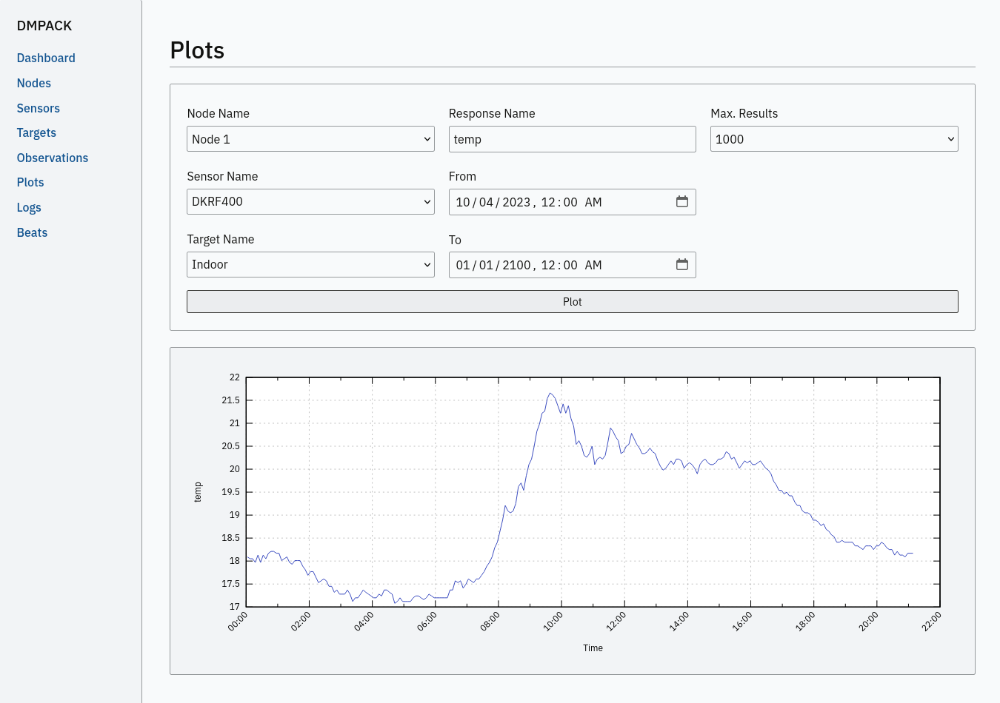

:docdate: 2023-09-05
:description: DMPACK User’s Guide
:lang: en
:author: Philipp Engel
:orgname: DABAMOS
:copyright: CC BY 4.0
:url-org: https://dabamos.de/
:url-project: {url-org}dmpack
:data-uri:
:source-highlighter: pygments
:toc: left
:toclevels: 2
:xrefstyle: short
:table-caption!:
:revnumber: 0.9

= DMPACK User’s Guide

== Project Description

The *Deformation Monitoring Package* (*DMPACK*) is a free and open source
software package for sensor control and automated time series processing in
geodesy and geotechnics. The package consists of a library _libdmpack_ and
additional programs based on it which serve as a reference implementation of
solutions to various problems in deformation monitoring, such as:

* sensor control
* sensor data parsing and processing
* database access
* remote procedure calls
* data synchronisation and export
* spatial transformations
* time series analysis
* plotting and reporting
* web-based data access
* distributed logging
* MQTT connectivity
* scripting
* e-mail

DMPACK is a scientific monitoring system developed for automated control
measurements of buildings, infrastructure, terrain, geodetic nets, and other
objects. The software runs on sensor nodes, usually industrial embedded systems
or single-board computers, and obtains observation data from arbitrary sensors,
like total stations, digital levels, inclinometers, weather stations, or GNSS
receivers. The raw sensor data is then processed, stored, and optionally
transmitted to a server. The software package may be used to monitor objects
like:

* bridges, tunnels, dams
* landslides, cliffs, glaciers
* construction sites, mining areas
* churches, monasteries, and other heritage buildings

DMPACK is built around the relational SQLite database for time series and log
storage on client and server. The server component is optional. It is possible
to run DMPACK on clients only, without data distribution. The client-side
message passing is based on POSIX message queues and POSIX semaphores.

Currently, only 64-bit Linux and FreeBSD are supported as operating systems.

* link:https://www.dabamos.de/[Project Website]
* link:https://www.dabamos.de/dmpack/guide/[User’s Guide]
* link:https://www.dabamos.de/dmpack/doc/[Source Code Documentation]
* link:https://github.com/dabamos/dmpack[Source Code Repository]

== Software Architecture

.Schematic view of the DMPACK client–server architecture
[#img-schema]
image::schema.png[schema,align="center"]

== Similar Software

There are similar open source projects that provide middleware for autonomous
sensor networks:

link:https://github.com/lpgera/argus[Argus]:: A non-geodetic sensor data
monitoring and alerting solution built with MariaDB, Node.js and React. (MIT)
link:https://github.com/FraunhoferIOSB[FROST]:: Fraunhofer Open Source
SensorThings (FROST) is the reference implementation of the OGC SensorThings API
in Java. The project provides an HTTP- and MQTT-based message bus for data
transmission between client and server. Developed by Fraunhofer-Institut für
Optronik, Systemtechnik und Bildauswertung (IOSB). (LGPLv3)
link:https://github.com/LSIR/gsn[Global Sensor Networks]:: A Java-based software
middleware designed to facilitate the deployment and programming of sensor
networks, by Distributed Information Systems Laboratory (EPFL), Switzerland.
(GPLv3)
link:https://github.com/istSOS/istsos2[istSOS]:: A server implementation of the
OGC Sensor Observation Service in Python, for managing and dispatching
observations from monitoring sensors. The project also provides a graphical user
interface and a RESTful web API to automate administration procedures. Developed
by Istituto Scienze della Terra, University of Applied Sciences and Arts of
Southern Switzerland. (GPLv2)
link:https://github.com/daq-tools/kotori[Kotori]:: A multi-channel,
multi-protocol, telemetry data acquisition and graphing toolkit for time-series
data processing in Python. It supports scientific environmental monitoring
projects, distributed sensor networks, and likewise scenarios. (AGPLv3)
link:https://www.dabamos.de/software/openadms/[OpenADMS]:: The Open Automatic
Deformation Monitoring software is an IoT sensor network middleware in Python 3.
The system was developed as a prototype of DMPACK and includes client and server
programs. (BSD)
link:https://github.com/project-mjolnir[Project Mjolnir]:: An open source
client–server IoT architecture for scientific sensor networks written in
Python, by University of Alabama in Huntsville and NASA. Includes a sensor
client for data logging, uplink and control, as well as a server component to
store, serve/display, and monitor data from remote sensors. (MIT)
link:http://www.agt.bme.hu/ulyxes/[Ulyxes]:: An open source project in Python to
control robotic total stations (RTS) and other sensors, and to publish
observation results on web based maps. Developed at the Department of Geodesy
and Surveying of the Budapest University of Technology and Economics. (GPLv2)

== Requirements

DMPACK has the following requirements:

* Linux (_glibc_) or FreeBSD operating system (64-bit)
* Fortran 2018 and ANSI C compiler

Additional dependencies have to be present to build and run the software of this
package:

* BLAS
* FastCGI
* Gnuplot
* LAPACK
* libcurl
* Lua 5.4
* PCRE2
* SQLite 3
* zlib

To generate the man pages, the User’s Guide, and the source code documentation,
you will also need:

* link:https://asciidoctor.org/[AsciiDoctor],
  link:https://pygments.org/[Pygments], and
  link:https://rubygems.org/gems/pygments.rb/versions/2.2.0[pygments.rb]
* link:https://github.com/Fortran-FOSS-Programmers/ford[FORD]

DMPACK depends on the following interface libraries:

* link:https://github.com/interkosmos/fortran-curl[fortran-curl]
* link:https://github.com/interkosmos/fortran-lua54[fortran-lua54]
* link:https://github.com/interkosmos/fortran-pcre2[fortran-pcre2]
* link:https://github.com/interkosmos/fortran-sqlite3[fortran-sqlite3]
* link:https://github.com/interkosmos/fortran-unix[fortran-unix]
* link:https://github.com/interkosmos/fortran-zlib[fortran-zlib]

If the DMPACK repository is cloned recursively, these submodules will be
downloaded automatically to directory `vendor/`.

== Installation

This section describes how to build the DMPACK library and programs from source.

=== FreeBSD

First, install the build and run-time dependencies:

....
$ doas pkg install databases/sqlite3 devel/git devel/pcre2 devel/pkgconf ftp/curl lang/gcc \
  lang/lua54 math/gnuplot math/lapack www/fcgi
....

Instead of `math/gnuplot`, you may want to install `math/gnuplot-lite` which
does not depend on X11 (but neither includes raster graphic terminals).  To
generate the man pages and the User’s Guide, install Pygments and AsciiDoctor:

....
$ doas pkg install devel/rubygem-pygments.rb textproc/rubygem-asciidoctor
....

Then, clone the repository recursively. Run the provided POSIX Makefile to build
the source:

....
$ git clone --depth 1 --recursive https://github.com/dabamos/dmpack
$ cd dmpack/
$ make freebsd
....

Install the library and all programs system-wide:

....
$ doas make install_freebsd
....

You can change the installation prefix with argument `PREFIX` (by default,
`/usr/local`). To install to a custom directory, run:

....
$ doas make install PREFIX=/opt
....

The DMPACK programs require the shared library `libgfortran.so` if they have
been compiled with GNU Fortran.

.Default paths on FreeBSD
[%autowidth]
|===
| Path                       | Description

| `/usr/local/bin/`          | DMPACK programs.
| `/usr/local/etc/dmpack/`   | DMPACK configuration files.
| `/usr/local/lib/dmpack/`   | DMPACK libraries and module files.
| `/usr/local/share/dmpack/` | DMPACK examples, scripts, style sheets.
| `/var/dmpack/`             | DMPACK databases.
| `/var/www/`                | WWW root directory.
|===

=== Linux

On Debian, install GCC, GNU Fortran, and the build environment:

....
$ sudo apt-get install gcc gfortran git make pkg-config
....

The third-party dependencies have to be installed with development headers:

....
$ sudo apt-get install --no-install-recommends libblas-dev liblapack-dev \
  curl libcurl4 libcurl4-openssl-dev libfcgi-bin libfcgi-dev \
  gnuplot lua5.4 liblua5.4 liblua5.4-dev libpcre2-8-0 libpcre2-dev \
  sqlite3 libsqlite3-dev zlib1g zlib1g-dev
....

Instead of package `gnuplot`, you may prefer the no-X11 flavour `gnuplot-nox`,
if raster image formats are not needed (SVG output only). Clone the DMPACK
repository, and then execute the Makefile with build target `linux`:

....
$ git clone --depth 1 --recursive https://github.com/dabamos/dmpack
$ cd dmpack/
$ make linux
....

Install the library and all programs system-wide:

....
$ sudo make install_linux
....

To install to a custom directory, run:

....
$ sudo make install PREFIX=/opt
....

== System Configuration

Additional changes to the system should be considered to prevent issues while
conducting a long-term monitoring.

=== Time Zone

The local time zone of the sensor client should be set to a zone without summer
daylight-saving. For instance, time zone `Europe/Berlin` implies Central
European Summer Time (CEST), which is usually not desired for long-term
observations, as it leads to time jumps. Instead, use time zone `GMT+1` or `UTC`
in this case.

On FreeBSD, configure the time zone using:

....
# tzsetup
....

On Linux, list all time zones and set the preferred one with _timedatectl(1)_:

....
# timedatectl list-timezones
# timedatectl set-timezone Etc/GMT+1
....

=== Time Synchronisation

The system time should be updated periodically by synchronising it with network
time servers. A Network Time Protocol (NTP) client has to be installed and
configured to enable the synchronisation.

==== FreeBSD

Set the current date and time intially by passing the IP or FQDN of the NTP
server to _ntpdate(1)_:

....
# ntpdate -b ptbtime1.ptb.de
....

The NTP daemon _ntpd(8)_ is configured through file `/etc/ntp.conf`. If
favoured, we can replace the existing NTP server pool `0.freebsd.pool.ntp.org`
with a single server, for example:

....
server ptbtime1.ptb.de iburst
....

Add the following entries to `/etc/rc.conf`:

....
ntpd_enable="YES"
ntpd_sync_on_start="YES"
ntpd_flags="-g"
....

Start the _ntpd(8)_ service:

....
# service ntpd start
....

==== Linux

On Debian Linux, install the NTP package:

....
# apt-get install ntp
....

Query the NTP servers to synchronise with:

....
# ntpq -p
....

The system time should be updated now:

....
# date -R
....

On error, try to reconfigure the NTP service:

....
# dpkg-reconfigure ntp
....

=== Power Saving

On Linux, power saving for USB devices may be enabled by default. This can cause
issues if sensors are attached through an USB adapter. USB power saving is
enabled if the kernel boot parameter `usbcore.autosuspend` is not equal `-1`:

....
# cat /sys/module/usbcore/parameters/autosuspend
2
....

We can update the boot loader to turn auto-suspend off. Edit `/etc/default/grub`
and change `GRUB_CMDLINE_LINUX_DEFAULT` to:

....
GRUB_CMDLINE_LINUX_DEFAULT="quiet usbcore.autosuspend=-1"
....

Then, update the boot loader:

....
# update-grub
....

The system has to be rebooted for the changes to take effect.

=== Message Queues

The operating system must have POSIX message queues enabled to run DMPACK
programs on sensor nodes.

On FreeBSD, make sure the kernel module `mqueuefs` is loaded, and the message
queue file system is mounted:

....
# kldstat -m mqueuefs
Id  Refs Name
522    1 mqueuefs
....

Otherwise, we can simply load and mount the file system:

....
# kldload mqueuefs
# mkdir -p /mnt/mqueue
# mount -t mqueuefs null /mnt/mqueue
....

To load messages queues at system start, add the module `mqueuefs` to
`/etc/rc.conf`, and the file system to `/etc/fstab`:

....
# sysrc kld_list+="mqueuefs"
# echo "null /mnt/mqueue mqueuefs rw 0 0" >> /etc/fstab
....

Additionally, we may increase the system limits of POSIX message queues with
_sysctl(8)_, or in `/etc/sysctl.conf`. The defaults are:

....
# sysctl kern.mqueue.maxmsg
kern.mqueue.maxmsg: 100
# sysctl kern.mqueue.maxmsgsize
kern.mqueue.maxmsgsize: 16384
....

The maximum message size has to be at least 16384 bytes.

=== Cron

On Unix-like operating system, link:https://en.wikipedia.org/wiki/Cron[cron] is
usually used to run jobs periodically. For example, in order to update an XML
feed, or to generate HTML reports, add a schedule of the task to perform to the
local _crontab(5)_ file.

We can edit the cron jobs of user `www` with _crontab(1)_:

....
# crontab -u www -e
....

The following _crontab(5)_ file adds a task to generate reports every hour:

[source,crontab]
....
SHELL=/bin/sh
MAILTO=/dev/null
# Create reports every hour, suppress logging.
@hourly -q /usr/local/share/dmpack/mkreport.sh
....

The shell script `mkreport.sh` must have the execution bits set. Update the
script to your configuration.

== Deformation Monitoring Entities

The data structures used by DMPACK are based on the following entities.

=== Observation Entities

Node:: A unique sensor node within a sensor network. Contains id, name, and
additional meta information.
Sensor:: A unique sensor attached to a _node_, with id, name, and additional
meta information.
Target:: A unique measurement target (point of interest, location) with id,
name, and additional meta information. Multiple nodes and sensors may share a
single target.
Observation:: A single measurement identified by name and unique UUID4 that
contains requests to and responses from a sensor, referencing a _node_, a
_sensor_, and a _target_. An observation can contain up to 8 requests which will
be sent to the sensor in sequential order.
Request:: Command to send to the sensor, referencing an _observation_ and
ordered by index. A request can contain up to 16 _responses_.
Response:: Floating-point values in the raw response of a _sensor_ can be
matched by regular expression groups. Each matched group is stored as a
response. Responses reference a _request_, and are ordered by index. They
contain name, value, unit, and an optional error code.

=== Log Entities

Log:: Log message of a sensor node, either of level _debug_, _info_, _warning_,
_error_, or _critical_, and optionally related to a _sensor_, a _target_, or an
_observation_.

=== Beat Entities

Beat:: Short status message (heartbeat, handshake) that contains node id,
timestamp, system uptime, and last connection error, sent periodically from
client to server.

=== RPC Entities

API Status:: Short key–value response of the HTTP-RPC API service in plain-text
format.

== Program Overview

DMPACK includes programs for sensor I/O, database management, observation
processing, and other tasks related to automated control measurements. The
programs may be classified into the following categories.

=== Databases

<<dmbackup>>:: Creates an online backup of a database by either using the
SQLite backup API or `VACUUM INTO`.
<<dmdb>>:: Stores observations received from POSIX message queue in a SQLite
database.
<<dmdbctl>>:: A command-line interface to the DMPACK observation database, to
read, add, update, or delete nodes, sensors, and targets.
<<dmexport>>:: Exports beats, nodes, sensors, targets, observations, and
logs from database to file, either in CSV, JSON, or JSON Lines format.
<<dmimport>>:: Imports nodes, sensors, targets, observations, and logs from CSV
file into database.
<<dminit>>:: Creates and initialises SQLite observation, log, and beat
databases.
<<dmlogger>>:: Stores logs received from POSIX message queue in a SQLite
database.

=== Message Passing

<<dmlog>>:: A utility program to send log messages from command-line or
shell script to the POSIX message queue of a <<dmlogger>> process, to be stored
in the log database.
<<dmrecv>>:: Receives logs or observations from POSIX message queue and writes
them to _stdout_, file, or named pipe.
<<dmsend>>:: Sends observations from _stdin_ or file to a DMPACK application
via POSIX message queue.

=== Observation Processing

<<dmlua>>:: Runs a custom Lua script to process an observation and forward it
to the next specified receiver.

=== Plots & Reports

<<dmgraph>>:: Creates line plots of time series read from database, with output
to file, terminal, or X11 window. Uses _gnuplot(1)_ internally as plotting
backend.
<<dmreport>>:: Creates HTML reports containing plots and optionally log
messages.

=== Remote Procedure Calls

<<dmapi>>:: A FastCGI-based HTTP-RPC service that provides an API for node,
sensor, target, observation, and log synchronisation, as well as heartbeat
transmission.  Clients may either send records to be stored in the server
database, or request data of a given time range. Depending on the HTTP Accept
header, the server returns data in CSV, JSON, JSON Lines or Namelist format.
Requires a FastCGI-compatible web server, such as _lighttpd(1)_.
<<dmbeat>>:: Sends short status messages (heartbeats) periodically to a remote
<<dmapi>> instance.
<<dmsync>>:: Synchronises nodes, sensors, targets, observations, and log
messages between client and <<dmapi>> server. Only uni-directional
synchronisation from client to server is supported.

=== Sensor Control

<<dmfs>>:: Reads sensor data from virtual file system, file, or named pipe. The
program be used to read values from sensors connected via 1-Wire (OWFS).
Observations are forwarded via POSIX message queue and/or written to file.
<<dmpipe>>:: Executes a program as a sub-process connected through an anonymous
pipe and forwards the output via POSIX message queue. Optionally, observations
are written to file or _stdout_.
<<dmserial>>:: Connects to a TTY/PTY serial port for sensor communication. The
program sends requests to a connected sensor to receive responses. The program
pre-processes the response data using regular expressions and forwards
observations via POSIX message queue.

=== Utilities

<<dminfo>>:: Prints system and database information as key–value pairs to
standard output.
<<dmuuid>>:: A command-line tool to generate UUID4 identifiers (by default in
hex format without hyphens).

=== Web

<<dmfeed>>:: Creates an
link:https://en.wikipedia.org/wiki/Atom_(web_standard)[Atom] syndication feed
in XML format (RFC 4287) from logs of given sensor node and log level. If the
feed is served by a web server, clients can subscribe to it by using a feed
reader or news aggregator. The program may be executed periodically as a cron
job.
<<dmweb>>:: A CGI-based web user interface for DMPACK database access on
client and server. Requires a web server and _gnuplot(1)_.

== Programs

Some programs read settings from an optional or mandatory configuration file.
Examples of configuration files are provided in directory
`/usr/local/etc/dmpack/`. The configuration file format is based on Lua tables
and is scriptable. Comments in the configuration file start with `--`.

You may want to enable Lua syntax highlighting in your editor (for instance,
`set syntax=lua` in Vim), or use the file ending `.lua` instead of `.conf`.

=== dmapi [[dmapi]]

*dmapi* is an HTTP-RPC API service for remote DMPACK database access. The web
application has to be executed through a FastCGI-compatible web server or a
FastCGI spawner. It is recommended to run _lighttpd(1)_.

The *dmapi* service offers endpoints for clients to insert beats, logs, and
observations into the local SQLite database, and to request data in CSV or JSON
format. Authentication and encryption are independent from *dmapi* and have to
be provided by the web server.

All POST data has to be serialised in Fortran 95 Namelist format, with optional
deflate compression.

If HTTP Basic Auth is enabled, the sensor id of each beat, log, node, sensor,
and observation sent to the RPC service must match the name of the
authenticated user. For example, to store an observation of a node with the id
`node-1`, the HTTP Basic Auth user name must equal the node id. If the
observation is sent by any other user, it will be rejected (HTTP 401).

[%autowidth]
|===
| Environment Variable | Description

| `DM_DB_BEAT`         | Path to heartbeat database (required).
| `DM_DB_LOG`          | Path to log database (required).
| `DM_DB_OBSERV`       | Path to observation database (required).
| `DM_READ_ONLY`       | Set to `1` to enable read-only database access.
|===

The web application is configured through environment variables. The web server
or FastCGI spawner must be able to pass environment variables to *dmapi*. See
<<rpc-server>> for an example configuration.

The service accepts HTTP GET and POST requests. Section <<rpc-api>> gives an
overview of the available endpoints. The response format depends on the MIME
type set in the HTTP Accept header of the request, either:

* `application/json` (JSON)
* `application/jsonl` (JSON Lines)
* `application/namelist` (Fortran 95 Namelist)
* `text/comma-separated-values` (CSV)

By default, responses are in CSV format. The Namelist format is available only
for single records. Status messages are returned as key–value pairs, signaled by
MIME type `text/plain`.

=== dmbackup [[dmbackup]]

The *dmbackup* utility creates an online backup of a running SQLite database. By
default, the SQLite backup API is used. The program is functional equivalent to
running the _sqlite3(1)_ command-line interface:

....
$ sqlite3 <database> ".backup '<output>'"
....

*dmbackup* does not replace existing backup databases.

==== Command-Line Options

[%autowidth.stretch]
|===
| Option              | Short | Default | Description

| `--backup _file_`   | `-b`  | –       | Path of the backup database.
| `--database _file_` | `-d`  | –       | Path of the SQLite database to backup.
| `--help`            | `-h`  | –       | Output available command-line arguments and quit.
| `--vacuum`          | `-U`  | off     | Use `VACUUM INTO` instead of the SQLite backup API.
| `--verbose`         | `-V`  | off     | Print backup progess (not in vacuum mode).
| `--version`         | `-v`  | –       | Output version information and quit.
| `--wal`             | `-W`  | off     | Enable WAL journal for backup database.
|===

==== Examples

Create an online backup of an observation database:

....
$ dmbackup --database /var/dmpack/observ.sqlite --backup /tmp/observ.sqlite
....

=== dmbeat [[dmbeat]]

The *dmbeat* program is a heartbeat emitter that sends
<<data-beat,status messages>> via HTTP POST to a remote <<dmapi>> service. The
status messages include timestamp, system uptime, and last connection error.
The server may inspect this data to check if a client is still running and has
network access. The RPC endpoint is expected at
`[http|https]://<host>:<port>/api/v1/beat`.

Passing the server credentials via the command-line arguments `--username` and
`--password` is insecure on multi-user operating systems and only recommended
for testing.
  
==== Command-Line Options

[%autowidth.stretch]
|===
| Option                 | Short | Default       | Description

| `--config _file_`      | `-c`  | –             | Path to configuration file.
| `--count _n_`          | `-C`  | 0 (unlimited) | Maximum number of heartbeats to send.
| `--debug`              | `-D`  | off           | Forward log messages of level DEBUG via IPC (if logger is set).
| `--help`               | `-h`  | –             | Output available command-line arguments and quit.
| `--host _host_`        | `-H`  | –             | IP or FQDN of HTTP-RPC host (for example, `127.0.0.1` or `example.com`).
| `--interval _seconds_` | `-I`  | 60            | Emit interval in seconds.
| `--logger _name_`      | `-l`  | –             | Optional name of logger. If set, sends logs to <<dmlogger>> process of given name.
| `--name _name_`        | `-n`  | `dmbeat`      | Optional name of instance and table in given configuration file.
| `--node _id_`          | `-N`  | –             | Node id.
| `--password _string_`  | `-P`  | –             | HTTP-RPC API password.
| `--port _port_`        | `-p`  | 0 (automatic) | Port of HTTP-RPC API server.
| `--tls`                | `-X`  | off           | Use TLS encryption.
| `--username _string_`  | `-U`  | –             | HTTP-RPC API user name. If set, implies HTTP Basic Auth.
| `--verbose`            | `-V`  | off           | Print log messages to _stderr_.
| `--version`            | `-v`  | –             | Output version information and quit.
|===

==== Examples

Send a single heartbeat to a <<dmapi>> RPC service on `localhost`:

....
$ dmbeat --node dummy-node --host 127.0.0.1 --count 1 --verbose
....

A sensor node with id `dummy-node` must exist in the server database. The
web application <<dmweb>> lists the beats received by the server.

=== dmdb [[dmdb]]

The *dmdb* program collects observations from a POSIX message queue and
stores them in a SQLite database. The name of the message queue equals the
given *dmdb* name, by default `dmdb`. The IPC option enables process
synchronisation via POSIX semaphores. The value of the semaphore is changed
from 0 to 1 if a new observation has been received. The name of the semaphore
equals the *dmdb* name. Only a single process may wait for the semaphore.

==== Command-Line Options

[%autowidth.stretch]
|===
| Option              | Short | Default | Description

| `--config _file_`   | `-c`  | –       | Path to configuration file.
| `--database _file_` | `-d`  | –       | Path to SQLite observation database.
| `--debug`           | `-D`  | off     | Forward log messages of level DEBUG via IPC (if logger is set).
| `--help`            | `-h`  | –       | Output available command-line arguments and quit.

| `--ipc`
| `-Q`
| off
| Uses a POSIX semaphore for process synchronisation. The name of the semaphore
matches the instance name (with leading `/`). The semaphore is set to 1 each
time an observation has been received. Only a single process may wait for this
semaphore, otherwise, reading occurs in round-robin fashion.

| `--logger _name_`
| `-l`
| –
| Optional name of logger. If set, sends logs to <<dmlogger>> process of given
name.

| `--name _name_`
| `-n`
| `dmdb`
| Optional name of program instance, configuration, POSIX message queue, and
POSIX semaphore.

| `--node _id_`       | `-N`  | –       | Node id.
| `--verbose`         | `-V`  | off     | Print status to _stderr_.
| `--version`         | `-v`  | –       | Output version information and quit.
|===

==== Examples

Create a message queue `/dmdb`, wait for incoming observations, and store them
in the given database:

....
$ dmdb --node dummy-node --database /var/dmpack/observ.sqlite --verbose
....

Log messages and observation ids are printed to _stdout_.

=== dmdbctl [[dmdbctl]]

The *dmdbctl* utility program performs create, read, update, or delete
operations (CRUD) on the observation database. Only nodes, sensors, and targets
are supported. Data attributes are passed through command-line arguments.

==== Command-Line Options

[%autowidth.stretch]
|===
| Option              | Short | Default | Description

| `--create _type_`   | `-C`  | –       | Create record of given type (`node`, `sensor`, or `target`).
| `--delete _type_`   | `-D`  | –       | Delete record of given type (`node`, `sensor`, or `target`).
| `--database _file_` | `-d`  | –       | Path to SQLite observation database (required).
| `--help`            | `-h`  | –       | Output available command-line arguments and quit.
| `--id _id_`         | `-I`  | –       | Node, sensor, or target id (required).
| `--meta _name_`     | `-M`  | –       | Node, sensor, or target meta description (optional).
| `--name _name_`     | `-n`  | –       | Node, sensor, or target name.
| `--node _id_`       | `-N`  | –       | Id of node the sensor is associated with.
| `--read _type_`     | `-R`  | –       | Read record of given type (`node`, `sensor`, or `target`).
| `--sn _sn_`         | `-Z`  | –       | Serial number of sensor (optional).
| `--type _name_`     | `-t`  | `none`  | <<data-sensor-types,Sensor type>>: `none`, `rts`, `gnss`, … (optional).
| `--update _type_`   | `-U`  | –       | Updates record of given type (`node`, `sensor`, or `target`).
| `--verbose`         | `-V`  | off     | Print additional log messages to _stderr_.
| `--version`         | `-v`  | –       | Output version information and quit.
|===

==== Examples

Add node, sensor, and target to observation database:

....
$ dmdbctl --database observ.sqlite --create node --id node-1 --name "Node 1"
$ dmdbctl --database observ.sqlite --create sensor --id sensor-1 --name "Sensor 1" --node node-1
$ dmdbctl --database observ.sqlite --create target --id target-1 --name "Target 1"
....

Delete a target from the database:

....
$ dmdbctl --database observ.sqlite --delete target --id target-1
....

Read attributes of sensor `sensor-1`:

....
$ dmdbctl --database observ.sqlite --read sensor --id sensor-1
sensor.id: sensor-1
sensor.node_id: node-1
sensor.type: virtual
sensor.name: Sensor 1
sensor.sn: 12345
sensor.meta: dummy sensor
....

=== dmexport [[dmexport]]

The *dmexport* program writes beats, logs, nodes, sensors, targets,
observations, and data points from database to file, in ASCII block, CSV, JSON,
or JSON Lines format. The ASCII block format is only available for X/Y data
points. The types data point, log, and observation require a sensor id, a target
id, and a time range in ISO 8601 format.

If no output file is given, the data is printed to standard output. The
output file will be overwritten if it already exists. If no records are found,
an empty file will be created.

.Output file formats
[[dmexport-output]]
[%autowidth]
|===
| Format  | Supported Types                                           | Description

| `block` | `dp`                                                      | ASCII block format.
| `csv`   | `beat`, `dp`, `log`, `node`, `observ`, `sensor`, `target` | CSV format.
| `json`  | `beat`, `dp`, `log`, `node`, `observ`, `sensor`, `target` | JSON format.
| `jsonl` | `beat`, `dp`, `log`, `node`, `observ`, `sensor`, `target` | JSON Lines format.
|===

==== Command-Line Options

[%autowidth.stretch]
|===
| Option               | Short | Default | Description

| `--database _file_`  | `-d`  | –       | Path to SQLite database (required).
| `--format _format_`  | `-f`  | –       | <<dmexport-output,Output file format>>: `block`, `csv`, `json`, `jsonl` (required).
| `--from _timestamp_` | `-B`  | –       | Start of time range in ISO 8601 (required for types `dp`, `log`, and `observ`).
| `--header`           | `-H`  | off     | Add CSV header.
| `--help`             | `-h`  | –       | Output available command-line arguments and quit.
| `--node _id_`        | `-N`  | –       | Node id (required).
| `--output _file_`    | `-o`  | –       | Path of output file.
| `--response _name_`  | `-R`  | –       | Response name for type `dp`.
| `--sensor _id_`      | `-S`  | –       | Sensor id (requied for types `dp` and `observ`).
| `--separator _char_` | `-s`  | `,`     | CSV separator character.
| `--target _id_`      | `-T`  | –       | Target id (required for types `dp` and `observ`).
| `--to _timestamp_`   | `-E`  | –       | End of time range in ISO 8601 (required for types `dp`, `log`, `observ`).
| `--type _type_`      | `-t`  | –       | Type of record to export: `beat`, `dp`, `log`, `node`, `observ`, `sensor`, `target` (required).
| `--version`          | `-v`  | –       | Output version information and quit.
|===

==== Examples

Export log messages from database to JSON file:

....
$ dmexport --database /var/dmpack/log.sqlite --type log --format json --node dummy-node \
  --from 2020-01-01 --to 2023-01-01 --output /tmp/log.json
....

Export observations from database to CSV file:

....
$ dmexport --database observ.sqlite --type observ --format csv --node dummy-node \
  --sensor dummy-sensor --target dummy-target --from 2020-01-01 --to 2025-01-01 \
  --output /tmp/observ.csv
....

=== dmfeed [[dmfeed]]

This program creates a web feed from log messages in Atom Syndication Format.
The log messages are read from database and written as XML to standard output
or file.

The feed id has to be a 36 characters long UUID with hyphens. News aggregators
use the id to identify the feed. Therefore, the id should not be reused among
different feeds. Run <<dmuuid>> to generate a valid UUID4.

If an XSLT style sheet is given, web browsers may be able to display the Atom
feed in HTML format. Set the option to the (relative) path of the public XSL on
the web server. An example style sheet `feed.xsl` is located in
`/usr/local/share/dmpack/`.

==== Command-Line Options

[%autowidth.stretch]
|===
| Option                | Short | Default  | Description

| `--author _name_`     | `-A`  | –        | Name of feed author or organisation.
| `--config _file_`     | `-c`  | –        | Path to configuration file.
| `--database _file_`   | `-d`  | –        | Path to SQLite log database.
| `--email _address_`   | `-M`  | –        | E-mail address of feed author.
| `--help`              | `-h`  | –        | Output available command-line arguments and quit.
| `--id _uuid_`         | `-I`  | –        | UUID of the feed, 36 characters long with hyphens.
| `--maxlevel _level_`  | `-K`  | 5        | Select log messages of the given maximum <<data-log-level,log level>> (between 1 and 5). Must be greater or equal the minimum level.
| `--minlevel _level_`  | `-L`  | 1        | Select log messages of the given minimum <<data-log-level,log level>> (between 1 and 5).
| `--name _name_`       | `-n`  | `dmfeed` | Name of instance and table in given configuration file.
| `--nentries _count_`  | `-E`  | 50       | Maximum number of entries in feed (max. 500).
| `--node _id_`         | `-N`  | –        | Select log messages of the given node id.
| `--output _file_`     | `-o`  | _stdout_ | Path of the output file. If empty, the Atom feed will be printed to standard output.
| `--subtitle _string_` | `-G`  | –        | Sub-title of feed.
| `--title _string_`    | `-T`  | –        | Title of feed.
| `--url _url_`         | `-U`  | –        | Public URL of the feed.
| `--version`           | `-v`  | –        | Output version information and quit.
| `--xsl`               | `-X`  | –        | Path to XSLT style sheet.
|===

==== Examples

First, generate a unique feed id:

....
$ dmuuid --hyphens
19c12109-3e1c-422c-ae36-3ba19281f2e
....

Then, write the last 50 log messages in Atom format to file `feed.xml`, and
include a link to the XSLT style sheet `feed.xsl`:

....
$ dmfeed --database /var/dmpack/log.sqlite --output /var/www/feed.xml \
  --id 19c12109-3e1c-422c-ae36-3ba19281f2e --xsl feed.xsl
....

Copy the XSLT style sheet to the directory of the Atom feed:

....
$ cp /usr/local/share/dmpack/feed.xsl /var/www/
....

If `/var/www/` is served by a web server, feed readers can subscribe to the
feed. Furthermore, we may translate feed and style sheet into a single HTML
document `feed.html`, using an arbitrary XSLT processor, for instance:

....
$ xsltproc --output feed.html /var/www/feed.xsl /var/www/feed.xml
....

=== dmfs [[dmfs]]

The *dmfs* program reads observations from file system, virtual file, or named
pipe.  The program can be used to read sensor data from the 1-Wire File System
(OWFS).

If any receivers are specified, observations are forwarded to the next receiver
via POSIX message queue. *dmfs* can act as a sole data logger if output and
format are set. If the output path is set to `-`, observations are written to
_stdout_ instead of file.

The requests of each observation have to contain the path of the (virtual) file
in attribute `request`. Response values are extracted by named group from the
raw response using the given regular expression pattern. Afterwards, the
observation is forwarded to the next receiver via POSIX message queue.

A configuration file is mandatory to describe the jobs to perform. Each
observation must have a valid target id. Node, sensor, and target have to be
present in the database.

==== Command-Line Options

[%autowidth.stretch]
|===
| Option              | Short | Default | Description

| `--config _file_`   | `-c`  | –       | Path to configuration file (required).
| `--debug`           | `-D`  | off     | Forward log messages of level DEBUG via IPC (if logger is set).
| `--format _format_` | `-f`  | –       | Output format, either `csv` or `jsonl`.
| `--help`            | `-h`  | –       | Output available command-line arguments and quit.
| `--logger _name_`   | `-l`  | –       | Optional name of logger. If set, sends logs to <<dmlogger>> process of given name.
| `--name _name_`     | `-n`  | `dmfs`  | Name of instance and table in given configuration file.
| `--node _id_`       | `-N`  | –       | Node id.
| `--output _file_`   | `-o`  | –       | Output file to append observations to (or `-` for _stdout_).
| `--sensor _id_`     | `-S`  | –       | Sensor id.
| `--verbose`         | `-V`  | off     | Print log messages to _stderr_.
| `--version`         | `-v`  | –       | Output version information and quit.
|===

==== Examples

First, install the 1-Wire file system package. On FreeBSD, run:

....
# pkg install comms/owfs
....

On Linux, install the package instead with:

....
# apt-get install owfs
....

Connect a 1-Wire temperature sensor through USB (device `/dev/ttyU0`), and mount
the 1-Wire file system with _owfs(1)_ under `/mnt/1wire/`:

....
# mkdir -p /mnt/1wire
# owfs -C -d /dev/ttyU0 --allow_other -m /mnt/1wire/
....

On Linux, the path to the USB adapter slightly differs:

....
# owfs -C -d /dev/ttyUSB0 --allow_other -m /mnt/1wire/
....

The command-line argument `-C` selects output in °C. The settings can be added
to the _owfs(1)_ configuration file, usually at `/usr/local/etc/owfs.conf` or
`/etc/owfs.conf`:

....
device = /dev/ttyU0
mountpoint = /mnt/1wire
allow_other
Celsius
....

The file system is mounted automatically at system start-up if _owfs(1)_ is
configured to run as a service.

Reading a temperature value from the connected sensor:

....
$ cat /mnt/1wire/10.DCA98C020800/temperature
19.12
....

Then, initialise the observation and log databases:

....
$ dminit --type observ --database /var/dmpack/observ.sqlite --wal
$ dminit --type log --database /var/dmpack/log.sqlite --wal
....

Create node `node-1`, sensor `sensor-1`, and target `target-1` in database
`/var/dmpack/observ.sqlite` through <<dmweb>> or <<dmdbctl>>:

....
$ dmdbctl -d /var/dmpack/observ.sqlite -C node --id node-1 --name "Node 1"
$ dmdbctl -d /var/dmpack/observ.sqlite -C sensor --id sensor-1 --name "Sensor 1" --node node-1
$ dmdbctl -d /var/dmpack/observ.sqlite -C target --id target-1 --name "Target 1"
....

Set the program settings in configuration file
`/usr/local/etc/dmpack/dmfs.conf`:

[source,lua]
....
-- dmfs.conf
dmfs = {
  logger = "dmlogger",          -- Logger to send logs to (optional).
  node = "node-1",              -- Node id (required).
  sensor = "sensor-1",          -- Sensor id (required).
  output = "",                  -- Path to output file or `-` for stdout (optional).
  format = "none",              -- Output format (`csv` or `jsonl`).
  debug = true,                 -- Forward log messages of level DEBUG via IPC.
  verbose = true,               -- Print messages to standard output (optional).
  jobs = {                      -- List of jobs to perform.
    {
      delay = 10 * 1000,        -- Delay in mseconds to wait afterwards (optional).
      disabled = false,         -- Set to 1 to ignore job (optional).
      onetime = false,          -- Set to 1 to run job only once (optional).
      observation = {           -- Observation to execute (required).
        name = "observ-1",      -- Observation name (required).
        target_id = "target-1", -- Target id (required).
        receivers = { "dmdb" }, -- Optional list of receivers (up to 16).
        requests = {            -- List of files to read.
          {
            request = "/mnt/1wire/10.DCA98C020800/temperature", -- File path.
            pattern = "(?<temp>[-+0-9\\.]+)",                   -- RegEx pattern.
            delay = 500,        -- Delay in mseconds (optional).
            responses = {
              {
                name = "temp",  -- RegEx group.
                unit = "degC"   -- Unit.
              }
            }
          }
        }
      }
    }
  }
}
....

Log messages will be sent to logger `dmlogger`, observations to receiver `dmdb`.

Start the logger process:

....
$ dmlogger --name dmlogger --database /var/dmpack/log.sqlite
....

Start the database process:

....
$ dmdb --name dmdb --database /var/dmpack/observ.sqlite --node node-1 --logger dmlogger
....

Start *dmfs* to execute the configured job:

....
$ dmfs --name dmfs --config /usr/local/etc/dmpack/dmfs.conf
....

=== dmgraph [[dmgraph]]

The *dmgraph* program is a front-end to _gnuplot(1)_ that creates plots of
observations read from database. Plots are either written to file or displayed
in terminal or X11 window.

Depending on the selected terminal backend, you may have to set the environment
variable `GDFONTPATH` to the local font directory first:

....
$ export GDFONTPATH="/usr/local/share/fonts/webfonts/"
....

The output file is ignored when using the terminals `sixelgd` and `x11`.
Plotting parameters passed via command-line have priority over those from
configuration file.

.Terminals supported by *dmgraph*
[[dmgraph-format]]
[%autowidth]
|===
| Terminal   | Description

| `ansi`     | ASCII format, in ANSI colours.
| `ascii`    | ASCII format.
| `gif`      | GIF format (_libgd_).
| `png`      | PNG format (_libgd_).
| `pngcairo` | PNG format (_libcairo_), created from vector graphics.
| `sixelgd`  | Sixel format (_libgd_), originally for DEC terminals.
| `svg`      | W3C Scalable Vector Graphics (SVG) format.
| `x11`      | Persistent X11 window (_libX11_).
|===

.Format descriptors allowed in the output file name
[[dmgraph-descript]]
[%autowidth]
|===
| Descriptor | Description (Format)

| `%Y`       | year (YYYY)
| `%M`       | month (MM)
| `%D`       | day (DD)
| `%h`       | hour (hh)
| `%m`       | minute (mm)
| `%s`       | second (ss)
|===

==== Command-Line Options

[%autowidth.stretch]
|===
| Option                  | Short | Default   | Description

| `--background _color_`  | `-G`  | –         | Background colour (for example, `#ffffff` or `white`).
| `--config _file_`       | `-c`  | –         | Path to configuration file.
| `--database _file_`     | `-d`  | –         | Path to SQLite observation database.
| `--font _name_`         | `-A`  | –         | Font name or file name (for example, `Open Sans`, `arial.ttf`, `monospace`).
| `--foreground _color_`  | `-P`  | –         | Foreground colour (for example, `#ff0000` or `red`).
| `--from _timestamp_`    | `-B`  | –         | Start of time range in ISO 8601.
| `--height _n_`          | `-H`  | 400       | Plot height.
| `--help`                | `-h`  | –         | Output available command-line arguments and quit.
| `--name _name_`         | `-n`  | `dmgraph` | Name of table in configuration file.
| `--node _id_`           | `-N`  | –         | Node id.
| `--output _file_`       | `-o`  | –         | File path of plot image. May include <<dmgraph-descript,format descriptors>>.
| `--response _name_`     | `-R`  | –         | Response name.
| `--sensor _id_`         | `-S`  | –         | Sensor id.
| `--target _id_`         | `-T`  | –         | Target id.
| `--terminal _terminal_` | `-M`  | –         | <<dmgraph-format,Plot format>>.
| `--title _title_`       | `-T`  | –         | Plot title.
| `--to _timestamp_`      | `-E`  | –         | End of time range in ISO 8601.
| `--version`             | `-v`  | –         | Output version information and quit.
| `--width _n_`           | `-W`  | 1000      | Plot width.
|===

==== Examples

Create a plot of observations selected from database `observ.sqlite` in PNG
format, and write the file to `/tmp/plot.png`:

....
$ dmgraph --node dummy-node --sensor dummy-sensor --target dummy-target --response dummy \
  --from 2020 --to 2024 --database observ.sqlite --terminal pngcairo --output /tmp/plot.png
....

Output the plot directly to terminal, with the configuration loaded from file:

....
$ dmgraph --name dmgraph -node --config dmgraph.conf --terminal sixelgd
....

The `sixelgd` format requires a terminal emulator with Sixel support (such as
_xterm(1)_ or _mlterm(1)_).

.Plotting time series directly in XTerm
[#img-dmgraph]

=== dminfo [[dminfo]]

The *dminfo* utility program prints build, database, and system information to
standard output. The path to the beat, log, or observation database is passed
through command-line argument `--database`.

The output contains compiler version and options; database PRAGMAs, tables, and
number of rows; as well as system name, version, and host name.

==== Command-Line Options

[%autowidth.stretch]
|===
| Option              | Short | Default | Description

| `--database _file_` | `-d`  | –       | Path to SQLite database.
| `--help`            | `-h`  | –       | Output available command-line arguments and quit.
| `--version`         | `-v`  | –       | Output version information and quit.
|===

==== Examples

Print build, database, and system information:

....
$ dminfo --database /var/dmpack/observ.sqlite
build.compiler: GCC version 13.1.0
build.options: -mtune=generic -march=x86-64 -std=f2018
db.application_id: 444D31
db.foreign_keys: T
db.journal_mode: wal
db.path: /var/dmpack/observ.sqlite
db.size: 286720
db.table.beats: F
db.table.beats.rows: 0
...
....

=== dmimport [[dmimport]]

The *dmimport* program reads logs, nodes, sensors, targets, and observations
in CSV format from file and imports them into the database. The database
inserts are transaction-based. If an error occurs, the transaction is rolled
back, and no records are written into the database at all.

The database has to be a valid DMPACK database and must contain the tables
required for the input records. The nodes, sensors, and targets referenced by
input observations must exist in the database. The nodes referenced by input
sensors must exist as well.

==== Command-Line Options

[%autowidth.stretch]
|===
| Option               | Short | Default | Description

| `--database _file_`  | `-d`  | –       | Path to SQLite database (required, unless in dry mode).
| `--dry`              | `-y`  | off     | Dry mode. Reads and validates records from file but skips database import.
| `--help`             | `-h`  | –       | Output available command-line arguments and quit.
| `--input _file_`     | `-i`  | –       | Path to input file in CSV format (required).
| `--quote _char_`     | `-q`  | –       | CSV quote character.
| `--separator _char_` | `-s`  | `,`     | CSV separator character.
| `--type _type_`      | `-t`  | –       | Type of record to import: `log`, `node`, `observ`, `sensor`, `target` (required).
| `--verbose`          | `-V`  | off     | Print progress to _stdout_.
| `--version`          | `-v`  | –       | Output version information and quit.
|===

==== Examples

Import observations from CSV file `observ.csv` into database `observ.sqlite`:

....
$ dmimport --type observ --input observ.csv --database observ.sqlite --verbose
....

=== dminit [[dminit]]

The *dminit* utility program creates beat, log, and observation databases. No
action is performed if the specified database already exists.

A synchronisation table is required for observation and log synchronisation with
an <<dmapi>> server. The argument can be omitted if this functionality is not
used.

The journal mode Write-Ahead Logging (WAL) should be enabled for databases with
multiple readers.

==== Command-Line Options

[%autowidth.stretch]
|===
| Option              | Short | Default | Description

| `--database _file_` | `-d`  | –       | Path of the new SQLite database.
| `--help`            | `-h`  | –       | Output available command-line arguments and quit.
| `--sync`            | `-Y`  | off     | Add synchronisation tables. Enable for data synchronisation between client and server.
| `--type _type_`     | `-t`  | –       | Type of database, either  `beat`, `log`, or `observ`.
| `--version`         | `-v`  | –       | Output version information and quit.
| `--wal`             | `-W`  | off     | Enable Write-Ahead Logging (WAL).
|===

==== Examples

Create an observation database with remote synchronisation tables (WAL):

....
$ dminit --database /var/dmpack/observ.sqlite --type observ --sync --wal
....

Create a log database with remote synchronisation tables (WAL):

....
$ dminit --database /var/dmpack/log.sqlite --type log --sync --wal
....

Create a heartbeat database (WAL):

....
$ dminit --database /var/dmpack/beat.sqlite --type beat --wal
....

=== dmlog [[dmlog]]

The *dmlog* utility forwards a log message to the message queue of a
<<dmlogger>> instance. The argument `--message` is mandatory. The default log
level is INFO. Pass the name of the _dmlogger_ instance through argument
`--logger`. The program terminates after log transmission.

The following log levels are accepted:

[%autowidth]
|===
| Level | Name

| 1     | DEBUG
| 2     | INFO
| 3     | WARNING
| 4     | ERROR
| 5     | CRITICAL
|===

==== Command-Line Options

[%autowidth.stretch]
|===
| Option               | Short | Default    | Description

| `--error _n_`        | `-e`  | 0          | DMPACK <<error-codes,error code>> (optional).
| `--help`             | `-h`  | –          | Output available command-line arguments and quit.
| `--level _n_`        | `-L`  | 2          | <<data-log-level,Log level>>, from 1 to 5.
| `--logger _name_`    | `-l`  | `dmlogger` | Name of logger instance and POSIX message queue.
| `--message _string_` | `-m`  | –          | Log message (max. 512 characters).
| `--node _id_`        | `-N`  | –          | Node id (optional).
| `--observ _id_`      | `-O`  | –          | Observation id (optional).
| `--sensor _id_`      | `-S`  | –          | Sensor id (optional).
| `--source _source_`  | `-Z`  | –          | Source of the log message (optional).
| `--target _id_`      | `-T`  | –          | Target id (optional).
| `--verbose`          | `-V`  | off        | Print log to _stderr_.
| `--version`          | `-v`  | –          | Output version information and quit.
|===

==== Examples

Send a log message to the message queue of logger `dmlogger`:

....
$ dmlog --level 3 --message "low battery" --source test --verbose
2022-12-09T22:50:44.161+01:00 [WARNING ] test - low battery
....

The `dmlogger` process will receive the log message and store it in the log
database (if the log level is ≥ the minimum log level):

....
$ dmlogger --node dummy-node --database /var/dmpack/log.sqlite --verbose
2022-12-09T22:50:44.161+01:00 [WARNING ] test - low battery
....

=== dmlogger [[dmlogger]]

The *dmlogger* program collects log messages from a POSIX message queue and
stores them in a SQLite database. The name of the message queue equals the
given *dmlogger* name with leading `/`, by default `/dmlogger`.

If a minimum log level is selected, only logs of a level greater equal the
minimum are stored in the database. Log messages with lower level are printed to
standard output before being discarded (if verbose mode is enabled).

The IPC option allows process synchronisation via POSIX semaphores. The value of
the semaphore is changed from `0` to `1` each time a new log has been received.
The name of the semaphore equals the *dmlogger* name with leading `/`. Only a
single process should wait for the semaphore unless round-robin passing is
desired.

This feature may be used to automatically synchronise incoming log messages with
a remote HTTP-RPC API server. <<dmsync>> will wait for new logs before starting
synchronisation if the *dmlogger* instance name has been passed through
command-line argument `--wait`.

The following log levels are accepted:

[%autowidth]
|===
| Level | Name

| 1     | DEBUG
| 2     | INFO
| 3     | WARNING
| 4     | ERROR
| 5     | CRITICAL
|===

==== Command-Line Options

[%autowidth.stretch]
|===
| Option              | Short | Default | Description

| `--config _file_`   | `-c`  | –       | Path to configuration file.
| `--database _file_` | `-d`  | –       | Path to SQLite log database.
| `--help`            | `-h`  | –       | Output available command-line arguments and quit.

| `--ipc`
| `-Q`
| off
| Use POSIX semaphore for process synchronisation. The name of the semaphore
matches the instance name (with leading slash). The semaphore is set to 1 each
time a log message has been received. Only a single process may wait for this
semaphore.

| `--minlevel _level_`
| `-L`
| 3
| Minimum level for a log to be stored in the database, from 1 to 5.

| `--name _name_`
| `-n`
| `dmlogger`
| Name of logger instance, configuration, POSIX message queue, and POSIX
semaphore.

| `--node _id_`       | `-N`  | –       | Node id.
| `--verbose`         | `-V`  | off     | Print received logs to _stderr_.
| `--version`         | `-v`  | –       | Output version information and quit.
|===

==== Examples

Create a message queue `/dmlogger`, wait for incoming logs, and store them in
the given database if logs are of level 4 (ERROR) or higher:

....
$ dmlogger --node dummy-node --database /var/dmpack/log.sqlite --minlevel 4
....

Push semaphore `/dmlogger` each time a log has been received:

....
$ dmlogger --node dummy-node --database /var/dmpack/log.sqlite --ipc
....

Let <<dmsync>> wait for semaphore `/dmlogger` before synchronising the log
database with host `192.168.1.100`, then repeat:

....
$ dmsync --type log --database /var/dmpack/log.sqlite --host 192.168.1.100 --wait dmlogger
....

=== dmlua [[dmlua]]

The *dmlua* program runs a custom Lua script to process observations received
from message queue. Each observation is passed as a Lua table to the function of
the name given in option `procedure`. If the option is not set, function name
`process` is assumed by default. The Lua function must return the (modified)
observation table on exit.

The observation returned from the Lua function is forwarded to the next receiver
specified in the receivers list of the observation. If no receivers are left,
the observation will be discarded.

==== Command-Line Options

[%autowidth.stretch]
|===
| Option               | Short | Default  | Description

| `--config _file_`    | `-c`  | –         | Path to configuration file (optional).
| `--debug`            | `-D`  | off       | Forward log messages of level DEBUG via IPC (if logger is set).
| `--help`             | `-h`  | –         | Output available command-line arguments and quit.
| `--logger _name_`    | `-l`  | –         | Optional name of logger. If set, sends logs to <<dmlogger>> process of given name.
| `--name _name_`      | `-n`  | `dmlua`   | Name of instance and table in given configuration file.
| `--node _id_`        | `-N`  | –         | Node id.
| `--procedure _name_` | `-p`  | `process` | Name of Lua function to call.
| `--script _file_`    | `-s`  | –         | Path to Lua script to run.
| `--verbose`          | `-V`  | off       | Print log messages to _stderr_.
| `--version`          | `-v`  | –         | Output version information and quit.
|===

==== Examples

The following Lua script `script.lua` just prints observation tables to
standard output:

[source,lua]
....
-- script.lua
function process(observ)
    print(dump(observ))
    return observ
end

function dump(o)
   if type(o) == 'table' then
      local s = '{ '
      for k, v in pairs(o) do
         if type(k) ~= 'number' then k = '"' .. k .. '"' end
         s = s .. '[' .. k .. '] = ' .. dump(v) .. ','
      end
      return s .. '} '
   else
      return tostring(o)
   end
end
....

Observations sent to message queue `/dmlua` will be passed to the Lua function
`process()` in `script.lua`, then forwarded to the next receiver:

....
$ dmlua --name dmlua --node dummy-node --script script.lua --verbose
....

=== dmpipe [[dmpipe]]

The *dmpipe* program reads responses from processes connected via pipe.

All requests of an observation have to contain the process in attribute
`request`. Response values are extracted by group from the raw response using
the given regular expression pattern.

If any receivers are specified, observations are forwarded to the next receiver
via POSIX message queue. The program can act as a sole data logger if output and
format are set. If the output path is set to `-`, observations are printed to
_stdout_.

A configuration file is mandatory to configure the jobs to perform. Each
observation must have a valid target id. Node id, sensor id, and observation id
are added by *dmpipe*. Node, sensor, and target have to be present in the
database for the observation to be stored.

==== Command-Line Options

[%autowidth.stretch]
|===
| Option              | Short | Default  | Description

| `--config _file_`   | `-c`  | –        | Path to configuration file (required).
| `--debug`           | `-D`  | off      | Forward log messages of level DEBUG via IPC (if logger is set).
| `--format _format_` | `-f`  | –        | Output format, either `csv` or `jsonl`.
| `--help`            | `-h`  | –        | Output available command-line arguments and quit.
| `--logger _name_`   | `-l`  | –        | Optional name of logger. If set, sends logs to <<dmlogger>> process of given name.
| `--name _name_`     | `-n`  | `dmpipe` | Name of instance and table in given configuration file.
| `--node _id_`       | `-N`  | –        | Node id.
| `--output _file_`   | `-o`  | –        | Output file to append observations to (or `-` for _stdout_).
| `--sensor _id_`     | `-S`  | –        | Sensor id.
| `--verbose`         | `-V`  | off      | Print log messages to _stderr_.
| `--version`         | `-v`  | –        | Output version information and quit.
|===

==== Examples

The example reads the remaining battery life returned by the _sysctl(8)_ tool
(available on FreeBSD):

....
$ sysctl hw.acpi.battery.life
hw.acpi.battery.life: 100
....

On Linux, the battery life can be read with <<dmfs>> from
`/sys/class/power_supply/BAT0/capacity` instead.

The regular expression pattern describes the response and defines the group
`battery` for extraction. The name of one of the responses in the `responses`
table must equal the group name. The observation will be forwarded to the
message queue of a <<dmdb>> process.

Backslash characters in the string values have to be escaped with `\`.

[source,lua]
....
-- dmpipe.conf
dmpipe = {
  logger = "dmlogger",              -- Logger to send logs to (optional).
  node = "dummy-node",              -- Node id (required).
  sensor = "dummy-sensor",          -- Sensor id (required).
  output = "",                      -- Path to output file or `-` for stdout (optional).
  format = "none",                  -- Output format (`csv` or `jsonl`).
  debug = true,                     -- Forward log messages of level DEBUG via IPC.
  verbose = true,                   -- Print messages to standard output (optional).
  jobs = {                          -- Jobs to perform.
    {
      delay = 60 * 1000,            -- Delay to wait afterwards in mseconds (optional).
      disabled = false,             -- Set to true to ignore job (optional).
      onetime = false,              -- Set to true to run job only once (optional).
      observation = {               -- Observation to execute (optional).
        name = "dummy-observ",      -- Observation name (required).
        target_id = "dummy-target", -- Target id (required).
        receivers = { "dmdb" },     -- Optional list of receivers (up to 16).
        requests = {                -- Pipes to open.
          {
            request = "sysctl hw.acpi.battery.life",                    -- Command to run.
            pattern = "hw\\.acpi\\.battery\\.life: (?<battery>[0-9]+)", -- RegEx pattern.
            delay = 0,              -- Delay in mseconds (optional).
            responses = {
              {
                name = "battery",   -- RegEx group.
                unit = "%"          -- Unit.
              }
            }
          }
        }
      }
    }
  }
}
....

Pass the path of the configuration file to *dmpipe*:

....
$ dmpipe --name dmpipe --config /usr/local/etc/dmpipe.conf
....

The result returned by _sysctl(8)_ will be formatted according to the current
locale (decimal separator). You may have to change the locale first to match the
regular expression pattern:

....
$ export LANG=C
$ dmpipe --name dmpipe --config /usr/local/etc/dmpipe.conf
....

=== dmrecv [[dmrecv]]

The *dmrecv* program listens to the POSIX message queue of its name and writes
received logs or observations to _stdout_, file, or named pipe; in CSV, JSON
Lines, or Namelist format. By default, the serialised data is appended to the
end of the output file. If argument `--replace` is passed, the file will be
replaced consecutively.

Received observations are not forwarded to the next specified receiver unless
argument `--forward` is set. If no receivers are defined or left, the
observation will be discarded after output.

The output format `block` is only available for observation data and requires
a response name to be set. Observations will be searched for this response name
and converted to data point type if found. The data point is printed in ASCII
block format.

If the JSON Lines output format is selected, logs and observations are written
as JSON objects to file or _stdout_, separated by new line (`\n`). Use _jq(1)_
to convert records in JSON Lines file `input.jsonl` into a valid JSON array in
`output.json`:

....
$ jq -s '.' input.jsonl > output.json
....

The program settings are passed through command-line arguments or an optional
configuration file. The arguments overwrite settings from file.

.Output formats of logs and observations
[[dmrecv-output]]
[%autowidth]
|===
| Format  | Type            | Description

| `block` | `observ`        | ASCII block format (timestamp and response value).
| `csv`   | `log`, `observ` | CSV format.
| `jsonl` | `log`, `observ` | JSON Lines format.
| `nml`   | `log`, `observ` | Fortran 95 Namelist format.
|===

==== Command-Line Options

[%autowidth.stretch]
|===
| Option              | Short | Default  | Description

| `--config _file_`   | `-c`  | –        | Path to configuration file.
| `--format _format_` | `-f`  | –        | <<dmrecv-output,Output format>>: `block`, `csv`, `jsonl`, `nml`.
| `--forward`         | `-F`  | off      | Forward observations to the next specified receiver.
| `--help`            | `-h`  | –        | Output available command-line arguments and quit.
| `--name _name_`     | `-n`  | `dmrecv` | Name of table in configuration file and POSIX message queue to subscribe to.
| `--output _file_`   | `-o`  | _stdout_ | Path of output file. Serialised data is written to _stdout_ if not set (default).
| `--replace`         | `-r`  | off      | Replace output file instead of appending data.
| `--response _name_` | `-R`  | –        | Name of observation response to output (required for format `block`).
| `--type _type_`     | `-t`  | –        | Data type to receive: `log` or `observ`.
| `--verbose`         | `-V`  | off      | Print log messages to _stderr_.
| `--version`         | `-v`  | –        | Output version information and quit.
|===

==== Examples

Write log messages received from POSIX message queue `/dmrecv` to file
`/tmp/logs.csv` in CSV format:

....
$ dmrecv --name dmrecv --type log --format csv --output /tmp/logs.csv
....

Output observations in JSON Lines format to _stdout_:

....
$ dmrecv --name dmrecv --type observ --format jsonl
....

Write the observations serialised in JSON Lines format to named pipe
`/tmp/dmrecv_pipe`:

....
$ mkfifo /tmp/dmrecv_pipe
$ dmrecv --name dmrecv --type observ --format jsonl --output /tmp/dmrecv_pipe
....

Another process can now read the observations from `/tmp/dmrecv_pipe`:

....
$ tail -f /tmp/dmrecv_pipe
....

=== dmreport [[dmreport]]

The *dmreport* program creates reports in HTML5 format, containing plots of
observations and/or log messages selected from database. Plots are created by
calling _gnuplot(1)_ and inlining the returned image (GIF, PNG, SVG) as a
base64-encoded data URI. Any style sheet file with classless CSS can be
included to alter the presentation of the report. The output of *dmreport* is a
single HTML file.

A configuration file is mandatory to create reports. Only a few parameters can
be set through command-line arguments. Passed command-line arguments have
priority over settings in the configuration file.

.Format descriptors allowed in the output file name
[[dmreport-descript]]
[%autowidth]
|===
| Descriptor | Description (Format)

| `%Y`       | year (YYYY)
| `%M`       | month (MM)
| `%D`       | day (DD)
| `%h`       | hour (hh)
| `%m`       | minute (mm)
| `%s`       | second (ss)
|===

==== Command-Line Options

[%autowidth.stretch]
|===
| Option                 | Short | Default    | Description

| `--config _file_`      | `-c`  | –          | Path to configuration file (required).
| `--from _timestamp_`   | `-B`  | –          | Start of time range in ISO 8601.
| `--help`               | `-h`  | –          | Output available command-line arguments and quit.
| `--name _name_`        | `-n`  | `dmreport` | Name of program instance and configuration.
| `--node _id_`          | `-N`  | –          | Sensor node id.
| `--output _path_`      | `-o`  | –          | Path of the HTML output file. May include <<dmreport-descript,format descriptors>>.
| `--style _path_`       | `-C`  | –          | Path to the CSS file to inline.
| `--to _timestamp_`     | `-E`  | –          | End of time range in ISO 8601.
| `--version`            | `-v`  | –          | Output version information and quit.
|===

==== Examples

The settings are stored in Lua table `dmreport` in the configuration file. The
observations are read from database `observ.sqlite`, the log messages from
`log.sqlite`.

[source,lua]
....
-- dmreport.conf
dmreport = {
  node = "dummy-node",
  from = "1970-01-01T00:00:00.000+00:00",
  to = "2070-01-01T00:00:00.000+00:00",
  output = "%Y-%M-%D_dummy-report.html",
  style = "share/dmpack.min.css",
  title = "Monitoring Report",
  subtitle = "Project",
  meta = "",
  plots = {
    disabled = false,            -- Disable plots.
    database = "observ.sqlite",  -- Path to observation database.
    title = "Plots",             -- Overwrite default heading.
    meta = "",                   -- Optional description.
    observations = {             -- List of plots to generate.
      {
        sensor = "dummy-sensor", -- Sensor id (required).
        target = "dummy-target", -- Target id (required).
        response = "tz0",        -- Response name (required).
        unit = "deg C",          -- Response unit.
        format = "svg",          -- Plot format (gif, png, pngcairo, svg).
        title = "Temperature",   -- Plot title.
        subtitle = "tz0",        -- Plot sub-title.
        meta = "",               -- Optional description.
        color = "#ff0000",       -- Graph colour.
        width = 1000,            -- Plot width.
        height = 300,            -- Plot height.
      }
    }
  },
  logs = {
    disabled = false,            -- Disable logs.
    database = "log.sqlite",     -- Path to log database.
    minlevel = 3,                -- Minimum log level (default: 3).
    maxlevel = 5,                -- Maximum log level (default: 5).
    title = "Logs",              -- Overwrite default heading.
    meta = "",                   -- Optional description.
  }
}
....

Write a report to file `report.html` based on settings in `dmreport.conf`:

....
$ dmreport --name dmreport --config dmreport.conf --output report.html
....

The command-line arguments overwrite the settings of the configuration file.

In order to create monthly reports, we may customise the shell script
`/usr/local/share/dmpack/mkreport.sh` to determine the timestamps of the last
and the current month, which will then be passed to *dmreport*. Modify the
script `mkreport.sh` to your set-up:

[source,sh]
....
dmreport="/usr/local/bin/dmreport"
name="dmreport"
config="/usr/local/etc/dmpack/dmreport.conf"
output="/var/www/reports/"
....

Executing the shell script creates two reports, one for time
series of the previous month (in case some observations have arrived late), and
one for those of the current month, for example:

....
$ sh /usr/local/share/dmpack/mkreport.sh
--- Writing report of 2023-08 to file /var/www/reports/2023-08_report.html ...
--- Writing report of 2023-09 to file /var/www/reports/2023-09_report.html ...
....

To run the report generation periodically, simply add the script to your
<<Cron,crontab>>.

=== dmsend [[dmsend]]

=== dmserial [[dmserial]]

The *dmserial* program sends requests to a sensor or actor connected via
USB/RS-232/RS-422/RS-485. Sensor commands and responses are sent/received
through a teletype (TTY) device provided by the operating system. A
pseudo-terminal (PTY) may be used to connect a virtual sensor.

Each request of an observation must contains the raw request intended for the
sensor in attribute `request`. Response values are extracted by group from the
raw response using the given regular expression pattern. Each group name must
match a response name. Response names are limited to eight characters.

Observations will be forwarded to the next receiver via POSIX message queue if
any receiver is specified. The program can act as a sole data logger if output
and format are set. If the output path is set to `-`, observations are printed
to _stdout_, else to file.

A configuration file is required to configure the jobs to perform. Each
observation must have a valid target id. The database must contain the specified
node, sensor, and targets.

The following baud rates are supported: 50, 75, 110, 134, 150, 200, 300, 600,
1200, 1800, 2400, 4800, 9600, 19200, 38400, 57600, 115200, 230400, 460800,
921600.

==== Command-Line Options

[%autowidth.stretch]
|===
| Option              | Short | Default    | Description

| `--baudrate _n_`    | `-B`  | 9600       | Number of symbols transmitted per second (4800, 9600, 115200, …).
| `--bytesize _n_`    | `-Z`  | 8          | Byte size (5, 6, 7, 8).
| `--config _file_`   | `-c`  | –          | Path to configuration file (required).
| `--debug`           | `-D`  | off        | Forward log messages of level DEBUG via IPC (if logger is set).
| `--dtr`             | `-Q`  | off        | Enable Data Terminal Ready (DTR).
| `--format _format_` | `-f`  | –          | Output format, either `csv` or `jsonl`.
| `--help`            | `-h`  | –          | Output available command-line arguments and quit.
| `--logger _name_`   | `-l`  | –          | Optional name of logger. If set, sends logs to <<dmlogger>> process of given name.
| `--name _name_`     | `-n`  | `dmserial` | Name of instance and table in given configuration file.
| `--node _id_`       | `-N`  | –          | Node id.
| `--output _file_`   | `-o`  | –          | Output file to append observations to (or `-` for _stdout_).
| `--parity _name_`   | `-P`  | `none`     | Parity bits (`none`, `even`, or `odd`).
| `--rts`             | `-R`  | off        | Enable Request To Send (RTS).
| `--sensor _id_`     | `-S`  | –          | Sensor id.
| `--stopbits _n_`    | `-O`  | 1          | Number of stop bits (1, 2).
| `--timeout _n_`     | `-T`  | 0          | Connection timeout in seconds (max. 25).
| `--tty _path_`      | `-Y`  | –          | Path to TTY/PTY device (for example, `/dev/ttyU0`).
| `--verbose`         | `-V`  | off        | Print log messages to _stderr_.
| `--version`         | `-v`  | –          | Output version information and quit.
|===

==== Examples

Read the jobs to perform from configuration file and execute them sequentially:

....
$ dmserial --name dmserial --config /usr/local/etc/dmpack/dmserial.conf --verbose
....

=== dmsync [[dmsync]]

The *dmsync* program sends logs, nodes, observations, sensors, and
targets from local database to a remote <<dmapi>> server. The synchronisation
may be started only once (to transfer nodes, sensors, and targets from client to
server), periodically as a cron job, or by waiting for a POSIX semaphore.

The nodes, sensors, and targets referenced by observations in the local database
must also exist in the remote server database. They can be created either with
<<dmdbctl>> or <<dmweb>>, but also synchronised with *dmsync*. Logs do not
require any additional database entries on server-side.

The client databases must contain synchronisation tables. The tables are created
automatically by <<dminit>> if command-line argument `--sync` is passed.
Alternatively, start *dmsync* with argument `--create` once.

If the RPC server uses HTTP Basic Auth for authentication, the RPC user name
must match the _node id_ of the transmitted node, sensor, observation, log, or
beat record. Otherwise, it will be rejected by the RPC server (HTTP 401).

The database records are send in compressed Fortran 95 Namelist format via HTTP
to the server. The program uses libcurl for data transfer. The accessed RPC API
endpoints are expected under URL `[http|https]://<host>:<port>/api/v1/<endpoint>`.

The result of each synchronisation attempt is stored in the local database.
Observations are marked as synchronised only if the server returns HTTP 201
(Created).

Passing the server credentials via the command-line arguments `--username` and
`--password` is insecure on multi-user operating systems and only recommended
for testing.

==== Command-Line Options

[%autowidth.stretch]
|===
| Option                 | Short | Default  | Description

| `--config _file_`      | `-c`  | –        | Path to configuration file.
| `--create`             | `-C`  | off      | Create database synchronisation tables if they do not exist.
| `--database _file_`    | `-d`  | –        | Path to SQLite log or observation database.
| `--debug`              | `-D`  | off      | Forward log messages of level DEBUG via IPC (if logger is set).
| `--help`               | `-h`  | –        | Output available command-line arguments and quit.
| `--host _host_`        | `-H`  | –        | IP address or FQDN of HTTP-RPC host (for example, `127.0.0.1` or `example.com`).
| `--interval _seconds_` | `-I`  | 60       | Synchronisation interval in seconds.
| `--logger _name_`      | `-l`  | –        | Name of logger. If set, sends logs to <<dmlogger>> process of given name.
| `--name _name_`        | `-n`  | `dmsync` | Name of program instance and configuration.
| `--node _id_`          | `-N`  | –        | Node id, required for types `sensor` and `observ`.
| `--password _string_`  | `-P`  | –        | HTTP-RPC API password.
| `--port _port_`        | `-p`  | 0        | Port of HTTP-RPC API server (set to `0` for automatic selection).
| `--tls`                | `-X`  | off      | Use TLS-encrypted connection.

| `--type _type_`
| `-t`
| –
| Type of data to sychronise, either `log`, `node`, `observ`, `sensor`, or
`target`. Type `log` requires a log database, all other an observation database.

| `--username _string_`  | `-U`  | –        | HTTP-RPC API user name. If set, implies HTTP Basic Auth.
| `--verbose`            | `-V`  | off      | Print log messages to _stderr_.
| `--version`            | `-v`  | –        | Output version information and quit.
| `--wait _name_`        | `-w`  | –        | Name of POSIX semaphore to wait for. Synchronises databases if semaphore is > 0.
|===

==== Examples

Synchronise nodes, sensors, and targets in the local observation database with
an RPC server:

....
$ dmsync --database observ.sqlite --type node --host 192.168.1.100
$ dmsync --database observ.sqlite --type sensor --node dummy-node --host 192.168.1.100
$ dmsync --database observ.sqlite --type target --host 102.168.1.100
....

Synchronise observations:

....
$ dmsync --database observ.sqlite --type observ --host 192.168.1.100
....

Synchronise log messages:

....
$ dmsync --database log.sqlite --type log --host 192.168.1.100
....

=== dmuuid [[dmuuid]]

The *dmuuid* program is a command-line tool to generate pseudo-random UUID4s. By
default, DMPACK uses 32 characters long UUID4s in hexadecimal format (without
hyphens). Hyphens can be added by a command-line flag. The option `--convert`
expects UUID4s to be passed via standard input. Invalid UUID4s will be replaced
with the default UUID4.

==== Command-Line Options

[%autowidth.stretch]
|===
| Option        | Short | Default | Description

| `--convert`   | `-C`  | off     | Add hyphens to 32 characters long hexadecimal UUIDs passed via stdin.
| `--count _n_` | `-n`  | 1       | Number of UUIDs to generate.
| `--help`      | `-h`  | –       | Output available command-line arguments and quit.
| `--hyphens`   | `-H`  | off     | Return 36 characters long UUIDs with hyphens.
| `--version`   | `-v`  | –       | Output version information and quit.
|===

==== Examples

Create three identifiers:

....
$ dmuuid --count 3
6827049760c545ad80d4082cc50203e8
ad488d0b8edd4c6c94582e702a810ada
3d3eee7ae1fb4259b5df72f854aaa369
....

Create a UUID4 with hyphens:

....
$ dmuuid --hyphens
d498f067-d14a-4f98-a9d8-777a3a131d12
....

Add hyphens to a hexadecimal UUID4:

....
$ echo '3d3eee7ae1fb4259b5df72f854aaa369' | dmuuid --convert
3d3eee7a-e1fb-4259-b5df-72f854aaa369
....

=== dmweb [[dmweb]]

*dmweb* is a CGI-based web user interface for DMPACK database access on client
and server. The web application has to be executed through a CGI-compatible web
server. It is recommended to run _lighttpd(1)_. Any other server must be able to
pass environment variables to the CGI application. _gnuplot(1)_ is required for
the plotting backend (no-X11 flavour is sufficient).

The web application allows the user to:

* add and view nodes, sensors, targets;
* view observations, logs, heartbeats;
* plot observations.

The style sheet of *dmweb* is based on link:http://classless.de/[Classless.css].
It may be replaced with any other
link:https://github.com/dbohdan/classless-css[classless CSS theme].

.Plotting of time series through the *dmweb* user interface
[#img-dmweb]

Environment variables are used to configure *dmweb*. Transport security and
authentication have to be provided by the web server.

[%autowidth]
|===
| Environment Variable | Description

| `DM_DB_BEAT`         | Path to heartbeat database (server).
| `DM_DB_LOG`          | Path to log database (client, server).
| `DM_DB_OBSERV`       | Path to observation database (client, server).
| `DM_READ_ONLY`       | Set to `1` to enable read-only database access.
|===

See section <<web-ui>> for an example configuration.

== Web Applications

.Comparision of DMPACK web applications
[[web-services-comp]]
[%autowidth]
|===
|                | dmapi                                 | dmweb

| Description    | HTTP-RPC API                          | Web UI
| Base Path      | `/api/v1/`                            | `/dmpack/`
| Protocol       | FastCGI                               | CGI
| Location       | server                                | client, server
| Configuration  | environment variables                 | environment variables
| Authentication | HTTP Basic Auth                       | HTTP Basic Auth
| Content-Types  | CSV, JSON, JSON Lines, Namelist, Text | HTML5
| HTTP Methods   | GET, POST                             | GET, POST
| Database       | SQLite 3                              | SQLite 3
| Read-Only Mode | Yes                                   | Yes
|===

The following web applications are part of DMPACK (<<web-services-comp,comparison>>):

<<dmapi>>:: HTTP-RPC API for data synchronisation, timeseries access, and
heartbeat collection.
<<dmweb>>:: Web user interface for database configuration, data access, and
plotting.

Both applications may be served by the same web server. It is recommended to run
them in _lighttpd(1)_. On FreeBSD, install the package with:

....
# pkg install www/lighttpd
....

The web server is configured through `/usr/local/etc/lighttpd/lighttpd.conf`.

In the listed examples, the DMPACK executables are assumend to be in
`/usr/local/bin/`, but you may copy the programs to `/var/www/cgi-bin/` or any
other directory. Set appropriate owner and access rights.

=== Authentication

Set `auth.backend.htpasswd.userfile` to the path of the file that contains the
HTTP Basic Auth credentials, or remove the related lines from the configuration
if authentication is not desired. You can run _openssl(1)_ to add credentials to
the _htpasswd_ user file:

....
# printf "<user>:`openssl passwd -crypt '<password>'`\n" >> /usr/local/etc/lighttpd/htpasswd
....

Replace `<user>` and `<password>` with real values. Instead of a _htpasswd_
file for, we may select a different authentication backend, for example, LDAP,
MySQL/MariaDB, PostgreSQL, or SQLite 3. See the _lighttpd(1)_ auth module
documentation for further instructions.

=== Cross-Origin Resource Sharing

If the HTTP-RPC API will be accessed by a client-side application running in the
browser, the web server has to be configured to send the appropriate
link:https://en.wikipedia.org/wiki/Cross-origin_resource_sharing[Cross-Origin Resource Sharing]
(CORS) headers. By default, asynchronous JavaScript requests are forbidden by
the same-origin security policy. Refer to the documentation of the web server on
how to set the `Access-Control-*` headers. For _lighttpd(1)_, load the module
`mod_setenv` and add response headers for OPTION requests:

[source,lighttpd]
....
$HTTP["request-method"] =~ "^(OPTIONS)$" {
  setenv.add-response-header = (
    "Access-Control-Allow-Origin"   => "*",
    "Access-Control-Allow-Headers"  => "accept, origin, x-requested-with, content-type, x-transmission-session-id",
    "Access-Control-Expose-Headers" => "X-Transmission-Session-Id",
    "Access-Control-Allow-Methods"  => "GET, POST, OPTIONS"
  )
}
....

If the web server is behind a reverse proxy, CORS headers should be set by the
proxy instead.

=== Databases

The databases are expected to be in directory `/var/dmpack/`. Change the
environment variables in the web server configuration to the actual paths. The
observation, log, and beat databases the web applications will access must be
created and initialised beforehand:

....
# dminit --type observ --database /var/dmpack/observ.sqlite --wal
# dminit --type log --database /var/dmpack/log.sqlite --wal
# dminit --type beat --database /var/dmpack/beat.sqlite --wal
....

Make sure the web server has read and write access to the directory:

....
# chown -R www:www /var/dmpack
....

Change `www:www` to the user and the group the web server is running as.

=== RPC Server [[rpc-server]]

The snippet in this section may be added to the _lighttpd(1)_ configuration to
run the <<dmapi>> service. The _lighttpd(1)_ web server does not require an
additional FastCGI spawner. The following server modules have to be imported:

* `mod_authn_file` (HTTP Basic Auth)
* `mod_extforward` (real IP, only if the server is behind a reverse proxy)
* `mod_fastcgi` (FastCGI)

Add the IP address of the proxy server to the list of trusted forwarders to have
access to the real IP of a client.

[source,lighttpd]
....
$SERVER["socket"] == "0.0.0.0:80" { }

# Load lighttpd modules.
server.modules += (
  "mod_authn_file",
  "mod_extforward",
  "mod_fastcgi"
)

# Set authentication backend and path of password file.
auth.backend = "htpasswd"
auth.backend.htpasswd.userfile = "/usr/local/etc/lighttpd/htpasswd"

# Real IP of client in case the server is behind a reverse proxy. Set one or
# more trusted proxies.
# extforward.headers = ( "X-Real-IP" )
# extforward.forwarder = ( "<PROXY IP>" => "trust" )

# FastCGI configuration. Run two worker processes, and pass the database paths
# through environment variables.
fastcgi.server = (
  "/api/v1" => ((
    "socket"      => "/var/lighttpd/sockets/dmapi.sock",
    "bin-path"    => "/usr/local/bin/dmapi",
    "max-procs"   => 2,
    "check-local" => "disable",
    "bin-environment" => (
      "DM_DB_BEAT"   => "/var/dmpack/beat.sqlite",
      "DM_DB_LOG"    => "/var/dmpack/log.sqlite",
      "DM_DB_OBSERV" => "/var/dmpack/observ.sqlite",
      "DM_READ_ONLY" => "0"
    )
  ))
)

# URL routing.
$HTTP["url"] =^ "/api/v1" {
  # Enable HTTP Basic Auth.
  auth.require = ( "" => (
    "method"  => "basic",
    "realm"   => "dmpack",
    "require" => "valid-user"
  ))
}
....

The FastCGI socket will be written to `/var/run/lighttpd/sockets/dmapi.sock`.
Change `max-procs` to the desired number of FastCGI processes. Set the
environment variables to the locations of the databases. The databases must
exist prior start.

On FreeBSD, add the service to the system rc file `/etc/rc.conf` and start the
server manually:

....
# sysrc lighttpd_enable="YES"
# service lighttpd start
....

If served locally, access the RPC API at http://127.0.0.1/api/v1/.

=== Web UI [[web-ui]]

The _lighttpd(1)_ web server has to be configured to run the CGI
application under base path `/dmpack/`. The following server modules are
required:

* `mod_alias` (URL rewrites)
* `mod_authn_file` (HTTP Basic Auth)
* `mod_cgi` (Common Gateway Interface)
* `mod_setenv` (CGI environment variables)

The example configuration may be appended to your `lighttpd.conf`:

[source,lighttpd]
....
$SERVER["socket"] == "0.0.0.0:80" { }

# Load lighttpd modules.
server.modules += (
  "mod_alias",
  "mod_authn_file",
  "mod_cgi",
  "mod_setenv"
)

# Set maximum number of concurrent connections and maximum
# HTTP request size of 8192 KiB (optional).
server.max-connections  = 16
server.max-request-size = 8192

# Pass the database paths through environment variables.
setenv.add-environment = (
  "DM_DB_BEAT"   => "/var/dmpack/beat.sqlite",
  "DM_DB_LOG"    => "/var/dmpack/log.sqlite",
  "DM_DB_OBSERV" => "/var/dmpack/observ.sqlite",
  "DM_READ_ONLY" => "0"
)

# Set authentication backend and path of password file.
auth.backend = "htpasswd"
auth.backend.htpasswd.userfile = "/usr/local/etc/lighttpd/htpasswd"

# URL routing.
$HTTP["url"] =^ "/dmpack/" {
  # Map URL to CGI executable.
  alias.url += ( "/dmpack" => "/usr/local/bin/dmweb" )

  # Enable HTTP Basic Auth.
  auth.require = ( "" => (
    "method"  => "basic",
    "realm"   => "dmpack",
    "require" => "valid-user"
  ))

  # CGI settings. Do not assign file endings to script interpreters,
  # execute only applications with execute bit set, enable write and
  # read timeouts of 30 seconds.
  cgi.assign = ( "" => "" )
  cgi.execute-x-only = "enable"
  cgi.limits = (
    "write-timeout"     => 30,
    "read-timeout"      => 30,
    "tcp-fin-propagate" => "SIGTERM"
  )
}
....

Copy the CSS file from `/usr/local/share/dmpack/dmpack.min.css` to the WWW root
directory, in this case, `/var/www/`, or just create a symlink. If the style
sheet has to be served from a path different from the root path, add a rewrite
rule or alias to the web server configuration.

On FreeBSD, add the service to the system rc file `/etc/rc.conf` and start the
server manually:

....
# sysrc lighttpd_enable="YES"
# service lighttpd start
....

If served locally, access the web application at http://127.0.0.1/dmpack/.

== RPC API [[rpc-api]]

All database records are returned in CSV format by default, with content type
`text/comma-separated-values`. Status and error messages are returned as
key–values pairs, with content type `text/plain`.

The following HTTP endpoints are provided by the RPC API:

[%autowidth]
|===
| Endpoint             | Method    | Description

| `/api/v1/`           | GET       | <<api-root,Read service status>>.
| `/api/v1/beats`      | GET       | <<api-beats,Read beats>>.
| `/api/v1/logs`       | GET       | <<api-logs,Read logs>>.
| `/api/v1/nodes`      | GET       | <<api-nodes,Read nodes>>.
| `/api/v1/observs`    | GET       | <<api-observs,Read observations>>.
| `/api/v1/sensors`    | GET       | <<api-sensors,Read sensors>>.
| `/api/v1/targets`    | GET       | <<api-targets,Read targets>>.
| `/api/v1/timeseries` | GET       | <<api-timeseries,Read time series>>.
| `/api/v1/beat`       | GET, POST | <<api-beat,Read or update beat>>.
| `/api/v1/log`        | GET, POST | <<api-log,Read or create log>>.
| `/api/v1/node`       | GET, POST | <<api-node,Read or create node>>.
| `/api/v1/observ`     | GET, POST | <<api-observ,Read or create observation>>.
| `/api/v1/sensor`     | GET, POST | <<api-sensor,Read or create sensor>>.
| `/api/v1/target`     | GET, POST | <<api-target,Read or create target>>
|===

=== Read Service Status [[api-root]]

Returns <<data-api-text,service status>> in API status format as `text/plain`.

==== Paths

* `/api/v1/`

==== Methods

* GET

==== Responses

.GET
[%autowidth]
|===
| Status | Description

| 200    | Always.
|===

==== Example

Return the RPC service status:

....
$ curl -s -u <username>:<password> --header "Accept: text/plain" \
  "http://localhost/api/v1/"
....

=== Read Beats [[api-beats]]

Returns all heartbeats in <<data-beat-csv,CSV>>, <<data-beat-json,JSON>>, or
JSON Lines format from database.

==== Paths

* `/api/v1/beats`
* `/api/v1/beats?header=<0|1>`

==== Methods

* GET

==== Request Parameters

[%autowidth]
|===
| GET Parameter | Type    | Description

| `header`      | integer | Add CSV header (0 or 1).
|===

==== Request Headers

.GET
[%autowidth]
|===
| Name   | Values

| Accept | `application/json`, `application/jsonl`, `text/comma-separated-values`
|===

==== Responses

.GET
[%autowidth]
|===
| Status | Description

| `200`  | Beats are returned.
| `404`  | No beats found.
| `500`  | Server error.
| `503`  | Database error.
|===

==== Example

Return beats of all nodes in JSON format, pretty-print the result with _jq(1)_:

....
$ curl -s -u <username>:<password> --header "Accept: application/json" \
  "http://localhost/api/v1/beats" | jq
....

=== Read Logs [[api-logs]]

Returns logs of a given node and time range in <<data-log-csv,CSV>>,
<<data-log-json,JSON>>, or JSON Lines format from database. Node id and time
range are mandatory.

==== Paths

* `/api/v1/logs?node_id=<id>&from=<timestamp>&to=<timestamp>`

==== Methods

* GET

==== Request Parameters

[%autowidth]
|===
| GET Parameter | Type    | Description

| `node_id`     | string  | Node id.
| `from`        | string  | Start of time range (ISO 8601).
| `to`          | string  | End of time range (ISO 8601).
| `header`      | integer | Add CSV header (0 or 1).
|===

==== Request Headers

.GET
[%autowidth]
|===
| Name   | Values

| Accept | `application/json`, `application/jsonl`, `text/comma-separated-values`
|===

==== Responses

.GET
[%autowidth]
|===
| Status | Description

| `200`  | Nodes are returned.
| `400`  | Invalid request.
| `404`  | No nodes found.
| `500`  | Server error.
| `503`  | Database error.
|===

==== Example

Return all logs of node `dummy-node` and year 2023 in CSV format:

....
$ curl -s -u <username>:<password> --header "Accept: text/comma-separated-values" \
  "http://localhost/api/v1/logs?node_id=dummy-node&from=2023&to=2024"
....

=== Read Nodes [[api-nodes]]

Returns all nodes in <<data-node-csv,CSV>>, <<data-node-json,JSON>>, or JSON
Lines format from database.

==== Paths

* `/api/v1/nodes`
* `/api/v1/nodes?header=<0|1>`

==== Methods

* GET

==== Request Parameters

[%autowidth]
|===
| GET Parameter | Type    | Description

| `header`      | integer | Add CSV header (0 or 1).
|===

==== Request Headers

.GET
[%autowidth]
|===
| Name   | Values

| Accept | `application/json`, `application/jsonl`, `text/comma-separated-values`
|===

==== Responses

.GET
[%autowidth]
|===
| Status | Description

| `200`  | Nodes are returned.
| `404`  | No nodes found.
| `500`  | Server error.
| `503`  | Database error.
|===

==== Example

Return all nodes in database as JSON array:

....
$ curl -s -u <username>:<password> --header "Accept: application/json" \
  "http://localhost/api/v1/nodes"
....

=== Read Observations [[api-observs]]

Returns observations of given node, sensor, target, and time range from
database, in <<data-observ-csv,CSV>>, <<data-observ-json,JSON>>, or JSON Lines
format.

==== Paths

* `/api/v1/observs?<parameters>`

==== Methods

* GET

==== Request Parameters

[%autowidth]
|===
| GET Parameter | Type    | Description

| `node_id`     | string  | Node id.
| `sensor_id`   | string  | Sensor id.
| `target_id`   | string  | Target id.
| `response`    | string  | Response name.
| `from`        | string  | Start of time range (ISO 8601).
| `to`          | string  | End of time range (ISO 8601).
| `limit`       | integer | Max. number of results (optional).
| `header`      | integer | Add CSV header (0 or 1).
|===

==== Request Headers

.GET
[%autowidth]
|===
| Name   | Values

| Accept | `application/json`, `application/jsonl`, `text/comma-separated-values`
|===

==== Responses

.GET
[%autowidth]
|===
| Status | Description

| `200`  | Observations are returned.
| `400`  | Invalid request.
| `404`  | No observations found.
| `500`  | Server error.
| `503`  | Database error.
|===

==== Example

Return all observations related to node `dummy-node`, sensor `dummy-sensor`, and
target `dummy-target` of a single month in JSON format, pretty-print the result
with _jq(1)_:

....
$ curl -s -u <username>:<password> --header "Accept: application/json" \
  "http://localhost/api/v1/observs?node_id=dummy-node&sensor_id=dummy-sensor\
&target_id=dummy-target&from=2023-01&to=2023-01" | jq
....

=== Read Sensors [[api-sensors]]

Returns all sensors in <<data-sensor-csv,CSV>>, <<data-sensor-json,JSON>>, or
JSON Lines format from database.

==== Paths

* `/api/v1/sensors`
* `/api/v1/sensors?header=<0|1>`

==== Methods

* GET

==== Request Parameters

[%autowidth]
|===
| GET Parameter | Type    | Description

| `header`      | integer | Add CSV header (0 or 1).
|===

==== Request Headers

.GET
[%autowidth]
|===
| Name   | Values

| Accept | `application/json`, `application/jsonl`, `text/comma-separated-values`
|===

==== Responses

.GET
[%autowidth]
|===
| Status | Description

| `200`  | Sensors are returned.
| `404`  | No sensors found.
| `500`  | Server error.
| `503`  | Database error.
|===

==== Example

Return all sensors of node `dummy-node` in JSON format:

....
$ curl -s -u <username>:<password> --header "Accept: application/json" \
  "http://localhost/api/v1/sensors?node_id=dummy-node"
....

=== Read Targets [[api-targets]]

Returns all targets in <<data-target-csv,CSV>>, <<data-target-json,JSON>>, or
JSON Lines format from database.

==== Paths

* `/api/v1/targets`
* `/api/v1/targets?header=<0|1>`

==== Methods

* GET

==== Request Parameters

[%autowidth]
|===
| GET Parameter | Type    | Description

| `header`      | integer | Add CSV header (0 or 1).
|===

==== Request Headers

.GET
[%autowidth]
|===
| Name   | Values

| Accept | `application/json`, `application/jsonl`, `text/comma-separated-values`
|===

==== Responses

.GET
[%autowidth]
|===
| Status | Description

| `200`  | Targets are returned.
| `404`  | No targets found.
| `500`  | Server error.
| `503`  | Database error.
|===

==== Example

Return all targets in CSV format:

....
$ curl -s -u <username>:<password> --header "Accept: text/comma-separated-values" \
  "http://localhost/api/v1/targets"
....

=== Read Time Series [[api-timeseries]]

Returns time series as observation views or <<data-dp-csv,data points>> (X/Y
records) in CSV format from database. In comparison to the
<<api-observs,observation endpoint>>, the time series include only a single
response, selected by name.

==== Paths

* `/api/v1/timeseries?<parameters>`

==== Methods

* GET

==== Request Parameters

[%autowidth]
|===
| GET Parameter | Type    | Description

| `node_id`     | string  | Node id.
| `sensor_id`   | string  | Sensor id.
| `target_id`   | string  | Target id.
| `response`    | string  | Response name.
| `from`        | string  | Start of time range (ISO 8601).
| `to`          | string  | End of time range (ISO 8601).
| `limit`       | integer | Max. number of results (optional).
| `header`      | integer | Add CSV header (0 or 1).
| `view`        | integer | Return observation views instead of data points (0 or 1).
|===

==== Request Headers

.GET
[%autowidth]
|===
| Name   | Values

| Accept | `text/comma-separated-values`
|===

==== Responses

.GET
[%autowidth]
|===
| Status | Description

| `200`  | Observations are returned.
| `400`  | Invalid request.
| `404`  | No observations found.
| `500`  | Server error.
| `503`  | Database error.
|===

==== Example

Return time series of responses `dummy` related to node `dummy-node`, sensor
`dummy-sensor`, and target `dummy-sensor`, from 2023 to 2024, as X/Y data in CSV
format:

....
$ curl -s -u <username>:<password> --header "Accept: text/comma-separated-values" \
  "http://localhost/api/v1/timeseries?node_id=dummy-node&sensor_id=dummy-sensor\
&target_id=dummy-target&response=dummy&from=2023&to=2024"
....

For additional meta information, add the parameter `view=1`.

=== Read or Update Beat [[api-beat]]

Returns heartbeat of a given node in <<data-beat-csv,CSV>>,
<<data-beat-json,JSON>>, or <<data-beat-nml,Namelist>> format from database.

On POST, adds or updates heartbeat given in Namelist format. Optionally, the
payload may be deflate compressed. The API returns HTTP 201 Created if the beat
was accepted.

If HTTP Basic Auth is used, the user name must match the `node_id` attribute of
the beat, otherwise, the request will be rejected as unauthorised (HTTP 401).

==== Paths

* `/api/v1/beat`
* `/api/v1/beat?node_id=<id>`

==== Methods

* GET
* POST

==== Request Parameters

[%autowith]
|===
| GET Parameter | Type   | Description

| `node_id`     | string | Node id.
|===

==== Request Headers

.GET
[%autowidth]
|===
| Name   | Values

| Accept | `application/json`, `application/namelist`, `text/comma-separated-values`
|===

.POST
[%autowidth]
|===
| Name             | Values

| Content-Encoding | `deflate` (optional)
| Content-Type     | `application/namelist`
|===

==== Responses

.GET
[%autowidth]
|===
| Status | Description

| `200`  | Heartbeat is returned.
| `400`  | Invalid request.
| `404`  | Heartbeat not found.
| `500`  | Server error.
| `503`  | Database error.
|===

.POST
[%autowidth]
|===
| Status | Description

| `201`  | Heartbeat was accepted.
| `400`  | Invalid request or payload.
| `401`  | Unauthorised.
| `413`  | Payload too large.
| `415`  | Invalid payload format.
| `500`  | Server error.
| `503`  | Database error.
|===

==== Example

Return the heartbeat of node `dummy-node` in JSON format:

....
$ curl -s -u <username>:<password> --header "Accept: application/json" \
  "http://localhost/api/v1/beat?node_id=dummy-node"
....

=== Read or Create Log [[api-log]]

Returns single log of passed id in <<data-log-csv,CSV>>,
<<data-log-json,JSON>>, or <<data-log-nml,Namelist>> format from database.

On POST, adds log in Namelist format to database. Optionally, the payload may
be deflate compressed. The API returns HTTP 201 Created if the log was
accepted.

If HTTP Basic Auth is used, the user name must match the `node_id` attribute of
the log, otherwise, the request will be rejected as unauthorised (HTTP 401).

==== Paths

* `/api/v1/log`
* `/api/v1/log?id=<id>`

==== Methods

* GET
* POST

==== Request Parameters

[%autowidth]
|===
| GET Parameter | Type   | Description

| `id`          | string | Log id (UUID4).
|===

==== Request Headers

.GET
[%autowidth]
|===
| Name   | Values

| Accept | `application/json`, `application/namelist`, `text/comma-separated-values`
|===

.POST
[%autowidth]
|===
| Name             | Values

| Content-Encoding | `deflate` (optional)
| Content-Type     | `application/namelist`
|===

==== Responses

.GET
[%autowidth]
|===
| Status | Description

| `200`  | Log is returned.
| `400`  | Invalid request.
| `404`  | Log not found.
| `500`  | Server error.
| `503`  | Database error.
|===

.POST
[%autowidth]
|===
| Status | Description

| `201`  | Log was accepted.
| `400`  | Invalid request or payload.
| `401`  | Unauthorised.
| `409`  | Log exists in database.
| `413`  | Payload too large.
| `415`  | Invalid payload format.
| `500`  | Server error.
| `503`  | Database error.
|===

==== Example

Return a specific log in JSON format:

....
$ curl -s -u <username>:<password> --header "Accept: application/json" \
  "http://localhost/api/v1/log?id=51adca2f1d4e42a5829fd1a378c8b6f1"
....

=== Read or Create Node [[api-node]]

Returns node of given id in <<data-node-csv,CSV>>, <<data-node-json,JSON>>, or
<<data-node-nml,Namelist>> format from database.

On POST, adds node in Namelist format to database. Optionally, the payload may
be deflate compressed. The API returns HTTP 201 Created if the node was
accepted.

If HTTP Basic Auth is used, the user name must match the `node_id` attribute of
the node, otherwise, the request will be rejected as unauthorised (HTTP 401).

==== Paths

* `/api/v1/node`
* `/api/v1/node?id=<id>`

==== Methods

* GET
* POST

==== Request Parameters

[%autowidth]
|===
| GET Parameter | Type   | Description

| `id`          | string | Node id.
|===

==== Request Headers

.GET
[%autowidth]
|===
| Name   | Values

| Accept | `application/json`, `application/namelist`, `text/comma-separated-values`
|===

.POST
[%autowidth]
|===
| Name             | Values

| Content-Encoding | `deflate` (optional)
| Content-Type     | `application/namelist`
|===

==== Responses

.GET
[%autowidth]
|===
| Status | Description

| `200`  | Node is returned.
| `400`  | Invalid request.
| `404`  | Node not found.
| `500`  | Server error.
| `503`  | Database error.
|===

.POST
[%autowidth]
|===
| Status | Description

| `201`  | Node was accepted.
| `400`  | Invalid request or payload.
| `401`  | Unauthorised.
| `409`  | Node exists in database.
| `413`  | Payload too large.
| `415`  | Invalid payload format.
| `500`  | Server error.
| `503`  | Database error.
|===

==== Example

Return node `dummy-node` in JSON format:

....
$ curl -s -u <username>:<password> --header "Accept: application/json" \
  "http://localhost/api/v1/node?node_id=dummy-node"
....

=== Read or Create Observation [[api-observ]]

Returns observation of given id from database, in <<data-observ-csv,CSV>>,
<<data-observ-json,JSON>>, or <<data-observ-nml,Namelist>> format.

On POST, adds observation in Namelist format to database. Optionally, the
payload may be deflate compressed. The API returns HTTP 201 Created if the
observation was accepted.

If HTTP Basic Auth is used, the user name must match the `node_id` attribute of
the observation, otherwise, the request will be rejected as unauthorised (HTTP
401).

==== Paths

* `/api/v1/observ`
* `/api/v1/observ?id=<id>`

==== Methods

* GET
* POST

==== Request Parameters

[%autowidth]
|===
| GET Parameter | Type   | Description

| `id`          | string | Observation id (UUID4).
|===

==== Request Headers

.GET
[%autowidth]
|===
| Name   | Values

| Accept | `application/json`, `application/namelist`, `text/comma-separated-values`
|===

.POST
[%autowidth]
|===
| Name             | Values

| Content-Encoding | `deflate` (optional)
| Content-Type     | `application/namelist`
|===

==== Responses

.GET
[%autowidth]
|===
| Status | Description

| `200`  | Observation is returned.
| `400`  | Invalid request.
| `404`  | Observation not found.
| `500`  | Server error.
| `503`  | Database error.
|===

.POST
[%autowidth]
|===
| Status | Description

| `201`  | Observation was accepted.
| `400`  | Invalid request or payload.
| `401`  | Unauthorised.
| `409`  | Observation exists in database.
| `413`  | Payload too large.
| `415`  | Invalid payload format.
| `500`  | Server error.
| `503`  | Database error.
|===

==== Example

Return a specific observation in JSON format:

....
$ curl -s -u <username>:<password> --header "Accept: application/json" \
  "http://localhost/api/v1/observ?id=7b98ae11d80b4ee392fe1a74d2c05809"
....

=== Read or Create Sensor [[api-sensor]]

Returns sensor of given id in <<data-sensor-csv,CSV>>,
<<data-sensor-json,JSON>>, or <<data-sensor-nml,Namelist>> format from
database.

On POST, adds node in Namelist format to database. Optionally, the payload may
be deflate compressed. The API returns HTTP 201 Created if the sensor was
accepted.

If HTTP Basic Auth is used, the user name must match the `node_id` attribute of
the sensor, otherwise, the request will be rejected as unauthorised (HTTP 401).

==== Paths

* `/api/v1/sensor`
* `/api/v1/sensor?id=<id>`

==== Methods

* GET
* POST

==== Request Parameters

[%autowidth]
|===
| GET Parameter | Type   | Description

| `id`          | string | Sensor id.
|===

==== Request Headers

.GET
[%autowidth]
|===
| Name   | Values

| Accept | `application/json`, `application/namelist`, `text/comma-separated-values`
|===

.POST
[%autowidth]
|===
| Name             | Values

| Content-Encoding | `deflate` (optional)
| Content-Type     | `application/namelist`
|===

==== Responses

.GET
[%autowidth]
|===
| Status | Description

| `200`  | Sensor is returned.
| `400`  | Invalid request.
| `404`  | Sensor not found.
| `500`  | Server error.
| `503`  | Database error.
|===

.POST
[%autowidth]
|===
| Status | Description

| `201`  | Sensor was accepted.
| `400`  | Invalid request or payload.
| `401`  | Unauthorised.
| `409`  | Sensor exists in database.
| `413`  | Payload too large.
| `415`  | Invalid payload format.
| `500`  | Server error.
| `503`  | Database error.
|===

==== Example

Return sensor `dummy-sensor` in JSON format:

....
$ curl -s -u <username>:<password> --header "Accept: application/json" \
  "http://localhost/api/v1/sensor?id=dummy-sensor"
....

=== Read or Create Target [[api-target]]

Returns target of given id in <<data-target-csv,CSV>>,
<<data-target-json,JSON>>, or <<data-target-nml,Namelist>> format from
database.

On POST, adds target in Namelist format to database. Optionally, the payload
may be deflate compressed. The API returns HTTP 201 Created if the target was
accepted.

==== Paths

* `/api/v1/target`
* `/api/v1/target?id=<id>`

==== Methods

* GET
* POST

==== Request Parameters

[%autowidth]
|===
| GET Parameter | Type   | Description

| `id`          | string | Target id.
|===

==== Request Headers

.GET
[%autowidth]
|===
| Name   | Values

| Accept | `application/json`, `application/namelist`, `text/comma-separated-values`
|===

.POST
[%autowidth]
|===
| Name             | Values

| Content-Encoding | `deflate` (optional)
| Content-Type     | `application/namelist`
|===

==== Responses

.GET
[%autowidth]
|===
| Status | Description

| `200`  | Target is returned.
| `400`  | Invalid request.
| `404`  | Target not found.
| `500`  | Server error.
| `503`  | Database error.
|===

.POST
[%autowidth]
|===
| Status | Description

| `201`  | Target was accepted.
| `400`  | Invalid request or payload.
| `409`  | Target exists in database.
| `413`  | Payload too large.
| `415`  | Invalid payload format.
| `500`  | Server error.
| `503`  | Database error.
|===

==== Example

Return target `dummy-target` in JSON format:

....
$ curl -s -u <username>:<password> --header "Accept: application/json" \
  "http://localhost/api/v1/target?id=dummy-target"
....

== Data Serialisation

DMPACK supports the following data serialisation formats:

Atom (XML):: Export of log messages in
link:https://en.wikipedia.org/wiki/Atom_(web_standard)[Atom Syndication Format]
(RFC 4287), with optional XSLT style sheet.
Block:: Export of observation responses as X/Y data points in ASCII block
format, consisting of timestamp (ISO 8601) and real value.
CSV:: Export and import of beat, log, node, observation, sensor, and target
data, with custom field separator and quote character. A CSV header is added
optionally.
JSON:: Export of beat, log, node, observation, sensor, and target data as
JSON objects or JSON arrays.
JSON Lines:: Export of beat, log, node, observation, sensor, and target data in
link:https://jsonlines.org/[JSON Lines] /
link:http://ndjson.org/[Newline Delimited JSON] format.
Lua:: Converting observations from and to Lua tables. Import of observations
from Lua file or stack-based data exchange between Fortran and Lua.
Namelist:: Import from and export to Fortran 95 Namelist format of single beat,
log, node, observation, sensor, and target data. The syntax is
case-insensitive, line-breaks are optional. Default values are assumed for
omitted attributes of data in Namelist format.
Text:: Status messages of the HTTP-RPC API are returned as key–value pairs in
plain text format

=== API Status [[data-api]]

.API status derived type
[%autowidth]
|===
| Attribute   | Type    | Size | Description

| `version`   | string  | 32   | DMPACK application version.
| `dmpack`    | string  | 32   | DMPACK library version.
| `host`      | string  | 32   | Server host name.
| `server`    | string  | 32   | Server software (web server).
| `timestamp` | string  | 29   | Server date and time in ISO 8601.
| `message`   | string  | 32   | Server status message (optional).
| `error`     | integer | 4    | <<error-codes,Error code>>.
|===

.Text [[data-api-text]]
....
version=1.0
dmpack=1.0
host=localhost
server=lighttpd/1.4.70
timestamp=1970-01-01T00:00:00.000+00:00
message=online
error=0
....

=== Beat [[data-beat]]

.Beat derived type
[%autowidth]
|===
| Attribute   | Type    | Size | Description

| `node_id`   | string  | 32   | Node id (`-0-9A-Za-z`).
| `address`   | string  | 45   | IPv4/IPv6 address of client.
| `time_sent` | string  | 29   | Date and time heartbeat was sent (ISO 8601).
| `time_recv` | string  | 29   | Date and time heartbeat was received (ISO 8601).
| `error`     | integer | 4    | <<error-codes,Error code>>.
| `interval`  | integer | 4    | Emit interval in seconds.
| `uptime`    | integer | 4    | Client uptime in seconds.
|===

.CSV [[data-beat-csv]]
[%autowidth]
|===
| Column | Attribute   | Description

| 1      | `node_id`   | Node id.
| 2      | `address`   | IP address of client.
| 3      | `time_sent` | Date and time heartbeat was sent.
| 4      | `time_recv` | Date and time heartbeat was received.
| 5      | `error`     | Error code.
| 6      | `interval`  | Emit interval in seconds.
| 7      | `uptime`    | Client uptime in seconds.
|===

.JSON [[data-beat-json]]
[source,json]
....
{
  "node_id": "dummy-node",
  "address": "127.0.0.1",
  "time_sent": "1970-01-01T00:00:00.000+00:00",
  "time_recv": "1970-01-01T00:00:00.000+00:00",
  "error": 0,
  "interval": 0,
  "uptime": 0
}
....

.Namelist [[data-beat-nml]]
....

&DMBEAT
BEAT%NODE_ID="dummy-node",
BEAT%ADDRESS="127.0.0.1",
BEAT%TIME_SENT="1970-01-01T00:00:00.000+00:00",
BEAT%TIME_RECV="1970-01-01T00:00:00.000+00:00",
BEAT%ERROR=0,
BEAT%INTERVAL=0,
BEAT%UPTIME=0,
/
....

=== Data Point [[data-dp]]

.Data point derived type
[%autowidth]
|===
| Attribute | Type   | Size | Description

| `x`       | string | 29   | X value (ISO 8601).
| `y`       | double | 8    | Y value.
|===

.Block [[data-dp-block]]
....
1970-01-01T00:00:00.000+00:00                0.00000000
....

.CSV [[data-dp-csv]]
[%autowidth]
|===
| Column | Attribute | Description

| 1      | `x`       | X value.
| 2      | `y`       | Y value.
|===

.JSON [[data-dp-json]]
[source,json]
....
{
  "x": "1970-01-01T00:00:00.000+00:00",
  "y": 0.0
}
....

=== Log [[data-log]]

.Log derived type
[%autowidth]
|===
| Attribute   | Type    | Size | Description

| `id`        | string  | 32   | Log id (UUID4).
| `level`     | integer | 4    | <<data-log-level>>.
| `error`     | integer | 4    | <<error-codes,Error code>>.
| `timestamp` | string  | 29   | Date and time (ISO 8601).
| `node_id`   | string  | 32   | Node id (optional).
| `sensor_id` | string  | 32   | Sensor id (optional).
| `target_id` | string  | 32   | Target id (optional).
| `observ_id` | string  | 32   | Observation id (optional).
| `source`    | string  | 32   | Log source (optional).
| `message`   | string  | 512  | Log message.
|===

.Log level
[[data-log-level]]
[%autowidth]
|===
| Level | Name

| 1     | DEBUG
| 2     | INFO
| 3     | WARNING
| 4     | ERROR
| 5     | CRITICAL
|===

.Atom [[data-log-atom]]
[source,xml]
....
<?xml version="1.0" encoding="utf-8"?>
<feed xmlns="http://www.w3.org/2005/Atom">
<generator version="1.0">DMPACK</generator>
<title>DMPACK Logs</title>
<subtitle>Log Messages Feed</subtitle>
<id>urn:uuid:a6baaf1a-43b7-4e59-a18c-653e6ee61dfa</id>
<updated>1970-01-01T00:00:00.000+00:00</updated>
<entry>
<title>DEBUG: dummy log message</title>
<id>urn:uuid:26462d27-d7ff-4ef1-b10e-0a2e921e638b</id>
<published>1970-01-01T00:00:00.000+00:00</published>
<updated>1970-01-01T00:00:00.000+00:00</updated>

DEBUG: dummy log message

<content type="xhtml">

<table>
<tbody>
<tr><th>ID</th><td><code>26462d27d7ff4ef1b10e0a2e921e638b</code></td></tr>
<tr><th>Timestamp</th><td>1970-01-01T00:00:00.000+00:00</td></tr>
<tr><th>Level</th><td>DEBUG (1)</td></tr>
<tr><th>Error</th><td>dummy error (2)</td></tr>
<tr><th>Node ID</th><td>dummy-node</td></tr>
<tr><th>Sensor ID</th><td>dummy-sensor</td></tr>
<tr><th>Target ID</th><td>dummy-target</td></tr>
<tr><th>Observation ID</th><td><code>9bb894c779e544dab1bd7e7a07ae507d</code></td></tr>
<tr><th>Source</th><td>dummy</td></tr>
<tr><th>Message</th><td>dummy log message</td></tr>
</tbody>
</table>

</content>
<author>
<name>dummy</name>
</author>
</entry>
</feed>
....

.CSV [[data-log-csv]]
[%autowidth]
|===
| Column | Attribute   | Description

| 1      | `id`        | Log id.
| 2      | `level`     | Log level.
| 3      | `error`     | Error code.
| 4      | `timestamp` | Date and time.
| 5      | `node_id`   | Node id.
| 6      | `sensor_id` | Sensor id.
| 7      | `target_id` | Target id.
| 8      | `observ_id` | Observation id.
| 9      | `source`    | Log source.
| 10     | `message`   | Log message.
|===

.JSON [[data-log-json]]
[source,json]
....
{
  "id": "26462d27d7ff4ef1b10e0a2e921e638b",
  "level": 1,
  "error": 2,
  "timestamp": "1970-01-01T00:00:00.000+00:00",
  "node_id": "dummy-node",
  "sensor_id": "dummy-sensor",
  "target_id": "dummy-target",
  "observ_id": "9bb894c779e544dab1bd7e7a07ae507d",
  "message": "dummy log message"
}
....

.Namelist [[data-log-nml]]
....
&DMLOG
LOG%ID="26462d27d7ff4ef1b10e0a2e921e638b",
LOG%LEVEL=1,
LOG%ERROR=2,
LOG%TIMESTAMP="1970-01-01T00:00:00.000+00:00",
LOG%NODE_ID="dummy-node",
LOG%SENSOR_ID="dummy-sensor",
LOG%TARGET_ID="dummy-target",
LOG%OBSERV_ID="9bb894c779e544dab1bd7e7a07ae507d",
LOG%SOURCE="dummy",
LOG%MESSAGE="dummy log message",
/
....

=== Node [[data-node]]

.Node derived type
[%autowidth]
|===
| Attribute | Type    | Size | Description

| `id`      | string  | 32   | Node id (`-0-9A-Za-z`).
| `name`    | string  | 32   | Node name.
| `meta`    | string  | 32   | Node description (optional).
|===

.CSV [[data-node-csv]]
[%autowidth]
|===
| Column | Attribute | Description

| 1      | `id`      | Node id.
| 2      | `name`    | Node name.
| 3      | `meta`    | Node description.
|===

.JSON [[data-node-json]]
[source,json]
....
{
  "id": "dummy-node",
  "name": "Dummy Node",
  "meta": "Description"
}
....

.Namelist [[data-node-nml]]
....
&DMNODE
NODE%ID="dummy-node",
NODE%NAME="Dummy Node",
NODE%META="Description",
/
....

=== Observation [[data-observ]]

.Observation derived type
[%autowidth]
|===
| Attribute   | Type    | Size | Description

| `id`        | string  | 32   | Observation id (UUID4).
| `node_id`   | string  | 32   | Node id (`-0-9A-Za-z`).
| `sensor_id` | string  | 32   | Sensor id (`-0-9A-Za-z`).
| `target_id` | string  | 32   | Target id (`-0-9A-Za-z`).
| `name`      | string  | 32   | Observation name (`-0-9A-Za-z`).
| `timestamp` | string  | 29   | Date and time of observation (ISO 8601).
| `path`      | string  | 32   | Path of TTY/PTY device.
| `priority`  | integer | 4    | Message queue priority (>= 0).
| `error`     | integer | 4    | Observation <<error-codes,error code>>.
| `next`      | integer | 4    | Cursor of receiver list (0 to 16).
| `nreceiver` | integer | 4    | Number of receivers (0 to 16).
| `nrequests` | integer | 4    | Number of sensor requests (0 to 8).
| `receivers` | array   | 16{nbsp}×{nbsp}32  | Array of receiver names (16).
| `requests`  | array   | 8{nbsp}×{nbsp}1277 | Array of requests (8).
|===

.Request derived type of an observation
[%autowidth]
|===
| Attribute    | Type    | Size | Description

| `timestamp`  | string  | 29   | Date and time of request (ISO 8601).
| `request`    | string  | 256  | Raw request to sensor. Non-printable characters have to be escaped.
| `response`   | string  | 256  | Raw response of sensor. Non-printable characters will be escaped.
| `delimiter`  | string  | 8    | Request delimiter. Non-printable characters have to be escaped.
| `pattern`    | string  | 256  | Regular expression pattern that describes the raw response using named groups.
| `delay`      | integer | 4    | Delay in mseconds to wait after the request.
| `error`      | integer | 4    | Request <<error-codes,error code>>.
| `retries`    | integer | 4    | Number of performed retries.
| `state`      | integer | 4    | Request state (unused, for future additions).
| `timeout`    | integer | 4    | Request timeout in mseconds.
| `nresponses` | integer | 4    | Number of responses (0 to 16).
| `responses`  | array   | 16{nbsp}×{nbsp}28 | Extracted values from the raw response (16).
|===

.Response derived type of a request
[%autowidth]
|===
| Attribute | Type    | Size | Description

| `name`    | string  | 8    | Response name (`-0-9A-Za-z`).
| `unit`    | string  | 8    | Response unit.
| `error`   | integer | 4    | Response <<error-codes,error code>>.
| `value`   | double  | 8    | Response value.
|===

.CSV [[data-observ-csv]]
[%autowidth]
|===
| Column    | Attribute    | Description

| 1         | `id`         | Observation id.
| 2         | `node_id`    | Node id.
| 3         | `sensor_id`  | Sensor id.
| 4         | `target_id`  | Target id.
| 5         | `name`       | Observation name.
| 6         | `timestamp`  | Date and time of observation.
| 7         | `path`       | Path of TTY/PTY device.
| 8         | `priority`   | Message queue priority.
| 9         | `error`      | Error code.
| 10        | `next`       | Cursor of receiver list (0 to 16).
| 11        | `nreceivers` | Number of receivers (0 to 16).
| 12        | `nrequests`  | Number of sensor requests (0 to 8).
| 13 – 28   | `receivers`  | Array of receiver names (16).
| 13        | `receiver`   | Receiver 1.
| 14        | `receiver`   | Receiver 2.
| 15        | `receiver`   | Receiver 3.
| 16        | `receiver`   | Receiver 4.
| 17        | `receiver`   | Receiver 5.
| 18        | `receiver`   | Receiver 6.
| 19        | `receiver`   | Receiver 7.
| 20        | `receiver`   | Receiver 8.
| 21        | `receiver`   | Receiver 9.
| 22        | `receiver`   | Receiver 10.
| 23        | `receiver`   | Receiver 11.
| 24        | `receiver`   | Receiver 12.
| 25        | `receiver`   | Receiver 13.
| 26        | `receiver`   | Receiver 14.
| 27        | `receiver`   | Receiver 15.
| 28        | `receiver`   | Receiver 16.
| 29 – 628  | `requests`   | Array of requests (8).
| 29 – 103  | `request`    | Request 1.
| 29        | `timestamp`  | Date and time of request.
| 30        | `request`    | Raw request to sensor.
| 31        | `response`   | Raw response of sensor.
| 32        | `delimiter`  | Request delimiter.
| 33        | `pattern`    | Regular expression pattern that describes the raw response.
| 34        | `delay`      | Delay in mseconds to wait after the request.
| 35        | `error`      | Error code.
| 36        | `retries`    | Number of retries performed.
| 37        | `state`      | Request state.
| 38        | `timeout`    | Request timeout in mseconds.
| 39        | `nresponses` | Number of responses (0 to 16).
| 40 – 103  | `responses`  | Array of responses (16).
| 40 – 43   | `response`   | Response 1.
| 40        | `name`       | Response name.
| 41        | `unit`       | Response unit.
| 42        | `error`      | Response error.
| 43        | `value`      | Response value.
| 44 – 47   | `response`   | Response 2.
| 48 – 51   | `response`   | Response 3.
| 52 – 55   | `response`   | Response 4.
| 56 – 59   | `response`   | Response 5.
| 60 – 63   | `response`   | Response 6.
| 64 – 67   | `response`   | Response 7.
| 68 – 71   | `response`   | Response 8.
| 72 – 75   | `response`   | Response 9.
| 76 – 79   | `response`   | Response 10.
| 80 – 83   | `response`   | Response 11.
| 84 – 87   | `response`   | Response 12.
| 88 – 91   | `response`   | Response 13.
| 92 – 95   | `response`   | Response 14.
| 96 – 99   | `response`   | Response 15.
| 100 – 103 | `response`   | Response 16.
| 104 – 178 | `request`    | Request 2.
| 179 – 253 | `request`    | Request 3.
| 254 – 328 | `request`    | Request 4.
| 329 – 403 | `request`    | Request 5.
| 404 – 478 | `request`    | Request 6.
| 479 – 553 | `request`    | Request 7.
| 554 – 628 | `request`    | Request 8.

|===

.JSON [[data-observ-json]]
[source,json]
....
{
  "id": "9273ab62f9a349b6a4da6dd274ee83e7",
  "node_id": "dummy-node",
  "sensor_id": "dummy-sensor",
  "target_id": "dummy-target",
  "name": "dummy-observ",
  "timestamp": "1970-01-01T00:00:00.000+00:00",
  "path": "/dev/null",
  "priority": 0,
  "error": 0,
  "next": 0,
  "nreceivers": 2,
  "nrequests": 1,
  "receivers": [
    "dummy-receiver1",
    "dummy-receiver2"
  ],
  "requests": [
    {
      "timestamp": "1970-01-01T00:00:00.000+00:00",
      "request": "?\\n",
      "response": "10.0\\n",
      "delimiter": "\\n",
      "pattern": "(?<sample>[-+0-9\\.]+)",
      "delay": 0,
      "error": 0,
      "retries": 0,
      "state": 0,
      "timeout": 0,
      "nresponses": 1,
      "responses": [
        {
          "name": "sample",
          "unit": "none",
          "error": 0,
          "value": 10.0
        }
      ]
    }
  ]
}
....

.Lua [[data-observ-lua]]
[source,lua]
....
{
  id = "9273ab62f9a349b6a4da6dd274ee83e7",
  node_id = "dummy-node",
  sensor_id = "dummy-sensor",
  target_id = "dummy-target",
  timestamp = "1970-01-01T00:00:00.000+00:00",
  path = "/dev/null",
  name = "dummy-observ",
  error = 0,
  next = 1,
  priority = 0,
  nreceivers = 2,
  nrequests = 1,
  receivers = { "dummy-receiver1", "dummy-receiver2" },
  requests = {
    {
      timestamp = "1970-01-01T00:00:00.000+00:00",
      request = "?\\n",
      response = "10.0\\n",
      pattern = "(?<sample>[-+0-9\\.]+)",
      delimiter = "\\n",
      delay = 0,
      error = 0,
      retries = 0,
      state = 0,
      timeout = 0,
      nresponses = 1,
      responses = {
        {
          name = "sample",
          unit = "none",
          error = 0,
          value = 10.0
        }
      }
    }
  }
}
....

.Namelist [[data-observ-nml]]
....
&DMOBSERV
OBSERV%ID="9273ab62f9a349b6a4da6dd274ee83e7",
OBSERV%NODE_ID="dummy-node",
OBSERV%SENSOR_ID="dummy-sensor",
OBSERV%TARGET_ID="dummy-target",
OBSERV%NAME="dummy-observ",
OBSERV%TIMESTAMP="1970-01-01T00:00:00.000+00:00",
OBSERV%PATH="/dev/null",
OBSERV%PRIORITY=0,
OBSERV%ERROR=0,
OBSERV%NEXT=0,
OBSERV%NRECEIVERS=2,
OBSERV%NREQUESTS=1,
OBSERV%RECEIVERS="dummy-receiver1","dummy-receiver2",
OBSERV%REQUESTS(1)%TIMESTAMP="1970-01-01T00:00:00.000+00:00",
OBSERV%REQUESTS(1)%REQUEST="?\n",
OBSERV%REQUESTS(1)%RESPONSE="10.0\n",
OBSERV%REQUESTS(1)%DELIMITER="\n",
OBSERV%REQUESTS(1)%PATTERN="(?<sample>[-+0-9\.]+)",
OBSERV%REQUESTS(1)%DELAY=0,
OBSERV%REQUESTS(1)%ERROR=0,
OBSERV%REQUESTS(1)%RETRIES=0,
OBSERV%REQUESTS(1)%STATE=0,
OBSERV%REQUESTS(1)%TIMEOUT=0,
OBSERV%REQUESTS(1)%NRESPONSES=1,
OBSERV%REQUESTS(1)%RESPONSES(1)%NAME="sample",
OBSERV%REQUESTS(1)%RESPONSES(1)%UNIT="none",
OBSERV%REQUESTS(1)%RESPONSES(1)%ERROR=0,
OBSERV%REQUESTS(1)%RESPONSES(1)%VALUE=10.00000000000000,
/
....

=== Sensor [[data-sensor]]

.Sensor derived type
[%autowidth]
|===
| Attribute | Type    | Size | Description

| `id`      | string  | 32   | Sensor id (`-0-9A-Za-z`).
| `node_id` | string  | 32   | Node id (`-0-9A-Za-z`).
| `type`    | integer | 4    | <<data-sensor-types,Sensor type>>.
| `name`    | string  | 32   | Sensor name.
| `sn`      | string  | 32   | Sensor serial number (optional).
| `meta`    | string  | 32   | Sensor description (optional).
|===

.Sensor types
[[data-sensor-types]]
[%autowidth]
|===
| # | Name      | Description

| 0 | `none`    | Unknown sensor type.
| 1 | `virtual` | Virtual sensor.
| 2 | `fs`      | File system.
| 3 | `process` | Process or service.
| 4 | `meteo`   | Meteorological sensor.
| 5 | `rts`     | Robotic total station.
| 6 | `gnss`    | GNSS receiver.
| 7 | `level`   | Level sensor.
| 8 | `mems`    | MEMS sensor.
|===

.CSV [[data-sensor-csv]]
[%autowidth]
|===
| Column | Attribute | Description

| 1      | `id`      | Sensor id.
| 2      | `node_id` | Node id.
| 3      | `type`    | Sensor type.
| 4      | `name`    | Sensor name.
| 5      | `sn`      | Sensor serial number.
| 6      | `meta`    | Sensor description.
|===

.JSON [[data-sensor-json]]
[source,json]
....
{
  "id": "dummy-sensor",
  "node_id": "dummy-node",
  "type": 3,
  "name": "Dummy Sensor",
  "sn": "00000",
  "meta": "Description."
}
....

.Namelist [[data-sensor-nml]]
....
&DMSENSOR
SENSOR%ID="dummy-sensor",
SENSOR%NODE_ID="dummy-node",
SENSOR%TYPE=3,
SENSOR%NAME="Dummy Sensor",
SENSOR%SN="00000",
SENSOR%META="Description",
/
....

=== Target [[data-target]]

.Target derived type
[%autowidth]
|===
| Attribute | Type    | Size | Description

| `id`      | string  | 32   | Target id (`-0-9A-Za-z`).
| `name`    | string  | 32   | Target name.
| `meta`    | string  | 32   | Target description (optional).
|===

.CSV [[data-target-csv]]
[%autowidth]
|===
| Column | Attribute | Description

| 1      | `id`      | Target id.
| 2      | `name`    | Target name.
| 3      | `meta`    | Target description.
|===

.JSON [[data-target-json]]
[source,json]
....
{
  "id": "dummy-target",
  "name": "Dummy Target",
  "meta": "Description"
}
....

.Namelist [[data-target-nml]]
....
&DMTARGET
TARGET%ID="dummy-target",
TARGET%NAME="Dummy Target",
TARGET%META="Description",
/
....

== Databases

The command-line tool _sqlite3(1)_ provides an interactive access to SQLite
databases and allows the user to execute SQL statements. The
link:https://sqlitebrowser.org/[DB Browser for SQLite] (DB4S) is a
spreadsheet-like graphical interface. They can be used to perform CRUD
operations on DMPACK databases.

For example, to write the schemas of an observation database to `schema.sql`,
run:

....
$ sqlite3 /var/dmpack/observ.sqlite ".schema" > schema.sql
....

To dump an observation database as raw SQL to `observ.sql`:

....
$ sqlite3 /var/dmpack/observ.sqlite ".dump" > observ.sql
....

Dump only table `logs` of a log database:

....
$ sqlite3 /var/dmpack/log.sqlite ".dump 'logs'" > log.sql
....

.DMPACK observation database in DB4S
[#img-sqlitebrowser]
image::sqlitebrowser.png[sqlitebrowser,align="center"]

=== Schemas

.SQL schema of the observation database, with synchronisation tables
[#img-db-schema-observ]
image::db_schema_observ.png[observation database schema,align="center"]

.SQL schema of the log database, with synchronisation table
[#img-db-schema-log]
image::db_schema_log.png[log database schema,align="center"]

.SQL schema of the beat database
[#img-db-schema-beat]
image::db_schema_beat.png[beat database schema,align="center"]

== Error Codes [[error-codes]]

[%autowidth]
|===
| Code | Error Name          | Error Description

|  0   | `E_NONE`            | No error.
|  1   | `E_ERROR`           | Generic error.
|  2   | `E_DUMMY`           | Dummy error.
|  3   | `E_INVALID`         | Invalid input/argument.
|  4   | `E_INCOMPLETE`      | Input/argument missing.
|  5   | `E_TYPE`            | Type error.
|  6   | `E_IO`              | I/O operation failed.
|  7   | `E_READ`            | Read operation failed.
|  8   | `E_WRITE`           | Write operation failed.
|  9   | `E_EOF`             | End of file.
| 10   | `E_EOR`             | End of record.
| 11   | `E_ALLOC`           | Memory allocation failed.
| 12   | `E_BOUNDS`          | Out of bounds error.
| 13   | `E_EXIST`           | Resource exists.
| 14   | `E_SYSTEM`          | System call failed.
| 15   | `E_TIMEOUT`         | Timeout occured.
| 16   | `E_EMPTY`           | No data.
| 17   | `E_LIMIT`           | Memory limit reached.
| 18   | `E_FORMAT`          | Format error.
| 19   | `E_NOT_FOUND`       | Resource not found.
| 20   | `E_READ_ONLY`       | Read-only access.
| 21   | `E_LUA`             | Lua error.
| 22   | `E_CONFIG`          | Invalid configuration.
| 30   | `E_DB`              | Generic database error.
| 31   | `E_DB_ID`           | Invalid database (wrong application id).
| 32   | `E_DB_MEM`          | No memory or disk full.
| 33   | `E_DB_BUSY`         | Database is busy.
| 34   | `E_DB_LOCKED`       | Database is locked.
| 35   | `E_DB_EXEC`         | Database execution failed.
| 36   | `E_DB_CONSTRAINT`   | Database contraint error.
| 37   | `E_DB_TRANSACTION`  | Database transaction failed.
| 38   | `E_DB_ROLLBACK`     | Database rollback failed.
| 39   | `E_DB_PREPARE`      | Database prepare failed.
| 40   | `E_DB_FINALIZE`     | Database statement finalisation error.
| 41   | `E_DB_BIND`         | Database binding failed.
| 42   | `E_DB_TYPE`         | Database type mismatch.
| 43   | `E_DB_STEP`         | Database step failed.
| 44   | `E_DB_NO_ROWS`      | Database returned no rows.
| 45   | `E_DB_BACKUP`       | Database backup error.
| 50   | `E_ARG`             | Generic command-line error.
| 51   | `E_ARG_NOT_FOUND`   | Argument not passed.
| 52   | `E_ARG_INVALID`     | Argument invalid or missing.
| 53   | `E_ARG_NO_VALUE`    | Argument value missing.
| 54   | `E_ARG_TYPE`        | Argument type mismatch.
| 55   | `E_ARG_LENGTH`      | Argument value length invalid.
| 60   | `E_MQUEUE`          | Generic message queue error.
| 61   | `E_MQUEUE_EMPTY`    | Empty message.
| 70   | `E_REGEX`           | Generic regular expression error.
| 71   | `E_REGEX_COMPILE`   | Failed to compile regular expression.
| 72   | `E_REGEX_EXCEEDED`  | Number of matches exceeds array size.
| 73   | `E_REGEX_NO_MATCH`  | No match.
| 74   | `E_REGEX_NO_GROUP`  | No group.
| 80   | `E_SENSOR`          | Generic sensor error.
| 90   | `E_RPC`             | Generic RPC error.
| 91   | `E_RPC_CONNECT`     | RPC connection error.
| 92   | `E_RPC_SSL`         | RPC SSL/TLS error.
| 93   | `E_RPC_API`         | RPC API call failed.
| 94   | `E_RPC_AUTH`        | RPC API call unauthorised.
| 95   | `E_RPC_CONFLICT`    | RPC resource exists.
| 96   | `E_RPC_SERVER`      | RPC internal server error.
| 100  | `E_MAIL`            | Generic SMTP error.
| 110  | `E_MQTT`            | Generic MQTT error.
|===
