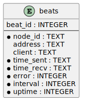
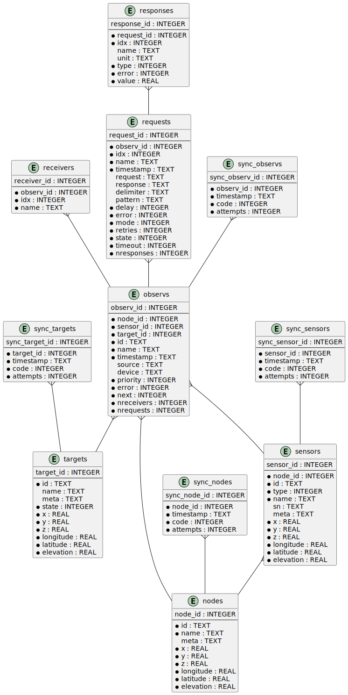

# Overview {#overview}

The **Deformation Monitoring Package** (**DMPACK**) is a free and open source
software package for sensor control and automated time series processing in
engineering geodesy and geotechnics. The package consists of a library
*libdmpack* and additional programs based on it which serve as a reference
implementation of solutions to various problems in deformation monitoring, such
as:

- sensor control,

- sensor data parsing and processing,

- database access,

- remote procedure calls,

- data synchronisation and export,

- spatial transformations,

- client status messages,

- distributed logging,

- plotting and reporting,

- MQTT and XMPP connectivity,

- Leica GeoCOM API.

DMPACK is a scientific monitoring system developed for automated control
measurements of buildings, infrastructure, terrain, geodetic nets, and other
objects through autonomous sensor networks in the IoT. The programs for sensor
data collection are intended to be run on client hardware connected to the
Internet through LTE/5G, usually industrial embedded systems or single-board
computers.

Observation data is periodically collected by the clients from arbitrary
sensors, like total stations, digital levels, inclinometers, weather stations,
or GNSS receivers. The raw sensor responses are structured, post-processed,
locally stored, and transmitted to a central monitoring server that provides an
HTTP-RPC API for client--server communication.

The software package can be used to monitor objects like:

- bridges, tunnels, dams,

- roads, railways,

- construction sites, mining areas,

- slopes, landslides, cliffs, glaciers,

- churches, monasteries, and other heritage buildings.

DMPACK is written in Fortran 2018 and integrates the relational SQLite database
for time series and log storage on client and server. The server component is
optional. If preferred, the data distribution may be omitted for local
monitoring only.

The software package relies on POSIX standards for system calls and process
management. The client-side message passing is based on POSIX message queues and
POSIX semaphores. Currently, only 64-bit Linux (*glibc*) and FreeBSD are
supported as operating systems.

The sources of DMPACK are released under the ISC licence that is functionally
equivalent to the BSD 2-Clause and MIT licences. The source code and the
documentation are available online. See the project website for further
information:

- [Project Website](https://www.dabamos.de/dmpack.html)

- [User Guide](https://www.dabamos.de/dmpack/guide/)

- [Screen Shots](https://www.dabamos.de/dmpack.html#screen-shots)

- [Source Code Documentation](https://www.dabamos.de/dmpack/doc/)

- [GitHub Repository](https://github.com/dabamos/dmpack)

This document is licenced under
[CC Attribution 4.0](https://creativecommons.org/licenses/by/4.0/).

# Software Architecture {#software_architecture}

{#img-schema alt="schema"}

The DMPACK library is based on a modular architecture that loosely follows the
Unix philosophy, i. e., distinct programs cover well-defined tasks. The
scheduling, process management and synchronisation, as well as the inter-process
communication between programs are handled by the operating system, using POSIX
system calls.

The DMPACK programs can be deployed either on a single sensor node with no or
only limited network access, or within a sensor network of one or more nodes
connected to a central monitoring server:

Data Logger

:   In the most basic use case, the DMPACK programs [dmserial](#dmserial),
    [dmfs](#dmfs), and [dmpipe](#dmpipe) act as data loggers without any
    database connectivity, by writing the observations to flat files in CSV or
    JSON Lines format. Any further data processing or analytics is subject to
    third-party programs.

Local Monitoring

:   The majority of the DMPACK programs depend on inter-process communication
    and database access. For instance, a [dmserial](#dmserial) process
    controlling an attached sensor may transmit observations and logs in
    real-time to the message queues of [dmdb](#dmdb) and [dmlogger](#dmlogger)
    to be stored in the local databases. The database records could then be
    exported periodically to flat files. Synchronisation with a remote server is
    optional.

Distributed Monitoring

:   Sensor nodes connected to a central monitoring server can run
    [dmsync](#dmsync) to send observations and log messages automatically to the
    HTTP-RPC interface of [dmapi](#dmapi) to be stored in the server databases.
    Additionally, the server may collect status messages to monitor the
    condition of the sensor nodes.

The programs are conceived to run headless on embedded devices and servers. Some
of them, such as [dmapi](#dmapi), [dmreport](#dmreport), or [dmweb](#dmweb), can
be deployed on sensor nodes and monitoring servers alike.

# Similar Software {#similar_software}

There are similar open source projects that provide middleware for autonomous
sensor networks:

[52°North Sensor Observation Service](https://github.com/52North/SOS)

:   The reference implementation of the OGC Sensor Observation Service (SOS) in
    Java, by 52°North Spatial Information Research GmbH. Offers an interoperable
    interface for publishing and querying sensor data and meta data. Additional
    client applications enable analysis and visualisation of the measurement
    data. The project is mostly inactive. (GPLv2)

[AImon5.0](https://3dgeo-heidelberg.github.io/AImon/)

:   Real-time monitoring of gravitational mass movements for critical
    infrastructure risk management with AI-assisted 3D metrology, by 3DGeo
    Research Group, Heidelberg University. (MIT)

[Argus](https://github.com/lpgera/argus)

:   A non-geodetic sensor data monitoring and alerting solution built with
    Node.js, MariaDB, and React. (MIT)

[FROST](https://github.com/FraunhoferIOSB)

:   Fraunhofer Open Source SensorThings (FROST) is the reference implementation
    of the OGC SensorThings API in Java. The project provides an HTTP- and
    MQTT-based message bus for data transmission between client and server.
    Developed by Fraunhofer-Institut für Optronik, Systemtechnik und
    Bildauswertung (IOSB), Karlsruhe. (LGPLv3)

[Global Sensor Networks](https://github.com/LSIR/gsn)

:   A Java-based software middleware designed to facilitate the deployment and
    programming of sensor networks, by Distributed Information Systems
    Laboratory (EPFL), Switzerland. The project appears to be abandoned. (GPLv3)

[istSOS2](https://github.com/istSOS/istsos2)

:   A server implementation of the OGC Sensor Observation Service in Python, for
    managing and dispatching observations from monitoring sensors. The project
    also provides a graphical user interface and a RESTful web API to automate
    administration procedures. Developed by Istituto Scienze della Terra,
    University of Applied Sciences and Arts of Southern Switzerland. The
    software seems not to be actively maintained anymore. (GPLv2)

[istSOS4](https://github.com/istSOS/istSOS4)

:   An OGC SensorThings API compliant service implementation written in Python
    that enables reproducibility of processes based on its data due to the
    Traveltime extension. The system allows for managing and dispatching
    observations from monitoring sensors, specimens or citizens. In early
    development stage. (GPL)

[Kotori](https://github.com/daq-tools/kotori)

:   A multi-channel, multi-protocol, telemetry data acquisition and graphing
    toolkit for time-series data processing in Python. It supports scientific
    environmental monitoring projects, distributed sensor networks, and likewise
    scenarios. (AGPLv3)

[OpenADMS](https://www.dabamos.de/openadms.html)

:   The Open Automatic Deformation Monitoring software is an IoT sensor network
    middleware in Python 3. The system was developed as a prototype of DMPACK
    and includes client and server programs. (BSD)

[OpenSensorHub](https://github.com/opensensorhub)

:   Java-based middleware for building Sensor Webs in the Internet of Things.
    Based on OGC standards from the Sensor Web Enablement (SWE) initiative.
    (MPLv2)

[Project Mjolnir](https://github.com/project-mjolnir)

:   An open source client--server IoT architecture for scientific sensor
    networks written in Python, by University of Alabama in Huntsville and NASA.
    Includes a sensor client for data logging, uplink and control, as well as a
    server component to store, serve/display, and monitor data from remote
    sensors. Further development of the software has been stopped. (MIT)

[TSDSystem](https://github.com/ingv-oe-dev/tsdsystem)

:   The Time Series Database management System (TSDSystem) is a framework to
    collect, archive and share time series of volcanological observatories from
    sensor networks at Istituto Nazionale di Geofisica e Vulcanologia,
    Osservatorio Etneo (Italy). It provides a web service to perform writing and
    reading data via standard web communication protocols. Basic web
    applications are supplied for joint and synchronised time series data
    visualisation as well as representation of stations on a geographical map.
    (MIT)

[Ulyxes](http://www.agt.bme.hu/ulyxes/)

:   An open source project in Python to control robotic total stations (RTS) and
    other sensors, and to publish observation results on web based maps.
    Developed at the Department of Geodesy and Surveying of the Budapest
    University of Technology and Economics. (GPLv2)

# Requirements {#requirements}

DMPACK has the following requirements:

- Linux or FreeBSD operating system

- 64-bit platform (x86-64, AArch64)

- Fortran 2018 and ANSI C compiler (GNU, LLVM, Intel)

Additional dependencies have to be present to build and run the software of this
package:

- [FastCGI](https://fastcgi-archives.github.io/)

- [Gnuplot](https://gnuplot.sourceforge.net/)

- [HDF5](https://www.hdfgroup.org/solutions/hdf5/)

- [LAPACK](https://www.netlib.org/lapack/)

- [libcurl](https://curl.se/libcurl/) (≥ 8.0.0)

- [libmodbus](https://libmodbus.org/)

- [libstrophe](https://strophe.im/libstrophe/) (≥ 0.13.1)

- [Lua 5.4](https://www.lua.org/)

- [NNG](https://nng.nanomsg.org/) (≥ 1.11.0)

- [PCRE2](https://www.pcre.org/)

- [SQLite 3](https://www.sqlite.org/) (≥ 3.39.0)

- [zlib](https://www.zlib.net/)

- [zstd](https://facebook.github.io/zstd/) (≥ 1.5.5)

Optionally, for PDF reports and client-side camera access:

- [FFmpeg](https://www.ffmpeg.org/)

- [Ghostscript](https://www.ghostscript.com/)

- [GNU roff](https://www.gnu.org/software/groff/)

- [GraphicsMagick](http://www.graphicsmagick.org/)

The [web applications](#web-applications) require a compatible web server, like:

- [lighttpd](https://www.lighttpd.net/)

- [Apache httpd](https://httpd.apache.org/)

# Quick Start {#quick_start}

On Ubuntu 24.04 LTS, run the following commands to build and install DMPACK from
source. First, install the dependencies:

    $ sudo apt-get install gcc gfortran make pkg-config
    $ sudo apt-get install --no-install-recommends curl ffmpeg gnuplot ghostscript \
      graphicsmagick groff gsfonts lua5.4 sqlite3 libblas-dev liblapack-dev libcurl4t64 \
      libcurl4-openssl-dev libfcgi-bin libfcgi-dev libhdf5-103-1t64 libhdf5-dev liblua5.4 \
      liblua5.4-dev libmodbus5 libmodbus-dev libnng1 libnng-dev libpcre2-8-0 libpcre2-dev \
      libsqlite3-0 libsqlite3-dev libstrophe0 libstrophe-dev libzstd1 libzstd-dev zlib1g \
      zlib1g-dev

Then, download and build DMPACK from source:

    $ cd /tmp/
    $ curl -O -L https://github.com/dabamos/dmpack/archive/refs/heads/master.zip
    $ unzip master.zip
    $ cd dmpack-master/
    $ make linux

If the host platform is 64-bit ARM (AArch64), run instead:

    $ make linux_aarch64

Install the DMPACK library and programs to `/opt`:

    $ sudo make install PREFIX=/opt

Add path `/opt/bin` to the `PATH` environment variable in `/etc/profile` or
`~/.profile` to start DMPACK programs from command-line.

Afterwards, configure [POSIX message queues](#sys-conf-mqueue-linux). If the
message queue file system is not mounted on `/dev/mqueue` already, run:

    $ sudo mkdir -p /dev/mqueue
    $ sudo mount -t mqueue none /dev/mqueue

Set the maximum number of messages and the maximum message size, and add the
settings to `/etc/sysctl.conf`:

    $ sudo sysctl fs.mqueue.msg_max=32
    $ sudo sysctl fs.mqueue.msgsize_max=16384
    $ sudo echo "fs.mqueue.msg_max=32" >> /etc/sysctl.conf
    $ sudo echo "fs.mqueue.msgsize_max=16384" >> /etc/sysctl.conf

Verify the configuration by executing script `runtests.sh` in
`/tmp/dmpack-master`. You can now use any DMPACK program, for example:

    $ dminfo

See the next section for complete installation instructions.

# Installation {#installation}

This section describes the steps to build the DMPACK library and programs from
source, either with POSIX Make or the [Fortran Package
Manager](https://fpm.fortran-lang.org/) (FPM). At the moment, support for the
Fortran Package Manager is experimental, and using GNU/BSD Make is recommended.
Display the available build targets of the Makefile:

    $ make help

Or, output the selected build options:

    $ make options PREFIX=/opt

See section [System Configuration](#sys-conf) on how to configure the operating
system following the installation. You must at least prepare [POSIX message
queues](#sys-conf-mqueue) in order to run DMPACK.

The shared libraries `libgcc.so`, `libgfortran.so`, and `libquadmath.so` have to
be present on the target system if the DMPACK programs have been compiled with
GNU Fortran.

| Path                         | Description                             |
|------------------------------|-----------------------------------------|
| `/usr/local/bin/`            | DMPACK programs.                        |
| `/usr/local/etc/dmpack/`     | DMPACK configuration files.             |
| `/usr/local/include/dmpack/` | DMPACK module files.                    |
| `/usr/local/lib/`            | DMPACK libraries.                       |
| `/usr/local/man/man1/`       | DMPACK man pages.                       |
| `/usr/local/share/dmpack/`   | DMPACK examples, scripts, style sheets. |
| `/var/dmpack/`               | DMPACK databases.                       |
| `/var/www/`                  | WWW root directory.                     |

: Paths used by default []{#requirements-paths}

## Linux

On Debian, install the compilers and the build environment first:

    $ sudo apt-get install gcc gfortran git make pkg-config

The Git client is optional. The third-party dependencies have to be installed
with development headers:

    $ sudo apt-get install --no-install-recommends curl ghostscript gnuplot groff \
      libblas-dev libcurl4 libcurl4-openssl-dev libfcgi-bin libfcgi-dev libhdf5-103-1 \
      libhdf5-dev liblapack-dev liblua5.4 liblua5.4-dev libmodbus5 libmodbus-dev \
      libnng1 libnng-dev libpcre2-8-0 libpcre2-dev libsqlite3-0 libsqlite3-dev \
      libstrophe0 libstrophe-dev libzstd1 libzstd-dev lua5.4 sqlite3 zlib1g zlib1g-dev

Instead of package `gnuplot`, you may prefer the no-X11 flavour `gnuplot-nox` if
raster graphic formats are not required (limiting the output formats essentially
to SVG). Depending on the Linux distribution, the names of the HDF5 and Lua
packages may differ. Optionally, install FFmpeg, GraphicsMagick, and GhostScript
fonts for camera access and image manipulation:

    $ sudo apt-get install --no-install-recommends ffmpeg graphicsmagick gsfonts

In the next step, build DMPACK with *make(1)* or *fpm(1)*.

Building Dependencies from Source

:   If third-party libraries are not available in the required minimum version,
    like on Ubuntu 22.04 LTS or Debian 12, you may want to build the missing
    dependencies from source, for instance:

    - [libcurl](#third-party-libcurl)

    - [libmodbus](#third-party-libmodbus)

    - [libstrophe](#third-party-libstrophe)

    - [NNG](#third-party-nng)

    - [SQLite 3](#third-party-sqlite)

    - [Zstandard](#third-party-zstd)

    If the libraries are installed to a non-default directory, overwrite the
    specific linker flag. For example, if SQLite 3 has been installed to `/opt`,
    pass argument `LIBSQLITE3`:

        $ make linux LIBSQLITE3="-Wl,-rpath=/opt/lib -L/opt/lib -lsqlite3"

    For the other libraries, pass `LIBCURL`, `LIBMODBUS`, `LIBNNG`, `LIBSTROPHE`,
    and `LIBZSTD` respectively.

Other Compilers

:   If Intel oneAPI Fortran or LLVM Flang is used, it is necessary to build
    HDF5 from source, because the versions in the Linux package repositories
    have been compiled with GNU Fortran and are therefore incompatible. See
    section [HDF5](#third-party-hdf5) for hints regarding the build process.
    Pass the library installation path additionally to `-lhdf5 -lhdf5_fortran`
    as argument `LIBHDF5` and the path to the module files as argument
    `INCHDF5`.

### FPM {#linux-fpm}

On Linux (x86-64), change to the cloned or downloaded repository, and run:

    $ fpm @linux-amd64-build

Build and install DMPACK with target `@linux-amd64-install`. The library and the
programs will be installed to directory `~/.local`. If the compilation fails
with an error message stating that `-llua-5.4` cannot be found, update the
library names in the manifests:

    $ sed -i "s/lua-5/lua5/g" fpm.toml
    $ sed -i "s/lua-5/lua5/g" build/dependencies/fortran-lua54/fpm.toml

### Make {#linux-make}

Clone the DMPACK repository with Git:

    $ git clone --depth 1 https://github.com/dabamos/dmpack
    $ cd dmpack/

If Git is not available, download the archive of the master branch instead:

    $ curl -O -L -s https://github.com/dabamos/dmpack/archive/refs/heads/master.zip
    $ unzip master.zip
    $ cd dmpack-master/

Then, execute build target `linux` of the Makefile to compile the source:

    $ make linux

On 64-bit ARM platforms, like those of the Raspberry Pi 3/4/5 series, select
build target `linux_aarch64` instead:

    $ make linux_aarch64

Install the DMPACK libraries and programs system-wide to `/usr/local`:

    $ sudo make install

Or, to install to directory `/opt`, run:

    $ sudo make install PREFIX=/opt

Path `/opt/bin` must be added to the global `PATH` environment variable to run
DMPACK programs from the command-line.

Intel oneAPI Compilers

:   If your prefer Intel oneAPI over GCC, run:

        $ make linux CC=icx FC=ifx \
          FFLAGS="-O2 -mtune=native -I/opt/include" \
          CFLAGS="-O2 -mtune=native" \
          LIBFLAGS="-fpic" \
          MODFLAGS="-module ./include -I./include" \
          PPFLAGS="" \
          LIBHDF5="-Wl,-rpath=/opt/lib -L/opt/lib -lhdf5 -lhdf5_fortran"

    In this particular case, the HDF5 libraries are installed to `/opt/lib`,
    and the HDF5 module files to `/opt/include`. Change the paths to the actual
    locations.

## FreeBSD

First, install the build and run-time dependencies:

    $ doas pkg install archivers/zstd comms/libmodbus databases/sqlite3 devel/git \
      devel/pcre2 devel/pkgconf ftp/curl graphics/GraphicsMagick lang/gcc \
      lang/lua54 math/gnuplot math/lapack multimedia/ffmpeg net/nng \
      net-im/libstrophe print/ghostscript10 science/hdf5 textproc/groff www/fcgi

Instead of `math/gnuplot`, you may want to install package `math/gnuplot-lite`
which does not depend on X11 (but lacks the raster image terminals). The
packages `graphics/GraphicsMagick` and `multimedia/ffmpeg` are optional. The web
applications additionally require a web server:

    $ doas pkg install www/lighttpd

If you want to generate the man pages and the User Guide from source, also
install Pandoc:

    $ doas pkg install textproc/hs-pandoc

Once all dependencies have been installed, build DMPACK with FPM or Make.

### FPM {#freebsd-fpm}

Either clone the repository with Git, or download the [archive of the master
branch](https://github.com/dabamos/dmpack/archive/refs/heads/master.zip). Then,
run:

    $ fpm @freebsd-build

The Fortran Package Manager will fetch all third-party dependencies
automatically, but the configuration and shared files have to be installed
manually. Use build target `@freebsd-install` to build and install DMPACK. The
library and the programs will be installed to `~/.local`.

### Make {#freebsd-make}

First, clone the repository with Git or download an archive of the master
branch:

    $ git clone --depth 1 https://github.com/dabamos/dmpack
    $ cd dmpack/

Execute the Makefile with build target `freebsd`:

    $ make freebsd

Install the library and all programs system-wide to `/usr/local`:

    $ doas make install

You can change the installation prefix with argument `PREFIX`. To install to
directory `/opt` instead, run:

    $ doas make install PREFIX=/opt

In this case, path `/opt/bin` should be included in the global `PATH`
environment variable.

LLVM Compilers

:   If you prefer [LLVM 21](https://www.freshports.org/devel/llvm21/) over GCC,
    you must compile HDF5 from source if enabled, as the module files provided
    in the FreeBSD package repository have been built with GNU Fortran. See
    section [HDF5](#third-party-hdf5) for hints. Assumed that the HDF5 library
    is installed to `/opt`, run:

        $ make freebsd CC=clang21 FC=flang21 \
          FFLAGS="-O2 -mtune=native -I/opt/include" \
          LDFLAGS="-L/usr/local/lib" \
          LIBHDF5="-Wl,-rpath=/opt/lib -L/opt/lib -lhdf5 -lhdf5_fortran"

# System Configuration {#sys-conf}

This sections describes how the operating system has to be configured in order
to run the DMPACK programs:

- [Message Queues](#sys-conf-mqueue) -- Enable message passing on
  [Linux](#sys-conf-mqueue-linux) and [FreeBSD](#sys-conf-mqueue-freebsd)
  (**required**).

- [Time Zone](#sys-conf-tz) -- Set the correct time zone of the sensor node.

- [Time Synchronisation](#sys-conf-ntp) -- Enable synchronisation with an NTP
  server.

- [Power Saving](#sys-conf-power) -- Disable USB power saving on Linux.

- [Cron](#sys-conf-cron) -- Add cron jobs to run programs periodically.

## Message Queues {#sys-conf-mqueue}

The sensor node must have POSIX message queues enabled.

Linux []{#sys-conf-mqueue-linux}

:   The POSIX message queue file system should already be mounted on
    `/dev/mqueue` by default. Otherwise, run:

        # mkdir -p /dev/mqueue
        # mount -t mqueue none /dev/mqueue

    Set the maximum number of messages and the maximum message size to some
    reasonable values, for example:

        # sysctl fs.mqueue.msg_max=32
        # sysctl fs.mqueue.msgsize_max=16384

    The maximum message size has to be at least 16384 bytes. Add the settings
    to `/etc/sysctl.conf` to make them permanent:

        fs.mqueue.msg_max=32
        fs.mqueue.msgsize_max=16384

FreeBSD []{#sys-conf-mqueue-freebsd}

:   On FreeBSD, make sure the kernel module `mqueuefs` is loaded, and the
    message queue file system is mounted:

        # kldstat -m mqueuefs
        Id  Refs Name
        522    1 mqueuefs

    Otherwise, we can simply load and mount the file system:

        # kldload mqueuefs
        # mkdir -p /mnt/mqueue
        # mount -t mqueuefs null /mnt/mqueue

    To load messages queues at system start, add the module `mqueuefs` to
    `/etc/rc.conf`, and the file system to `/etc/fstab`:

        # sysrc kld_list+="mqueuefs"
        # echo "null /mnt/mqueue mqueuefs rw 0 0" >> /etc/fstab

    Additionally, we may increase the system limits of POSIX message queues
    with *sysctl(8)*, or in `/etc/sysctl.conf`. The defaults are:

        # sysctl kern.mqueue.maxmsg
        kern.mqueue.maxmsg: 32
        # sysctl kern.mqueue.maxmsgsize
        kern.mqueue.maxmsgsize: 16384

    The maximum message size has to be at least 16384 bytes.

## Time Zone {#sys-conf-tz}

The local time zone of the sensor client should be set to a zone without summer
daylight-saving. For instance, time zone `Europe/Berlin` implies Central
European Summer Time (CEST), which is usually not desired for long-term
observations, as it leads to time jumps. Instead, use time zone `GMT+1` or `UTC`
in this case.

Linux []{#sys-conf-tz-linux}

:   On Linux, list all time zones and set the preferred one with
    *timedatectl(1)*:

        # timedatectl list-timezones
        # timedatectl set-timezone Etc/GMT+1

FreeBSD []{#sys-conf-tz-freebsd}

:   On FreeBSD, configure the time zone using:

        # tzsetup

## Time Synchronisation {#sys-conf-ntp}

The system time should be updated periodically by synchronising it with network
time servers. A Network Time Protocol (NTP) client has to be installed and
configured to enable the synchronisation.

Linux []{#sys-conf-ntp-linux}

:   On Debian Linux, install the NTP package:

        # apt-get install ntp

    Query the NTP servers to synchronise with:

        # ntpq -p

    The system time should be updated now:

        # date -R

    On error, try to reconfigure the NTP service:

        # dpkg-reconfigure ntp

FreeBSD []{#sys-conf-ntp-freebsd}

:   Set the current date and time intially by passing the IP or FQDN of the NTP
    server to *ntpdate(1)*:

        # ntpdate -b ptbtime1.ptb.de

    The NTP daemon *ntpd(8)* is configured through file `/etc/ntp.conf`. If
    favoured, we can replace the existing NTP server pool
    `0.freebsd.pool.ntp.org` with a single server, for example:

        server ptbtime1.ptb.de iburst

    Add the following entries to `/etc/rc.conf`:

        ntpd_enable="YES"
        ntpd_sync_on_start="YES"
        ntpd_flags="-g"

    Start the *ntpd(8)* service:

        # service ntpd start

## Power Saving {#sys-conf-power}

On Linux, power saving for USB devices may be enabled by default. This can cause
issues if sensors are attached through an USB adapter. USB power saving is
enabled if the kernel boot parameter `usbcore.autosuspend` is not `-1`:

    # cat /sys/module/usbcore/parameters/autosuspend
    2

We can update the boot loader to turn auto-suspend off. Edit `/etc/default/grub`
and change `GRUB_CMDLINE_LINUX_DEFAULT` to:

    GRUB_CMDLINE_LINUX_DEFAULT="quiet usbcore.autosuspend=-1"

Then, update the boot loader:

    # update-grub

The system has to be rebooted for the changes to take effect.

## Cron {#sys-conf-cron}

On Unix-like operating system, [cron](https://en.wikipedia.org/wiki/Cron) is
usually used to run jobs periodically. For instance, in order to update an XML
feed or to generate HTML reports at regular intervals, add a schedule of the
task to perform to the *crontab(5)* file of a local user. For example, to edit
the cron jobs of user `www` with *crontab(1)* run:

    # crontab -u www -e

The following *crontab(5)* entry adds a job to generate reports every hour,
using utility script `mkreport.sh`:

    SHELL=/bin/sh
    MAILTO=/dev/null
    # Create reports every hour.
    @hourly /usr/local/share/dmpack/dmreport/mkreport.sh

Alter script `mkreport.sh` to your set-up. Status mails and logging are
disabled. The shell script `mkreport.sh` must have the execution bits set.
Modify the script according to your set-up. Additionally, we may update an Atom
XML feed of logs by running [dmfeed](#dmfeed) every five minutes:

    */5 * * * * /usr/local/bin/dmfeed --config /usr/local/etc/dmpack/dmfeed.conf

The feed is updated only if new logs have arrived in the meantime, unless option
`--force` is passed as an additional argument.

# Deformation Monitoring Entities {#entities}

The data structures of DMPACK are based on the following entities. The date and
time format used internally is a 32-characters long ISO 8601 time stamp in
microsecond resolution, with time separator `T` and mandatory GMT offset, for
example, `1970-01-01T00:00:00.000000+00:00`. The human-readable output format
`1970-01-01 00:00:00 +00:00` is used where reasonable. Global coordinates are in
longitude/latitude order (east-west/north-south order).

## Observation Entities {#observation_entities}

[Node](#data_node)

:   A unique sensor node within a sensor network. Contains id, name,
    description, and optional position.

[Sensor](#data_sensor)

:   A unique sensor attached to a *node*, with id, name, description, and
    optional position.

[Target](#data_target)

:   A unique measurement target (point of interest, location) with id, name,
    description, and optional position. Multiple nodes and sensors may share a
    single target.

[Observation](#data_observ)

:   A single measurement identified by name and unique UUID identifier that
    contains a request to and up to 64 responses from a sensor, referencing a
    *node*, a *sensor*, and a *target*. An observation can contain up to 8
    requests which will be sent to the sensor in sequential order.

[Response](#data_observ)

:   Floating-point values in the raw response of a *sensor* can be matched by
    regular expression groups. Each matched group is stored as a response.
    Responses reference an *observation*, and are ordered by index. They
    contain name, type, value, unit, and an optional error code.

## Log Entities {#log_entities}

[Log](#data_log)

:   Log message of a sensor node, either of level *debug*, *info*, *warning*,
    *error*, *critical*, or *user*, and optionally related to a *sensor*, a
    *target*, and an *observation*.

## Beat Entities {#beat_entities}

[Beat](#data_beat)

:   Short status message (heartbeat, handshake) that contains node id, client
    address, client version, time stamp, system uptime, and last connection
    error, sent periodically from client to server.

## RPC Entities {#rpc_entities}

[API Status](#data_api)

:   Short key--value response of the HTTP-RPC API service in plain-text format.

[Image](#data_image)

:   Attributes of an image captured from webcam or IP camera, to be sent from
    client to server.

[Transfer](#data_transfer)

:   The meta data of a unique file transfer from client to server. Only used
    internally.

# Program Overview {#program_overview}

DMPACK includes programs for sensor I/O, database management, observation
processing, and other tasks related to automated control measurements. The
programs may be classified into the following categories.

## Database Access {#database_access}

[dmbackup](#dmbackup)

:   Creates an online backup of a database by either using the SQLite backup API
    or `VACUUM INTO`.

[dmdb](#dmdb)

:   Stores observations received from POSIX message queue in an SQLite database.

[dmdbctl](#dmdbctl)

:   A command-line interface to the DMPACK observation database, to read, add,
    update, or delete nodes, sensors, and targets.

[dmexport](#dmexport)

:   Exports beats, nodes, sensors, targets, observations, and logs from database
    to file, either in CSV, JSON, or JSON Lines format.

[dmimport](#dmimport)

:   Imports nodes, sensors, targets, observations, and logs from CSV file into
    database.

[dminit](#dminit)

:   Creates and initialises observation, log, and beat databases.

## Logging {#logging}

[dmlog](#dmlog)

:   A utility program to send log messages from command-line or shell script to
    the POSIX message queue of a [dmlogger](#dmlogger) process, to be stored in
    the log database.

[dmlogger](#dmlogger)

:   Stores logs received from POSIX message queue in an SQLite database.

## Message Passing {#message_passing}

[dmrecv](#dmrecv)

:   Receives logs or observations from POSIX message queue and writes them to
    *stdout*, file, or named pipe.

[dmsend](#dmsend)

:   Sends observations or logs from file to a DMPACK application via POSIX
    message queue.

## Observation Processing {#observation_processing}

[dmgrc](#dmgrc)

:   Inspects received observations and creates log messages from GeoCOM return
    codes.

[dmlua](#dmlua)

:   Runs a custom Lua script to process observations and forward them to the
    next specified receiver.

## Plots & Reports {#plots_reports}

[dmplot](#dmplot)

:   Creates line plots of time series read from database, with output to file,
    terminal, or X11 window. Uses *gnuplot(1)* internally as plotting back-end.

[dmreport](#dmreport)

:   Generates reports in HTML and PDF format, containing plots and optionally
    log messages.

## Remote Procedure Calls {#remote_procedure_calls}

[dmapi](#dmapi)

:   A FastCGI-based HTTP-RPC service that provides an API for node, sensor,
    target, observation, and log synchronisation, as well as heartbeat
    transmission. Clients may either send records to be stored in the server
    database, or request data of a given time range. Depending on the HTTP
    Accept header, the server returns data in CSV, JSON, JSON Lines or Namelist
    format. Requires a FastCGI-compatible web server, such as *lighttpd(1)*.

[dmbeat](#dmbeat)

:   Sends short status messages (heartbeats) periodically to a remote
    [dmapi](#dmapi) instance.

[dmbot](#dmbot)

:   Accepts commands sent via XMPP/Jabber to monitor the status of a sensor
    node.

[dmsync](#dmsync)

:   Synchronises nodes, sensors, targets, observations, and log messages between
    client and [dmapi](#dmapi) server. Only uni-directional synchronisation from
    client to server is supported.

[dmupload](#dmupload)

:   Uploads captured camera images from client to HTTP-RPC server.

## Sensor Control {#sensor_control}

[dmcamera](#dmcamera)

:   Captures images of an attached USB webcam (V4L2) or from a real-time IP
    camera stream (RTSP).

[dmdwd](#dmdwd)

:   Reads weather reports of a MOSMIX weather station from the Open Data API of
    Deutscher Wetterdienst (DWD).

[dmfs](#dmfs)

:   Reads sensor data from virtual file system, file, or named pipe. The program
    be used to read values from sensors connected through 1-Wire (OWFS).
    Observations are forwarded via POSIX message queue and/or written to file.

[dmmb](#dmmb)

:   Sensor control program for Modbus RTU/TCP. Loads the observations to perform
    from a configuration file and either reads from or writes to Modbus
    registers.

[dmmbctl](#dmmbctl)

:   A command-line utility to read a value from or write a value to a register
    of a Modbus RTU/TCP device.

[dmpipe](#dmpipe)

:   Executes a program as a sub-process connected through an anonymous pipe and
    forwards the output via POSIX message queue. Optionally, observations are
    written to file or *stdout*.

[dmserial](#dmserial)

:   Connects to a TTY/PTY serial port for sensor communication. The program
    sends requests to a connected sensor to receive responses. The program
    pre-processes the response data using regular expressions and forwards
    observations via POSIX message queue.

[dmsystem](#dmsystem)

:   Reads system parameters, like free disk space, database sizes, load average,
    or CPU temperature.

[dmved](#dmved)

:   Reads status information of a connected Victron Energy MPPT solar charge
    controller or SmartShunt battery monitor, using the VE.Direct protocol.

## Utilities {#utilities}

[dminfo](#dminfo)

:   Prints system and database information as key--value pairs to standard
    output.

[dmuuid](#dmuuid)

:   A command-line tool to generate unique UUID identifiers (by default in
    hexadecimal format without hyphens).

## Web {#web}

[dmfeed](#dmfeed)

:   Creates an [Atom](https://en.wikipedia.org/wiki/Atom_(web_standard))
    syndication feed in XML format (RFC 4287) from logs of given sensor node and
    log level. If the feed is served by a web server, clients can subscribe to
    it by using a feed reader or news aggregator. The program may be executed
    periodically as a cron job.

[dmweb](#dmweb)

:   A CGI-based web user interface for DMPACK database access on client and
    server. Requires a web server and *gnuplot(1)*.

# Programs {#programs}

This section contains descriptions of all DMPACK programs with their respective
command-line arguments. Some programs read settings from an optional or
mandatory configuration file. Example configuration files for all programs are
provided in directory `/usr/local/etc/dmpack/`.

The configuration files are ordinary Lua scripts, i.e., you can add Lua control
structures for complex tables or access the [Lua API](#lua-api) of DMPACK. In
your editor, set the language to Lua to enable syntax highlighting (for
instance, `set syntax=lua` in Vim), or use file ending `.lua` instead of
`.conf`.

The set-up of the [web applications](#web-applications) is outlined in the next
section.

| Environment Variable | Description                                             |
|----------------------|---------------------------------------------------------|
| `DM_LOGGER`          | Name of [dmlogger](#dmlogger) instance to send logs to. |
| `NO_COLOR`           | Disable ANSI colour output if set to `1`.               |

: Environment variables used by DMPACK programs

## dmapi {#dmapi}

**dmapi** is an HTTP-RPC API service for remote DMPACK database access. The web
application has to be executed through a FastCGI-compatible web server. It is
recommended to use *lighttpd(1)*. The service is configured through environment
variables. The web server or FastCGI spawner must be able to pass environment
variables to **dmapi**.

The **dmapi** service offers endpoints for clients to insert beats, logs, and
observations into the local SQLite database, and to request data in CSV or JSON
format. Only HTTP GET and POST requests are accepted. All POST data has to be
serialised in Fortran 95 Namelist format, with optional
[deflate](http://www.zlib.net/) or [zstd](http://www.zstd.net/) compression.
Section [RPC API](#rpc-api) gives an overview of the available endpoints.

Authentication and encryption are independent from **dmapi** and have to be
provided by the web server. If HTTP Basic Auth is enabled, the sensor id of each
beat, log, node, sensor, and observation sent to the HTTP-RPC service must match
the name of the authenticated user. For example, to store an observation of a
node with the id `node-1`, the user name of the client must be `node-1` as well.
If the observation is sent by any other user, it will be rejected (HTTP 401).

| Environment Variable | Description                                     |
|----------------------|-------------------------------------------------|
| `DM_BEAT_DB`         | Path to heartbeat database (required).          |
| `DM_IMAGE_DB`        | Path to image database (optional).              |
| `DM_IMAGE_DIR`       | Path to image file directory (optional).        |
| `DM_LOG_DB`          | Path to log database (required).                |
| `DM_OBSERV_DB`       | Path to observation database (required).        |
| `DM_READ_ONLY`       | Set to `1` to enable read-only database access. |

: Environment variables of *dmapi(1)* []{#dmapi-env}

The response format depends on the MIME type set in the HTTP Accept header of
the request, either:

- `application/json` (JSON)

- `application/jsonl` (JSON Lines)

- `application/namelist` (Fortran 95 Namelist)

- `text/comma-separated-values` (CSV)

- `text/plain` (plain text)

By default, responses are in CSV format. The Namelist format is available only
for single records. Status messages are returned as key--value pairs, indicated
by content type `text/plain`.

See section [RPC Server](#web-rpc-server) for a basic *lighttpd(1)*
configuration.

## dmbackup {#dmbackup}

The **dmbackup** utility creates an online backup of a running SQLite database.
By default, the SQLite backup API is used. Existing backup databases are not
replaced.

The program is functional equivalent to running the *sqlite3(1)* command-line
interface:

    $ sqlite3 <database> ".backup '<backup>'"

To synchronise a database with a different host through SSH, run the [database
remote-copy tool](https://sqlite.org/rsync.html) *sqlite3_rsync(1)* instead, for
example:

    $ sqlite3_rsync -v /var/dmpack/observ.db user@host:/var/backup/observ.db
    sent 411,141,667 bytes, received 22 bytes, 45,911,969.74 bytes/sec
    total size 410,640,384

The tool must be installed on both systems.

### Command-Line Options

| Option             | Short | Default | Description                                            |
|--------------------|-------|---------|--------------------------------------------------------|
| `--backup file`    | `-b`  | --      | Path of the backup database.                           |
| `--database file`  | `-d`  | --      | Path of the SQLite database to backup.                 |
| `--help`           | `-h`  | --      | Print available command-line arguments and quit.       |
| `--vacuum`         | `-U`  | off     | Use `VACUUM INTO` instead of the SQLite backup API.    |
| `--verbose`        | `-V`  | off     | Print backup progess to *stdout* (not in vacuum mode). |
| `--version`        | `-v`  | --      | Print version information and quit.                    |
| `--wal`            | `-W`  | off     | Enable WAL journal for backup database.                |

### Examples

Create an online backup of an observation database:

    $ dmbackup --database /var/dmpack/observ.db --backup /tmp/observ.db

## dmbeat {#dmbeat}

The **dmbeat** program is a heartbeat emitter that sends [handshake
messages](#data_beat) via HTTP POST to a remote [dmapi](#dmapi) service.
Heartbeats include the following attributes:

| Attribute   | Description                                      |
|-------------|--------------------------------------------------|
| `node_id`   | Node id.                                         |
| `address`   | IPv4/IPv6 address of client.                     |
| `client`    | Client software name and version.                |
| `time_sent` | Date and time heartbeat was sent (ISO 8601).     |
| `time_recv` | Date and time heartbeat was received (ISO 8601). |
| `error`     | Last client connection error.                    |
| `interval`  | Emit interval in seconds.                        |
| `uptime`    | Client uptime in seconds.                        |

The server may inspect the data to check if a client is still running and has
network access. The RPC endpoint on the server is expected at URL
`[http|https]://<host>:<port>/api/v2/beat`.

### Command-Line Options

| Option               | Short | Default  | Description                                                                                 |
|----------------------|-------|----------|---------------------------------------------------------------------------------------------|
| `--compression name` | `-x`  | `zstd`   | Compression library to use (`none`, `zlib`, `zstd`).                                        |
| `--config file`      | `-c`  | --       | Path to configuration file.                                                                 |
| `--count n`          | `-C`  | 0        | Number of heartbeats to send (unlimited if 0).                                              |
| `--debug`            | `-D`  | off      | Forward log messages of level *debug* (if logger is set).                                   |
| `--help`             | `-h`  | --       | Print available command-line arguments and quit.                                            |
| `--host host`        | `-H`  | --       | IP or FQDN of HTTP-RPC API host (for instance, `127.0.0.1` or `iot.example.com`).           |
| `--interval sec`     | `-I`  | 0        | Emit interval in seconds.                                                                   |
| `--logger name`      | `-l`  | --       | Optional name of logger. If set, sends logs to [dmlogger](#dmlogger) process of given name. |
| `--name name`        | `-n`  | `dmbeat` | Optional name of instance and table in configuration.                                       |
| `--node id`          | `-N`  | --       | Node id.                                                                                    |
| `--password string`  | `-P`  | --       | API password.                                                                               |
| `--port port`        | `-q`  | 0        | Port of HTTP-RPC API server (0 for automatic).                                              |
| `--tls`              | `-E`  | off      | Use TLS encryption.                                                                         |
| `--username string`  | `-U`  | --       | API user name. If set, implies HTTP Basic Auth.                                             |
| `--verbose`          | `-V`  | off      | Print log messages to *stderr*.                                                             |
| `--version`          | `-v`  | --       | Print version information and quit.                                                         |

### Examples

Send a single heartbeat to a [dmapi](#dmapi) service on `localhost`:

    $ dmbeat --node dummy-node --host 127.0.0.1 --count 1 --verbose

A sensor node with id `dummy-node` must exist in the server database. The web
application [dmweb](#dmweb) lists the beats received by the server.

## dmbot {#dmbot}

{#img-dmbot alt="dmbot"}

The **dmbot** program is an XMPP bot that accepts commands via chat. Access to
the bot is limited to the JIDs added to table `group` in the configuration file.
Requests from clients whose JID is not in the table will be rejected. If table
`group` is empty, all clients are allowed to send commands to the bot.

The XMPP resource is automatically set to the name of the bot instance. If the
JID of the bot account is `bot@example.com` and the bot name is `dmbot`, the
full JID will be set to `bot@example.com/dmbot`.

All commands start with prefix `!`. For an overview, send chat command `!help`
to the bot. The bot understands the following commands:

!beats

:   Return current time of the sensor node in
    [Swatch Internet Time](https://en.wikipedia.org/wiki/Swatch_Internet_Time)
    (*.beats*).

!date

:   Return date and time of the sensor node in ISO 8601.

!help

:   Return help text.

!jid

:   Return full JID of bot.

!log \<level\> \"\<message\>\"

:   Send log message of given level to logger. The argument `level` must be a
    valid log level name or numeric log level. The argument `message` must be in
    quotes if it contains spaces.

!node

:   Return node id of bot.

!poke

:   Return a message if the bot is online.

!reconnect

:   Reconnect bot to server.

!uname

:   Return name and version of the operating system.

!uptime

:   Return system uptime and load.

!version

:   Return bot version.

Passing the XMPP credentials via the command-line arguments `--jid` and
`--password` is insecure on multi-user operating systems and only recommended
for testing.

### Command-Line Options

| Option              | Short | Default | Description                                                                                 |
|---------------------|-------|---------|---------------------------------------------------------------------------------------------|
| `--config file`     | `-c`  | --      | Path to configuration file.                                                                 |
| `--debug`           | `-D`  | off     | Forward log messages of level *debug* (if logger is set).                                   |
| `--help`            | `-h`  | --      | Print available command-line arguments and quit.                                            |
| `--host host`       | `-H`  | --      | FQDN of XMPP server (for instance, `example.com`).                                          |
| `--jid string`      | `-J`  | --      | Bot Jabber id (for example, `bot@example.com`).                                             |
| `--logger name`     | `-l`  | --      | Optional name of logger. If set, sends logs to [dmlogger](#dmlogger) process of given name. |
| `--name name`       | `-n`  | `dmbot` | Optional name of instance, XMPP resource, and table in configuration.                       |
| `--node id`         | `-N`  | --      | Node id.                                                                                    |
| `--password string` | `-P`  | --      | Bot password.                                                                               |
| `--port port`       | `-q`  | 5222    | Port of XMPP server.                                                                        |
| `--reconnect`       | `-R`  | off     | Reconnect on error.                                                                         |
| `--tls`             | `-E`  | off     | Force TLS encryption.                                                                       |
| `--verbose`         | `-V`  | off     | Print log messages to *stderr*.                                                             |
| `--version`         | `-v`  | --      | Print version information and quit.                                                         |

### Examples

Connect with JID `bot@example.com` to an XMPP server on port 5223 and wait for
commands:

    $ dmbot --node dummy-node --jid bot@example.com --password secret \
      --host example.com --port 5223 --tls --verbose

If no configuration file is used, any client may send commands to the bot
without authorisation. Start a chat with the bot JID and send a command. For
instance, on command `!uptime` the bot sends a reply like the following:

    uptime: 0 days 23 hours 57 mins 32 secs (.0, .0, .0)

## dmcamera {#dmcamera}

The **dmcamera** program captures images of an attached USB webcam (V4L2) or
remote IP camera (RTSP). The images are written to file in JPEG or PNG format.
If an image database is specified, the image meta data is added to the database.
The database can be created with [dminit](#dminit). The program depends on
FFmpeg and GraphicsMagick. The executables *ffmpeg(1)* and *gm(1)* are required.
In order to capture USB camera images on Linux, additionally install package
`v4l-utils`.

A text overlay may be added to the image, containg the date and time it was
captured in ISO 8601. The overlay font must be known to GraphicsMagick. For a
list of all fonts supported by GraphicsMagick, run:

    $ gm convert -list font
    Path: /usr/local/lib/GraphicsMagick/config/type-windows.mgk

    Name                             Family                  Style   Stretch  Weight
    --------------------------------------------------------------------------------
    Arial                            Arial                   normal  normal    400
    Arial-Black                      Arial                   normal  normal    900
    Arial-Bold                       Arial                   normal  normal    700
    Arial-Bold-Italic                Arial                   italic  normal    700
    Arial-Italic                     Arial                   italic  normal    400
    ...

Depending on the operating system, you may have to manually modify the
GraphicsMagick configuration file `type.mgk` according to the fonts installed on
the system. Or, use the Perl script `imagick_type_gen.pl` to generate a type
file `type-custom.mgk`, for example:

    $ find /usr/local/share/fonts/ -type f -name "*.*" | perl ./imagick_type_gen.pl -f - > \
      /usr/local/lib/GraphicsMagick/config/type-custom.mgk

Set the include file in `type.mgk` to `type-custom.mgk` or replace `type.mgk`
with `type-custom.mgk` altogether.

### Command-Line Options

| Option             | Short | Default          | Description                                                                                                                                                                                                                                                                                     |
|--------------------|-------|------------------|-------------------------------------------------------------------------------------------------------------------------------------------------------------------------------------------------------------------------------------------------------------------------------------------------|
| `--config file`    | `-c`  | --               | Path to configuration file.                                                                                                                                                                                                                                                                     |
| `--database file`  | `-d`  | --               | Path to SQLite image database.                                                                                                                                                                                                                                                                  |
| `--debug`          | `-D`  | off              | Forward log messages of level *debug* (if logger is set).                                                                                                                                                                                                                                       |
| `--device name`    | `-C`  | --               | Camera device type (`rtsp` or `v4l2`).                                                                                                                                                                                                                                                          |
| `--directory path` | `-p`  | --               | Directory to store the image files in.                                                                                                                                                                                                                                                          |
| `--font name`      | `-F`  | `DejaVuSansMono` | Name of font to use for overlay text.                                                                                                                                                                                                                                                           |
| `--fontsize n`     | `-Z`  | 12               | Font size of overlay text.                                                                                                                                                                                                                                                                      |
| `--height n`       | `-H`  | 0 (auto)         | Desired image height. May be ignored if unsupported by camera.                                                                                                                                                                                                                                  |
| `--help`           | `-h`  | --               | Print available command-line arguments and quit.                                                                                                                                                                                                                                                |
| `--input path`     | `-i`  | --               | URL of RTSP stream or path of V4L2 device (for example, `rtsp://localhost/` or `/dev/video0`).                                                                                                                                                                                                  |
| `--interval n`     | `-I`  | 0 (off)          | Capture interval in seconds. If 0, only a single image is captured.                                                                                                                                                                                                                             |
| `--ipc`            | `-Q`  | off              | Uses a POSIX semaphore for process synchronisation. The name of the semaphore matches the instance name (with leading `/`). The semaphore is set to 1 whenever an image has been captured. Only a single process may wait for this semaphore, otherwise, reading occurs in round-robin fashion. |
| `--logger name`    | `-l`  | --               | Optional name of logger. If set, sends logs to [dmlogger](#dmlogger) process of given name.                                                                                                                                                                                                     |
| `--mime name`      | `-M`  | `image/jpeg`     | MIME type of image format to use (`image/jpeg` or `image/png`).                                                                                                                                                                                                                                 |
| `--name name`      | `-n`  | `dmcamera`       | Optional name of program instance, configuration, POSIX message queue, and POSIX semaphore.                                                                                                                                                                                                     |
| `--node id`        | `-N`  | --               | Node id.                                                                                                                                                                                                                                                                                        |
| `--overlay`        | `-O`  | off              | Add date and time in ISO 8601 as overlay text to image.                                                                                                                                                                                                                                         |
| `--sensor id`      | `-S`  | --               | Sensor id of camera.                                                                                                                                                                                                                                                                            |
| `--target id`      | `-T`  | --               | Target id of camera view.                                                                                                                                                                                                                                                                       |
| `--verbose`        | `-V`  | off              | Print log messages to *stderr*.                                                                                                                                                                                                                                                                 |
| `--version`        | `-v`  | --               | Print version information and quit.                                                                                                                                                                                                                                                             |
| `--width n`        | `-W`  | 0 (auto)         | Desired image width. May be ignored if unsupported by camera.                                                                                                                                                                                                                                   |

### Examples

Capture an image from an attached USB webcam (V4L2), write image to directory
`/tmp`, and add a text overlay with date and time in ISO 8601:

    $ dmcamera --node dummy-node --sensor dummy-sensor --target dummy-target \
      --directory /tmp --device v4l2 --input /dev/video0 --overlay --verbose

## dmdb {#dmdb}

The **dmdb** program collects observations from a POSIX message queue and stores
them in an SQLite database. The name of the message queue equals the given
**dmdb** name and leading `/`. The IPC option enables process synchronisation
via POSIX semaphores. The value of the semaphore is changed from 0 to 1 if a new
observation has been received. Only a single process shall wait for the
semaphore.

Only [observation types](#data_observ) in binary format are accepted. Log
messages are stored to database by the distinct [dmlogger](#dmlogger) program.

### Command-Line Options

| Option            | Short | Default | Description                                                                                                                                                                                                                                                                                          |
|-------------------|-------|---------|------------------------------------------------------------------------------------------------------------------------------------------------------------------------------------------------------------------------------------------------------------------------------------------------------|
| `--config file`   | `-c`  | --      | Path to configuration file.                                                                                                                                                                                                                                                                          |
| `--database file` | `-d`  | --      | Path to SQLite observation database.                                                                                                                                                                                                                                                                 |
| `--debug`         | `-D`  | off     | Forward log messages of level *debug* (if logger is set).                                                                                                                                                                                                                                            |
| `--help`          | `-h`  | --      | Print available command-line arguments and quit.                                                                                                                                                                                                                                                     |
| `--ipc`           | `-Q`  | off     | Uses a POSIX semaphore for process synchronisation. The name of the semaphore matches the instance name (with leading `/`).  The semaphore is set to 1 whenever a new observation was received. Only a single process may wait for this semaphore, otherwise, reading occurs in round-robin fashion. |
| `--logger name`   | `-l`  | --      | Optional name of logger. If set, sends logs to [dmlogger](#dmlogger) process of given name.                                                                                                                                                                                                          |
| `--name name`     | `-n`  | `dmdb`  | Optional name of program instance, configuration, POSIX message queue, and POSIX semaphore.                                                                                                                                                                                                          |
| `--node id`       | `-N`  | --      | Node id.                                                                                                                                                                                                                                                                                             |
| `--verbose`       | `-V`  | off     | Print log messages to *stderr*.                                                                                                                                                                                                                                                                      |
| `--version`       | `-v`  | --      | Print version information and quit.                                                                                                                                                                                                                                                                  |

### Examples

Create a message queue `/dmdb`, wait for incoming observations, and store them
in the given database:

    $ dmdb --name dmdb --node dummy-node --database /var/dmpack/observ.db --verbose

Log messages and observation ids are printed to *stderr* if argument `--verbose`
is set.

## dmdbctl {#dmdbctl}

The **dmdbctl** utility program performs create, read, update, or delete
operations (CRUD) on the observation database.

Create

:   Add nodes, sensors, and targets to the database.

Read

:   Read nodes, sensors, and targets from database. Print the records to
    standard output.

Update

:   Update nodes, sensors, and targets in the database.

Delete

:   Delete nodes, sensors, and targets from the database.

Only nodes, sensors, and targets are supported. All data attributes are passed
through command-line arguments.

### Command-Line Options

| Option             | Short | Default | Description                                                   |
|--------------------|-------|---------|---------------------------------------------------------------|
| `--create type`    | `-C`  | --      | Create record of given type (`node`, `sensor`, or `target`).  |
| `--database file`  | `-d`  | --      | Path to SQLite observation database (required).               |
| `--delete type`    | `-D`  | --      | Delete record of given type (`node`, `sensor`, or `target`).  |
| `--elevation elev` | `-E`  | --      | Node, sensor, or target elevation (optional).                 |
| `--help`           | `-h`  | --      | Print available command-line arguments and quit.              |
| `--id id`          | `-I`  | --      | Node, sensor, or target id (required).                        |
| `--latitude lat`   | `-L`  | --      | Node, sensor, or target latitude (optional).                  |
| `--longitude lon`  | `-G`  | --      | Node, sensor, or target longitude (optional).                 |
| `--meta meta`      | `-M`  | --      | Node, sensor, or target meta description (optional).          |
| `--name name`      | `-n`  | --      | Node, sensor, or target name.                                 |
| `--node id`        | `-N`  | --      | Id of node the sensor is associated with.                     |
| `--read type`      | `-R`  | --      | Read record of given type (`node`, `sensor`, or `target`).    |
| `--sn sn`          | `-Q`  | --      | Serial number of sensor (optional).                           |
| `--state n`        | `-S`  | --      | Target state (optional).                                      |
| `--type name`      | `-t`  | `none`  | [Sensor type](#data_sensor_types) (`none`, `rts`, `gnss`, …). |
| `--update type`    | `-U`  | --      | Updates record of given type (`node`, `sensor`, or `target`). |
| `--verbose`        | `-V`  | off     | Print log messages to *stderr*.                               |
| `--version`        | `-v`  | --      | Print version information and quit.                           |
| `--x x`            | `-X`  | --      | Local node, sensor, or target x (optional).                   |
| `--y y`            | `-Y`  | --      | Local node, sensor, or target y (optional).                   |
| `--z z`            | `-Z`  | --      | Local node, sensor, or target z (optional).                   |

### Examples

Add node, sensor, and target to observation database:

    $ dmdbctl -d observ.db -C node -I node-1 -n "Node 1"
    $ dmdbctl -d observ.db -C sensor -I sensor-1 -n "Sensor 1" -N node-1
    $ dmdbctl -d observ.db -C target -I target-1 -n "Target 1"

Delete a target from the database:

    $ dmdbctl -d observ.db -D target -I target-1

Read attributes of sensor `sensor-1`:

    $ dmdbctl -d observ.db -R sensor -I sensor-1
    sensor.id: sensor-1
    sensor.node_id: node-1
    sensor.type: virtual
    sensor.name: Sensor 1
    sensor.sn: 12345
    sensor.meta: dummy sensor
    sensor.x: 0.000000000000
    sensor.y: 0.000000000000
    sensor.z: 0.000000000000
    sensor.longitude: 0.000000000000
    sensor.latitude: 0.000000000000
    sensor.elevation: 0.000000000000

## dmdwd {#dmdwd}

The **dmdwd** program fetches weather reports from the [open data
API](http://opendata.dwd.de/weather/weather_reports/poi/) of Deutscher
Wetterdienst (DWD) and forwards them to a receiver via POSIX message queue. Node
id, sensor id, target id, and station id are mandatory. See the MOSMIX station
catalog or the
[Stationslexikon](https://www.dwd.de/DE/leistungen/klimadatendeutschland/stationsliste.html)
for a list of all stations.

Observations may contain the following response values, if measured by the
weather station:

cloud_cover

:   Cloud cover total \[%\].

temperature_mean_prev_day

:   Daily mean of temperature previous day \[°C\].

depth_new_snow

:   Depth of new snow \[cm\].

dew_point_temperature_2m

:   Dew point temperature at 2 meters above ground \[°C\].

diffuse_radiation_last_hour

:   Diffuse solar radiation last hour \[W/m²\].

direct_radiation_last_24h

:   Direct solar radiation last 24 hours \[W/m²\].

direct_radiation_last_hour

:   Direct solar radiation last hour \[W/m²\].

dry_bulb_temperature_2m

:   Dry bulb temperature at 2 meters above ground \[°C\].

evaporation_last_24h

:   Evaporation/evapotranspiration last 24 hours \[mm\].

global_radiation_last_hour

:   Global radiation last hour \[W/m²\].

global_radiation_last_24h

:   Global radiation last 24 hours \[W/m²\].

lowest_cloud_above_station

:   Height of base of lowest cloud above station \[m\].

horizontal_visibility

:   Horizontal visibility \[km\].

max_wind_speed_mean_prev_day

:   Maximum of 10 minutes mean of wind speed for previous day \[km/h\].

max_temperature_prev_day

:   Maximum of temperature for previous day \[°C\].

max_temperature_last_12h_2m

:   Maximum temperature last 12 hours 2 meters above ground \[°C\].

max_wind_speed_mean_last_hour

:   Maximum wind speed as 10 minutes mean during last hour \[km/h\].

max_wind_speed_last_6h

:   Maximum wind speed during last 6 hours \[km/h\].

max_wind_speed_prev_day

:   Maximum wind speed for previous day \[km/h\].

max_wind_speed_last_hour

:   Maximum wind speed last hour \[km/h\].

wind_dir_mean_last_10min_10m

:   Mean wind direction during last 10 min at 10 meters above ground \[°\].

wind_speed_mean_last_10min_10m

:   Mean wind speed during last 10 min at 10 meters above ground \[km/h\].

min_temperature_prev_day_5cm

:   Minimum of temperature at 5 cm above ground for previous day \[°C\].

min_temperature_prev_day

:   Minimum of temperature for previous day \[°C\].

min_temperature_last_12h_2m

:   Minimum temperature last 12 hours 2 meters above ground \[°C\].

min_temperature_last_12h_5cm

:   Minimum temperature last 12 hours 5 cm above ground \[°C\].

last_weather1

:   Past weather 1 \[code\].

last_weather2

:   Past weather 2 \[code\].

precipitation_last_24h

:   Precipitation amount last 24 hours \[mm\].

precipitation_last_3h

:   Precipitation amount last 3 hours \[mm\].

precipitation_last_6h

:   Precipitation amount last 6 hours \[mm\].

precipitation_last_hour

:   Precipitation amount last hour \[mm\].

precipitation_last_12h

:   Precipitation last 12 hours \[mm\].

present_weather

:   Present weather \[code\].

pressure_mean_sea_level

:   Pressure reduced to mean sea level \[hPa\].

relative_humidity

:   Relative humidity \[%\].

water_temperature

:   Sea/water temperature \[°C\].

temperature_5cm

:   Temperature at 5 cm above ground \[°C\].

total_snow_depth

:   Total snow depth \[cm\].

total_time_sunshine_last_hour

:   Total time of sunshine during last hour \[min\].

total_time_sunshine_last_day

:   Total time of sunshine last day \[h\].

DWD provides an [assignment
table](https://www.dwd.de/DE/leistungen/opendata/help/schluessel_datenformate/csv/poi_present_weather_zuordnung_pdf.pdf)
for the weather codes in responses `last_weather1`, `last_weather2`, and
`present_weather`. The MOSMIX station catalog is optional and only used to
verify the station id. A valid station id does not ensure that Deutscher
Wetterdienst offers weather reports for this station, as the catalog contains
stations that are out of service.

If the interval is set to 0 (default), the program will exit after the first
report has been fetched and forwarded. The program supports the following read
modes:

all

:   Reads all records found in the weather reports file.

last

:   Reads only the last record in the weather reports file.

next

:   Waits until the weather report file is updated the next time and then reads
    the newest record.

By default, read mode `last` is selected.

### Command-Line Options

| Option            | Short | Default | Description                                                                                 |
|-------------------|-------|---------|---------------------------------------------------------------------------------------------|
| `--catalog file`  | `-C`  | --      | Path to MOSMIX station catalog file (optional).                                             |
| `--config file`   | `-c`  | --      | Path to configuration file.                                                                 |
| `--debug`         | `-D`  | off     | Forward log messages of level *debug* (if logger is set).                                   |
| `--help`          | `-h`  | --      | Print available command-line arguments and quit.                                            |
| `--interval sec`  | `-I`  | 0       | Interval in seconds in which weather reports are fetched.                                   |
| `--logger name`   | `-l`  | --      | Optional name of logger. If set, sends logs to [dmlogger](#dmlogger) process of given name. |
| `--name name`     | `-n`  | `dmdwd` | Optional name of instance and table in configuration.                                       |
| `--node id`       | `-N`  | --      | Node id.                                                                                    |
| `--read name`     | `-R`  | `last`  | Weather report read mode (`last`, `next`, or `all`).                                        |
| `--receiver name` | `-r`  | --      | Name of observation receiver/message queue.                                                 |
| `--sensor id`     | `-S`  | --      | Sensor id.                                                                                  |
| `--station id`    | `-m`  | --      | MOSMIX station id.                                                                          |
| `--target id`     | `-T`  | --      | Target id.                                                                                  |
| `--verbose`       | `-V`  | off     | Print log messages to *stderr*.                                                             |
| `--version`       | `-v`  | --      | Print version information and quit.                                                         |

### Examples

Fetch the last weather report of station 10385 (Airport Berlin-Brandenburg) and
send the observation to `dmrecv`:

    $ dmdwd --node dummy-node --sensor dummy-sensor --target dummy-target \
      --station 10385 --read last --receiver dmrecv --verbose

Print the received observation in JSON Lines format to standard output:

    $ dmrecv --name dmrecv --type observ --format jsonl --output "-" --verbose

Alternatively, the options may be passed through a configuration file to
**dmdwd**, for example:

``` lua
-- dmdwd.conf
dmdwd = {
  logger = "",
  node = "dummy-node",
  sensor = "dummy-sensor",
  target = "dummy-target",
  catalog = "/usr/local/share/dmdwd/catalog.cfg",
  station = "10385",
  receiver = "",
  read = "last",
  interval = 60 * 10,
  debug = false,
  verbose = false
}
```

The DWD API is accessed every 10 minutes. The last weather report is read and
forwarded to `dmdb` as an observation. Node `dummy-node`, sensor `dummy-sensor`,
and target `dummy-target` must exist in the observation database. Start the
system monitoring:

    $ dmdwd --name dmdwd --config /usr/local/etc/dmpack/dmdwd.conf --verbose

## dmexport {#dmexport}

The **dmexport** program writes beats, logs, nodes, sensors, targets,
observations, and data points from database to file, in ASCII block, CSV, JSON,
JSON Lines, Fortran 95 Namelist, or TSV format. The ASCII block format is only
available for X/Y data points. The types data point, log, and observation
require a sensor id, a target id, and a time range in ISO 8601 format.

If no output file is given, the data is printed to standard output. The output
file will be overwritten if it already exists. If no records are found, an empty
file will be created.

| Type     | Block | CSV   | JSON  | JSONL | NML   | TSV   |
|----------|-------|-------|-------|-------|-------|-------|
| `beat`   |       | ✓     | ✓     | ✓     | ✓     | ✓     |
| `dp`     | ✓     | ✓     | ✓     | ✓     | ✓     | ✓     |
| `log`    |       | ✓     | ✓     | ✓     | ✓     | ✓     |
| `node`   |       | ✓     | ✓     | ✓     | ✓     | ✓     |
| `observ` |       | ✓     | ✓     | ✓     | ✓     | ✓     |
| `sensor` |       | ✓     | ✓     | ✓     | ✓     | ✓     |
| `target` |       | ✓     | ✓     | ✓     | ✓     | ✓     |

: Output file formats []{#dmexport-format}

### Command-Line Options

| Option             | Short | Default | Description                                                                                     |
|--------------------|-------|---------|-------------------------------------------------------------------------------------------------|
| `--database file`  | `-d`  | --      | Path to SQLite database (required).                                                             |
| `--format format`  | `-f`  | --      | [Output file format](#dmexport-format) (`block`, `csv`, `json`, `jsonl`, `nml`, `tsv`).         |
| `--from timestamp` | `-B`  | --      | Start of time range in ISO 8601 (required for types `dp`, `log`, and `observ`).                 |
| `--header`         | `-H`  | off     | Add CSV header.                                                                                 |
| `--help`           | `-h`  | --      | Print available command-line arguments and quit.                                                |
| `--node id`        | `-N`  | --      | Node id (required).                                                                             |
| `--output file`    | `-o`  | --      | Path of output file.                                                                            |
| `--response name`  | `-R`  | --      | Response name for type `dp`.                                                                    |
| `--sensor id`      | `-S`  | --      | Sensor id (requied for types `dp` and `observ`).                                                |
| `--separator char` | `-s`  | `,`     | CSV field separator.                                                                            |
| `--target id`      | `-T`  | --      | Target id (required for types `dp` and `observ`).                                               |
| `--to timestamp`   | `-E`  | --      | End of time range in ISO 8601 (required for types `dp`, `log`, `observ`).                       |
| `--type type`      | `-t`  | --      | Type of record to export: `beat`, `dp`, `log`, `node`, `observ`, `sensor`, `target` (required). |
| `--version`        | `-v`  | --      | Print version information and quit.                                                             |

### Examples

Export log messages from database to JSON file:

    $ dmexport --database log.db --type log --format json --node dummy-node \
      --from 2020-01-01 --to 2023-01-01 --output /tmp/log.json

Export observations from database to CSV file:

    $ dmexport --database observ.db --type observ --format csv --node dummy-node \
      --sensor dummy-sensor --target dummy-target --from 2020-01-01 --to 2025-01-01 \
      --output /tmp/observ.csv

## dmfeed {#dmfeed}

The **dmfeed** program creates a web feed from log messages in Atom Syndication
Format. The log messages are read from database and written as XML to standard
output or file.

The feed id has to be a 36 characters long UUID with hyphens. News aggregators
will use the id to identify the feed. Therefore, the id should not be reused
among different feeds. Run [dmuuid](#dmuuid) to generate a valid UUIDv4.

The time stamp of the feed in element *updated* is set to the date and time of
the last log message. If no logs have been added to the database since the last
file modification of the feed, the output file is not updated, unless argument
`--force` is passed. The file modification time of the output file is set to the
time stamp of the last log message. To update the feed periodically, add
**dmfeed** to [crontab](#sys-conf-cron).

If an XSLT style sheet is given, web browsers may be able to display the Atom
feed in HTML format. Set the option to the (relative) path of the public XSL on
the web server. An example style sheet `feed.xsl` is located in
`/usr/local/share/dmpack/`.

### Command-Line Options

| Option              | Short | Default    | Description                                                                                                                                           |
|---------------------|-------|------------|-------------------------------------------------------------------------------------------------------------------------------------------------------|
| `--author name`     | `-A`  | --         | Name of feed author or organisation.                                                                                                                  |
| `--config file`     | `-c`  | --         | Path to configuration file.                                                                                                                           |
| `--database file`   | `-d`  | --         | Path to SQLite log database.                                                                                                                          |
| `--email address`   | `-M`  | --         | E-mail address of feed author (optional).                                                                                                             |
| `--entries count`   | `-E`  | 50         | Maximum number of entries in feed (max. 500).                                                                                                         |
| `--force`           | `-F`  | --         | Force file output even if no new log records are available.                                                                                           |
| `--help`            | `-h`  | --         | Print available command-line arguments and quit.                                                                                                      |
| `--id uuid`         | `-I`  | --         | UUID of the feed, 36 characters long with hyphens.                                                                                                    |
| `--maxlevel level`  | `-K`  | `critical` | Select log messages of the given maximum [log level](#data_log_level) (from `debug` or 1 to `user` or 6). Must be greater or equal the minimum level. |
| `--minlevel level`  | `-L`  | `debug`    | Select log messages of the given minimum [log level](#data_log_level) (from `debug` or 1 to `user` or 6).                                             |
| `--name name`       | `-n`  | `dmfeed`   | Name of instance and table in configuration.                                                                                                          |
| `--node id`         | `-N`  | --         | Select log messages of the given node id.                                                                                                             |
| `--output file`     | `-o`  | *stdout*   | Path of the output file. If empty or `-`, the Atom feed will be printed to standard output.                                                           |
| `--subtitle string` | `-G`  | --         | Sub-title of feed.                                                                                                                                    |
| `--title string`    | `-C`  | --         | Title of feed.                                                                                                                                        |
| `--url url`         | `-U`  | --         | Public URL of the feed.                                                                                                                               |
| `--version`         | `-v`  | --         | Print version information and quit.                                                                                                                   |
| `--xsl`             | `-x`  | --         | Path or URL to XSLT style sheet.                                                                                                                      |

### Examples

First, generate a unique feed id:

    $ dmuuid --hyphens
    19c12109-3e1c-422c-ae36-3ba19281f2e

Then, write the last 50 log messages in Atom format to file `feed.xml`, and
include a link to the XSLT style sheet `feed.xsl`:

    $ dmfeed --database /var/dmpack/log.db --output /var/www/feed.xml \
      --id 19c12109-3e1c-422c-ae36-3ba19281f2e --xsl feed.xsl

Copy the XSLT style sheet to the directory of the Atom feed:

    $ cp /usr/local/share/dmpack/feed.xsl /var/www/

If `/var/www/` is served by a web server, feed readers can subscribe to the
feed. Additionally, we may translate feed and style sheet into a single HTML
document `feed.html`, using an arbitrary XSLT processor, for instance:

    $ xsltproc --output feed.html /var/www/feed.xsl /var/www/feed.xml

## dmfs {#dmfs}

The **dmfs** program reads observations from file system, virtual file, or named
pipe. The program can be used to read sensor data from the 1-Wire File System
(OWFS).

If any receivers are specified, observations are forwarded to the next receiver
via POSIX message queue. **dmfs** can act as a sole data logger if output and
format are set. If the output path is set to `-`, observations are written to
*stdout* instead of file.

The requests of each observation have to contain the path of the (virtual) file
in attribute `request`. Response values are extracted by named group from the
raw response using the given regular expression pattern. Afterwards, the
observation is forwarded to the next receiver via POSIX message queue.

A configuration file is mandatory to describe the jobs to perform. Each
observation must have a valid target id. Node, sensor, and target have to be
present in the database.

### Command-Line Options

| Option            | Short | Default | Description                                                                                 |
|-------------------|-------|---------|---------------------------------------------------------------------------------------------|
| `--config file`   | `-c`  | --      | Path to configuration file (required).                                                      |
| `--debug`         | `-D`  | off     | Forward log messages of level *debug* (if logger is set).                                   |
| `--format format` | `-f`  | --      | Output format, either `csv` or `jsonl`.                                                     |
| `--help`          | `-h`  | --      | Print available command-line arguments and quit.                                            |
| `--logger name`   | `-l`  | --      | Optional name of logger. If set, sends logs to [dmlogger](#dmlogger) process of given name. |
| `--name name`     | `-n`  | `dmfs`  | Name of instance and table in configuration.                                                |
| `--node id`       | `-N`  | --      | Node id.                                                                                    |
| `--output file`   | `-o`  | --      | Output file to append observations to (`-` for *stdout*).                                   |
| `--sensor id`     | `-S`  | --      | Sensor id.                                                                                  |
| `--verbose`       | `-V`  | off     | Print log messages to *stderr*.                                                             |
| `--version`       | `-v`  | --      | Print version information and quit.                                                         |

### Examples

Start **dmfs** to execute the jobs in the configuration file:

    $ dmfs --name dmfs --config /usr/local/etc/dmpack/dmfs.conf --verbose

## dmgrc {#dmgrc}

The **dmgrc** program creates log messages from Leica GeoCOM return codes.
Observations received by POSIX message queue are searched for a GeoCOM return
code (GRC) response. If the code does not equal `GRC_OK`, a log message is sent
to the configured logger instance.

By default, observation responses of name `grc` are verified. For each GeoCOM
error code, a custom log level may be specified in the configuration file.
Otherwise, the default log level is used instead.

### Command-Line Options

| Option            | Short | Default   | Description                                                              |
|-------------------|-------|-----------|--------------------------------------------------------------------------|
| `--config file`   | `-c`  | --        | Path to configuration file (required).                                   |
| `--debug`         | `-D`  | off       | Forward log messages of level *debug* (if logger is set).                |
| `--help`          | `-h`  | --        | Print available command-line arguments and quit.                         |
| `--level level`   | `-L`  | `warning` | Default [log level](#data_log_level) (from `debug` or 1 to `user` or 6). |
| `--logger name`   | `-l`  | --        | Name of [dmlogger](#dmlogger) process to send logs to.                   |
| `--name name`     | `-n`  | `dmgrc`   | Name of instance and table in configuration.                             |
| `--node id`       | `-N`  | --        | Node id.                                                                 |
| `--response name` | `-R`  | `grc`     | Response name of the GeoCOM return code.                                 |
| `--verbose`       | `-V`  | off       | Print log messages to *stderr*.                                          |
| `--version`       | `-v`  | --        | Print version information and quit.                                      |

### Examples

A configuration file is not required, but allows to specifiy the log level of
certain GeoCOM return codes. In the following example configuration, the default
log level for all return codes other than `GRC_OK` is set to `LL_WARNING`. The
level is further refined for specific GeoCOM codes:

``` lua
-- dmgrc.conf
dmgrc = {
  logger = "dmlogger",
  node = "dummy-node",
  response = "grc",
  level = LL_WARNING,
  codes = {
    debug = { GRC_ABORT, GRC_SHUT_DOWN, GRC_NO_EVENT },
    info = { GRC_SLEEP_NODE, GRC_NA, GRC_STOPPED },
    warning = { GRC_TMC_ACCURACY_GUARANTEE, GRC_AUT_NO_TARGET },
    error = { GRC_FATAL },
    critical = {},
    user = {}
  },
  debug = false,
  verbose = false
}
```

See section [GeoCOM API](#geocom-api-return-codes) for a table of all supported
return codes. Pass the path of the configuration file through the command-line
argument:

    $ dmgrc --name dmgrc --config /usr/local/etc/dmpack/dmgrc.conf --verbose

The name argument must match the name of the configuration table. A logger
process of name `dmlogger` must be running to process the generated log
messages.

## dmimport {#dmimport}

The **dmimport** program reads logs, nodes, sensors, targets, and observations
in CSV format from file and imports them into the database. The database inserts
are transaction-based. If an error occurs, the transaction is rolled back, and
no records are written to the database at all.

The database has to be a valid DMPACK database and must contain the tables
required for the input records. The nodes, sensors, and targets referenced by
input observations must exist in the database. The nodes referenced by input
sensors must exist as well.

### Command-Line Options

| Option             | Short | Default | Description                                                                              |
|--------------------|-------|---------|------------------------------------------------------------------------------------------|
| `--database file`  | `-d`  | --      | Path to SQLite database (required, unless in dry mode).                                  |
| `--dry`            | `-D`  | off     | Dry mode. Reads and validates records from file but skips database import.               |
| `--help`           | `-h`  | --      | Print available command-line arguments and quit.                                         |
| `--input file`     | `-i`  | --      | Path to input file in CSV format (required).                                             |
| `--quote char`     | `-q`  | --      | CSV quote character.                                                                     |
| `--separator char` | `-s`  | `,`     | CSV field separator.                                                                     |
| `--type type`      | `-t`  | --      | Type of record to import, either `log`, `node`, `observ`, `sensor`, `target` (required). |
| `--verbose`        | `-V`  | off     | Print progress to *stdout*.                                                              |
| `--version`        | `-v`  | --      | Print version information and quit.                                                      |

### Examples

Import observations from CSV file `observ.csv` into database `observ.db`:

    $ dmimport --type observ --input observ.csv --database observ.db --verbose

## dminfo {#dminfo}

The **dminfo** utility program prints build, database, and system information to
standard output. The path to the beat, log, or observation database is passed
through command-line argument `--database`. Only one database can be specified.

The output contains compiler version and options; database PRAGMAs, tables, and
number of rows; as well as system name, version, and host name.

### Command-Line Options

| Option            | Short | Default | Description                                      |
|-------------------|-------|---------|--------------------------------------------------|
| `--database file` | `-d`  | --      | Path to SQLite database.                         |
| `--help`          | `-h`  | --      | Print available command-line arguments and quit. |
| `--version`       | `-v`  | --      | Print version information and quit.              |

### Examples

Print build, database, and system information:

    $ dminfo --database /var/dmpack/observ.db
    build.compiler: GCC version 14.2.0
    build.options: -mtune=generic -march=x86-64 -std=f2018
    db.application_id: 444D31
    db.foreign_keys: true
    db.journal_mode: wal
    db.library: libsqlite3/3.46.1
    db.path: /var/dmpack/observ.db
    db.schema_version: 3
    db.size: 286720
    db.table.beats.rows: 0
    db.table.logs.rows: 0
    db.table.nodes.rows: 1
    db.table.observs.rows: 202
    db.table.receivers.rows: 606
    db.table.requests.rows: 202
    db.table.responses.rows: 232
    db.table.sensors.rows: 2
    db.table.targets.rows: 2
    dmpack.version: 0.9.6
    system.byte_order: little-endian
    system.host: workstation
    system.name: FreeBSD
    system.platform: amd64
    system.release: 14.2-RELEASE
    system.time.now: 2025-02-09T14:23:24.207627+01:00
    system.time.zone: +0100
    system.version: FreeBSD 14.2-RELEASE releng/14.2-n269506-c8918d6c7412 GENERIC

## dminit {#dminit}

The **dminit** utility program creates beat, log, and observation databases. No
action is performed if the specified database already exists. A synchronisation
table is required for observation and log synchronisation with an
[dmapi](#dmapi) server. The argument can be omitted if this feature is not
needed. The journal mode Write-Ahead Logging (WAL) should be enabled for
databases with multiple readers.

### Command-Line Options

| Option            | Short | Default | Description                                                                            |
|-------------------|-------|---------|----------------------------------------------------------------------------------------|
| `--database file` | `-d`  | --      | Path of the new SQLite database (required).                                            |
| `--force`         | `-F`  | off     | Force the table creation even if the database already exists.                          |
| `--help`          | `-h`  | --      | Print available command-line arguments and quit.                                       |
| `--sync`          | `-s`  | off     | Add synchronisation tables. Enable for data synchronisation between client and server. |
| `--transfer`      | `-x`  | off     | Add transfer table to image database.                                                  |
| `--type type`     | `-t`  | --      | Type of database: `beat`, `image`, `log`, or `observ` (required).                      |
| `--version`       | `-v`  | --      | Print version information and quit.                                                    |
| `--wal`           | `-W`  | off     | Enable journal mode Write-Ahead Logging (WAL).                                         |

### Examples

Create an observation database with remote synchronisation tables (WAL):

    $ dminit --database /var/dmpack/observ.db --type observ --sync --wal

Create a log database with remote synchronisation tables (WAL):

    $ dminit --database /var/dmpack/log.db --type log --sync --wal

Create a heartbeat database (WAL):

    $ dminit --database /var/dmpack/beat.db --type beat --wal

Create an image database with transfer table:

    $ dminit --type image --database image.db --transfer

## dmlog {#dmlog}

The **dmlog** utility forwards a log message to the message queue of a
[dmlogger](#dmlogger) or [dmrecv](#dmrecv) instance. The program may be executed
through a shell script to add logs to the DMPACK database. The argument
`--message` is mandatory. The default log level is *info*. Pass the name of the
*dmlogger* or *dmrecv* instance to send the log to through command-line argument
`--logger`. Alternatively, set environment variable `DM_LOGGER` to the name of
the logger. The command-line argument overwrites the environment variable. Logs
are sent in binary format. The program terminates after log transmission.

The log level may be one of the following:

| Level   | Parameter String  | Description                                     |
|---------|-------------------|-------------------------------------------------|
| 1       | `debug`           | Debug message.                                  |
| 2       | `info`            | Hint or info message.                           |
| 3       | `warning`         | Warning message.                                |
| 4       | `error`           | Non-critical error message.                     |
| 5       | `critical`        | Critical error message.                         |
| 6       | `user`            | User-defined log level.                         |

Both, parameter strings and literal log level values, are accepted as
command-line arguments. For level *warning*, set argument `--level` to `3` or
`warning`.

### Command-Line Options

| Option             | Short | Default | Description                                                     |
|--------------------|-------|---------|-----------------------------------------------------------------|
| `--debug`          | `-D`  | --      | Send log message of level `debug` to logger.                    |
| `--error n`        | `-e`  | 0       | DMPACK [error code](#error-codes) (optional).                   |
| `--help`           | `-h`  | --      | Print available command-line arguments and quit.                |
| `--level level`    | `-L`  | `info`  | [Log level](#data_log_level), from `debug` or 1 to `user` or 6. |
| `--logger name`    | `-l`  | --      | Name of logger instance and POSIX message queue.                |
| `--message string` | `-m`  | --      | Log message (max. 512 characters).                              |
| `--node id`        | `-N`  | --      | Node id (optional).                                             |
| `--observ id`      | `-O`  | --      | Observation id (optional).                                      |
| `--sensor id`      | `-S`  | --      | Sensor id (optional).                                           |
| `--source source`  | `-Z`  | --      | Source of the log message (optional).                           |
| `--target id`      | `-T`  | --      | Target id (optional).                                           |
| `--verbose`        | `-V`  | off     | Print log to *stderr*.                                          |
| `--version`        | `-v`  | --      | Print version information and quit.                             |

### Examples

Send a log message to the message queue of logger `dmlogger`:

    $ export DM_LOGGER=dmlogger
    $ dmlog --level warning --message "low battery" --source dmlog --verbose
    2022-12-09T22:50:44.161000+01:00 [WARNING] dmlog - low battery

The `dmlogger` process will receive the log message in real-time and store it in
the log database (if the log level is ≥ the configured minimum log level):

    $ dmlogger --node dummy-node --database /var/dmpack/log.db --verbose
    2022-12-09T22:50:44.161000+01:00 [WARNING] dmlog - low battery

## dmlogger {#dmlogger}

The **dmlogger** program collects log messages from a POSIX message queue and
writes them to log file or log database. The name of the message queue will
equal the given **dmlogger** name with leading `/`, by default `/dmlogger`.

If a minimum log level is selected, only logs of a level greater or equal the
minimum are stored in the database. Log messages with a lower level are printed
to standard output before being discarded (only if the verbose flag is enabled).

The IPC option allows an optional process synchronisation via a named POSIX
semaphores. The value of the semaphore is changed from `0` to `1` whenever a new
log was received. The name of the semaphore will equal the **dmlogger** name
with leading `/`.

Only a single process should wait for the semaphore unless round-robin passing
is desired. This feature may be used to automatically synchronise incoming log
messages with a remote HTTP-RPC API server. [dmsync](#dmsync) will wait for new
logs before starting synchronisation if the **dmlogger** instance name has been
passed through command-line argument `--wait`.

If the output file is a named pipe (FIFO), writing to log file is blocking,
i.e., **dmlogger** will wait until the log has been read. You may want to use
[mbuffer](https://www.maier-komor.de/mbuffer.html) or similar instead to buffer
the data. The output `-` is equal to verbose mode.

The following log levels are accepted:

| Level | Parameter String | Description                 |
|-------|------------------|-----------------------------|
| 1     | `debug`          | Debug message.              |
| 2     | `info`           | Hint or info message.       |
| 3     | `warning`        | Warning message.            |
| 4     | `error`          | Non-critical error message. |
| 5     | `critical`       | Critical error message.     |
| 6     | `user`           | User-defined log level.     |

### Command-Line Options

| Option             | Short | Default    | Description                                                                                                                                                                                                                                     |
|--------------------|-------|------------|-------------------------------------------------------------------------------------------------------------------------------------------------------------------------------------------------------------------------------------------------|
| `--config file`    | `-c`  | --         | Path to configuration file.                                                                                                                                                                                                                     |
| `--database file`  | `-d`  | --         | Path to SQLite log database.                                                                                                                                                                                                                    |
| `--help`           | `-h`  | --         | Print available command-line arguments and quit.                                                                                                                                                                                                |
| `--ipc`            | `-Q`  | off        | Use POSIX semaphore for process synchronisation. The name of the semaphore matches the instance name (with leading slash). The semaphore is set to 1 whenever a new log message is received. Only a single process may wait for this semaphore. |
| `--minlevel level` | `-L`  | `info`     | Minimum level for a log to be stored in the database, from `debug` or 1 to `user` or 6.                                                                                                                                                         |
| `--name name`      | `-n`  | `dmlogger` | Name of logger instance, configuration, POSIX message queue, and POSIX semaphore.                                                                                                                                                               |
| `--node id`        | `-N`  | --         | Node id.                                                                                                                                                                                                                                        |
| `--output file`    | `-o`  | --         | Path of log file (or `-` for *stderr*).                                                                                                                                                                                                         |
| `--verbose`        | `-V`  | off        | Print received logs to *stderr*.                                                                                                                                                                                                                |
| `--version`        | `-v`  | --         | Print version information and quit.                                                                                                                                                                                                             |

### Examples

Create a message queue `/dmlogger`, wait for incoming logs, and store them in
the given database if logs are of level *warning* (3) or higher:

    $ dmlogger --node dummy-node --database log.db --minlevel warning

Push semaphore `/dmlogger` each time a log has been received:

    $ dmlogger --node dummy-node --database log.db --ipc

Let [dmsync](#dmsync) wait for semaphore `/dmlogger` before synchronising the
log database with host `192.168.1.100`, then repeat:

    $ dmsync --type log --database log.db --host 192.168.1.100 --wait dmlogger

## dmlua {#dmlua}

The **dmlua** program runs a custom Lua script to process observations received
from message queue. Each observation is passed as a Lua table to the function of
the name given in option `procedure`. If the option is not set, function name
`process` is assumed by default. The Lua function must return the (modified)
observation table on exit.

The observation returned from the Lua function is forwarded to the next receiver
specified in the receivers list of the observation. If no receivers are left,
the observation will be discarded.

### Command-Line Options

| Option             | Short | Default   | Description                                                                                 |
|--------------------|-------|---------------------------------------------------------------------------------------------------------|
| `--config file`    | `-c`  | --        | Path to configuration file (optional).                                                      |
| `--debug`          | `-D`  | off       | Forward log messages of level *debug* (if logger is set).                                   |
| `--help`           | `-h`  | --        | Print available command-line arguments and quit.                                            |
| `--logger name`    | `-l`  | --        | Optional name of logger. If set, sends logs to [dmlogger](#dmlogger) process of given name. |
| `--name name`      | `-n`  | `dmlua`   | Name of instance and table in configuration.                                                |
| `--node id`        | `-N`  | --        | Node id.                                                                                    |
| `--procedure name` | `-p`  | `process` | Name of Lua function to call.                                                               |
| `--script file`    | `-s`  | --        | Path to Lua script to run.                                                                  |
| `--verbose`        | `-V`  | off       | Print log messages to *stderr*.                                                             |
| `--version`        | `-v`  | --        | Print version information and quit.                                                         |

### Examples

The following Lua script `script.lua` just prints observation table `observ` to
standard output, before returning it to **dmlua** unmodified:

``` lua
-- script.lua
function process(observ)
    print(dump(observ))
    return observ
end

function dump(o)
    if type(o) == 'table' then
        local s = '{\n'
        for k, v in pairs(o) do
            if type(k) ~= 'number' then k = '"' .. k .. '"' end
            s = s .. '[' .. k .. '] = ' .. dump(v) .. ',\n'
        end
        return s .. '}'
    else
        return tostring(o)
    end
end
```

Any observation sent to receiver `dmlua` will be passed to the Lua function
`process()` in `script.lua`, then forwarded to the next receiver (if any):

    $ dmlua --name dmlua --node dummy-node --script script.lua --verbose

## dmmb {#dmmb}

The **dmmb** program reads values from or writes values to Modbus RTU/TCP
registers by sequentially processing the job list loaded from a configuration
file. Each request of an observation must contain the Modbus register parameters
in the request string. The value of the first response is set to the result of
the read operation. Up to 8 requests to read and/or write values are permitted.
Integers read from a register may be scaled using an optional scale denominator.

For example, to read a 2-byte unsigned integer from holding register 40050 of
slave device 2 with a scale factor of 1/10, the attribute `request` of a request
must be set to:

    access=read, slave=1, address=40050, type=uint16, scale=10

Or, to read a 4-byte floating-point value in ABCD byte order from register
40060:

    access=read, slave=1, address=40060, type=float, order=abcd

Only integer values may be written to an input register, for instance:

    access=write, slave=2, address=30010, type=uint16, value=1

The value is converted to `uint16` automatically. The command string can be in
lower or upper case, white spaces are optional.

The following fields are supported in the command string:

| Field     | Value          | Description                                          |
|-----------|----------------|------------------------------------------------------|
| `access`  | `read`         | Read value of `type`.                                |
|           | `write`        | Write value of `type` (integer only).                |
| `address` | 30001 -- 39999 | Input register address.                              |
|           | 40001 -- 49999 | Holding register address.                            |
|           | default        | Holding register address.                            |
| `code`    |                | Modbus function code in hex format (`0x01`, `0x05`). |
| `order`   | `abcd`         | ABCD byte order of type `float`.                     |
|           | `badc`         | BADC byte order of type `float`.                     |
|           | `cdab`         | CDAB byte order of type `float`.                     |
|           | `dcba`         | DCBA byte order of type `float`.                     |
| `scale`   | \> 0           | Optional integer scale denominator.                  |
| `slave`   | \> 0           | Slave id.                                            |
| `type`    | `int16`        | 2-byte signed integer.                               |
|           | `int32`        | 4-byte signed integer.                               |
|           | `uint16`       | 2-byte unsigned integer.                             |
|           | `uint32`       | 4-byte unsigned integer.                             |
|           | `float`        | 4-byte float.                                        |
| `value`   |                | Integer value to write.                              |

Observations will be forwarded to the next receiver via POSIX message queue if
any receiver is specified. The program can act as a sole data logger if output
and format are set. If the output path is set to `-`, observations are printed
to *stdout*, else to file. If option *mqueue* is enabled, the program creates a
POSIX message queue of its name and executes received observations during job
delays or when the job queue is empty.

A configuration file is required to configure the jobs to perform. Each
observation must have a valid target id. The database must contain the specified
node, sensor, and targets if observations will be forwarded to [dmdb](#dmdb).

### Command-Line Options

| Option            | Short | Default | Description                                                                                 |
|-------------------|-------|---------|---------------------------------------------------------------------------------------------|
| `--config file`   | `-c`  | --      | Path to configuration file (required).                                                      |
| `--debug`         | `-D`  | off     | Forward log messages of level *debug* (if logger is set).                                   |
| `--format format` | `-f`  | --      | Output format, either `csv` or `jsonl`.                                                     |
| `--help`          | `-h`  | --      | Print available command-line arguments and quit.                                            |
| `--logger name`   | `-l`  | --      | Optional name of logger. If set, sends logs to [dmlogger](#dmlogger) process of given name. |
| `--mqueue`        | `-Q`  | off     | Create message queue to receive observations.                                               |
| `--name name`     | `-n`  | `dmmb`  | Name of instance and table in configuration.                                                |
| `--node id`       | `-N`  | --      | Node id.                                                                                    |
| `--output file`   | `-o`  | --      | Output file to append observations to (`-` for *stdout*).                                   |
| `--sensor id`     | `-S`  | --      | Sensor id.                                                                                  |
| `--verbose`       | `-V`  | off     | Print log messages to *stderr*.                                                             |
| `--version`       | `-v`  | --      | Print version information and quit.                                                         |

### Examples

The following example can be used as a starting point for a custom configuration
file. The job list contains one observation with two requests to read
temperature and humidity values from the holding register. The temperature is
provided as a 4-byte float in ABCD byte order in register 40060, the humidity as
a 2-byte unsigned integer in register 40050. The humidity will be scaled
automatically by 1/10, i.e., an integer value of `600` is converted to the real
value `60.0`.

``` lua
-- dmmb.conf

-- Read temperature as 4-byte float (ABCD) from register 40060.
get_temperature = {
  name = "get_temperature",
  target_id = "dummy-target",
  receivers = { },
  request = "access=read, slave=1, address=40060, type=float, order=abcd",
  delay = 0,
  responses = {{ name = "temp", unit = "degC", type = RESPONSE_TYPE_REAL64 }}
}

-- Read humidity as 2-byte unsigned integer from register 40050.
get_humdity = {
  name = "get_humidity",
  target_id = "dummy-target",
  receivers = { },
  request = "access=read, slave=1, address=40050, type=uint16, scale=10",
  delay = 0,
  responses = {{ name = "hum", unit = "%", type = RESPONSE_TYPE_REAL64 }}
}

dmmb = {
  logger = "",             -- Logger name.
  node = "dummy-node",     -- Node id.
  sensor = "dummy-sensor", -- Sensor id.
  output = "-",            -- Output path or stdout.
  format = "jsonl",        -- Output format.
  mode = "rtu",            -- Modbus mode (rtu, tcp).
  rtu = {
    path = "/dev/ttyUSB0", -- Serial device path.
    baudrate = 19200,      -- Baud rate.
    bytesize = 8,          -- Byte size (5, 6, 7, 8).
    parity = "none",       -- Parity (none, even odd).
    stopbits = 2           -- Stop bits (1, 2).
  },
  tcp = {
    address = "10.0.0.2",  -- IPv4 address.
    port = 502             -- TCP port.
  },
  jobs = {
    {
      -- Read temperature and humidity from Modbus registers.
      disabled = false,
      onetime = false,
      group = {
        get_temperature,
        get_humidity
      },
      delay = 60 * 1000
    }
  },
  debug = false,  -- Forward debug messages.
  mqueue = false, -- Create message queue to receive observations.
  verbose = false -- Output debug messages.
}
```

The **dmmb** program opens a Modbus RTU connection to `/dev/ttyUSB0` (19200
baud, 8N2), then reads temperature and humidity from slave device 1 every 60
seconds. The observations are printed to *stdout* in JSONL format:

    $ dmmb --name dmmb --config /usr/local/etc/dmpack/dmmb.conf --verbose

## dmmbctl {#dmmbctl}

The **dmmbctl** command-line program reads a value from or writes a value to a
register of a connected Modbus RTU/TCP device. Modbus RTU requires the
command-line arguments `--path`, `--baudrate`, `--bytesize`, `--parity`, and
`--stopbits`. For Modbus TCP, only `--address` and `--port` must be passed. The
following data types are supported:

| Type     | Description              |
|----------|--------------------------|
| `int16`  | 2-byte signed integer.   |
| `int32`  | 4-byte signed integer.   |
| `uint16` | 2-byte unsigned integer. |
| `uint32` | 4-byte unsigned integer. |
| `float`  | 4-byte float.            |

In order to read floating-point values, set `--type` to `float` and `--order` to
the byte order used by the Modbus device, either `abcd`, `badc`, `cdab`, or
`dcba`. Only integer values may be written to a register.

### Command-Line Options

| Option             | Short | Default | Description                                                     |
|--------------------|-------|---------|-----------------------------------------------------------------|
| `--address ip`     | `-a`  | --      | Modbus TCP address (IPv4).                                      |
| `--baudrate n`     | `-B`  | --      | Modbus RTU baud rate (9600, 19200, …).                          |
| `--bytesize n`     | `-Z`  | --      | Modbus RTU byte size (5, 6, 7, 8).                              |
| `--code`           | `-C`  | auto    | Modbus function code (1 to read from coil, 5 to write to coil). |
| `--debug`          | `-V`  | off     | Print debug messages from *libmodbus*.                          |
| `--help`           | `-h`  | --      | Print available command-line arguments and quit.                |
| `--order name`     | `-b`  | --      | Byte order of float (`abcd`, `badc`, `cdab`, `dcba`).           |
| `--parity name`    | `-P`  | --      | Modbus RTU parity bits (`none`, `even`, `odd`).                 |
| `--path path`      | `-p`  | --      | Modbus RTU device path.                                         |
| `--port port`      | `-q`  | --      | Modbus TCP port.                                                |
| `--read register`  | `-r`  | --      | Read value from given Modbus register address.                  |
| `--slave n`        | `-s`  | --      | Slave id of Modbus device.                                      |
| `--stopbits n`     | `-O`  | --      | Modbus RTU stop bits (1, 2).                                    |
| `--type name`      | `-t`  | --      | Number type (`int16`, `int32`, `uint16`, `uint32`, `float`).    |
| `--value n`        | `-i`  | --      | Integer value to write.                                         |
| `--version`        | `-v`  | --      | Print version information and quit.                             |
| `--write register` | `-w`  | --      | Write value to given Modbus register address.                   |

### Examples

Read the current temperature in °C measured by an Pt100 RTD connected to an I/O
module with Modbus RTU interface (19200 baud, 8E1):

    $ dmmbctl --path /dev/ttyUSB0 --baudrate 19200 --bytesize 8 --parity even --stopbits 1 \
      --slave 1 --read 40050 --type float --order abcd
    21.217552185059

The I/O module is attached through an RS-485 adapter on `/dev/ttyUSB0` and
configured to use slave id 1. The value is read from register 40050 and
converted to float in ABCD byte order.

## dmpipe {#dmpipe}

The **dmpipe** program reads responses from processes connected through a pipe
to read sensor data from a third-party program. Requests of an observation have
to contain the process to call in attribute `request`. Response values are
extracted by group from the raw response using the given regular expression
pattern.

If any receivers are specified, observations are forwarded to the next receiver
via POSIX message queue. The program can act as a sole data logger if output and
format are set. If the output path is set to `-`, observations are printed to
*stdout*.

A configuration file is mandatory to configure the jobs to perform. Each
observation must have a valid target id. Node id, sensor id, and observation id
are added by **dmpipe**. If the observation will be stored in a database, the
node, sensor and target ids have to exist in the database.

### Command-Line Options

| Option            | Short | Default  | Description                                                                                 |
|-------------------|-------|----------|---------------------------------------------------------------------------------------------|
| `--config file`   | `-c`  | --       | Path to configuration file (required).                                                      |
| `--debug`         | `-D`  | off      | Forward log messages of level *debug* (if logger is set).                                   |
| `--format format` | `-f`  | --       | Output format, either `csv` or `jsonl`.                                                     |
| `--help`          | `-h`  | --       | Print available command-line arguments and quit.                                            |
| `--logger name`   | `-l`  | --       | Optional name of logger. If set, sends logs to [dmlogger](#dmlogger) process of given name. |
| `--name name`     | `-n`  | `dmpipe` | Name of instance and table in configuration.                                                |
| `--node id`       | `-N`  | --       | Node id.                                                                                    |
| `--output file`   | `-o`  | --       | Output file to append observations to (`-` for *stdout*).                                   |
| `--sensor id`     | `-S`  | --       | Sensor id.                                                                                  |
| `--verbose`       | `-V`  | off      | Print log messages to *stderr*.                                                             |
| `--version`       | `-v`  | --       | Print version information and quit.                                                         |

### Examples

The example reads the remaining battery life returned by the *sysctl(8)* tool
(available on FreeBSD):

    $ sysctl hw.acpi.battery.life
    hw.acpi.battery.life: 100

On Linux, the battery life can be read with [dmfs](#dmfs) from
`/sys/class/power_supply/BAT0/capacity` instead.

The regular expression pattern describes the response and defines the group
`battery` for extraction. The name of one of the responses in the `responses`
table must equal the group name. The observation will be forwarded to the
message queue of a [dmdb](#dmdb) process. Backslash characters in the string
values have to be escaped with `\`.

``` lua
-- dmpipe.conf

get_battery = {
  name = "get_battery",           -- Observation name (required).
  target_id = "dummy-target",     -- Target id (required).
  request = "sysctl -n hw.acpi.battery.life", -- Command to execute.
  pattern = "(?<battery>[0-9]+)", -- RegEx pattern.
  delay = 0,                      -- Delay in mseconds.
  receivers = { "dmdb" },         -- List of receivers (up to 16).
  responses = {
    {
      name = "battery",           -- RegEx group name (max. 32 characters).
      unit = "%"                  -- Response unit (max. 8 characters).
      type = RESPONSE_TYPE_REAL64 -- Response value type.
    }
  }
}

dmpipe = {
  logger = "dmlogger",          -- Logger to send logs to.
  node = "dummy-node",          -- Node id (required).
  sensor = "dummy-sensor",      -- Sensor id (required).
  output = "",                  -- Path to output file, `-` for stdout.
  format = "none",              -- Output format (`csv` or `jsonl`).
  jobs = {                      -- Jobs to perform.
    {
      disabled = false,         -- Skip job.
      onetime = false,          -- Run job only once.
      group = { get_battery },  -- Observation group to execute.
      delay = 60 * 1000,        -- Delay to wait afterwards in mseconds.
    }
  },
  debug = false,                -- Forward logs of level DEBUG via IPC.
  verbose = false               -- Print messages to standard error.
}
```

Pass the path of the configuration file to **dmpipe**:

    $ dmpipe --name dmpipe --config /usr/local/etc/dmpipe.conf --verbose

The result returned by *sysctl(8)* will be formatted according to the current
locale (decimal separator). You may have to change the locale first to match the
regular expression pattern:

    $ export LANG=C
    $ dmpipe --name dmpipe --config /usr/local/etc/dmpipe.conf --verbose

## dmplot {#dmplot}

The **dmplot** program is a front-end to *gnuplot(1)* that creates plots of
observations read from database. Plots are either written to file or displayed
in terminal or X11 window.

Depending on the selected terminal back-end, you may have to set the environment
variable `GDFONTPATH` to the path of the local font directory first:

    $ export GDFONTPATH="/usr/local/share/fonts/webfonts/"

If *gnuplot(1)* is installed under a name other than `gnuplot`, for example,
`gnuplot-nox`, create a symbolic link or add an alias to the global profile:

``` text
alias gnuplot="gnuplot-nox"
```

The output file is ignored when using the terminals `sixelgd` and `x11`.
Plotting parameters passed via command-line have priority over those from
configuration file.

| Terminal     | Description                                            |
|--------------|--------------------------------------------------------|
| `ansi`       | ASCII format, in ANSI colours.                         |
| `ascii`      | ASCII format.                                          |
| `gif`        | GIF format (*libgd*).                                  |
| `gpic`       | PIC preprocessor format for GNU roff.                  |
| `png`        | PNG format (*libgd*).                                  |
| `pngcairo`   | PNG format (*libcairo*), created from vector graphics. |
| `postscript` | PostScript (EPS) format.                               |
| `sixelgd`    | Sixel format (*libgd*).                                |
| `sixeltek`   | Sixel format (bitmap graphics).                        |
| `svg`        | W3C Scalable Vector Graphics (SVG) format.             |
| `x11`        | Persistent X11 window (*libX11*).                      |

: Terminals supported by **dmplot** []{#dmplot-terminal}

| Descriptor | Description (Format) |
|------------|----------------------|
| `%Y`       | year (YYYY)          |
| `%M`       | month (MM)           |
| `%D`       | day of month (DD)    |
| `%h`       | hour (hh)            |
| `%m`       | minute (mm)          |
| `%s`       | second (ss)          |

: Format descriptors allowed in the output file name []{#dmplot-descriptor}

### Command-Line Options

| Option                | Short | Default   | Description                                                                    |
|-----------------------|-------|-----------|--------------------------------------------------------------------------------|
| `--background color`  | `-G`  | --        | Background colour (for example, `#ffffff` or `white`).                         |
| `--config file`       | `-c`  | --        | Path to configuration file.                                                    |
| `--database file`     | `-d`  | --        | Path to SQLite observation database.                                           |
| `--font name`         | `-A`  | --        | Font name or file path (for example, `Open Sans`, `arial.ttf`, `monospace`).   |
| `--foreground color`  | `-P`  | `#3b4cc0` | Foreground colour (for example, `#ff0000` or `red`).                           |
| `--from timestamp`    | `-B`  | --        | Start of time range in ISO 8601.                                               |
| `--height n`          | `-H`  | 400       | Plot height.                                                                   |
| `--help`              | `-h`  | --        | Print available command-line arguments and quit.                               |
| `--name name`         | `-n`  | `dmplot`  | Name of table in configuration.                                                |
| `--node id`           | `-N`  | --        | Node id.                                                                       |
| `--output file`       | `-o`  | --        | File path of plot image. May include [format descriptors](#dmplot-descriptor). |
| `--response name`     | `-R`  | --        | Response name.                                                                 |
| `--sensor id`         | `-S`  | --        | Sensor id.                                                                     |
| `--target id`         | `-T`  | --        | Target id.                                                                     |
| `--terminal terminal` | `-m`  | --        | [Plot terminal](#dmplot-terminal).                                             |
| `--title title`       | `-C`  | --        | Plot title.                                                                    |
| `--to timestamp`      | `-E`  | --        | End of time range in ISO 8601.                                                 |
| `--version`           | `-v`  | --        | Print version information and quit.                                            |
| `--width n`           | `-W`  | 1000      | Plot width.                                                                    |

### Examples

Create a plot of observations selected from database `observ.db` in PNG format,
and write the file to `/tmp/plot.png`:

    $ dmplot --database /var/dmpack/observ.db --terminal pngcairo --output /tmp/plot.png \
      --node dummy-node --sensor dummy-sensor --target dummy-target --response dummy \
      --from 2024 --to 2025

Output the plot directly to terminal, using the configuration in `dmplot.conf`:

    $ dmplot --name dmplot --config dmplot.conf --terminal sixelgd

The `sixelgd` format requires a terminal emulator with Sixel support, such as
*xterm(1)* or *mlterm(1)*.

{#img-dmplot alt="dmplot"}

## dmrecv {#dmrecv}

The **dmrecv** program listens to the POSIX message queue of its name and writes
received logs or observations to *stdout*, file, or named pipe; in CSV, JSON
Lines, or Namelist format. By default, the serialised data is appended to the
end of the output file. If argument `--replace` is passed, the file will be
replaced consecutively.

Received observations are not forwarded to the next specified receiver unless
argument `--forward` is set. If no receivers are defined or left, the
observation will be discarded after output. If the JSON Lines output format is
selected, logs and observations are written as JSON objects to file or *stdout*,
separated by new line (`\n`). Use *jq(1)* to convert records in JSON Lines file
`input.jsonl` into a valid JSON array in `output.json`:

    $ jq -s '.' input.jsonl > output.json

The output format `block` is only available for observation data and requires a
response name to be set. Observations will be searched for this response name
and converted to data point type if found. The data point is printed in ASCII
block format.

The program settings are passed through command-line arguments or an optional
configuration file. The arguments overwrite settings from file.

| Type     | Block | CSV   | JSONL | NML   |
|----------|-------|–------|-------|-------|
| `log`    |       | ✓     | ✓     | ✓     |
| `observ` | ✓     | ✓     | ✓     | ✓     |

: Output formats of logs and observations []{#dmrecv-output}

### Command-Line Options

| Option            | Short | Default  | Description                                                                                 |
|-------------------|-------|----------|---------------------------------------------------------------------------------------------|
| `--config file`   | `-c`  | --       | Path to configuration file.                                                                 |
| `--debug`         | `-D`  | off      | Forward log messages of level *debug* (if logger is set).                                   |
| `--format format` | `-f`  | --       | [Output format](#dmrecv-output) (`block`, `csv`, `jsonl`, `nml`).                           |
| `--forward`       | `-F`  | off      | Forward observations to the next specified receiver.                                        |
| `--help`          | `-h`  | --       | Print available command-line arguments and quit.                                            |
| `--logger name`   | `-l`  | --       | Optional name of logger. If set, sends logs to [dmlogger](#dmlogger) process of given name. |
| `--name name`     | `-n`  | `dmrecv` | Name of table in configuration and POSIX message queue to subscribe to.                     |
| `--node id`       | `-N`  | --       | Optional node id.                                                                           |
| `--output file`   | `-o`  | *stdout* | Output file to append observations to (`-` for *stdout*).                                   |
| `--replace`       | `-r`  | off      | Replace output file instead of appending data.                                              |
| `--response name` | `-R`  | --       | Name of observation response to output (required for format `block`).                       |
| `--type type`     | `-t`  | --       | Data type to receive: `log` or `observ`.                                                    |
| `--verbose`       | `-V`  | off      | Print log messages to *stderr*.                                                             |
| `--version`       | `-v`  | --       | Print version information and quit.                                                         |

### Examples

Write log messages received from POSIX message queue `/dmrecv` to file
`/tmp/logs.csv` in CSV format:

    $ dmrecv --name dmrecv --type log --format csv --output /tmp/logs.csv

Output observations in JSON Lines format to *stdout*:

    $ dmrecv --name dmrecv --type observ --format jsonl

Write the observations serialised in JSON Lines format to named pipe
`/tmp/fifo_dmrecv`:

    $ mkfifo /tmp/fifo_dmrecv
    $ dmrecv --name dmrecv --type observ --format jsonl --output /tmp/fifo_dmrecv

Another process can now read the observations from `/tmp/fifo_dmrecv`:

    $ tail -f /tmp/fifo_dmrecv

Responses in block format can also be piped to a graph tool like
[trend](https://www.thregr.org/wavexx/software/trend/) to update a chart in
real-time. For instance, to pipe the responses of name `tz0` in observations
received through message queue `/dmrecv` to the trend graph program, run:

    $ dmrecv --name dmrecv --type observ --format block --response tz0 \
      | gawk '{ print $2 | "trend - 60" }'

[GNU awk](https://en.wikipedia.org/wiki/AWK) is used to extract the response
value from the stream, before it is piped to *trend(1)*.

## dmreport {#dmreport}

The **dmreport** program generates reports in HTML, PDF, or PostScript format,
containing plots of observations and/or log messages selected from database.
Plots are created by calling *gnuplot(1)* and inlining the returned image.
Reports in HTML format may contain GIF, PNG, or SVG images as base64-encoded
data URI. Reports in PDF and PostScript format are generated with *groff(1)* and
support only EPS images. Ghostscript must be installed for PDF generation.

The output of **dmreport** is a single file regardless of the format. The plot
dimensions `width` and `height` are in px for HTML output and in cm for PDF/PS
output. Any style sheet file with classless CSS can be included to alter the
presentation of the HTML report. A basic style sheet `dmreport.css` and its
minified version `dmreport.min.css` are provided in
`/usr/local/share/dmpack/dmreport/`. The paper format of PDF/PS reports is
always DIN A4, with a maximum plot width of 17 cm.

Depending on the selected plot format, the environment variable `GDFONTPATH` may
have to be set to the local font directory containing the TrueType fonts first,
for example:

    $ export GDFONTPATH="/usr/local/share/fonts/webfonts/"

Add the export statement to the global profile `/etc/profile`. If *gnuplot(1)*
is installed under a name other than `gnuplot`, for example, `gnuplot-nox`,
create a symbolic link or add an alias to `/etc/profile`:

``` text
alias gnuplot="gnuplot-nox"
```

A configuration file is mandatory to create reports. Only a few parameters can
be set through command-line arguments. Passed command-line arguments have
priority over settings in the configuration file.

| Format       | Description                                       |
|--------------|---------------------------------------------------|
| `gif`        | GIF format (HTML)                                 |
| `png`        | PNG format (HTML)                                 |
| `pngcairo`   | PNG format, generated from vector graphics (HTML) |
| `postscript` | EPS format (PDF, PostScript)                      |
| `svg`        | SVG format (HTML)                                 |

: Plot formats supported by **dmreport** []{#dmreport-terminal}

| Descriptor | Description (Format) |
|------------|----------------------|
| `%Y`       | year (YYYY)          |
| `%M`       | month (MM)           |
| `%D`       | day of month (DD)    |
| `%h`       | hour (hh)            |
| `%m`       | minute (mm)          |
| `%s`       | second (ss)          |

: Format descriptors allowed in the output file name []{#dmreport-descript}

### Command-Line Options

| Option             | Short | Default    | Description                                                                    |
|--------------------|-------|------------|--------------------------------------------------------------------------------|
| `--config file`    | `-c`  | --         | Path to configuration file (required).                                         |
| `--format name`    | `-F`  | --         | Output format (`html`, `pdf`, `ps`).                                           |
| `--from timestamp` | `-B`  | --         | Start of time range in ISO 8601.                                               |
| `--help`           | `-h`  | --         | Print available command-line arguments and quit.                               |
| `--name name`      | `-n`  | `dmreport` | Name of program instance and configuration.                                    |
| `--node id`        | `-N`  | --         | Sensor node id.                                                                |
| `--output path`    | `-o`  | --         | Path of the output file. May include [format descriptors](#dmreport-descript). |
| `--style path`     | `-C`  | --         | Path to the CSS file to inline.                                                |
| `--to timestamp`   | `-E`  | --         | End of time range in ISO 8601.                                                 |
| `--version`        | `-v`  | --         | Print version information and quit.                                            |

### Examples

The settings are stored in Lua table `dmreport` in the configuration file. The
observations are read from database `/var/dmpack/observ.db`, the log messages
from `/var/dmpack/log.db`.

``` lua
-- dmreport.conf
dmreport = {
  node = "dummy-node",
  from = "1970-01-01T00:00:00.000000+00:00",
  to = "2070-01-01T00:00:00.000000+00:00",
  format = "html",
  output = "%Y-%M-%D_dummy-report.html",
  style = "/usr/local/share/dmpack/dmreport/dmreport.min.css",
  title = "Monitoring Report",
  subtitle = "Project",
  author = "Jane Doe",
  meta = "",
  verbose = true,
  plots = {
    disabled = false,                   -- Disable plots.
    database = "/var/dmpack/observ.db", -- Path to observation database.
    title = "Plots",                    -- Overwrite default heading.
    meta = "",                          -- Optional description.
    observations = {                    -- List of plots to generate.
      {
        disabled = false,               -- Disable plot.
        sensor = "dummy-sensor",        -- Sensor id (required).
        target = "dummy-target",        -- Target id (required).
        response = "tz0",               -- Response name (required).
        unit = "deg C",                 -- Response unit.
        scale = 1.0,                    -- Response value scale factor.
        format = "svg",                 -- Plot format.
        title = "Temperature",          -- Plot title.
        subtitle = "tz0",               -- Plot sub-title.
        meta = "",                      -- Optional description.
        color = "#ff0000",              -- Graph colour.
        width = 1000,                   -- Plot width [px, cm].
        height = 300,                   -- Plot height [px, cm].
        pagebreak = false               -- Add page break afterwards (PDF/PS only).
      }
    }
  },
  logs = {
    disabled = false,                   -- Disable logs.
    database = "/var/dmpack/log.db",    -- Path to log database.
    minlevel = LL_WARNING,              -- Minimum log level (default: LL_WARNING).
    maxlevel = LL_CRITICAL,             -- Maximum log level (default: LL_CRITICAL).
    title = "Logs",                     -- Overwrite default heading.
    meta = ""                           -- Optional description.
  }
}
```

The sensor node `dummy-node`, the sensor `dummy-sensor`, and the target
`dummy-target` must exist in database `/var/dmpack/observ.db`, and the
observations to plot need to have responses of name `tz0`. Write a report to
file `report.html` based on settings in `dmreport.conf`. The command-line
arguments overwrite the settings of the configuration file:

    $ dmreport --name dmreport --config dmreport.conf --output report.html

In order to update reports periodically, we can customise the shell script
`mkreport.sh` in `/usr/local/share/dmpack/dmreport/`. The script determines the
timestamps of the last and the current month (to allow observations to arrived
late), which will then be passed to **dmreport** to create monthly reports.
Modify the script according to your set-up:

``` sh
dmreport="/usr/local/bin/dmreport"
name="dmreport"
config="/usr/local/etc/dmpack/dmreport.conf"
output="/var/www/reports/"
```

The shell script writes two reports to `/var/www/reports/`.

    $ sh /usr/local/share/dmpack/dmreport/mkreport.sh
    --- Writing report of 2023-08 to file /var/www/reports/2023-08_report.html ...
    --- Writing report of 2023-09 to file /var/www/reports/2023-09_report.html ...

The directory may be served by *lighttpd(1)*. Add the script to your
[crontab](#sys-conf-cron) to run the report generation periodically.

## dmsend {#dmsend}

The **dmsend** program reads observations or logs in [CSV](#data_observ_csv) and
[Fortran 95 Namelist](#data_observ_nml) format, and sends them sequentially to
the POSIX message queue of a given receiver. The data is either read from file
or standard input. If the input data is of type `observ` and the argument
`--forward` is passed, each observation will be sent to its next specified
receiver in the receivers list instead of the receiver given through argument
`--receiver`. If no receivers are set, or if the end of the receivers list is
reached, the observation will be discarded.

The program settings are passed through command-line arguments or an optional
configuration file. The arguments overwrite settings from file.

### Command-Line Options

| Option            | Short | Default  | Description                                                                                 |
|-------------------|-------|----------|---------------------------------------------------------------------------------------------|
| `--config file`   | `-c`  | --       | Path to configuration file.                                                                 |
| `--debug`         | `-D`  | off      | Forward log messages of level *debug* (if logger is set).                                   |
| `--format format` | `-f`  | --       | Input format: `csv` or `nml`.                                                               |
| `--forward`       | `-F`  | off      | Forward observations to the next specified receiver.                                        |
| `--help`          | `-h`  | --       | Print available command-line arguments and quit.                                            |
| `--input file`    | `-i`  | *stdin*  | Path to input file (empty or `-` for *stdin*).                                              |
| `--logger name`   | `-l`  | --       | Optional name of logger. If set, sends logs to [dmlogger](#dmlogger) process of given name. |
| `--name name`     | `-n`  | `dmsend` | Name of instance and table in configuration.                                                |
| `--node id`       | `-N`  | --       | Optional node id.                                                                           |
| `--receiver name` | `-r`  | --       | Name of receiver/message queue.                                                             |
| `--type type`     | `-t`  | --       | Input data type: `log` or `observ`.                                                         |
| `--verbose`       | `-V`  | off      | Print log messages to *stderr*.                                                             |
| `--version`       | `-v`  | --       | Print version information and quit.                                                         |

### Examples

Read a single observation from Namelist file `observ.nml` and send it to the
next receiver specified by attribute `next`:

    $ dmsend --type observ --format nml --input observ.nml --forward

Send multiple logs in CSV file `logs.csv` sequentially to process `dmrecv`:

    $ dmsend --receiver dmrecv --type log --format csv --input logs.csv

## dmserial {#dmserial}

The **dmserial** program sends requests to a sensor or actor connected via
USB/RS-232/RS-422/RS-485. Sensor commands and responses are sent/received
through a teletype (TTY) device provided by the operating system. A
pseudo-terminal (PTY) may be used to connect a virtual sensor.

Each request of an observation must contains the raw request intended for the
sensor in attribute `request`. Response values are extracted by group from the
raw response using the given regular expression pattern. Each group name must
match a response name. Response names are limited to 32 characters. Observations
will be forwarded to the next receiver via POSIX message queue if any receiver
is specified. The program can act as a sole data logger if output file and
format are set. If the output is set to `-`, observations are printed to
*stdout*.

A configuration file is mandatory to configure the jobs to perform. Each
observation must have a valid target id. The database must contain the specified
node, sensor, and targets. Parameters and functions of the [Lua API](#lua-api)
may be used in the configuration file. The following baud rates are supported:
50, 75, 110, 134, 150, 200, 300, 600, 1200, 1800, 2400, 4800, 9600, 19200,
38400, 57600, 115200, 230400, 460800, 921600.

### Command-Line Options

| Option            | Short | Default    | Description                                                                                 |
|-------------------|-------|------------|---------------------------------------------------------------------------------------------|
| `--baudrate n`    | `-B`  | 9600       | Number of symbols transmitted per second.                                                   |
| `--bytesize n`    | `-Z`  | 8          | Byte size (5, 6, 7, 8).                                                                     |
| `--config file`   | `-c`  | --         | Path to configuration file (required).                                                      |
| `--debug`         | `-D`  | off        | Forward log messages of level *debug* (if logger is set).                                   |
| `--dtr`           | `-Q`  | off        | Enable Data Terminal Ready (DTR).                                                           |
| `--format format` | `-f`  | --         | Output format, either `csv` or `jsonl`.                                                     |
| `--help`          | `-h`  | --         | Print available command-line arguments and quit.                                            |
| `--logger name`   | `-l`  | --         | Optional name of logger. If set, sends logs to [dmlogger](#dmlogger) process of given name. |
| `--name name`     | `-n`  | `dmserial` | Name of instance and table in configuration.                                                |
| `--node id`       | `-N`  | --         | Node id.                                                                                    |
| `--output file`   | `-o`  | --         | Output file to append observations to (`-` for *stdout*).                                   |
| `--parity name`   | `-P`  | `none`     | Parity bits (`none`, `even`, or `odd`).                                                     |
| `--rts`           | `-R`  | off        | Enable Request To Send (RTS).                                                               |
| `--sensor id`     | `-S`  | --         | Sensor id.                                                                                  |
| `--stopbits n`    | `-O`  | 1          | Number of stop bits (1, 2).                                                                 |
| `--timeout n`     | `-T`  | 0          | Connection timeout in seconds (max. 25).                                                    |
| `--path path`     | `-p`  | --         | Path to TTY/PTY device (for example, `/dev/ttyU0`).                                         |
| `--verbose`       | `-V`  | off        | Print log messages to *stderr*.                                                             |
| `--version`       | `-v`  | --         | Print version information and quit.                                                         |

### Examples

Read the jobs to perform from configuration file and execute them sequentially:

    $ dmserial --name dmserial --config /usr/local/etc/dmpack/dmserial.conf --verbose

## dmsync {#dmsync}

The **dmsync** program synchronises logs, nodes, observations, sensors, and
targets from local databases concurrently with a remote [dmapi](#dmapi) server.
The synchronisation may be started only once if no interval is set (to transfer
nodes, sensors, and targets initially from client to server), periodically as a
cron job, or by waiting for a POSIX semaphore.

The nodes, sensors, and targets referenced by observations in the local database
must also exist in the remote server database. They can be created on the server
with [dmdbctl](#dmdbctl) or [dmweb](#dmweb), or sent from client to server with
**dmsync**. Logs and targets do not require any additional database entries on
the server-side.

The client databases must contain synchronisation tables. The tables are created
automatically by [dminit](#dminit) if command-line argument `--sync` is passed.
Otherweise, start **dmsync** with argument `--create` once to add the missing
tables.

If the RPC server uses HTTP Basic Auth for authentication, the RPC user name
must match the *node id* of the transmitted node, sensor, observation, log, or
beat records, or the server will reject the requests and return HTTP 401
(Unauthorized).

The database records are serialised in Fortran 95 Namelist format and optionally
compressed before being sent to the server. The program uses libcurl for data
transfer, and deflate or zstd for compression. The RPC API endpoints to post
records to are expected at URL `[http|https]://<host>:<port>/api/v2/<endpoint>`.

The result of each synchronisation attempt is stored in the local database.
Records are marked as synchronised only if the server returns HTTP 201
(Created).

Passing the server credentials via the command-line arguments `--username` and
`--password` is insecure on multi-user operating systems and only recommended
for testing.

### Command-Line Options

| Option               | Short | Default  | Description                                                                                                                                                |
|----------------------|-------|----------|------------------------------------------------------------------------------------------------------------------------------------------------------------|
| `--compression name` | `-x`  | `zstd`   | Compression library to use (`none`, `zlib`, `zstd`).                                                                                                       |
| `--config file`      | `-c`  | --       | Path to configuration file.                                                                                                                                |
| `--create`           | `-C`  | off      | Create missing database synchronisation tables.                                                                                                            |
| `--database file`    | `-d`  | --       | Path to log or observation database.                                                                                                                       |
| `--debug`            | `-D`  | off      | Forward log messages of level *debug* (if logger is set).                                                                                                  |
| `--help`             | `-h`  | --       | Print available command-line arguments and quit.                                                                                                           |
| `--host host`        | `-H`  | --       | IP address or FQDN of HTTP-RPC API host (for instance, `127.0.0.1` or `iot.example.com`).                                                                  |
| `--interval sec`     | `-I`  | 60       | Synchronisation interval in seconds. If set to 0, synchronisation is executed only once.                                                                   |
| `--logger name`      | `-l`  | --       | Name of logger. If set, sends logs to [dmlogger](#dmlogger) process of given name.                                                                         |
| `--name name`        | `-n`  | `dmsync` | Name of program instance and configuration.                                                                                                                |
| `--node id`          | `-N`  | --       | Node id, required for types `sensor` and `observ`.                                                                                                         |
| `--password string`  | `-P`  | --       | API password.                                                                                                                                              |
| `--port port`        | `-q`  | 0        | Port of HTTP-RPC API server (0 for automatic).                                                                                                             |
| `--tls`              | `-E`  | off      | Use TLS-encrypted connection.                                                                                                                              |
| `--type type`        | `-t`  | --       | Type of data to sychronise, either `log`, `node`, `observ`, `sensor`, or `target`.  Type `log` requires a log database, all other an observation database. |
| `--username string`  | `-U`  | --       | API user name. If set, implies HTTP Basic Auth.                                                                                                            |
| `--verbose`          | `-V`  | off      | Print log messages to *stderr*.                                                                                                                            |
| `--version`          | `-v`  | --       | Print version information and quit.                                                                                                                        |
| `--wait name`        | `-w`  | --       | Name of POSIX semaphore to wait for. Synchronises databases if semaphore is \> 0.                                                                          |

### Examples

Initially synchronise nodes, sensors, and targets in the local observation
database with an HTTP-RPC server (without authentication):

    $ dmsync --database observ.db --type node --host 192.168.1.100
    $ dmsync --database observ.db --type sensor --node dummy-node --host 192.168.1.100
    $ dmsync --database observ.db --type target --host 102.168.1.100

Synchronise observations:

    $ dmsync --database observ.db --type observ --host 192.168.1.100

Synchronise log messages:

    $ dmsync --database log.db --type log --host 192.168.1.100

## dmsystem {#dmsystem}

The **dmsystem** program is a system monitor that watches free disk space and
disk capacity, database sizes, load average, CPU temperature, and system uptime.
The file system for the free disk space and disk capacity responses is
determined through a given file or directory path. The paths to the log and
observation databases have to be given in the configuration file.

cpu_temp

:   CPU temperature \[°C\]. Depending on the hardware, temperature measurement
    may not be provided or must be activated in BIOS/UEFI first. Disabled by
    default.

disk_free

:   Free disk space \[Byte\]. Requires file or directory path.

disk_capacity

:   Disk capacity \[%\]. Requires file or directory path.

load_avg1

:   Load average, last minute. Enabled by default.

load_avg5

:   Load average, last 5 minutes. Enabled by default.

load_avg15

:   Load average, last 15 minutes. Enabled by default.

log_db

:   Size of log database \[Byte\]. Requires database path.

observ_db

:   Size of observation database \[Byte\]. Requires database path.

uptime

:   System uptime \[sec\]. Enabled by default.

### Command-Line Options

| Option            | Short | Default    | Description                                                                                 |
|-------------------|-------|------------|---------------------------------------------------------------------------------------------|
| `--config file`   | `-c`  | --         | Path to configuration file.                                                                 |
| `--count n`       | `-C`  | 0          | Number of observations to create. No limit if set to 0 (default).                           |
| `--debug`         | `-D`  | off        | Forward log messages of level *debug* (if logger is set).                                   |
| `--help`          | `-h`  | --         | Print available command-line arguments and quit.                                            |
| `--interval sec`  | `-I`  | 600        | Interval in seconds in which to read the system parameters.                                 |
| `--logger name`   | `-l`  | --         | Optional name of logger. If set, sends logs to [dmlogger](#dmlogger) process of given name. |
| `--name name`     | `-n`  | `dmsystem` | Optional name of instance and table in configuration.                                       |
| `--node id`       | `-N`  | --         | Node id.                                                                                    |
| `--receiver name` | `-r`  | --         | Name of observation receiver/message queue.                                                 |
| `--sensor id`     | `-S`  | --         | Sensor id.                                                                                  |
| `--target id`     | `-T`  | --         | Target id.                                                                                  |
| `--verbose`       | `-V`  | off        | Print log messages to *stderr*.                                                             |
| `--version`       | `-v`  | --         | Print version information and quit.                                                         |

### Examples

Read system parameters every 60 seconds and forward observations to `dmrecv`:

    $ dmsystem --node dummy-node --sensor dummy-sensor --target dummy-target \
      --interval 60 --receiver dmrecv --verbose

A configuration file is required in order to monitor file system and database,
for example:

``` lua
-- dmsystem.conf
dmsystem = {
  logger = "",
  node = "dummy-node",
  sensor = "dummy-sensor",
  target = "dummy-target",
  receiver = "dmdb",
  count = 0,
  interval = 60,
  options = {
    cpu_temp = true,
    disk_free = "/var/dmpack",
    load_avg1 = true,
    load_avg5 = true,
    load_avg15 = true,
    log_db = "/var/dmpack/log.db",
    observ_db = "/var/dmpack/observ.db",
    uptime = true
  },
  debug = false,
  verbose = false
}
```

Observations are created every 60 seconds and forwarded to `dmdb`. Node
`dummy-node`, sensor `dummy-sensor`, and target `dummy-target` must exist in the
observation database. Start the system monitoring:

    $ dmsystem --name dmsystem --config /usr/local/etc/dmpack/dmsystem.conf --verbose

## dmupload {#dmupload}

The **dmupload** program uploads camera images from local database and file
system to a remote server through HTTP-RPC API requests. The upload may be
started only once, periodically in a given interval, or by waiting for a POSIX
semaphore.

The image database must contain a synchronisation table. The table is created
automatically by [dminit](#dminit) if command-line argument `--sync` is passed.
Alternatively, start **dmupload** with argument `--create` once.

The result of each upload attempt is stored in the local image database. Records
are marked as uploaded only if the server returns HTTP 201 (Created).

Passing the server credentials via the command-line arguments `--username` and
`--password` is insecure on multi-user operating systems and only recommended
for testing.

### Command-Line Options

| Option               | Short | Default    | Description                                                                               |
|----------------------|-------|------------|-------------------------------------------------------------------------------------------|
| `--compression name` | `-x`  | `zstd`     | Compression library to use (`none`, `zlib`, `zstd`).                                      |
| `--config file`      | `-c`  | --         | Path to configuration file.                                                               |
| `--create`           | `-C`  | off        | Create missing database tables required for uploading.                                    |
| `--database file`    | `-d`  | --         | Path to image database.                                                                   |
| `--debug`            | `-D`  | off        | Forward log messages of level *debug* (if logger is set).                                 |
| `--directory path`   | `-p`  | --         | Path to the directory of stored images.                                                   |
| `--help`             | `-h`  | --         | Print available command-line arguments and quit.                                          |
| `--host host`        | `-H`  | --         | IP address or FQDN of HTTP-RPC API host (for instance, `127.0.0.1` or `iot.example.com`). |
| `--interval sec`     | `-I`  | 60         | Synchronisation interval in seconds. If set to 0, synchronisation is executed only once.  |
| `--logger name`      | `-l`  | --         | Name of logger. If set, sends logs to [dmlogger](#dmlogger) process of given name.        |
| `--name name`        | `-n`  | `dmupload` | Name of program instance and configuration.                                               |
| `--node id`          | `-N`  | --         | Node id.                                                                                  |
| `--password string`  | `-P`  | --         | API password.                                                                             |
| `--port port`        | `-q`  | 0          | Port of HTTP-RPC API server (0 for automatic).                                            |
| `--tls`              | `-E`  | off        | Use TLS-encrypted connection.                                                             |
| `--username string`  | `-U`  | --         | API user name. If set, implies HTTP Basic Auth.                                           |
| `--verbose`          | `-V`  | off        | Print log messages to *stderr*.                                                           |
| `--version`          | `-v`  | --         | Print version information and quit.                                                       |
| `--wait name`        | `-w`  | --         | Name of POSIX semaphore to wait for. Synchronises database if semaphore is \> 0.          |

### Examples

Run [dmcamera](#dmcamera) to capture an image from USB camera `/dev/video` every
30 seconds and trigger semaphore `/dmcamera` for IPC afterwards:

    $ dmcamera --name dmcamera --node dummy-node --sensor dummy-sensor \
      --target dummy-target --database /var/dmpack/image.db --directory /var/dmpack/images \
      --device v4l2 --input /dev/video0 --interval 30 --ipc --verbose

Wait for semaphore `/dmcamera` and upload the images to the HTTP-RPC server
`192.168.1.100` without authentication:

    $ dmupload --wait dmcamera --node dummy-node --database /var/dmpack/image.db \
      --directory /var/dmpack/images --host 192.168.2.100 --verbose

## dmuuid {#dmuuid}

The **dmuuid** program is a command-line tool to generate pseudo-random UUIDs.
By default, DMPACK uses 32 characters long UUIDv4 identifiers in hexadecimal
format (without hyphens). Hyphens can be added by a command-line flag. The
option `--convert` expects UUIDv4 identifiers to be passed via standard input.
Invalid identifiers will be replaced with the default UUID. The program may be
used to create a feed id for [dmfeed](#dmfeed).

### Command-Line Options

| Option      | Short | Default | Description                                                             |
|-------------|-------|---------|-------------------------------------------------------------------------|
| `--convert` | `-c`  | off     | Add hyphens to 32 characters long hexadecimal UUIDs passed via *stdin*. |
| `--count n` | `-n`  | 1       | Number of identifiers to generate.                                      |
| `--help`    | `-h`  | --      | Print available command-line arguments and quit.                        |
| `--hyphens` | `-p`  | off     | Return 36 characters long UUIDv4 with hyphens.                          |
| `--version` | `-v`  | --      | Print version information and quit.                                     |

### Examples

Create three identifiers:

    $ dmuuid --count 3
    6827049760c545ad80d4082cc50203e8
    ad488d0b8edd4c6c94582e702a810ada
    3d3eee7ae1fb4259b5df72f854aaa369

Create a UUIDv4 with hyphens:

    $ dmuuid --hyphens
    d498f067-d14a-4f98-a9d8-777a3a131d12

Add hyphens to a hexadecimal UUID:

    $ echo "3d3eee7ae1fb4259b5df72f854aaa369" | dmuuid --convert
    3d3eee7a-e1fb-4259-b5df-72f854aaa369

## dmved {#dmved}

The **dmved** program captures VE.Direct status data received from a connected
Victron Energy Maximum Power Point Tracking (MPPT) solar charge controller or
battery monitor, either:

- BlueSolar MPPT series,

- SmartSolar MPPT series,

- SmartShunt.

An official Victron Energy USB cable or TTL adapter with JST PH connector is
required for data link. The TTY will be configured to 19200 baud (8N1). Values
are captured once per second. An observation containing the responses of the
device is sent in the specified interval to the configured receiver.

**Fields**

The following VE.Direct fields are supported, depending on the device:

| Response | Unit | MPPT  | Shunt | Description                              |
|----------|------|-------|-------|------------------------------------------|
| `alarm`  | --   |       | ✓     | alarm condition active (on/off)          |
| `ar`     | --   |       | ✓     | alarm reason                             |
| `ce`     | Ah   |       | ✓     | consumed amp hours                       |
| `cs`     | --   | ✓     |       | state of operation                       |
| `dm`     | %    |       | ✓     | mid-point deviation of the battery bank  |
| `err`    | --   | ✓     |       | error code                               |
| `h1`     | Ah   |       | ✓     | depth of the deepest discharge           |
| `h2`     | Ah   |       | ✓     | depth of the last discharge              |
| `h3`     | Ah   |       | ✓     | depth of the average discharge           |
| `h4`     | --   |       | ✓     | number of charge cycles                  |
| `h5`     | --   |       | ✓     | number of full discharges                |
| `h6`     | Ah   |       | ✓     | cumulative amp hours drawn               |
| `h7`     | V    |       | ✓     | minimum main (battery) voltage           |
| `h8`     | V    |       | ✓     | maximum main (battery) voltage           |
| `h9`     | sec  |       | ✓     | number of seconds since last full charge |
| `h10`    | --   |       | ✓     | number of automatic synchronisations     |
| `h11`    | --   |       | ✓     | number of low main voltage alarms        |
| `h12`    | --   |       | ✓     | number of high main voltage alarms       |
| `h15`    | V    |       | ✓     | minimum auxiliary (battery) voltage      |
| `h16`    | V    |       | ✓     | maximum auxiliary (battery) voltage      |
| `h17`    | kWh  |       | ✓     | amount of produced energy                |
| `h18`    | kWh  |       | ✓     | amount of consumed energy                |
| `h19`    | kWh  | ✓     |       | yield total (user resettable counter)    |
| `h20`    | kWh  | ✓     |       | yield today                              |
| `h21`    | W    | ✓     |       | maximum power today                      |
| `h22`    | kWh  | ✓     |       | yield yesterday                          |
| `h23`    | W    | ✓     |       | maximum power yesterday                  |
| `hsds`   | --   | ✓     |       | day sequence number (0 to 364)           |
| `i`      | A    | ✓     | ✓     | main or channel 1 battery current        |
| `il`     | A    | ✓     |       | load current                             |
| `load`   | --   | ✓     |       | load output state (on/off)               |
| `mon`    | --   |       | ✓     | DC monitor mode                          |
| `mppt`   | --   | ✓     |       | tracker operation mode                   |
| `or`     | --   | ✓     |       | off reason                               |
| `p`      | W    |       | ✓     | instantaneous power                      |
| `ppv`    | W    | ✓     |       | panel power                              |
| `relay`  | --   | ✓     | ✓     | relay state (on/off)                     |
| `soc`    | %    |       | ✓     | state-of-charge                          |
| `t`      | °C   |       | ✓     | battery temperature                      |
| `ttg`    | min  |       | ✓     | time-to-go                               |
| `v`      | V    | ✓     | ✓     | main or channel 1 (battery) voltage      |
| `vm`     | V    |       | ✓     | mid-point voltage of the battery bank    |
| `vpv`    | V    | ✓     |       | panel voltage                            |
| `vs`     | V    |       | ✓     | auxiliary (starter) voltage              |

ar

:   This field describes the cause of the alarm. Since multiple alarm conditions
    can be present at the same time the values of the separate alarm conditions
    are added.

    | Value | Cause                |
    |-------|----------------------|
    | 1     | low voltage          |
    | 2     | high voltage         |
    | 4     | low SOC              |
    | 8     | low starter voltage  |
    | 16    | high starter voltage |
    | 32    | low temperature      |
    | 64    | high temperature     |
    | 128   | mid voltage          |

cs

:   The state of the MPPT operation.

    | Value | State                     |
    |-------|---------------------------|
    | 0     | off                       |
    | 2     | fault                     |
    | 3     | bulk                      |
    | 4     | absorption                |
    | 5     | float                     |
    | 7     | equalise (manual)         |
    | 245   | starting-up               |
    | 247   | auto-equalise/recondition |
    | 252   | external control          |

err

:   The error code of the device, relevant when the device is in fault state.

    Error 19 can be ignored, this condition regularly occurs during start-up or
    shutdown of the MPPT charger. Since version 1.15 this error will no longer
    be reported.

    Error 21 can be ignored for 5 minutes, this condition regularly occurs
    during start-up or shutdown of the MPPT charger. Since version 1.16 this
    warning will no longer be reported when it is not persistent.

    | Value | Error                                                |
    |-------|------------------------------------------------------|
    | 0     | no error                                             |
    | 2     | battery voltage too high                             |
    | 17    | charger temperature too high                         |
    | 18    | charger over current                                 |
    | 19    | charger current reversed                             |
    | 20    | bulk time limit exceeded                             |
    | 21    | current sensor issue (sensor bias/sensor broken)     |
    | 26    | terminals overheated                                 |
    | 28    | converter issue (dual converter models only)         |
    | 33    | input voltage too high (solar panel)                 |
    | 34    | input current too high (solar panel)                 |
    | 38    | input shutdown (due to excessive battery voltage)    |
    | 39    | input shutdown (due to current flow during off mode) |
    | 65    | lost communication with one of devices               |
    | 66    | synchronised charging device configuration issue     |
    | 67    | BMS connection lost                                  |
    | 68    | network misconfigured                                |
    | 116   | factory calibration data lost                        |
    | 117   | invalid/incompatible firmware                        |
    | 119   | user settings invalid                                |

hsds

:   The day sequence number in range 0 to 364. A change in this number indicates
    a new day. This implies that the historical data has changed.

mppt

:   The tracker operation mode.

    | Value | Mode                       |
    |-------|----------------------------|
    | 0     | off                        |
    | 1     | voltage or current limited |
    | 2     | MPPT active                |

or

:   The off reason of the charger. This field describes why a unit is switched
    off.

    | Value | Reason                              |
    |-------|-------------------------------------|
    | 1     | no input power                      |
    | 2     | switched off (power switch)         |
    | 4     | switched off (device mode register) |
    | 8     | remote input                        |
    | 16    | protection active                   |
    | 32    | pay-as-you-go (PAYGo)               |
    | 64    | BMS                                 |
    | 128   | engine shutdown detection           |
    | 256   | analysing input voltage             |

### Command-Line Options

| Option            | Short | Default | Description                                                                                 |
|-------------------|-------|---------|---------------------------------------------------------------------------------------------|
| `--config file`   | `-c`  | --      | Path to configuration file.                                                                 |
| `--debug`         | `-D`  | off     | Forward log messages of level *debug* (if logger is set).                                   |
| `--device name`   | `-d`  | --      | Type of connected device (`mppt` or `shunt`).                                               |
| `--dump path`     | `-o`  | --      | Path of file or named pipe to dump received raw data to.                                    |
| `--help`          | `-h`  | --      | Print available command-line arguments and quit.                                            |
| `--interval sec`  | `-I`  | 60      | Observation emit interval in seconds.                                                       |
| `--logger name`   | `-l`  | --      | Optional name of logger. If set, sends logs to [dmlogger](#dmlogger) process of given name. |
| `--name name`     | `-n`  | `dmved` | Name of instance and table in configuration.                                                |
| `--node id`       | `-N`  | --      | Optional node id.                                                                           |
| `--path path`     | `-p`  | --      | Path to TTY device (for example, `/dev/ttyUSB0`).                                           |
| `--receiver name` | `-r`  | --      | Name of observation receiver/message queue.                                                 |
| `--sensor id`     | `-S`  | --      | Sensor id.                                                                                  |
| `--target id`     | `-T`  | --      | Target id.                                                                                  |
| `--verbose`       | `-V`  | off     | Print log messages to *stderr*.                                                             |
| `--version`       | `-v`  | --      | Print version information and quit.                                                         |

### Examples

For a connected SmartSolar MPPT charger, create a configuration file
`dmved.conf`, set the device to `mppt` and the path to the TTY path, for example
`/dev/ttyUSB0` if a Victron Energy USB adapter cable is used. Change node id,
sensor id, and target id to your setup:

``` lua
-- dmved.conf
dmved = {
  logger = "",             -- No log forwarding.
  device = "mppt",         -- Device is MPPT.
  node = "dummy-node",     -- Node id.
  sensor = "dummy-sensor", -- Sensor id.
  target = "dummy-target", -- Target id.
  path = "/dev/ttyUSB0",   -- Path of serial device.
  dump = "",               -- Path of dump file.
  receiver = "dmrecv",     -- Name of receiver.
  interval = 60,           -- Forward observations every minute.
  debug = false,           -- Disable forwarding of debug messages.
  verbose = false          -- Print logs to standard error.
}
```

Start **dmved** to read and forward status data from the connected MPPT every 60
seconds:

    $ dmved --name dmved --config /usr/local/etc/dmpack/dmved.conf --verbose

Start [dmrecv](#dmrecv) to receive observations and output them to *stdout* in
JSONL format:

    $ dmrecv --name dmrecv --type observ --format jsonl

## dmweb {#dmweb}

**dmweb** is a CGI-based web user interface for DMPACK database access on client
and server. The web application has to be executed through a CGI-compatible web
server. It is recommended to run *lighttpd(1)*. Any other server must be able to
pass environment variables to the CGI application. *gnuplot(1)* is required for
the plotting back-end (no-X11 flavour is sufficient).

The web application provides the following pages:

Dashboard

:   Lists heartbeats, logs, and observations that have been added to the
    databases most recently.

Nodes

:   Lists all sensor nodes, and allows to add new ones.

Sensors

:   Lists all sensors, and allows to add new ones.

Targets

:   Lists all targets, and allows to add new ones.

Observations

:   Lists observations in database, selected by filter.

Plots

:   Creates plots in SVG format from observation responses in database.

Logs

:   Lists log messages stored in database, with optional filter.

Beats

:   Lists received heartbeat messages, sorted by node id. The beat view shows
    the time the heartbeat was sent and received, as well as the time passed
    since then, additionally in
    [Swatch Internet Time](https://en.wikipedia.org/wiki/Swatch_Internet_Time).

Images

:   Shows uploaded camera images.

Map

:   Displays nodes, sensors, and targets inside an interactive map.

The style sheet of **dmweb** is based on [missing.css](https://missing.style/).
It can be replaced with any other classless CSS theme. For best experience, the
[IBM Plex](https://github.com/IBM/plex/releases) font family should be installed
locally.

If *gnuplot(1)* is installed under a name other than `gnuplot`, for example,
`gnuplot-nox`, create a symbolic link or add an alias to the global profile
`/etc/profile`:

``` text
alias gnuplot="gnuplot-nox"
```

On FreeBSD, it might be necessary to add the environment variable `GDFONTPATH`
to the path of the font directory:

``` text
export GDFONTPATH="/usr/local/share/fonts/webfonts/"
```

| Environment Variable | Description                                                                        |
|----------------------|------------------------------------------------------------------------------------|
| `DM_BEAT_DB`         | Path to heartbeat database (server).                                               |
| `DM_IMAGE_DB`        | Path to image database (optional).                                                 |
| `DM_IMAGE_DIR`       | Path to image file directory relative to WWW document root (optional).             |
| `DM_LOG_DB`          | Path to log database (client, server).                                             |
| `DM_OBSERV_DB`       | Path to observation database (client, server).                                     |
| `DM_READ_ONLY`       | Set to `1` to enable read-only database access.                                    |
| `DM_TILE_URL`        | URL of [tile server](https://leafletjs.com/reference.html#tilelayer-url-template). |

: Environment variables of *dmweb(1)* []{#dmweb-env}

The map view requires a URL to the tile server in environment variable
`DM_TILE_URL`. For example, set the variable to
`https://tile.openstreetmap.org/{z}/{x}/{y}.png` to use OpenStreetMap as the
tile backend.

Copy the directory `/usr/local/share/dmpack/dmweb` manually to the WWW root
directory, or create a symlink. Environment variables are used to configure
**dmweb**. Transport security and authentication have to be managed by the web
server. See section [Web UI](#web-web-ui) for an example configuration.

{#img-dmweb alt="dmweb"}

# Web Applications

|                | dmapi                                 | dmweb                       |
|----------------|---------------------------------------|-----------------------------|
| Description    | HTTP-RPC API                          | Web UI                      |
| Base Path      | `/api/v2/`                            | `/dmpack/`                  |
| Protocol       | FastCGI                               | CGI                         |
| Location       | server                                | client, server              |
| Configuration  | environment variables                 | environment variables       |
| Authentication | HTTP Basic Auth                       | HTTP Basic Auth             |
| Content Types  | CSV, JSON, JSON Lines, Namelist, Text | HTML5                       |
| HTTP Methods   | GET, POST, PUT                        | GET, POST                   |
| Database       | SQLite 3                              | SQLite 3                    |
| Read-Only Mode | ✓                                     | ✓                           |

: Comparision between DMPACK web applications []{#web-services-comp}

The following web applications are part of DMPACK:

[dmapi](#dmapi)

:   HTTP-RPC API for data synchronisation, time series access, and heartbeat
    collection.

[dmweb](#dmweb)

:   Web user interface for database configuration, data access, and plotting.

Both applications may be served by the same web server. It is recommended to run
them in *lighttpd(1)*. On Debian-based Linux distributions, install the package
by running:

    $ sudo apt-get install lighttpd

On FreeBSD, instead:

    $ doas pkg install www/lighttpd

The web server is configured through `/usr/local/etc/lighttpd/lighttpd.conf`.
See the [lighttpd wiki](https://redmine.lighttpd.net/projects/lighttpd/wiki) on
how to configure the web server. An example configuration for [dmapi](#dmapi)
and [dmweb](#dmweb) is provided in `/usr/local/share/dmpack/lighttpd/`.

In the listed examples, the DMPACK executables are assumend to be in
`/usr/local/bin/`, but you may copy the programs to `/var/www/cgi-bin/` or any
other directory. Set an appropriate owner, such as the one the server is running
as.

## Authentication {#web-auth}

The HTTP-RPC API and the web interface will be publicly accessible if the web
server is not configured to manage user authentication. HTTP Basic Auth is a
simple method to authenticate users by name and password. The *lighttpd(1)* web
server includes an [auth
module](https://redmine.lighttpd.net/projects/lighttpd/wiki/Mod_auth) with
various back-ends. In the web server configuration, set
`auth.backend.htpasswd.userfile` to the path of the file that contains the
credentials. You can run *openssl(1)* to add one or more user accounts with
hashed password (SHA-512) to the *htpasswd* file, in this case
`/usr/local/etc/lighttpd/htpasswd`:

    # read AUTH_USR
    # read AUTH_PWD
    # printf "%s:%s\n" $AUTH_USR `openssl passwd -6 "$AUTH_PWD"` \
      >> /usr/local/etc/lighttpd/htpasswd

Enter the user name and the associated password after the `read` commands. As an
alternative to storing the credentials in a flat file, we can select a different
authentication back-end, for example, LDAP, PAM, or database. See the
documentation of the module for further instructions. In the web server
configuration, load module `mod_authn_file`, select the back-end, and enable
authentication globally or for specific routes:

``` lighttpd
# Load authentication module.
server.modules += ( "mod_authn_file" )

# Authentication back-end and path of user file.
auth.backend = "htpasswd"
auth.backend.htpasswd.userfile = "/usr/local/etc/lighttpd/htpasswd"

# Protected routes.
auth.require = (
  "/api/v2" => (
    "method"  => "basic",
    "realm"   => "dmpack",
    "require" => "valid-user"
  ),
  "/dmpack" => (
    "method"  => "basic",
    "realm"   => "dmpack",
    "require" => "valid-user"
  )
)
```

## Cross-Origin Resource Sharing {#web-cors}

If the HTTP-RPC API will be accessed by a client-side application running in the
browser, the web server has to be configured to send the appropriate
[Cross-Origin Resource Sharing](https://en.wikipedia.org/wiki/Cross-origin_resource_sharing)
(CORS) headers. By default, asynchronous JavaScript requests are forbidden by
the same-origin security policy. Refer to the documentation of the web server
on how to set the `Access-Control-*` headers. For *lighttpd(1)*, load the
module `mod_setenv` and add response headers for OPTION requests:

``` lighttpd
$HTTP["request-method"] =~ "^(OPTIONS)$" {
  setenv.add-response-header = (
    "Access-Control-Allow-Origin"   => "*",
    "Access-Control-Allow-Headers"  =>
        "accept, origin, x-requested-with, content-type, x-transmission-session-id",
    "Access-Control-Expose-Headers" => "X-Transmission-Session-Id",
    "Access-Control-Allow-Methods"  => "GET, POST, OPTIONS"
  )
}
```

If the web server is behind a reverse proxy, CORS headers should be set by the
proxy instead.

## Databases {#web-db}

The databases are expected to be in directory `/var/dmpack/`. Change the
environment variables in the web server configuration to the actual paths. The
observation, log, and beat databases the web applications will access must be
created and initialised beforehand:

    # dminit --type observ --database /var/dmpack/observ.db --wal
    # dminit --type log --database /var/dmpack/log.db --wal
    # dminit --type beat --database /var/dmpack/beat.db --wal

Make sure the web server has read and write access to the directory and all
databases inside:

    # chown -R www:www /var/dmpack

Change `www:www` to the user and the group the web server is running as.

## RPC Server {#web-rpc-server}

The snippet in this section may be added to the *lighttpd(1)* configuration to
run the [dmapi](#dmapi) service. The *lighttpd(1)* web server does not require
an additional FastCGI spawner. The following server modules have to be imported:

- `mod_authn_file` (HTTP Basic Auth)

- `mod_extforward` (real IP, only if the server is behind a reverse proxy)

- `mod_fastcgi` (FastCGI)

Add the IP address of the proxy server to the list of trusted forwarders to have
access to the real IP of a client. The following example configuration may be
appended to your `lighttpd.conf`:

``` lighttpd
# Listen on all network interfaces.
$SERVER["socket"] == "0.0.0.0:80" { }

# Load lighttpd modules.
server.modules += (
  "mod_authn_file",
  "mod_extforward",
  "mod_fastcgi"
)

# Real IP of client in case the server is behind a reverse proxy. Set one or
# more trusted proxies.
# extforward.headers = ( "X-Real-IP" )
# extforward.forwarder = ( "<PROXY IP>" => "trust" )

# Set authentication back-end and path of user file.
auth.backend = "htpasswd"
auth.backend.htpasswd.userfile = "/usr/local/etc/lighttpd/htpasswd"

# Protected routes.
auth.require = ( "/api/v2" => (
  "method"  => "basic",
  "realm"   => "dmpack",
  "require" => "valid-user"
))

# FastCGI configuration. Run 4 worker processes, and pass the database paths
# through environment variables.
fastcgi.server = (
  "/api/v2" => ((
    "socket"      => "/var/lighttpd/sockets/dmapi.sock",
    "bin-path"    => "/usr/local/bin/dmapi",
    "max-procs"   => 4,
    "check-local" => "disable",
    "bin-environment" => (
      "DM_BEAT_DB"    => "/var/dmpack/beat.db",
      "DM_IMAGE_DB"   => "/var/dmpack/image.db",
      "DM_IMAGE_DIR"  => "/var/dmpack/images/",
      "DM_LOG_DB"     => "/var/dmpack/log.db",
      "DM_OBSERV_DB"  => "/var/dmpack/observ.db",
      "DM_READ_ONLY"  => "0"
    )
  ))
)
```

The FastCGI socket will be written to `/var/run/lighttpd/sockets/dmapi.sock`.
Change `max-procs` to the desired number of FastCGI processes. Set the
environment variables to the locations of the databases. The databases must
exist prior start. On FreeBSD, add the service to the system rc file
`/etc/rc.conf` and start the server manually:

    # sysrc lighttpd_enable="YES"
    # service lighttpd start

On Linux, enable and start the service:

    # systemctl enable lighttpd.service
    # systemctl start lighttpd.service

If served locally, access the RPC API at <http://127.0.0.1/api/v2/>.

## Web UI {#web-web-ui}

The *lighttpd(1)* web server has to be configured to run the CGI application
under base path `/dmpack`. The following server modules are required:

- `mod_alias` (URL rewrites)

- `mod_authn_file` (HTTP Basic Auth)

- `mod_cgi` (Common Gateway Interface)

- `mod_setenv` (CGI environment variables)

The example configuration may be appended to your `lighttpd.conf`:

``` lighttpd
# Listen on all network interfaces.
$SERVER["socket"] == "0.0.0.0:80" { }

# Load lighttpd modules.
server.modules += (
  "mod_alias",
  "mod_authn_file",
  "mod_cgi",
  "mod_setenv"
)

# Set maximum number of concurrent connections and maximum
# HTTP request size of 8192 KiB (optional).
server.max-connections  = 32
server.max-request-size = 8192

# Pass the database paths through environment variables.
setenv.add-environment = (
  "DM_BEAT_DB"   => "/var/dmpack/beat.db",
  "DM_IMAGE_DB"  => "/var/dmpack/image.db",
  "DM_IMAGE_DIR" => "/images",
  "DM_LOG_DB"    => "/var/dmpack/log.db",
  "DM_OBSERV_DB" => "/var/dmpack/observ.db",
  "DM_READ_ONLY" => "0",
  "DM_TILE_URL"  => "https://tile.openstreetmap.org/{z}/{x}/{y}.png"
)

# Set authentication back-end and path of user file.
auth.backend = "htpasswd"
auth.backend.htpasswd.userfile = "/usr/local/etc/lighttpd/htpasswd"

# Protected routes.
auth.require = ( "/dmpack" => (
  "method"  => "basic",
  "realm"   => "dmpack",
  "require" => "valid-user"
))

# URL routing.
$HTTP["url"] =~ "^/dmpack" {
  # Map URL to CGI executable.
  alias.url += ( "/dmpack" => "/usr/local/bin/dmweb" )

  # CGI settings. Do not assign file endings to script interpreters,
  # execute only applications with execute bit set, enable write and
  # read timeouts of 30 seconds.
  cgi.assign = ( "" => "" )
  cgi.execute-x-only = "enable"
  cgi.limits = (
    "write-timeout"     => 30,
    "read-timeout"      => 30,
    "tcp-fin-propagate" => "SIGTERM"
  )
}
```

Copy the directory `dmweb` from `/usr/local/share/dmpack` (or
`/opt/share/dmpack`) to the WWW root directory, in this case, `/var/www`, or
simply create a symlink:

    # ln -s /usr/local/share/dmpack/dmweb /var/www/dmweb

If the image files are stored outside the WWW root directory, for example, in
`/var/dmpack/images/`, create a symlink, too:

    # ln -s /var/dmpack/images /var/www/images

The environment variable `DM_IMAGE_DIR` must be set to `/images`. On FreeBSD,
add the service to the system rc file `/etc/rc.conf` and start the web server
manually:

    # sysrc lighttpd_enable="YES"
    # service lighttpd start

On Linux, enable and start the service:

    # systemctl enable lighttpd.service
    # systemctl start lighttpd.service

If served locally, access the web application at <http://127.0.0.1/dmpack/>.

# Databases {#databases}

The DMPACK programs use four distinct databases to store [deformation monitoring
entity](#entities) records:

Beat Database

:   Stores heartbeat messages by unique node id.

Image Database

:   Stores image meta data, with optional synchronisation (client) and transfer
    (server) tables.

Log Database

:   Stores all log messages in single table, with optional synchronisation
    table.

Observation Database

:   Stores nodes, sensors, targets, observations, observation receivers, and
    observation responses, with optional synchronisation tables for all record
    types.

The databases are usually located in directory `/var/dmpack` or
`/opt/var/dmpack`.

## Administration {#administration}

The *sqlite3(1)* program is stand-alone command-line shell for SQLite database
access that allows the user to execute arbitrary SQL statements. Third-party
programs provide an additional graphical user interface:

[DB Browser for SQLite](https://sqlitebrowser.org/) (DB4S)

:   A spreadsheet-like visual interface for Linux, Unix, macOS, and Windows.
    (MPLv2, GPLv3)

[HeidiSQL](https://www.heidisql.com/)

:   A free database administration tool for MariaDB, MySQL, MS SQL Server,
    PostgreSQL, and SQLite. For Windows only. (GPLv2)

[phpLiteAdmin](https://www.phpliteadmin.org/)

:   A web front-end for SQLite database administration written in PHP. (GPLv3)

[SQLiteStudio](https://sqlitestudio.pl/)

:   A free, open source, and multi-platform SQLite database manager written in
    C++ that is based on the Qt framework. (GPLv3)

[SQLite Web](https://github.com/coleifer/sqlite-web)

:   A web-based SQLite database browser in Python. (MIT)

## Entity--Relationship Model {#entityrelationship_model}

{#db-uml-beat alt="UML" width="25%"}

{#db-uml-log alt="UML" width="25%"}

{#db-uml-observ alt="UML"}

## Examples {#examples_31}

Write all schemas of an observation database to file `schema.sql`, using the
*sqlite3(1)* command-line tool:

    $ sqlite3 /var/dmpack/observ.db ".schema" > schema.sql

To dump an observation database as raw SQL to `observ.sql`:

    $ sqlite3 /var/dmpack/observ.db ".dump" > observ.sql

Dump only table `logs` of a log database:

    $ sqlite3 /var/dmpack/log.db ".dump 'logs'" > log.sql

# Sensor Control {#sensor-control}

This section covers the configuration and initialisation of DMPACK for sensor
data collection. Basic knowledge of regular expressions and familiarity with the
Lua syntax are recommended. The sensor control examples are written for Linux
and assume DMPACK to be installed to `/opt`. The path `/opt/bin` must be added
to the global `PATH` variable.

## Humidity Sensor {#humidity_sensor}

{#img-dkrf400 alt="DKRF400"}

The DKRF400 is a temperature and humidity probe made by Driesen + Kern GmbH. The
standard probe DKRF400 is calibrated for the temperatures range --40 .. +80 °C,
with an accuracy of ±0.3 °C at 25 °C. The probe is suitable for the range of 0
.. 100 % relative humidity and has an accuracy of ±1.8 % in the range of 20 ..
80 %. The sensor returns the following measured parameters:

- temperature \[°C\],

- relative humidity \[%\],

- absolute humidity \[g/m³\],

- dew point \[°C\],

- wet-bulb temperature \[°C\].

The sensor is available with analog and digital output signals (RS-232, USB,
RS-485). This section is based on the digital version with RS-232 interface. Use
an USB serial adapter if the sensor node does not provide a distinct COM port.
By default, the digital DKRF400 starts sending values over the serial line once
the sensor is connected to the host. We can change from stream to
request/response mode through a basic ASCII protocol: the command `s\r` stops
the continuous output of reponses and the command `Meter\r` returns a single
response (`\r` is carriage return).

Serial interface specifications of the DKRF400 sensor:

|                  |                     |
|------------------|---------------------|
| **Name**         | DKRF400             |
| **Manufacturer** | Driesen + Kern GmbH |
| **Interface**    | RS-232              |
| **Protocol**     | ASCII               |
| **Connector**    | D-sub (DE-9)        |
| **Baud rate**    | 9600                |
| **Byte size**    | 8                   |
| **Parity**       | none                |
| **Stop bits**    | 2                   |
| **DTR**          | enabled             |
| **RTS**          | enabled             |

The serial connection can be tested with *minicom(1)*.

    $ sudo apt-get install minicom

In this case, the first COM port is mapped to device `/dev/ttyS0`. The user
under which *minicom(1)* runs must be member of group `dialout` to access the
device. The command-line argument `-s` is passed to display the setup menu at
start:

    $ minicom -s

Select *Serial port setup* to change the TTY parameters to 9600 baud and 8N2.
Return and select *Exit* to receive sensor responses:

``` text
Welcome to minicom 2.8

OPTIONS: I18n
Port /dev/ttyS0, 20:56:16

Press CTRL-A Z for help on special keys

-MTAA-DKrF400
Enhanced Architecture HW.V. 4.0
SW.V. 4.12 build Sep 28 2010 13:49:50C 530 166
(c) Driesen+Kern GmbH Bad Bramstedt Germany
SNr: XXXXX
Range:     -40'C   ..       80'C               0%    ..      100%
status: 0840    08      00      00      01      00      80      25      01
Vref: 2500.000000
SHT1X7X
   26.84 'C        53.03 %         13.52 g/m3      16.46 'C        19.97 'C
   26.84 'C        53.03 %         13.52 g/m3      16.46 'C        19.97 'C
   26.84 'C        52.97 %         13.51 g/m3      16.44 'C        19.96 'C
```

The key combination `CTRL` + `A` `O` shows the options menu again, and `CTRL` +
`A` `X` exits *minicom(1)*.

### Databases {#databases_2}

Use **dminit** to create the observation and the log database in directory
`/opt/var/dmpack/`:

    $ cd /opt/var/dmpack/
    $ dminit --database observ.db --type observ --wal
    $ dminit --database log.db --type log --wal

Create node `node-1`, sensor `dkrf400`, and target `target-1` in database
`observ.db` through **dmdbctl**:

    $ dmdbctl -d observ.db -C node --id node-1 --name "Node 1"
    $ dmdbctl -d observ.db -C sensor --id dkrf400 --name "DKRF400" --node node-1
    $ dmdbctl -d observ.db -C target --id target-1 --name "Target 1"

### Configuration {#configuration}

](resources/images/regex101.png){#img-regex101 alt="regex101.com"}

On request `Meter\r`, the sensor returns an ASCII response containing
temperature, relative humidity, absolute humidity, dew point, and wet-bulb
temperature:

``` text
   21.90 'C  \t   57.60 %   \t   11.11 g/m3\t   13.16 'C  \t   16.50 'C  \t\r
```

The tab character `0x09` and the carriage return `0x0d` in the raw response of
the sensor will be replaced by **dmserial** with `\t` and `\r` respectively. The
program also extracts the values from the raw response and adds them to the
entries in the pre-defined responses list if a regular expression pattern has
been set. The following pattern was made with the online tool
[regex101.com](https://reg101.com/) ([Creating the regular expression pattern of
the DKRF400 response with ](#img-regex101)) and matches the sensor responses of
the DKRF400:

``` text
^\s*(?<temp>[-0-9.]+)\s.C\s+.t\s+(?<humrel>[-0-9.]+)\s%\s+.t\s+(?<humabs>[-0-9.]+)\sg.m3.t\s+(?<dew>[-0-9.]+)\s.C\s+.t\s+(?<wetbulb>[-0-9.]+)
```

The group names `temp`, `humrel`, `humabs`, `dew`, and `wetbulb` within the
pattern must match the names given in the responses list. The name length is
limited to 32 characters. Optionally, the responses can be given a unit in
attribute `unit` and a [response type](#data_response_types) in attribute
`type`. If no response type is set, `RESPONSE_TYPE_REAL64` (double precision
number) is assumed by default.

In the configuration file, each backslash character `\` has to be escaped with
an additional `\`. Simply replace every occurance of `\` with `\\`:

``` text
^\\s*(?<temp>[-0-9.]+)\\s.C\\s+.t\\s+(?<humrel>[-0-9.]+)\\s%\\s+.t\\s+(?<humabs>[-0-9.]+)\\sg.m3.t\\s+(?<dew>[-0-9.]+)\\s.C\\s+.t\\s+(?<wetbulb>[-0-9.]+)
```

Set the regular expression pattern as value of attribute `pattern` in request
`get_values` of observation `meter`. The complete configuration file of
**dmserial** is listed below.

``` lua
-- dmserial.conf

-- Global variables of identifiers used in the configuration. The values must
-- match the records added to the database.
node_id   = "node-1"
sensor_id = "dkrf400"
target_id = "target-1"

-- Observations to be used in jobs list. The attribute `receivers` may contain
-- a list of up to 16 processes to forward the observation to in sequential
-- order.

-- Start the sensor by sending a single carriage return.
start = {
  name = "start",         -- Observation name (required).
  target_id = target_id,  -- Target id (required).
  request = "\\r",        -- Raw request to send to sensor.
  delimiter = "\\n",      -- Response delimiter.
  pattern = "",           -- RegEx pattern of the response.
  delay = 500,            -- Delay in msec to wait afterwards.
  receivers = { }         -- List of receivers (up to 16).
}

-- Stop "Meter Mode". The sensor response will be ignored if no delimiter is
-- set (as the DKRF400 does not always return a response to the command).
mode = {
  name = "mode",          -- Observation name (required).
  target_id = target_id,  -- Target id (required).
  request = "s\\r",       -- Raw request to send to sensor.
  delimiter = "",         -- Response delimiter.
  pattern = "",           -- RegEx pattern of the response.
  delay = 500,            -- Delay in msec to wait afterwards.
  receivers = { }         -- List of receivers (up to 16).
}

-- Perform single measurement.
meter = {
  name = "meter",         -- Observation name (required).
  target_id = target_id,  -- Target id (required).
  request = "Meter\\r",   -- Raw request to send to sensor.
  delimiter = "\\r",      -- Response delimiter.
  pattern = "^\\s*(?<temp>[-0-9.]+)\\s.C\\s+.t\\s+(?<humrel>[-0-9.]+)\\s%\\s+.t\\s+(?<humabs>[-0-9.]+)\\sg.m3.t\\s+(?<dew>[-0-9.]+)\\s.C\\s+.t\\s+(?<wetbulb>[-0-9.]+)",
  delay = 0,              -- Delay in msec to wait afterwards.
  receivers = { "dmdb" }, -- List of receivers (up to 16).
  responses = {
    -- List of expected responses (up to 64).
    { name = "temp",    unit = "degC" }, -- Temperature (real64).
    { name = "humrel",  unit = "%"    }, -- Relative humidity (real64).
    { name = "humabs",  unit = "g/m3" }, -- Absolute humidity (real64).
    { name = "dew",     unit = "degC" }, -- Dew point (real64).
    { name = "wetbulb", unit = "degC" }  -- Wet-bulb temperature (real64).
  }
}

-- Settings of program dmserial. Change the name to the parameter given through
-- command-line argument `--name`.
dmserial = {
  logger = "dmlogger",   -- Name of logger instance (implies log forwarding).
  node = node_id,        -- Sensor node id (required).
  sensor = sensor_id,    -- Sensor id (required).
  output = "",           -- Path of optional output file, or `-` for stdout.
  format = "",           -- Output file format (`csv`, `jsonl`).
  path = "/dev/ttyS0",   -- TTY device path.
  baudrate = 9600,       -- TTY baud rate.
  bytesize = 8,          -- TTY byte size (5, 6, 7, 8).
  parity = "none",       -- TTY parity (`none`, `even`, `odd`).
  stopbits = 2,          -- TTY stop bits (1, 2).
  timeout = 5,           -- TTY timeout in seconds (max. 25).
  dtr = true,            -- TTY Data Terminal Ready (DTR) enabled.
  rts = true,            -- TTY Request To Send (RTS) enabled.
  jobs = {               -- List of jobs to perform.
    {
      -- (1) Start sensor.
      disabled = false,  -- Skip job.
      onetime = true,    -- Run job only once.
      group = { start }, -- Observations to perform.
      delay = 2000       -- Delay in msec to wait afterwards.
    }, {
      -- (2) Stop "Meter Mode".
      disabled = false,  -- Skip job.
      onetime = true,    -- Run job only once.
      group = { mode },  -- Observations to perform.
      delay = 2000       -- Delay in msec to wait afterwards.
    }, {
      -- (3) Measure values.
      disabled = false,  -- Skip job.
      onetime = false,   -- Run job only once.
      group = { meter }, -- Observations to perform.
      delay = 300 * 1000 -- Delay in msec to wait afterwards.
    }
  },
  debug = false,         -- Forward debug messages to logger.
  verbose = false        -- Output debug messages to console.
}
```

Save the configuration to `/opt/etc/dmpack/dmserial.conf`.

### Monitoring {#monitoring}

Start the **dmlogger** process first:

    $ dmlogger --node node-1 --database /opt/var/dmpack/log.db --verbose

Then, start the **dmdb** database process:

    $ dmdb --logger dmlogger --node node-1 --database /opt/var/dmpack/observ.db --verbose

Finally, start **dmserial** to execute the configured jobs:

    $ dmserial --config /opt/etc/dmpack/dmserial.conf --verbose

## Temperature Sensor {#temperature_sensor}

1-Wire is a half-duplex serial bus designed by Dallas Semiconductor that is
typically used to communicate with low-cost digital thermometers and weather
stations. This section describes the configuration of DMPACK programs to
retrieve temperature values from a single 1-Wire sensor. The following hardware
is required:

- 1-Wire temperature sensor,

- 1-Wire USB adapter iButtonLink LinkUSB.

Make sure that [USB power saving](#sys-conf-power) is disabled or the LinkUSB
adapter may be detached after a while. The sensor data is read with **dmfs** and
stored to database with **dmdb**. Additionally, the **dmlogger** program will
capture log messages. The sensor has to be mounted through the virtual 1-Wire
File System (OWFS).

### 1-Wire File System {#temperature_sensor_1_wire_file_system}

The 1-Wire File System provides an abstraction layer to access the measurement
values of attached sensors. An additional driver is required to mount the
virtual file system to which sensors are mapped. On Linux, simply install the
OWFS package:

    $ sudo apt-get install owfs

Then, connect the temperature sensor via the USB adapter. The device path may be
`/dev/ttyUSB0` or `/dev/ttyU0` depending on the operating system, and will
differ if an RS-232 adapter is used instead. Mount the file system with
*owfs(1)* under `/mnt/1wire/`:

    $ sudo mkdir -p /mnt/1wire
    $ sudo owfs -C -d /dev/ttyUSB0 --allow_other -m /mnt/1wire

The command-line argument `-C` selects output in °C. The settings can be added
to the *owfs(1)* configuration file `/etc/owfs.conf`:

    device = /dev/ttyUSB0
    mountpoint = /mnt/1wire
    allow_other
    Celsius

The file system is mounted automatically at system start-up if *owfs(1)* is
configured to run as a service. Read a temperature value from the connected
sensor:

    $ cat /mnt/1wire/10.DCA98C020800/temperature
    19.12

The name of the virtual directory `10.DCA98C020800` depends on the sensor id.

### Databases {#temperature_sensor_databases}

Once the file system is configured, initialise the observation and log databases
with **dminit**:

    $ cd /opt/var/dmpack/
    $ dminit --database observ.db --type observ --wal
    $ dminit --database log.db --type log --wal

Create node `node-1`, sensor `owfs`, and target `target-1` in database
`observ.db` through **dmdbctl**:

    $ dmdbctl -d observ.db -C node --id node-1 --name "Node 1"
    $ dmdbctl -d observ.db -C sensor --id owfs --name "OWFS" --node node-1
    $ dmdbctl -d observ.db -C target --id target-1 --name "Target 1"

### Configuration {#temperature_sensor_configuration}

The DMPACK program **dmfs** will read temperature values periodically from the
OWFS and forward observations to **dmdb** to be saved in the database. Copy the
following **dmfs** configuration to `/opt/etc/dmpack/dmfs.conf`:

``` lua
-- dmfs.conf
-- Global identifiers and sensor file path used in the configuration. The
-- identifiers must match the records in the database.
node_id   = "node-1"
sensor_id = "owfs"
target_id = "target-1"
file_path = "/mnt/1wire/10.DCA98C020800/temperature"

get_temp = {
  name = "get_temp",                -- Observation name (required).
  target_id = target_id,            -- Target id (required).
  request = file_path,              -- File path.
  pattern = "(?<temp>[-+0-9\\.]+)", -- RegEx pattern of the response.
  delay = 500,                      -- Delay in msec to wait afterwards.
  receivers = { "dmdb" },           -- List of receivers (up to 16).
  responses = {
    {
      name = "temp",                -- RegEx group name (max. 32 characters).
      unit = "degC",                -- Response unit (max. 8 characters).
      type = RESPONSE_TYPE_REAL64   -- Response value type.
    }
  }
}

dmfs = {
  logger = "dmlogger",      -- Logger to send logs to.
  node = node_id,           -- Node id (required).
  sensor = sensor_id,       -- Sensor id (required).
  output = "",              -- Path of optional output file, or `-` for stdout.
  format = "none",          -- Output file format (`csv` or `jsonl`).
  jobs = {
    -- List of jobs to perform.
    {
      disabled = false,     -- Skip job.
      onetime = false,      -- Run job only once.
      group = { get_temp }, -- Observation to execute (required).
      delay = 10 * 1000,    -- Delay in msec to wait afterwards.
    }
  },
  debug = false,            -- Forward logs of level DEBUG via IPC.
  verbose = true            -- Print messages to standard error.
}
```

The path `/mnt/1wire/10.DCA98C020800/temperature` in variable `file_path` must
match the actual file system path of the sensor. The job will be performed every
10 seconds and repeated indefinitely. Log messages are sent to the **dmlogger**
process of default name `dmlogger`, and observations to the **dmdb** process of
default name `dmdb`.

### Monitoring {#temperature_sensor_monitoring}

Start the **dmlogger** process first:

    $ dmlogger --node node-1 --database /opt/var/dmpack/log.db --verbose

Then, start the **dmdb** database process:

    $ dmdb --logger dmlogger --node node-1 --database /opt/var/dmpack/observ.db --verbose

Finally, start **dmfs** to execute the configured job:

    $ dmfs --config /opt/etc/dmpack/dmfs.conf

## UV Sensor {#uv_sensor}

The [UV-Cosine](https://sglux.de/en/produkt/uv-cosine/) is a waterproof and
dirt-repellent UV sensor by sglux GmbH, with analog (4--20 mA, 0--5 V, 0--10 V)
or digital (USB, Modbus RTU, CAN) output. Depending on the model, the spectral
sensitivity of the sensor is calibrated for broadband UV, UVA, UVB+C, UVC, UV
index, bluelight, or UV+VI.

For this section, the digital model with Modbus interface and broadband UV
sensitivity is used. See the official *Programming Manual* on how to program the
UV-Cosine. The sensor uses non-standard Modbus holding register addresses:

| Address | Name              | Type       | Bytes | Access | Description                         |
|---------|-------------------|------------|-------|--------|--------------------------------------
| 100     | hardware revision | `uint16`   | 2     | RD     | hardware revision number            |
| 101     | firmware revision | `uint16`   | 2     | RD     | firmware revision number            |
| 104     | serial number     | `uint32`   | 4     | RD     | sensor serial number                |
| 106     | sensor address    | `uint16`   | 2     | RDWR   | Modbus slave id                     |
| 107     | sensor protocol   | `uint16`   | 2     | RDWR   | baud rate, parity, stop bits        |
| 110     | product vendor    | `string16` | 16    | RD     | vendor name (`SGLUX GMBH`)          |
| 118     | product name      | `string16` | 16    | RD     | product name                        |
| 126     | sensor name       | `string16` | 16    | RDWR   | user-defined device name            |
| 1030    | calibration date  | `uint32`   | 4     | RD     | date of calibration                 |
| 1032    | calibration 1     | `string16` | 16    | RD     | name of calibration 1               |
| 1040    | calibration 2     | `string16` | 16    | RD     | name of calibration 2 (or `?`)      |
| 1048    | calibration 3     | `string16` | 16    | RD     | name of calibration 3 (or `?`)      |
| 1056    | calibration 4     | `string16` | 16    | RD     | name of calibration 4 (or `?`)      |
| 1064    | calibration 5     | `string16` | 16    | RD     | name of calibration 5 (or `?`)      |
| 2000    | cycle count       | `uint16`   | 2     | RD     | measurement cycle counter           |
| 2001    | status            | `uint16`   | 2     | RD     | status of ADC                       |
| 2002    | timestamp         | `uint32`   | 4     | RD     | internal timestamp \[msec\]         |
| 2004    | radiation 1       | `float`    | 4     | RD     | radiation by calibration 1 \[W/m²\] |
| 2006    | radiation 2       | `float`    | 4     | RD     | radiation by calibration 2 \[W/m²\] |
| 2008    | radiation 3       | `float`    | 4     | RD     | radiation by calibration 3 \[W/m²\] |
| 2010    | radiation 4       | `float`    | 4     | RD     | radiation by calibration 4 \[W/m²\] |
| 2012    | radiation 5       | `float`    | 4     | RD     | radiation by calibration 5 \[W/m²\] |
| 2014    | temperature       | `float`    | 4     | RD     | internal sensor temperature \[°C\]  |

The radiation in W/m² (calibration factor 1) is read from register `2004` and
the internal temperature in °C from register `2014`, both as floating-point
number in ABCD byte order. We can test the register access with **dmmbctl** and
output the UV radiation. If the sensor is connected through an USB adapter on
`/dev/ttyUSB0`, run:

    $ dmmbctl --path /dev/ttyUSB0 --baudrate 115200 --bytesize 8 --parity even --stopbits 1 \
      --slave 1 --read 2004 --type float --order abcd
    1.87749458

The RS-485 interface parameters may be configured through register `107`
(hi-byte/lo-byte combination). The factory default is `0x2606` for 115200 baud
(8E1). Set the register to `0x0606` (1542) for 115200 baud (8N1):

    $ dmmbctl --path /dev/ttyUSB0 --baudrate 115200 --bytesize 8 --parity even --stopbits 1 \
      --type uint16 --write 107 --slave 1 --value 1542

Change the slave id to 2 by writing to register `106`:

    $ dmmbctl --path /dev/ttyUSB0 --baudrate 115200 --bytesize 8 --parity even --stopbits 1 \
      --type uint16 --write 106 --slave 1 --value 2

Finally, write `0xFF01` (65281) to hidden register `10` and then disconnect the
sensor from power for the changes to take effect:

    $ dmmbctl --path /dev/ttyUSB0 --baudrate 115200 --bytesize 8 --parity even --stopbits 1 \
      --type uint16 --write 10 --slave 1 --value 65281

Once reconnected, the sensor is configured to 115200 baud (8N1) and Modbus slave
id 2:

    $ dmmbctl --path /dev/ttyUSB0 --baudrate 115200 --bytesize 8 --parity none --stopbits 1 \
      --slave 2 --read 2004 --type float --order abcd
    1.87591026

### Configuration {#uv_sensor_configuration}

The Modbus monitoring program **dmmb** will read radiation and internal
temperature from the sensor. The observations are written to
`/tmp/timeseries.jsonl` in JSONL format, without any database storage for
simplicity. Copy the **dmdb** configuration to `/opt/etc/dmpack/dmmb.conf`:

``` lua
-- dmmb.conf

get_radiation = {
  name = "get_radiation",
  target_id = "target-1",
  receivers = { },
  request = "access=read, slave=2, address=2004, type=float, order=abcd",
  responses = {{ name = "radiation", unit = "W/m2" }}
}

get_internal_temperature = {
  name = "get_internal_temperature",
  target_id = "target-1",
  receivers = { },
  request = "access=read, slave=2, address=2014, type=float, order=abcd",
  responses = {{ name = "temperature", unit = "degC" }}
}

dmmb = {
  logger = "",
  node = "node-1",
  sensor = "uv-cosine",
  output = "/tmp/timeseries.jsonl",
  format = "jsonl",
  mode = "rtu",
  rtu = {
    path = "/dev/ttyUSB0",
    baudrate = 115200,
    bytesize = 8,
    parity = "none",
    stopbits = 1
  },
  tcp = {
    address = "127.0.0.1",
    port = 502
  },
  jobs = {
    {
      disabled = false,
      onetime = false,
      delay = 10 * 1000,
      group = {
        get_radiation,
        get_internal_temperature
      }
    }
  },
  debug = false,
  verbose = false
}
```

### Monitoring {#uv_sensor_monitoring}

Start **dmmb** to write the measurement values to file `/tmp/timeseries.jsonl`:

    $ dmmb --name dmmb --config /opt/etc/dmpack/dmmb.conf --verbose

Watch the output file:

    $ tail -f /tmp/timeseries.jsonl

## Weather Station {#weather_station}

This section describes the set-up of DMPACK programs to capture sensor data of
the digital weather station WSC11 by Adolf Thies GmbH & Co KG. The model used in
this example is connected through Modbus RTU to the sensor node. The input
registers will be read by the Modbus control program **dmmb**. All observations
are forwarded to **dmdb** for database storage.

The weather station is offered with RS-485 (ASCII, Modbus RTU) or KNX interface.
Depending on the hardware model, the following values are measured:

- wind speed and direction;

- global radiation, twilight, and brightness (north, east, south, west);

- precipitation status, intensity (option) and amount (option);

- ice/frost/snow detection (option);

- temperature and dew point;

- absolute and relative humidity;

- absolute air pressure and air pressure at sea level (QNH);

- sun position, elevation, azimuth;

- longitude, latitude, and elevation;

- date and time.

The WSC11 has its RS-485 interface factory-set to 9600 baud (8N1) and its Modbus
slave id to 1. In order to change the baud rate, the default password (`234`)
has to be written to register `40009` first:

    $ dmmbctl --path /dev/ttyUSB0 --baudrate 9600 --bytesize 8 --parity none --stopbits 1 \
      --type uint32 --write 40009 --slave 1 --value 234

For 115200 baud, write parameter 9 to register `40005`:

    $ dmmbctl --path /dev/ttyUSB0 --baudrate 9600 --bytesize 8 --parity none --stopbits 1 \
      --type uint32 --write 40005 --slave 1 --value 9

The sensor is now reconfigured.

### Databases {#weather_station_databases}

In order to store any observations or logs, initialise the databases with
**dminit** first:

    $ cd /opt/var/dmpack/
    $ dminit --database observ.db --type observ --wal
    $ dminit --database log.db --type log --wal

Create node `node-1`, sensor `thies-wsc11`, and target `target-1` in database
`observ.db` through **dmdbctl**:

    $ dmdbctl -d observ.db -C node --id node-1 --name "Node 1"
    $ dmdbctl -d observ.db -C sensor --id thies-wsc11 --name "Thies WSC11" --node node-1
    $ dmdbctl -d observ.db -C target --id target-1 --name "Target 1"

Optionally, set the sensor type to `meteo` (for meteorological sensors) with
argument `--type`. Alternatively, the entities can be added with **dmweb**
instead.

### Configuration {#weather_station_configuration}

In this example, the weather station is connected via a WaveShare
RS-232/RS-485/TTL converter on `/dev/ttyUSB0`. The Modbus connection may be
tested with **dmmbctl** first. For instance, read input register `34601` to
output the current date in format `YYYYMMDD`:

    $ dmmbctl --path /dev/ttyUSB0 --baudrate 115200 --bytesize 8 --parity none --stopbits 1 \
      --slave 1 --read 34601 --type uint32
    20250305

As each observation may contain a maximum of eight requests, reading the input
registers is split into multiple observations. Unwanted measurement jobs can
simply be disabled. See the [user
manual](https://www.thiesclima.com/db/dnl/4.9056.1x.x0x_WSC11_eng.pdf) (PDF) for
an overview of all Modbus registers. The register values are automatically
scaled and converted to response type `RESPONSE_TYPE_REAL64`. The last job does
not contain an observation and only causes the program to wait for 60 seconds
before the next cycle starts.

The target and the receivers of all observations are declared globally at the
top of the file. Copy the **dmmb** configuration to `/opt/etc/dmpack/dmmb.conf`
if DMPACK is installed to `/opt`:

``` lua
-- dmmb.conf
target_id = "target-1"
receivers = { "dmdb" }

--
-- Observation groups for Thies WSC11 weather station.
--

-- Get wind speed and direction.
get_wind = {
  {
    name = "get_wind_speed",
    target_id = target_id,
    receivers = receivers,
    request = "access=read, slave=1, address=30001, type=uint32, scale=10",
    responses = {{ name = "wind_speed", unit = "m/s" }}
  }, {
    name = "get_wind_speed_avg",
    target_id = target_id,
    receivers = receivers,
    request = "access=read, slave=1, address=30003, type=uint32, scale=10",
    responses = {{ name = "wind_speed_avg", unit = "m/s" }}
  }, {
    name = "get_wind_dir",
    target_id = target_id,
    receivers = receivers,
    request = "access=read, slave=1, address=30201, type=uint32, scale=10",
    responses = {{ name = "wind_dir", unit = "deg" }}
  }, {
    name = "get_wind_dir_avg",
    target_id = target_id,
    receivers = receivers,
    request = "access=read, slave=1, address=30203, type=uint32, scale=10",
    responses = {{ name = "wind_dir_avg", unit = "deg" }}
  }
}

-- Get temperature, humidity, and air pressure.
get_temp_hum_press = {
  {
    name = "get_temperature",
    target_id = target_id,
    receivers = receivers,
    request = "access=read, slave=1, address=30401, type=int32, scale=10",
    responses = {{ name = "temperature", unit = "degC" }}
  }, {
    name = "get_internal_temperature",
    target_id = target_id,
    receivers = receivers,
    request = "access=read, slave=1, address=30403, type=int32, scale=10",
    responses = {{ name = "internal_temperature", unit = "degC" }}
  }, {
    name = "get_relative_humidity",
    target_id = target_id,
    receivers = receivers,
    request = "access=read, slave=1, address=30601, type=uint32, scale=10",
    responses = {{ name = "rel_humidity", unit = "%rh" }}
  }, {
    name = "get_absolute_humidity",
    target_id = target_id,
    receivers = receivers,
    request = "access=read, slave=1, address=30603, type=uint32, scale=100",
    responses = {{ name = "abs_humidity", unit = "g/m3" }}
  }, {
    name = "get_dew_point",
    target_id = target_id,
    receivers = receivers,
    request = "access=read, slave=1, address=30605, type=int32, scale=10",
    responses = {{ name = "dew_point", unit = "degC" }}
  }, {
    name = "get_absolute_pressure",
    target_id = target_id,
    receivers = receivers,
    request = "access=read, slave=1, address=30801, type=uint32, scale=100",
    responses = {{ name = "abs_pressure", unit = "hPa" }}
  }, {
    name = "get_relative_pressure",
    target_id = target_id,
    receivers = receivers,
    request = "access=read, slave=1, address=30803, type=uint32, scale=100",
    responses = {{ name = "rel_pressure", unit = "hPa" }}
  }
}

-- Get global radiation, brightness, and sun position.
get_radiation = {
  {
    name = "get_global_radiation",
    target_id = target_id,
    receivers = receivers,
    request = "access=read, slave=1, address=31001, type=int32, scale=10",
    responses = {{ name = "radiation", unit = "W/m2" }}
  }, {
    name = "get_brightness_north",
    target_id = target_id,
    receivers = receivers,
    request = "access=read, slave=1, address=31201, type=uint32, scale=10",
    responses = {{ name = "bright_north", unit = "kLux" }}
  }, {
    name = "get_brightness_east",
    target_id = target_id,
    receivers = receivers,
    request = "access=read, slave=1, address=31203, type=uint32, scale=10",
    responses = {{ name = "bright_east", unit = "kLux" }}
  }, {
    name = "get_brightness_south",
    target_id = target_id,
    receivers = receivers,
    request = "access=read, slave=1, address=31205, type=uint32, scale=10",
    responses = {{ name = "bright_south", unit = "kLux" }}
  }, {
    name = "get_brightness_west",
    target_id = target_id,
    receivers = receivers,
    request = "access=read, slave=1, address=31207, type=uint32, scale=10",
    responses = {{ name = "bright_west", unit = "kLux" }}
  }, {
    name = "get_twilight",
    target_id = target_id,
    receivers = receivers,
    request = "access=read, slave=1, address=31209, type=uint32, scale=1",
    responses = {{ name = "twilight", unit = "Lux" }}
  }, {
    name = "get_sun_elevation",
    target_id = target_id,
    receivers = receivers,
    request = "access=read, slave=1, address=34805, type=int32, scale=10",
    responses = {{ name = "sun_elevation", unit = "deg" }}
  }, {
    name = "get_sun_azimuth",
    target_id = target_id,
    receivers = receivers,
    request = "access=read, slave=1, address=34807, type=int32, scale=10",
    responses = {{ name = "sun_azimuth", unit = "deg" }}
  }
}

-- Get GPS position (longitude, latitude, elevation in NN/NHN).
get_position = {
  {
    name = "get_longitude",
    target_id = target_id,
    receivers = receivers,
    request = "access=read, slave=1, address=34801, type=int32, scale=1000000",
    responses = {{ name = "longitude", unit = "deg" }}
  }, {
    name = "get_latitude",
    target_id = target_id,
    receivers = receivers,
    request = "access=read, slave=1, address=34803, type=int32, scale=1000000",
    responses = {{ name = "latitude", unit = "deg" }}
  }, {
    name = "get_elevation_nn",
    target_id = target_id,
    receivers = receivers,
    request = "access=read, slave=1, address=34809, type=uint32, scale=1",
    responses = {{ name = "elevation_nn", unit = "m" }}
  }, {
    name = "get_elevation_nhn",
    target_id = target_id,
    receivers = receivers,
    request = "access=read, slave=1, address=34817, type=uint32, scale=10",
    responses = {{ name = "elevation_nhn", unit = "m" }}
  }
}

dmmb = {
  logger = "dmlogger",
  node = "node-1",
  sensor = "thies-wsc11",
  output = "",
  format = "",
  mode = "rtu",
  rtu = {
    path = "/dev/ttyUSB0",
    baudrate = 115200,
    bytesize = 8,
    parity = "none",
    stopbits = 1
  },
  tcp = {
    address = "127.0.0.1",
    port = 502
  },
  jobs = {
    {
      disabled = false,
      onetime = false,
      delay = 60 * 1000,
      group = {
        get_wind,
        get_temp_hum_press,
        get_radiation,
        get_position,
      }
    }
  },
  debug = false,
  verbose = false
}
```

### Monitoring {#weather_station_monitoring}

Start the **dmlogger** process to store any logs:

    $ dmlogger --node node-1 --database /opt/var/dmpack/log.db --verbose

Start the **dmdb** database process to store the observations:

    $ dmdb --logger dmlogger --node node-1 --database /opt/var/dmpack/observ.db --verbose

Start **dmmb** to execute the configured jobs:

    $ dmmb --name dmmb --config /opt/etc/dmpack/dmmb.conf --verbose

## Digital Multimeter {#digital_multimeter}

{#img-peaktech4094 alt="PeakTech 4094"}

Digital multimeters are used to measure values like voltage, resistance,
current, and temperature. If equipped with a serial interface, modern devices
are even programmable through protocols like
[SCPI](https://en.wikipedia.org/wiki/Standard_Commands_for_Programmable_Instruments).

In this example, the voltage of a 24 VDC power supply unit is monitored using a
PeakTech 4094 graphical bench multimeter. The multimeter features an RS-232
interface and SCPI protocol support. The voltage values will be read by
**dmserial**, forwarded to **dmrecv**, and displayed as a trend graph without
additional persistence. The serial port is configured to the default parameters
of the device (115200 baud, 8N1). The 50 VDC measurement function has to be
selected using the keys on the front panel or via the SCPI command
`SENSe:FUNCtion`. See the [official programming
manual](https://www.peaktech.de/media/28/84/1c/1636710959/PeakTech_4094_Programming_Manual_V1.0.0_EN.pdf)
(PDF) for an overview of supported SCPI commands.

The captured voltage is filtered by GNU awk first and then rendered with
[trend](https://www.thregr.org/wavexx/software/trend/). On Linux, install the
required packages first:

    $ sudo apt-get install gawk trend

### Configuration {#digital_multimeter_configuration}

The multimeter is attached to `/dev/ttyUSB0`. The sensor control program
**dmserial** will send the measurement command `MEAS1?` once every second to the
PeakTech 4094 to read the voltage, then forward the observation to **dmrecv**
for plotting. Values are usually returned in scientific notation. Therefore, the
regular expression pattern for response extraction has to include the character
`E`.

``` lua
-- dmserial.conf

get_voltage = {
  name = "get_voltage",                -- Request name (required).
  target_id = "target-1",              -- Target id (required).
  request = "MEAS1?\\r\\n",            -- Raw request to send to sensor.
  delimiter = "\\r\\n",                -- Response delimiter.
  pattern = "^(?<voltage>[-+.0-9E]+)", -- RegEx pattern of the response.
  delay = 0,                           -- Delay in msec to wait afterwards.
  receivers = { "dmrecv" },            -- List of receivers (up to 16).
  responses = {                        -- List of expected responses.
    {
      name = "voltage",                -- RegEx group name (max. 32 characters).
      unit = "VDC",                    -- Response unit (max. 8 characters).
      type = RESPONSE_TYPE_REAL64      -- Response value type.
    }
  }
}

dmserial = {
  logger = "",                -- Name of logger instance (implies log forwarding).
  node = "node-1",            -- Sensor node id (required).
  sensor = "peaktech-4094",   -- Sensor id (required).
  output = "",                -- Path of optional output file, or `-` for stdout.
  format = "",                -- Output file format (`csv`, `jsonl`).
  path = "/dev/ttyUSB0",      -- TTY device path.
  baudrate = 115200,          -- TTY baud rate.
  bytesize = 8,               -- TTY byte size (5, 6, 7, 8).
  parity = "none",            -- TTY parity (`none`, `even`, `odd`).
  stopbits = 1,               -- TTY stop bits (1, 2).
  timeout = 0,                -- TTY timeout in seconds (max. 25).
  dtr = false,                -- TTY Data Terminal Ready (DTR) enabled.
  rts = false,                -- TTY Request To Send (RTS) enabled.
  jobs = {                    -- List of jobs to perform.
    {
      disabled = false,       -- Skip job.
      onetime = false,        -- Run job only once.
      group = { get_voltage}, -- Observation group to execute.
      delay = 1000            -- Delay in msec to wait afterwards.
    }
  },
  debug = false,              -- Forward logs of level DEBUG via IPC.
  verbose = false             -- Print messages to standard error.
}
```

Additionally, we can add a job to select the measurement function via SCPI
before starting observation `meter` (for instance, AC/DC voltage, AC/DC current,
frequency, or resistance).

### Monitoring {#digital_multimeter_monitoring}

Start **dmserial** and pass the path to the configuration file as a command-line
argument:

    $ dmserial --name dmserial --config config/dmserial.conf --verbose

The program **dmrecv** will print responses of name `voltage` in ASCII block
format to standard output. *gawk(1)* then extracts the response value and pipes
it to *trend(1)*:

    $ dmrecv --name dmrecv --type observ --format block --response voltage \
      | gawk '{ print $2 | "trend - 60" }'

The trend graph is rendered in real-time with OpenGL.

# RPC API

All database records are returned in CSV format by default, with content type
`text/comma-separated-values`. Status and error messages are returned as
key--values pairs, with content type `text/plain`.

The following HTTP endpoints are provided by the RPC API:

| HTTP Method | Endpoint             | Description                                |
|-------------|----------------------|--------------------------------------------|
| GET         | `/api/v2/`           | [Read service status](#api-root).          |
| GET         | `/api/v2/beats`      | [Read beats](#api-beats).                  |
| GET         | `/api/v2/logs`       | [Read logs](#api-logs).                    |
| GET         | `/api/v2/nodes`      | [Read nodes](#api-nodes).                  |
| GET         | `/api/v2/observs`    | [Read observations](#api-observs).         |
| GET         | `/api/v2/sensors`    | [Read sensors](#api-sensors).              |
| GET         | `/api/v2/targets`    | [Read targets](#api-targets).              |
| GET         | `/api/v2/timeseries` | [Read time series](#api-timeseries).       |
| GET, POST   | `/api/v2/beat`       | [Read or update beat](#api-beat).          |
| GET, POST   | `/api/v2/log`        | [Read or create log](#api-log).            |
| GET, POST   | `/api/v2/node`       | [Read or create node](#api-node).          |
| GET, POST   | `/api/v2/observ`     | [Read or create observation](#api-observ). |
| GET, POST   | `/api/v2/sensor`     | [Read or create sensor](#api-sensor).      |
| GET, POST   | `/api/v2/target`     | [Read or create target](#api-target)       |
| POST, PUT   | `/api/v2/image`      | [Upload image](#api-image).                |

## Read Service Status {#api-root}

Returns [service status](#data_api_text) in API status format as `text/plain`.

### API Endpoint

- `/api/v2/`

### Methods

- GET

### Request Headers

| Name     | Values       |
|----------|--------------|
| `Accept` | `text/plain` |

: GET

### Responses

| Status | Description       |
|--------|-------------------|
| `200`  | Default response. |
| `401`  | Unauthorised.     |
| `500`  | Server error.     |

: GET

### Example

Return the HTTP-RPC service status:

    $ curl -s -u <username>:<password> --header "Accept: text/plain" \
      "http://localhost/api/v2/"

## Read Beats {#api-beats}

Returns all heartbeats in [CSV](#data_beat-csv), [JSON](#data_beat_json), or
JSON Lines format from database.

### API Endpoint

- `/api/v2/beats`

- `/api/v2/beats?header=<0|1>`

### Methods

- GET

### Request Parameters

| GET Parameter | Type    | Description              |
|---------------|---------|--------------------------|
| `header`      | integer | Add CSV header (0 or 1). |

### Request Headers

| Name     | Values                                                                                         |
|----------|------------------------------------------------------------------------------------------------|
| `Accept` | `application/json`, `application/jsonl`, `application/namelist`, `text/comma-separated-values` |

: GET

### Responses

| Status | Description         |
|--------|---------------------|
| `200`  | Beats are returned. |
| `401`  | Unauthorised.       |
| `404`  | No beats found.     |
| `500`  | Server error.       |
| `503`  | Database error.     |

: GET

### Example

Return beats of all nodes in JSON format, pretty-print the result with *jq(1)*:

    $ curl -s -u <username>:<password> --header "Accept: application/json" \
      "http://localhost/api/v2/beats" | jq

## Read Logs {#api-logs}

Returns logs of a given node and time range in [CSV](#data_log_csv),
[JSON](#data_log_json), or JSON Lines format from database. Node id and time
range are mandatory.

### API Endpoint

- `/api/v2/logs?node_id=<id>&from=<timestamp>&to=<timestamp>`

### Methods

- GET

### Request Parameters

| GET Parameter | Type    | Description                     |
|---------------|---------|---------------------------------|
| `node_id`     | string  | Node id.                        |
| `from`        | string  | Start of time range (ISO 8601). |
| `to`          | string  | End of time range (ISO 8601).   |
| `header`      | integer | Add CSV header (0 or 1).        |

### Request Headers

| Name     | Values                                                                                         |
|----------|------------------------------------------------------------------------------------------------|
| `Accept` | `application/json`, `application/jsonl`, `application/namelist`, `text/comma-separated-values` |

: GET

### Responses

| Status | Description        |
|--------|--------------------|
| `200`  | Logs are returned. |
| `400`  | Invalid request.   |
| `401`  | Unauthorised.      |
| `404`  | No logs found.     |
| `500`  | Server error.      |
| `503`  | Database error.    |

: GET

### Example

Return all logs of node `dummy-node` and year 2023 in CSV format:

    $ curl -s -u <username>:<password> --header "Accept: text/comma-separated-values" \
      "http://localhost/api/v2/logs?node_id=dummy-node&from=2023&to=2024"

## Read Nodes {#api-nodes}

Returns all nodes in [CSV](#data_node_csv), [JSON](#data_node_json), or JSON
Lines format from database.

### API Endpoint

- `/api/v2/nodes`

- `/api/v2/nodes?header=<0|1>`

### Methods

- GET

### Request Parameters

| GET Parameter | Type    | Description              |
|---------------|---------|--------------------------|
| `header`      | integer | Add CSV header (0 or 1). |

### Request Headers

| Name     | Values                                                                                         |
|----------|------------------------------------------------------------------------------------------------|
| `Accept` | `application/json`, `application/jsonl`, `application/namelist`, `text/comma-separated-values` |

: GET

### Responses

| Status | Description         |
|--------|---------------------|
| `200`  | Nodes are returned. |
| `401`  | Unauthorised.       |
| `404`  | No nodes found.     |
| `500`  | Server error.       |
| `503`  | Database error.     |

: GET

### Example

Return all nodes in database as JSON array:

    $ curl -s -u <username>:<password> --header "Accept: application/json" \
      "http://localhost/api/v2/nodes"

## Read Observations {#api-observs}

Returns observations of given node, sensor, target, and time range from
database, in [CSV](#data_observ-csv), [JSON](#data_observ_json), or JSON Lines
format.

### API Endpoint

- `/api/v2/observs?<parameters>`

### Methods

- GET

### Request Parameters

| GET Parameter | Type    | Description                        |
|---------------|---------|------------------------------------|
| `node_id`     | string  | Node id.                           |
| `sensor_id`   | string  | Sensor id.                         |
| `target_id`   | string  | Target id.                         |
| `response`    | string  | Response name.                     |
| `from`        | string  | Start of time range (ISO 8601).    |
| `to`          | string  | End of time range (ISO 8601).      |
| `limit`       | integer | Max. number of results (optional). |
| `header`      | integer | Add CSV header (0 or 1).           |

### Request Headers

| Name     | Values                                                                                         |
|----------|------------------------------------------------------------------------------------------------|
| `Accept` | `application/json`, `application/jsonl`, `application/namelist`, `text/comma-separated-values` |

: GET

### Responses

| Status | Description                |
|--------|----------------------------|
| `200`  | Observations are returned. |
| `400`  | Invalid request.           |
| `401`  | Unauthorised.              |
| `404`  | No observations found.     |
| `500`  | Server error.              |
| `503`  | Database error.            |

: GET

### Example

Return all observations related to node `dummy-node`, sensor `dummy-sensor`, and
target `dummy-target` of a single month in JSON format, pretty-print the result
with *jq(1)*:

    $ curl -s -u <username>:<password> --header "Accept: application/json" \
      "http://localhost/api/v2/observs?node_id=dummy-node&sensor_id=dummy-sensor\
    &target_id=dummy-target&from=2023-01&to=2024-01" | jq

## Read Sensors {#api-sensors}

Returns all sensors in [CSV](#data_sensor-csv), [JSON](#data_sensor_json), or
JSON Lines format from database.

### API Endpoint

- `/api/v2/sensors`

- `/api/v2/sensors?header=<0|1>`

### Methods

- GET

### Request Parameters

| GET Parameter | Type    | Description              |
|---------------|---------|--------------------------|
| `header`      | integer | Add CSV header (0 or 1). |

### Request Headers

| Name     | Values                                                                                         |
|----------|------------------------------------------------------------------------------------------------|
| `Accept` | `application/json`, `application/jsonl`, `application/namelist`, `text/comma-separated-values` |

: GET

### Responses

| Status | Description           |
|--------|-----------------------|
| `200`  | Sensors are returned. |
| `401`  | Unauthorised.         |
| `404`  | No sensors found.     |
| `500`  | Server error.         |
| `503`  | Database error.       |

: GET

### Example

Return all sensors of node `dummy-node` in JSON format:

    $ curl -s -u <username>:<password> --header "Accept: application/json" \
      "http://localhost/api/v2/sensors?node_id=dummy-node"

## Read Targets {#api-targets}

Returns all targets in [CSV](#data_target_csv), [JSON](#data_target_json), or
JSON Lines format from database.

### API Endpoint

- `/api/v2/targets`

- `/api/v2/targets?header=<0|1>`

### Methods

- GET

### Request Parameters

| GET Parameter | Type    | Description              |
|---------------|---------|--------------------------|
| `header`      | integer | Add CSV header (0 or 1). |

### Request Headers

| Name     | Values                                                                                         |
|----------|------------------------------------------------------------------------------------------------|
| `Accept` | `application/json`, `application/jsonl`, `application/namelist`, `text/comma-separated-values` |

: GET

### Responses

| Status | Description           |
|--------|-----------------------|
| `200`  | Targets are returned. |
| `401`  | Unauthorised.         |
| `404`  | No targets found.     |
| `500`  | Server error.         |
| `503`  | Database error.       |

: GET

### Example

Return all targets in CSV format:

    $ curl -s -u <username>:<password> --header "Accept: text/comma-separated-values" \
      "http://localhost/api/v2/targets"

## Read Time Series {#api-timeseries}

Returns time series as observation views or [data points](#data_dp_csv) (X/Y
records) in CSV format from database. In comparison to the [observation
endpoint](#api-observs), the time series include only a single response,
selected by name.

### API Endpoint

- `/api/v2/timeseries?<parameters>`

### Methods

- GET

### Request Parameters

| GET Parameter | Type    | Description                        |
|---------------|---------|------------------------------------|
| `node_id`     | string  | Node id.                           |
| `sensor_id`   | string  | Sensor id.                         |
| `target_id`   | string  | Target id.                         |
| `response`    | string  | Response name.                     |
| `from`        | string  | Start of time range (ISO 8601).    |
| `to`          | string  | End of time range (ISO 8601).      |
| `limit`       | integer | Max. number of results (optional). |
| `header`      | integer | Add CSV header (0 or 1).           |
| `view`        | integer | Return observation views (0 or 1). |

### Request Headers

| Name     | Values                                                                                         |
|----------|------------------------------------------------------------------------------------------------|
| `Accept` | `application/json`, `application/jsonl`, `application/namelist`, `text/comma-separated-values` |

: GET

### Responses

| Status | Description                |
|--------|----------------------------|
| `200`  | Observations are returned. |
| `400`  | Invalid request.           |
| `401`  | Unauthorised.              |
| `404`  | No observations found.     |
| `500`  | Server error.              |
| `503`  | Database error.            |

: GET

### Example

Return time series of responses `dummy` related to node `dummy-node`, sensor
`dummy-sensor`, and target `dummy-sensor`, from 2023 to 2024, as X/Y data in CSV
format:

    $ curl -s -u <username>:<password> --header "Accept: text/comma-separated-values" \
      "http://localhost/api/v2/timeseries?node_id=dummy-node&sensor_id=dummy-sensor\
    &target_id=dummy-target&response=dummy&from=2023&to=2024"

For additional meta information, add the parameter `&view=1`.

## Read or Update Beat {#api-beat}

On GET, returns heartbeat of a given node in [CSV](#data_beat_csv),
[JSON](#data_beat-json), [JSON Lines](#data_beat_jsonl), or
[Namelist](#data_beat_nml) format from database.

On POST, adds or updates heartbeat given in Namelist format. Optionally, the
payload may be deflate or zstd compressed. The API returns HTTP 201 Created if
the beat was accepted.

If HTTP Basic Auth is used, the user name must match the `node_id` attribute of
the beat, otherwise, the request will be rejected as unauthorised (HTTP 401).

### API Endpoint

- `/api/v2/beat`

- `/api/v2/beat?node_id=<id>`

### Methods

- GET

- POST

### Request Parameters

| GET Parameter | Type    | Description              |
|---------------|---------|--------------------------|
| `node_id`     | string  | Node id.                 |
| `header`      | integer | Add CSV header (0 or 1). |

### Request Headers

| Name     | Values                                                                                         |
|----------|------------------------------------------------------------------------------------------------|
| `Accept` | `application/json`, `application/jsonl`, `application/namelist`, `text/comma-separated-values` |

: GET

| Name               | Values                       |
|--------------------|------------------------------|
| `Content-Encoding` | `deflate`, `zstd` (optional) |
| `Content-Type`     | `application/namelist`       |

: POST

### Responses

| Status | Description       |
|--------|-------------------|
| `200`  | Beat is returned. |
| `400`  | Invalid request.  |
| `401`  | Unauthorised.     |
| `404`  | Beat not found.   |
| `500`  | Server error.     |
| `503`  | Database error.   |

: GET

| Status | Description                 |
|--------|-----------------------------|
| `201`  | Beat was accepted.          |
| `400`  | Invalid request or payload. |
| `401`  | Unauthorised.               |
| `413`  | Payload too large.          |
| `415`  | Invalid payload format.     |
| `500`  | Server error.               |
| `503`  | Database error.             |

: POST

### Example

Return the heartbeat of node `dummy-node` in JSON format:

    $ curl -s -u <username>:<password> --header "Accept: application/json" \
      "http://localhost/api/v2/beat?node_id=dummy-node"

## Read or Create Log {#api-log}

On GET, returns single log of passed id in [CSV](#data_log_csv),
[JSON](#data_log-json), [JSON Lines](#data_log_jsonl), or
[Namelist](#data_log_nml) format from database.

On POST, adds log in Namelist format to database. Optionally, the payload may be
deflate or zstd compressed. The API returns HTTP 201 Created if the log was
accepted.

If HTTP Basic Auth is used, the user name must match the `node_id` attribute of
the log, otherwise, the request will be rejected as unauthorised (HTTP 401).

### API Endpoint

- `/api/v2/log`

- `/api/v2/log?id=<id>`

### Methods

- GET

- POST

### Request Parameters

| GET Parameter | Type   | Description      |
|---------------|--------|------------------|
| `id`          | string | Log id (UUIDv4). |

### Request Headers

| Name     | Values                                                                                         |
|----------|------------------------------------------------------------------------------------------------|
| `Accept` | `application/json`, `application/jsonl`, `application/namelist`, `text/comma-separated-values` |

: GET

| Name               | Values                       |
|--------------------|------------------------------|
| `Content-Encoding` | `deflate`, `zstd` (optional) |
| `Content-Type`     | `application/namelist`       |

: POST

### Responses

| Status | Description      |
|--------|------------------|
| `200`  | Log is returned. |
| `400`  | Invalid request. |
| `401`  | Unauthorised.    |
| `404`  | Log not found.   |
| `500`  | Server error.    |
| `503`  | Database error.  |

: GET

| Status | Description                 |
|--------|-----------------------------|
| `201`  | Log was accepted.           |
| `400`  | Invalid request or payload. |
| `401`  | Unauthorised.               |
| `409`  | Log exists in database.     |
| `413`  | Payload too large.          |
| `415`  | Invalid payload format.     |
| `500`  | Server error.               |
| `503`  | Database error.             |

: POST

### Example

Return a specific log in JSON format:

    $ curl -s -u <username>:<password> --header "Accept: application/json" \
      "http://localhost/api/v2/log?id=51adca2f1d4e42a5829fd1a378c8b6f1"

## Read or Create Node {#api-node}

On GET, returns node of given id in [CSV](#data_node_csv),
[JSON](#data_node_json), [JSON Lines](#data_node_jsonl), or
[Namelist](#data_node_nml) format from database.

On POST, adds node in Namelist format to database. Optionally, the payload may
be deflate or zstd compressed. The API returns HTTP 201 Created if the node was
accepted.

If HTTP Basic Auth is used, the user name must match the `node_id` attribute of
the node, otherwise, the request will be rejected as unauthorised (HTTP 401).

### API Endpoint

- `/api/v2/node`

- `/api/v2/node?id=<id>`

### Methods

- GET

- POST

### Request Parameters

| GET Parameter | Type   | Description                                         |
|---------------|--------|-----------------------------------------------------|
| `id`          | string | Node id.                                            |

### Request Headers

| Name     | Values                                                                                         |
|----------|------------------------------------------------------------------------------------------------|
| `Accept` | `application/json`, `application/jsonl`, `application/namelist`, `text/comma-separated-values` |

: GET

| Name               | Values                       |
|--------------------|------------------------------|
| `Content-Encoding` | `deflate`, `zstd` (optional) |
| `Content-Type`     | `application/namelist`       |

: POST

### Responses

| Status | Description       |
|--------|-------------------|
| `200`  | Node is returned. |
| `400`  | Invalid request.  |
| `401`  | Unauthorised.     |
| `404`  | Node not found.   |
| `500`  | Server error.     |
| `503`  | Database error.   |

: GET

| Status | Description                 |
|--------|-----------------------------|
| `201`  | Node was accepted.          |
| `400`  | Invalid request or payload. |
| `401`  | Unauthorised.               |
| `409`  | Node exists in database.    |
| `413`  | Payload too large.          |
| `415`  | Invalid payload format.     |
| `500`  | Server error.               |
| `503`  | Database error.             |

: POST

### Example

Return node `dummy-node` in JSON format:

    $ curl -s -u <username>:<password> --header "Accept: application/json" \
      "http://localhost/api/v2/node?node_id=dummy-node"

## Read or Create Observation {#api-observ}

On GET, returns observation of given id from database, in
[CSV](#data_observ-csv), [JSON](#data_observ_json), [JSON
Lines](#data_observ-jsonl), or [Namelist](#data_observ_nml) format.

On POST, adds observation in Namelist format to database. Optionally, the
payload may be deflate or zstd compressed. The API returns HTTP 201 Created if
the observation was accepted.

If HTTP Basic Auth is used, the user name must match the `node_id` attribute of
the observation, otherwise, the request will be rejected as unauthorised (HTTP
401).

### API Endpoint

- `/api/v2/observ`

- `/api/v2/observ?id=<id>`

### Methods

- GET

- POST

### Request Parameters

| GET Parameter | Type   | Description              |
|---------------|--------|--------------------------|
| `id`          | string | Observation id (UUIDv4). |

### Request Headers

| Name     | Values                                                                                         |
|----------|------------------------------------------------------------------------------------------------|
| `Accept` | `application/json`, `application/jsonl`, `application/namelist`, `text/comma-separated-values` |

: GET

| Name               | Values                       |
|--------------------|------------------------------|
| `Content-Encoding` | `deflate`, `zstd` (optional) |
| `Content-Type`     | `application/namelist`       |

: POST

### Responses

| Status | Description              |
|--------|--------------------------|
| `200`  | Observation is returned. |
| `400`  | Invalid request.         |
| `401`  | Unauthorised.            |
| `404`  | Observation not found.   |
| `500`  | Server error.            |
| `503`  | Database error.          |

: GET

| Status | Description                     |
|--------|---------------------------------|
| `201`  | Observation was accepted.       |
| `400`  | Invalid request or payload.     |
| `401`  | Unauthorised.                   |
| `409`  | Observation exists in database. |
| `413`  | Payload too large.              |
| `415`  | Invalid payload format.         |
| `500`  | Server error.                   |
| `503`  | Database error.                 |

: POST

### Example

Return a specific observation in JSON format:

    $ curl -s -u <username>:<password> --header "Accept: application/json" \
      "http://localhost/api/v2/observ?id=7b98ae11d80b4ee392fe1a74d2c05809"

## Read or Create Sensor {#api-sensor}

On GET, returns sensor of given id in [CSV](#data_sensor_csv),
[JSON](#data_sensor-json), [JSON Lines](#data_sensor_jsonl), or
[Namelist](#data_sensor_nml) format from database.

On POST, adds node in Namelist format to database. Optionally, the payload may
be deflate or zstd compressed. The API returns HTTP 201 Created if the sensor
was accepted.

If HTTP Basic Auth is used, the user name must match the `node_id` attribute of
the sensor, otherwise, the request will be rejected as unauthorised (HTTP 401).

### API Endpoint

- `/api/v2/sensor`

- `/api/v2/sensor?id=<id>`

### Methods

- GET

- POST

### Request Parameters

| GET Parameter | Type   | Description |
|---------------|--------|-------------|
| `id`          | string | Sensor id.  |

### Request Headers

| Name     | Values                                                                                         |
|----------|------------------------------------------------------------------------------------------------|
| `Accept` | `application/json`, `application/jsonl`, `application/namelist`, `text/comma-separated-values` |

: GET

| Name               | Values                       |
|--------------------|------------------------------|
| `Content-Encoding` | `deflate`, `zstd` (optional) |
| `Content-Type`     | `application/namelist`       |

: POST

### Responses

| Status | Description         |
|--------|---------------------|
| `200`  | Sensor is returned. |
| `400`  | Invalid request.    |
| `401`  | Unauthorised.       |
| `404`  | Sensor not found.   |
| `500`  | Server error.       |
| `503`  | Database error.     |

: GET

| Status | Description                 |
|--------|-----------------------------|
| `201`  | Sensor was accepted.        |
| `400`  | Invalid request or payload. |
| `401`  | Unauthorised.               |
| `409`  | Sensor exists in database.  |
| `413`  | Payload too large.          |
| `415`  | Invalid payload format.     |
| `500`  | Server error.               |
| `503`  | Database error.             |

: POST

### Example

Return sensor `dummy-sensor` in JSON format:

    $ curl -s -u <username>:<password> --header "Accept: application/json" \
      "http://localhost/api/v2/sensor?id=dummy-sensor"

## Read or Create Target {#api-target}

On GET, returns target of given id in [CSV](#data_target_csv),
[JSON](#data_target_json), [JSON Lines](#data_target_jsonl), or
[Namelist](#data_target_nml) format from database.

On POST, adds target in Namelist format to database. Optionally, the payload may
be deflate or zstd compressed. The API returns HTTP 201 Created if the target
was accepted.

### API Endpoint

- `/api/v2/target`

- `/api/v2/target?id=<id>`

### Methods

- GET

- POST

### Request Parameters

| GET Parameter | Type   | Description |
|---------------|--------|-------------|
| `id`          | string | Target id.  |

### Request Headers

| Name     | Values                                                                                         |
|----------|------------------------------------------------------------------------------------------------|
| `Accept` | `application/json`, `application/jsonl`, `application/namelist`, `text/comma-separated-values` |

: GET

| Name               | Values                       |
|--------------------|------------------------------|
| `Content-Encoding` | `deflate`, `zstd` (optional) |
| `Content-Type`     | `application/namelist`       |

: POST

### Responses

| Status | Description         |
|--------|---------------------|
| `200`  | Target is returned. |
| `400`  | Invalid request.    |
| `401`  | Unauthorised.       |
| `404`  | Target not found.   |
| `500`  | Server error.       |
| `503`  | Database error.     |

: GET

| Status | Description                 |
|--------|-----------------------------|
| `201`  | Target was accepted.        |
| `400`  | Invalid request or payload. |
| `409`  | Target exists in database.  |
| `413`  | Payload too large.          |
| `415`  | Invalid payload format.     |
| `500`  | Server error.               |
| `503`  | Database error.             |

: POST

### Example

Return target `dummy-target` in JSON format:

    $ curl -s -u <username>:<password> --header "Accept: application/json" \
      "http://localhost/api/v2/target?id=dummy-target"

## Upload Image {#api-image}

On POST, tries to create new image transfer and returns a transfer token in HTTP
response header `dmpack-transfer-id`. The meta data of the image must be passed
in Fortran 95 Namelist format and may be deflate or zstd compressed.

On PUT, searches database for transfer token passed in HTTP request header
`dmpack-transfer-id` and stores payload if found. The payload size must match
the image size accepted in the POST request.

### API Endpoint

- `/api/v2/image`

### Methods

- POST

- PUT

### Request Headers

| Name               | Values                       |
|--------------------|------------------------------|
| `Content-Encoding` | `deflate`, `zstd` (optional) |
| `Content-Type`     | `application/namelist`       |

: POST

| Name                 | Values                                                |
|----------------------|-------------------------------------------------------|
| `Content-Length`     | Image size, must match size passed in POST request.   |
| `Content-Type`       | `image/jpeg`, `image/png`                             |
| `dmpack-transfer-id` | Transfer token for image upload (from POST response). |

: PUT

### Response Headers

| Name                 | Values                                         |
|----------------------|------------------------------------------------|
| `dmpack-transfer-id` | Transfer token for image upload (PUT request). |

: POST

### Responses

| Status | Description                  |
|--------|------------------------------|
| `202`  | Image transfer was accepted. |
| `400`  | Invalid request or payload.  |
| `401`  | Unauthorised.                |
| `405`  | Method not allowed.          |
| `409`  | Image exists in database.    |
| `415`  | Invalid payload format.      |
| `500`  | Server error.                |
| `503`  | Database error.              |

: POST

| Status | Description                      |
|--------|----------------------------------|
| `201`  | Image was successfully uploaded. |
| `400`  | Invalid request or payload.      |
| `401`  | Unauthorised.                    |
| `405`  | Method not allowed.              |
| `415`  | Invalid payload format.          |
| `500`  | Server error.                    |
| `503`  | Database error.                  |

: PUT

# GeoCOM API

The DMPACK library provides Leica GeoCOM abstraction layers for Fortran and
[Lua](#lua-api), to write distinct programs for TPS control or to load evaluable
configuration files into [dmserial](#dmserial).

| Acronym | Name                                   |
|---------|----------------------------------------|
| `AUT`   | Automation                             |
| `BAP`   | Basic Applications                     |
| `BMM`   | Basic Man--Machine Interface           |
| `COM`   | Communication Settings                 |
| `CSV`   | Central Services                       |
| `EDM`   | Electronic Distance Measurement        |
| `FTR`   | File Transfer                          |
| `IMG`   | Image Processing                       |
| `MOT`   | Motorisation                           |
| `SUP`   | Supervisor                             |
| `TMC`   | Theodolite Measurement and Calculation |

: Sub-systems of the official GeoCOM API []{#geocom-api-sub}

DMPACK does not follow the Leica GeoCOM API for C/C++ and Visual Basic. Instead,
the API is entirely object-oriented, and methods are given more memorable names
without any sub-system prefix. Structured types have been removed altogether.
Named parameters start with prefix `GEOCOM_` and return codes with prefix
`GRC_`. See the [source code
documentation](https://www.dabamos.de/dmpack/doc/module/dm_geocom.html) for an
overview of the API.

The following example in Fortran 2018 opens the TTY `/dev/ttyUSB0`, calls the
null procedure of the instrument (`COM_NullProc`), and then prints return code,
associated error message, and last request to standard output:

``` fortran
! geocom.f90
program main
    use :: dmpack
    implicit none (type, external)
    integer            :: rc      ! DMPACK return code.
    type(geocom_class) :: geocom  ! GeoCOM object.
    type(request_type) :: request ! Last request.

    ! Initialise DMPACK.
    call dm_init()

    ! Open connection to instrument, quit on error.
    call geocom%open('/dev/ttyUSB0', GEOCOM_COM_BAUD_115200, verbose=.true., error=rc)
    call dm_error_out(rc, fatal=.true.)

    ! Call remote procedure COM_NullProc and output result.
    call geocom%null()
    print '(i0, ": ", a)', geocom%code(), geocom%message()

    ! Output last request.
    call geocom%last_request(request)
    call dm_request_out(request)

    ! Close connection.
    call geocom%close()
end program main
```

Make sure that the instrument is configured to 115200 baud. Invalid parameters
passed to the GeoCOM methods will be replaced with their default values, and an
error message is printed in verbose mode.

If the DMPACK library and module files are installed to `/opt`, build, link, and
run the example program with:

    $ gfortran -I/opt/include/dmpack -o geocom geocom.f90 /opt/lib/libdmpack.a -lpcre2-8
    $ ./geocom

## Enumerators {#geocom-api-enums}

All GeoCOM named types and enumerators supported by DMPACK start with prefix
`GEOCOM_`.

| Name                           | Description                                 |
|--------------------------------|---------------------------------------------|
| `GEOCOM_IOS_BEEP_STDINTENS`    | Standard intensity of beep expressed as     |
|                                | percentage.                                 |
| `GEOCOM_AUT_CLOCKWISE`         | Direction close-wise.                       |
| `GEOCOM_AUT_ANTICLOCKWISE`     | Direction counter clock-wise.               |

| Name                           | Description                                 |
|--------------------------------|---------------------------------------------|
| `GEOCOM_AUT_NORM_MODE`         | Angle tolerance.                            |
| `GEOCOM_AUT_POINT_MODE`        | Point tolerance.                            |
| `GEOCOM_AUT_DEFINE_MODE`       | System independent positioning tolerance.   |

: GEOCOM_AUT_ADJMODE: Fine-adjust position mode []{#geocom-api-aut-adjmode}

| Name                           | Description                                 |
|--------------------------------|---------------------------------------------|
| `GEOCOM_AUT_POSITION`          | Positioning to Hz and V angle.              |
| `GEOCOM_AUT_TARGET`            | Positioning to a target in the env. of the  |
|                                | Hz and V angle.                             |

: GEOCOM_AUT_ATRMODE: Automatic target recognition mode
[]{#geocom-api-aut-atrmode}

| Name                           | Description                                 |
|--------------------------------|---------------------------------------------|
| `GEOCOM_AUT_NORMAL`            | Fast positioning mode.                      |
| `GEOCOM_AUT_PRECISE`           | Exact positioning mode.                     |
| `GEOCOM_AUT_FAST`              | For TM30/TS30.                              |

: GEOCOM_AUT_POSMODE: Position precision []{#geocom-api-aut-posmode}

| Name                           | Description                                 |
|--------------------------------|---------------------------------------------|
| `GEOCOM_BAP_ATRSET_NORMAL`     | ATR is using no special flags or modes.     |
| `GEOCOM_BAP_ATRSET_LOWVIS_ON`  | ATR low-vis mode on.                        |
| `GEOCOM_BAP_ATRSET_LOWVIS_AON` | ATR low-vis mode always on.                 |
| `GEOCOM_BAP_ATRSET_SRANGE_ON`  | ATR high-reflectivity mode on.              |
| `GEOCOM_BAP_ATRSET_SRANGE_AON` | ATR high-reflectivity mode always on.       |

: GEOCOM_BAP_ATRSETTING: ATR low-vis mode definition []{#geocom-api-bap-atrsetting}

| Name                           | Description                                 |
|--------------------------------|---------------------------------------------|
| `GEOCOM_BAP_NO_MEAS`           | No measurements, take last one.             |
| `GEOCOM_BAP_NO_DIST`           | No distance measurement, angles only.       |
| `GEOCOM_BAP_DEF_DIST`          | Default distance measurements.              |
| `GEOCOM_BAP_CLEAR_DIST`        | Clear distances.                            |
| `GEOCOM_BAP_STOP_TRK`          | Stop tracking.                              |

: GEOCOM_BAP_MEASURE_PRG: Measurement modes []{#geocom-api-bap-measure-prg}

| Name                            | Description                                |
|---------------------------------|--------------------------------------------|
| `GEOCOM_BAP_PRISM_ROUND`        | Leica Circular Prism.                      |
| `GEOCOM_BAP_PRISM_MINI`         | Leica Mini Prism.                          |
| `GEOCOM_BAP_PRISM_TAPE`         | Leica Reflector Tape.                      |
| `GEOCOM_BAP_PRISM_360`          | Leica 360° Prism.                          |
| `GEOCOM_BAP_PRISM_USER1`        | Not supported by TPS1200.                  |
| `GEOCOM_BAP_PRISM_USER2`        | Not supported by TPS1200.                  |
| `GEOCOM_BAP_PRISM_USER3`        | Not supported by TPS1200.                  |
| `GEOCOM_BAP_PRISM_360_MINI`     | Leica Mini 360° Prism                      |
| `GEOCOM_BAP_PRISM_MINI_ZERO`    | Leica Mini Zero Prism.                     |
| `GEOCOM_BAP_PRISM_USER`         | User-defined Prism.                        |
| `GEOCOM_BAP_PRISM_NDS_TAPE`     | Leica HDS Target.                          |
| `GEOCOM_BAP_PRISM_GRZ121_ROUND` | GRZ121 360º Prism for Machine Guidance.    |
| `GEOCOM_BAP_PRISM_MA_MPR122`    | MPR122 360º Prism for Machine Guidance.    |

: GEOCOM_BAP_PRISMTYPE: Prism type definition []{#geocom-api-bap-prismtype}

| Name                           | Description                                 |
|--------------------------------|---------------------------------------------|
| `GEOCOM_BAP_REFL_UNDEF`        | Reflector not defined.                      |
| `GEOCOM_BAP_REFL_PRISM`        | Reflector prism.                            |
| `GEOCOM_BAP_REFL_TAPE`         | Reflector tape.                             |

: GEOCOM_BAP_REFLTYPE: Reflector type definition []{#geocom-api-bap-refltype}

| Name                           | Description                                 |
|--------------------------------|---------------------------------------------|
| `GEOCOM_BAP_REFL_USE`          | With reflector.                             |
| `GEOCOM_BAP_REFL_LESS`         | Without reflector.                          |

: GEOCOM_BAP_TARGET_TYPE: Target type definition []{#geocom-api-bap-target-type}

| Name                              | Description                              |
|-----------------------------------|------------------------------------------|
| `GEOCOM_BAP_SINGLE_REF_STANDARD`  | IR standard.                             |
| `GEOCOM_BAP_SINGLE_REF_FAST`      | IR fast.                                 |
| `GEOCOM_BAP_SINGLE_REF_VISIBLE`   | LO standard.                             |
| `GEOCOM_BAP_SINGLE_RLESS_VISIBLE` | RL standard.                             |
| `GEOCOM_BAP_CONT_REF_STANDARD`    | IR tracking.                             |
| `GEOCOM_BAP_CONT_REF_FAST`        | Not supported by TPS1200.                |
| `GEOCOM_BAP_CONT_RLESS_VISIBLE`   | RL fast tracking.                        |
| `GEOCOM_BAP_AVG_REF_STANDARD`     | IR average.                              |
| `GEOCOM_BAP_AVG_REF_VISIBLE`      | LO average.                              |
| `GEOCOM_BAP_AVG_RLESS_VISIBLE`    | RL average.                              |
| `GEOCOM_BAP_CONT_REF_SYNCHRO`     | IR synchro-tracking.                     |
| `GEOCOM_BAP_SINGLE_REF_PRECISE`   | IR precise (TM30/TS30).                  |

: GEOCOM_BAP_USER_MEASPRG: Distance measurement programs []{#geocom-api-bap-user-measprg}

| Name                           | Description                                 |
|--------------------------------|---------------------------------------------|
| `GEOCOM_COM_BAUD_2400`         | 2400 baud.                                  |
| `GEOCOM_COM_BAUD_4800`         | 4800 baud.                                  |
| `GEOCOM_COM_BAUD_9600`         | 9600 baud.                                  |
| `GEOCOM_COM_BAUD_19200`        | 19200 baud (default).                       |
| `GEOCOM_COM_BAUD_38400`        | 38400 baud.                                 |
| `GEOCOM_COM_BAUD_57600`        | 57600 baud.                                 |
| `GEOCOM_COM_BAUD_115200`       | 115200 baud.                                |

: GEOCOM_COM_BAUD_RATE: Baud rate []{#geocom-api-com-baud-rate}

| Name                           | Description                                 |
|--------------------------------|---------------------------------------------|
| `GEOCOM_COM_ASCII`             | ASCII protocol.                             |
| `GEOCOM_COM_BINARY`            | Binary protocol.                            |

: GEOCOM_COM_FORMAT: Transmission data format []{#geocom-api-com-format}

| Name                           | Description                                 |
|--------------------------------|---------------------------------------------|
| `GEOCOM_CSV_EXTERNAL_POWER`    | Power source is external.                   |
| `GEOCOM_CSV_INTERNAL_POWER`    | Power source is the internal battery.       |

: GEOCOM_CSV_POWER_PATH: Power sources []{#geocom-api-csv-power-path}

| Name                           | Description                                 |
|--------------------------------|---------------------------------------------|
| `GEOCOM_COM_STARTUP_LOCAL`     | Not supported by TPS1200.                   |
| `GEOCOM_COM_STARTUP_REMOTE`    | RPC is enabled (online mode).               |

: GEOCOM_COM_TPS_STARTUP_MODE: Start mode []{#geocom-api-tps-startup-mode}

| Name                           | Description                                 |
|--------------------------------|---------------------------------------------|
| `GEOCOM_COM_STOP_SHUT_DOWN`    | Power down instrument.                      |
| `GEOCOM_COM_STOP_SLEEP`        | Not supported by TPS1200.                   |

: GEOCOM_COM_TPS_STOP_MODE: Stop mode []{#geocom-api-tps-stop-mode}

| Name                           | Description                                 |
|--------------------------------|---------------------------------------------|
| `GEOCOM_EDM_EGLINTEN_OFF`      | Off.                                        |
| `GEOCOM_EDM_EGLINTEN_LOW`      | Low intensity.                              |
| `GEOCOM_EDM_EGLINTEN_MID`      | Medium intensity.                           |
| `GEOCOM_EDM_EGLINTEN_HIGH`     | High intensity.                             |

: GEOCOM_EDM_EGLINTENSITY_TYPE: Intensity of Electronic Guidelight (EGL) []{#geocom-api-egl-intensity-type}

| Name                           | Description                                 |
|--------------------------------|---------------------------------------------|
| `GEOCOM_EDM_MODE_NOT_USED`     | Initial value.                              |
| `GEOCOM_EDM_SINGLE_TAPE`       | IR standard Reflector Tape.                 |
| `GEOCOM_EDM_SINGLE_STANDARD`   | IR standard.                                |
| `GEOCOM_EDM_SINGLE_FAST`       | IR fast.                                    |
| `GEOCOM_EDM_SINGLE_LRANGE`     | LO standard.                                |
| `GEOCOM_EDM_SINGLE_SRANGE`     | RL standard.                                |
| `GEOCOM_EDM_CONT_STANDARD`     | Standard repeated measurement.              |
| `GEOCOM_EDM_CONT_DYNAMIC`      | IR tacking.                                 |
| `GEOCOM_EDM_CONT_REFLESS`      | RL tracking.                                |
| `GEOCOM_EDM_CONT_FAST`         | Fast repeated measurement.                  |
| `GEOCOM_EDM_AVERAGE_IR`        | IR average.                                 |
| `GEOCOM_EDM_AVERAGE_SR`        | RL average.                                 |
| `GEOCOM_EDM_AVERAGE_LR`        | LO average.                                 |
| `GEOCOM_EDM_PRECISE_IR`        | IR precise (TM30, TS30).                    |
| `GEOCOM_EDM_PRECISE_TAPE`      | IR precise Reflector Tape (TM30, TS30).     |

: GEOCOM_EDM_MODE: EDM measurement mode []{#geocom-api-edm-mode}

| Name                           | Description                                 |
|--------------------------------|---------------------------------------------|
| `GEOCOM_FTR_DEVICE_INTERNAL`   | Internal memory module.                     |
| `GEOCOM_FTR_DEVICE_PCPARD`     | External memory card.                       |

: GEOCOM_FTR_DEVICETYPE: Device type []{#geocom-api-ftr-devicetype}

| Name                           | Description                                 |
|--------------------------------|---------------------------------------------|
| `GEOCOM_FTR_FILE_UNKNOWN`      | Undocumented (0).                           |
| `GEOCOM_FTR_FILE_IMAGES`       | Extension wildcard: `*.jpg`.                |

: GEOCOM_FTR_FILETYPE: File type []{#geocom-api-ftr-filetype}

| Name                           | Description                                 |
|--------------------------------|---------------------------------------------|
| `GEOCOM_IMG_INTERNAL_MEMORY`   | Internal memory module.                     |
| `GEOCOM_IMG_PC_CARD`           | External memory card.                       |

: GEOCOM_IMG_MEM_TYPE: Memory device type []{#geocom-api-img-mem-type}

| Name                           | Description                                 |
|--------------------------------|---------------------------------------------|
| `GEOCOM_MOT_LOCKED_OUT`        | Locked out.                                 |
| `GEOCOM_MOT_LOCKED_IN`         | Locked in.                                  |
| `GEOCOM_MOT_PREDICTION`        | Prediction mode.                            |

: GEOCOM_MOT_LOCK_STATUS: Lock conditions []{#geocom-api-mot-lock-status}

| Name                           | Description                                 |
|--------------------------------|---------------------------------------------|
| `GEOCOM_MOT_POSIT`             | Configured for relative positioning.        |
| `GEOCOM_MOT_OCONST`            | Configured for constant speed.              |
| `GEOCOM_MOT_MANUPOS`           | Configured for manual positioning (default  |
|                                | setting).                                   |
| `GEOCOM_MOT_LOCK`              | Configured as "Lock-in" controller.         |
| `GEOCOM_MOT_BREAK`             | Configured as "Brake" controller.           |
| `GEOCOM_MOT_TERM`              | Terminates the controller task.             |

: GEOCOM_MOT_MODE: Controller configuration []{#geocom-api-mot-mode}

| Name                           | Description                                 |
|--------------------------------|---------------------------------------------|
| `GEOCOM_MOT_NORMAL`            | Slow down with current acceleration.        |
| `GEOCOM_MOT_SHUTDOWN`          | Slow down by switch off power supply.       |

: GEOCOM_MOT_STOPMODE: Controller stop mode []{#geocom-api-mot-stopmode}

| Name                           | Description                                 |
|--------------------------------|---------------------------------------------|
| `GEOCOM_SUP_POWER_DISABLED`    | Instrument remains on.                      |
| `GEOCOM_SUP_POWER_OFF`         | Turns off mechanism.                        |

: GEOCOM_SUP_AUTO_POWER: Automatic shutdown mechanism for the system []{#geocom-api-sup-auto-power}

| Name                           | Description                                 |
|--------------------------------|---------------------------------------------|
| `GEOCOM_TMC_FACE_1`            | Position 1 of telescope.                    |
| `GEOCOM_TMC_FACE_2`            | Position 2 of telescope.                    |

: GEOCOM_TMC_FACE: Actual face []{#geocom-api-tmc-face}

| Name                           | Description                                 |
|--------------------------------|---------------------------------------------|
| `GEOCOM_TMC_FACE_NORMAL`       | Face in normal position.                    |
| `GEOCOM_TMC_FACE_TURN`         | Face turned.                                |

: GEOCOM_TMC_FACE_DEF: Face position []{#geocom-api-tmc-face-def}

| Name                           | Description                                 |
|--------------------------------|---------------------------------------------|
| `GEOCOM_TMC_MEA_INC`           | Use sensor (*a priori* sigma).              |
| `GEOCOM_TMC_AUTO_INC`          | Automatic mode (sensor/plane).              |
| `GEOCOM_TMC_PLANE_INC`         | Use plane (*a priori* sigma).               |

: GEOCOM_TMC_INCLINE_PRG: Inclination sensor measurement program []{#geocom-api-tmc-incline-prg}

| Name                           | Description                                 |
|--------------------------------|---------------------------------------------|
| `GEOCOM_TMC_STOP`              | Stop measurement program.                   |
| `GEOCOM_TMC_DEF_DIST`          | Default distance measurement program.       |
| `GEOCOM_TMC_CLEAR`             | `GEOCOM_TMC_STOP` and clear data.           |
| `GEOCOM_TMC_SIGNAL`            | Signal measurement (test function).         |
| `GEOCOM_TMC_DO_MEASURE`        | (Re-)start measurement task.                |
| `GEOCOM_TMC_RTRK_DIST`         | Distance-TRK measurement program.           |
| `GEOCOM_TMC_RED_TRK_DIST`      | Reflectorless tracking.                     |
| `GEOCOM_TMC_FREQUENCY`         | Frequency measurement (test).               |

: GEOCOM_TMC_MEASURE_PRG: TMC measurement mode []{#geocom-api-tmc-measure-prg}

| Name                           | Description                                 |
|--------------------------------|---------------------------------------------|
| `GEOCOM_TPS_CLASS_1100`        | TPS1000 family member, 1 mgon, 3 \".        |
| `GEOCOM_TPS_CLASS_1700`        | TPS1000 family member, 0.5 mgon, 1.5 \".    |
| `GEOCOM_TPS_CLASS_1800`        | TPS1000 family member, 0.3 mgon, 1 \".      |
| `GEOCOM_TPS_CLASS_5000`        | TPS2000 family member.                      |
| `GEOCOM_TPS_CLASS_6000`        | TPS2000 family member.                      |
| `GEOCOM_TPS_CLASS_1500`        | TPS1000 family member.                      |
| `GEOCOM_TPS_CLASS_2003`        | TPS2000 family member.                      |
| `GEOCOM_TPS_CLASS_5005`        | TPS5000 family member.                      |
| `GEOCOM_TPS_CLASS_5100`        | TPS5000 family member.                      |
| `GEOCOM_TPS_CLASS_1102`        | TPS1100 family member, 2 \".                |
| `GEOCOM_TPS_CLASS_1103`        | TPS1100 family member, 3 \".                |
| `GEOCOM_TPS_CLASS_1105`        | TPS1100 family member, 5 \".                |
| `GEOCOM_TPS_CLASS_1101`        | TPS1100 family member, 1 \".                |
| `GEOCOM_TPS_CLASS_1202`        | TPS1200 family member, 2 \".                |
| `GEOCOM_TPS_CLASS_1203`        | TPS1200 family member, 3 \".                |
| `GEOCOM_TPS_CLASS_1205`        | TPS1200 family member, 5 \".                |
| `GEOCOM_TPS_CLASS_1201`        | TPS1200 family member, 1 \".                |
| `GEOCOM_TPS_CLASS_TX30`        | TS30, TM30 family member, 0.5 \".           |
| `GEOCOM_TPS_CLASS_TX31`        | TS30, TM30 family member, 1 \".             |

: GEOCOM_TPS_DEVICE_CLASS: TPS device precision class []{#geocom-api-tps-device-class}

| Name                           | Description                                 |
|--------------------------------|---------------------------------------------|
| `GEOCOM_TPS_DEVICE_T`          | Theodolite without built-in EDM.            |
| `GEOCOM_TPS_DEVICE_MOT`        | Motorised device.                           |
| `GEOCOM_TPS_DEVICE_ATR`        | Automatic Target Recognition (ATR).         |
| `GEOCOM_TPS_DEVICE_EGL`        | Electronic Guide Light (EGL).               |
| `GEOCOM_TPS_DEVICE_DB`         | Reserved (database, not GSI).               |
| `GEOCOM_TPS_DEVICE_DL`         | Diode laser.                                |
| `GEOCOM_TPS_DEVICE_LP`         | Laser plumbed.                              |
| `GEOCOM_TPS_DEVICE_TC1`        | Tachymeter (TCW1).                          |
| `GEOCOM_TPS_DEVICE_TC2`        | Tachymeter (TCW2).                          |
| `GEOCOM_TPS_DEVICE_TC`         | Tachymeter (TCW3).                          |
| `GEOCOM_TPS_DEVICE_TCR`        | Tachymeter (TCW3 with red laser).           |
| `GEOCOM_TPS_DEVICE_ATC`        | Auto-collimation lamp (used only PMU).      |
| `GEOCOM_TPS_DEVICE_LPNT`       | Laser pointer.                              |
| `GEOCOM_TPS_DEVICE_RL_EXT`     | Reflectorless EDM with extended range       |
|                                | (Pinpoint R100, R300).                      |
| `GEOCOM_TPS_DEVICE_PS`         | PowerSearch.                                |
| `GEOCOM_TPS_DEVICE_SIM`        | Runs on simulation, no hardware.            |

: GEOCOM_TPS_DEVICE_TYPE: TPS device configuration type []{#geocom-api-tps-device-type}

| Name                           | Description                                 |
|--------------------------------|---------------------------------------------|
| `GEOCOM_TPS_REFLESS_NONE`      | None.                                       |
| `GEOCOM_TPS_REFLESS_R100`      | Pinpoint R100.                              |
| `GEOCOM_TPS_REFLESS_R300`      | Pinpoint R300.                              |
| `GEOCOM_TPS_REFLESS_R400`      | Pinpoint R400.                              |
| `GEOCOM_TPS_REFLESS_R1000`     | Pinpoint R1000.                             |

: GEOCOM_TPS_REFLESS_CLASS: Reflectorless class []{#geocom-api-tps-refless-class}

## Return Codes {#geocom-api-return-codes}

All GeoCOM return codes start with prefix `GRC_`.

| Code  | Name                             | Description                                                                           |
|-------|----------------------------------|---------------------------------------------------------------------------------------|
| 0     | `GRC_OK`                         | Function successfully completed.                                                      |
| 1     | `GRC_UNDEFINED`                  | Unknown error, result unspecified.                                                    |
| 2     | `GRC_IVPARAM`                    | Invalid parameter detected. Result unspecified.                                       |
| 3     | `GRC_IVRESULT`                   | Invalid result.                                                                       |
| 4     | `GRC_FATAL`                      | Fatal error.                                                                          |
| 5     | `GRC_NOT_IMPL`                   | Not implemented.                                                                      |
| 6     | `GRC_TIME_OUT`                   | Function execution timed out. Result unspecified.                                     |
| 7     | `GRC_SET_INCOMPL`                | Parameter setup for subsystem is incomplete.                                          |
| 8     | `GRC_ABORT`                      | Function execution has been aborted.                                                  |
| 9     | `GRC_NOMEMORY`                   | Fatal error (not enough memory).                                                      |
| 10    | `GRC_NOTINIT`                    | Fatal error (subsystem not initialised).                                              |
| 12    | `GRC_SHUT_DOWN`                  | Subsystem is down.                                                                    |
| 13    | `GRC_SYSBUSY`                    | System busy/already in use of another process.                                        |
| 14    | `GRC_HWFAILURE`                  | Fatal error (hardware failure).                                                       |
| 15    | `GRC_ABORT_APPL`                 | Execution of application has been aborted.                                            |
| 16    | `GRC_LOW_POWER`                  | Operation aborted (insufficient power supply level).                                  |
| 17    | `GRC_IVVERSION`                  | Invalid version of file.                                                              |
| 18    | `GRC_BAT_EMPTY`                  | Battery empty, about 1 minute remaining.                                              |
| 20    | `GRC_NO_EVENT`                   | No event pending.                                                                     |
| 21    | `GRC_OUT_OF_TEMP`                | Out of temperature range.                                                             |
| 22    | `GRC_INSTRUMENT_TILT`            | Instrument tilting out of range.                                                      |
| 23    | `GRC_COM_SETTING`                | Communication error.                                                                  |
| 24    | `GRC_NO_ACTION`                  | `GRC_TYPE` input (do no action)                                                       |
| 25    | `GRC_SLEEP_MODE`                 | Instrument went into sleep mode.                                                      |
| 26    | `GRC_NOTOK`                      | Function not successfully completed.                                                  |
| 27    | `GRC_NA`                         | Not available (licence key not available).                                            |
| 28    | `GRC_OVERFLOW`                   | Overflow error.                                                                       |
| 29    | `GRC_STOPPED`                    | System or subsystem has been stopped.                                                 |
| 256   | `GRC_ANG`                        | ANG error.                                                                            |
| 257   | `GRC_ANG_ERROR`                  | Angles and inclinations not valid.                                                    |
| 258   | `GRC_ANG_INCL_ERROR`             | Inclinations not valid.                                                               |
| 259   | `GRC_ANG_BAD_ACC`                | Value accuracies not reached.                                                         |
| 260   | `GRC_ANG_BAD_ANGLE_ACC`          | Angle accuracies not reached.                                                         |
| 261   | `GRC_ANG_BAD_INCLIN_ACC`         | Inclination accuracies not reached.                                                   |
| 266   | `GRC_ANG_WRITE_PROTECTED`        | No write access allowed.                                                              |
| 267   | `GRC_ANG_OUT_OF_RANGE`           | Value out of range.                                                                   |
| 268   | `GRC_ANG_IR_OCCURED`             | Function aborted due to interrupt.                                                    |
| 269   | `GRC_ANG_HZ_MOVED`               | Hz moved during incline measurement.                                                  |
| 270   | `GRC_ANG_OS_ERROR`               | Troubles with operation system.                                                       |
| 271   | `GRC_ANG_DATA_ERROR`             | Overflow at parameter values.                                                         |
| 272   | `GRC_ANG_PEAK_CNT_UFL`           | Not enough peaks.                                                                     |
| 273   | `GRC_ANG_TIME_OUT`               | Reading timeout.                                                                      |
| 274   | `GRC_ANG_TOO_MANY_EXPOS`         | Too many exposures wanted.                                                            |
| 275   | `GRC_ANG_PIX_CTRL_ERR`           | Picture height out of range.                                                          |
| 276   | `GRC_ANG_MAX_POS_SKIP`           | Positive exposure dynamic overflow.                                                   |
| 277   | `GRC_ANG_MAX_NEG_SKIP`           | Negative exposure dynamic overflow.                                                   |
| 278   | `GRC_ANG_EXP_LIMIT`              | Exposure time overflow.                                                               |
| 279   | `GRC_ANG_UNDER_EXPOSURE`         | Picture under-exposured.                                                              |
| 280   | `GRC_ANG_OVER_EXPOSURE`          | Picture over-exposured.                                                               |
| 300   | `GRC_ANG_TMANY_PEAKS`            | Too many peaks detected.                                                              |
| 301   | `GRC_ANG_TLESS_PEAKS`            | Not enough peaks detected.                                                            |
| 302   | `GRC_ANG_PEAK_TOO_SLIM`          | Peak too slim.                                                                        |
| 303   | `GRC_ANG_PEAK_TOO_WIDE`          | Peak to wide.                                                                         |
| 304   | `GRC_ANG_BAD_PEAKDIFF`           | Bad peak difference.                                                                  |
| 305   | `GRC_ANG_UNDER_EXP_PICT`         | Too low peak amplitude.                                                               |
| 306   | `GRC_ANG_PEAKS_INHOMOGEN`        | Inhomogeneous peak amplitudes.                                                        |
| 307   | `GRC_ANG_NO_DECOD_POSS`          | No peak decoding possible.                                                            |
| 308   | `GRC_ANG_UNSTABLE_DECOD`         | Peak decoding not stable.                                                             |
| 309   | `GRC_ANG_TLESS_FPEAKS`           | Not enough valid fine-peaks.                                                          |
| 316   | `GRC_ANG_INCL_OLD_PLANE`         | Inclination plane out of time range.                                                  |
| 317   | `GRC_ANG_INCL_NO_PLANE`          | Inclination no plane available.                                                       |
| 326   | `GRC_ANG_FAST_ANG_ERR`           | Errors in 5 kHz and or 2.5 kHz angle.                                                 |
| 327   | `GRC_ANG_FAST_ANG_ERR_5`         | Errors in 5 kHz angle.                                                                |
| 328   | `GRC_ANG_FAST_ANG_ERR_25`        | Errors in 2.5 kHz angle.                                                              |
| 329   | `GRC_ANG_TRANS_ERR`              | LVDS transfer error detected.                                                         |
| 330   | `GRC_ANG_TRANS_ERR_5`            | LVDS transfer error detected in 5 kHz mode.                                           |
| 331   | `GRC_ANG_TRANS_ERR_25`           | LVDS transfer error detected in 2.5 kHz mode.                                         |
| 512   | `GRC_ATA_NOT_READY`              | ATR system is not ready.                                                              |
| 513   | `GRC_ATA_NO_RESULT`              | Result is not available yet.                                                          |
| 514   | `GRC_ATA_SEVERAL_TARGETS`        | Several targets detected.                                                             |
| 515   | `GRC_ATA_BIG_SPOT`               | Spot is too big for analyse.                                                          |
| 516   | `GRC_ATA_BACKGROUND`             | Background is too bright.                                                             |
| 517   | `GRC_ATA_NO_TARGETS`             | No targets detected.                                                                  |
| 518   | `GRC_ATA_NOT_ACCURAT`            | Accuracy worse than asked for.                                                        |
| 519   | `GRC_ATA_SPOT_ON_EDGE`           | Spot is on the edge of the sensing area.                                              |
| 522   | `GRC_ATA_BLOOMING`               | Blooming or spot on edge detected.                                                    |
| 523   | `GRC_ATA_NOT_BUSY`               | ATR is not in a continuous mode.                                                      |
| 524   | `GRC_ATA_STRANGE_LIGHT`          | Not the spot of the own target illuminator.                                           |
| 525   | `GRC_ATA_V24_FAIL`               | Communication error to sensor (ATR).                                                  |
| 526   | `GRC_ATA_DECODE_ERROR`           | Received Arguments cannot be decoded.                                                 |
| 527   | `GRC_ATA_HZ_FAIL`                | No spot detected in Hz direction.                                                     |
| 528   | `GRC_ATA_V_FAIL`                 | No spot detected in V direction.                                                      |
| 529   | `GRC_ATA_HZ_STRANGE_L`           | Strange light in Hz direction.                                                        |
| 530   | `GRC_ATA_V_STRANGE_L`            | Strange light in V direction.                                                         |
| 531   | `GRC_ATA_SLDR_TRANSFER_PENDING`  | On multiple `ATA_SLDR_OpenTransfer.`                                                  |
| 532   | `GRC_ATA_SLDR_TRANSFER_ILLEGAL`  | No `ATA_SLDR_OpenTransfer` happened.                                                  |
| 533   | `GRC_ATA_SLDR_DATA_ERROR`        | Unexpected data format received.                                                      |
| 534   | `GRC_ATA_SLDR_CHK_SUM_ERROR`     | Checksum error in transmitted data.                                                   |
| 535   | `GRC_ATA_SLDR_ADDRESS_ERROR`     | Address out of valid range.                                                           |
| 536   | `GRC_ATA_SLDR_INV_LOADFILE`      | Firmware file has invalid format.                                                     |
| 537   | `GRC_ATA_SLDR_UNSUPPORTED`       | Current (loaded) firmware does not support upload.                                    |
| 538   | `GRC_ATA_PS_NOT_READY`           | PowerSearch system is not ready.                                                      |
| 539   | `GRC_ATA_ATR_SYSTEM_ERR`         | ATR system error.                                                                     |
| 768   | `GRC_EDM`                        | EDM error.                                                                            |
| 769   | `GRC_EDM_SYSTEM_ERR`             | Fatal EDM sensor error.                                                               |
| 770   | `GRC_EDM_INVALID_COMMAND`        | Invalid command or unknown command.                                                   |
| 771   | `GRC_EDM_BOOM_ERR`               | Boomerang error.                                                                      |
| 772   | `GRC_EDM_SIGN_LOW_ERR`           | Received signal too low, prism to far away, or natural barrier, bad environment, etc. |
| 773   | `GRC_EDM_DIL_ERR`                | Obsolete.                                                                             |
| 774   | `GRC_EDM_SIGN_HIGH_ERR`          | Received signal to strong, prism to near, strange light effect.                       |
| 775   | `GRC_EDM_TIMEOUT`                | Timeout, measuring time exceeded (signal too weak, beam interrupted).                 |
| 776   | `GRC_EDM_FLUKT_ERR`              | Too much turbulences or distractions.                                                 |
| 777   | `GRC_EDM_FMOT_ERR`               | Filter motor defective.                                                               |
| 778   | `GRC_EDM_DEV_NOT_INSTALLED`      | Device like EGL, DL is not installed.                                                 |
| 779   | `GRC_EDM_NOT_FOUND`              | Search result invalid.                                                                |
| 780   | `GRC_EDM_ERROR_RECEIVED`         | Communication ok, but an error reported from the EDM sensor.                          |
| 781   | `GRC_EDM_MISSING_SRVPWD`         | No service password is set.                                                           |
| 782   | `GRC_EDM_INVALID_ANSWER`         | Communication ok, but an unexpected answer received.                                  |
| 783   | `GRC_EDM_SEND_ERR`               | Data send error, sending buffer is full.                                              |
| 784   | `GRC_EDM_RECEIVE_ERR`            | Data receive error, like parity buffer overflow.                                      |
| 785   | `GRC_EDM_INTERNAL_ERR`           | Internal EDM subsystem error.                                                         |
| 786   | `GRC_EDM_BUSY`                   | Sensor is working already, abort current measuring first.                             |
| 787   | `GRC_EDM_NO_MEASACTIVITY`        | No measurement activity started.                                                      |
| 788   | `GRC_EDM_CHKSUM_ERR`             | Calculated checksum, resp. received data wrong.                                       |
| 789   | `GRC_EDM_INIT_OR_STOP_ERR`       | During start up or shut down phase an error occured.                                  |
| 790   | `GRC_EDM_SRL_NOT_AVAILABLE`      | Red laser not available on this sensor hardware.                                      |
| 791   | `GRC_EDM_MEAS_ABORTED`           | Measurement will be aborted (will be used for the laser security).                    |
| 798   | `GRC_EDM_SLDR_TRANSFER_PENDING`  | Multiple OpenTransfer calls.                                                          |
| 799   | `GRC_EDM_SLDR_TRANSFER_ILLEGAL`  | No open transfer happened.                                                            |
| 800   | `GRC_EDM_SLDR_DATA_ERROR`        | Unexpected data format received.                                                      |
| 801   | `GRC_EDM_SLDR_CHK_SUM_ERROR`     | Checksum error in transmitted data.                                                   |
| 802   | `GRC_EDM_SLDR_ADDR_ERROR`        | Address out of valid range.                                                           |
| 803   | `GRC_EDM_SLDR_INV_LOADFILE`      | Firmware file has invalid format.                                                     |
| 804   | `GRC_EDM_SLDR_UNSUPPORTED`       | Current (loaded) firmware doesn’t support upload.                                     |
| 808   | `GRC_EDM_UNKNOW_ERR`             | Undocumented error from the EDM sensor, should not occur.                             |
| 818   | `GRC_EDM_DISTRANGE_ERR`          | Out of distance range (too small or large).                                           |
| 819   | `GRC_EDM_SIGNTONOISE_ERR`        | Signal to noise ratio too small.                                                      |
| 820   | `GRC_EDM_NOISEHIGH_ERR`          | Noise too high.                                                                       |
| 821   | `GRC_EDM_PWD_NOTSET`             | Password is not set.                                                                  |
| 822   | `GRC_EDM_ACTION_NO_MORE_VALID`   | Elapsed time between prepare and start fast measurement for ATR too long.             |
| 823   | `GRC_EDM_MULTRG_ERR`             | Possibly more than one target (also a sensor error).                                  |
| 824   | `GRC_EDM_MISSING_EE_CONSTS`      | EEPROM constants are missing.                                                         |
| 825   | `GRC_EDM_NOPRECISE`              | No precise measurement possible.                                                      |
| 826   | `GRC_EDM_MEAS_DIST_NOT_ALLOWED`  | Measured distance is too big (not allowed).                                           |
| 1024  | `GRC_GMF`                        | GMF error.                                                                            |
| 1025  | `GRC_GMF_WRONG_AREA_DEF`         | Wrong area definition.                                                                |
| 1026  | `GRC_GMF_IDENTICAL_PTS`          | Identical points.                                                                     |
| 1027  | `GRC_GMF_PTS_IN_LINE`            | Points on one line                                                                    |
| 1028  | `GRC_GMF_OUT_OF_RANGE`           | Out of range.                                                                         |
| 1029  | `GRC_GMF_PLAUSIBILITY_ERR`       | Plausibility error.                                                                   |
| 1030  | `GRC_GMF_TOO_FEW_OBSERVATIONS`   | Too few observations to calculate the average.                                        |
| 1031  | `GRC_GMF_NO_SOLUTION`            | No solution.                                                                          |
| 1032  | `GRC_GMF_ONE_SOLUTION`           | Only one solution.                                                                    |
| 1033  | `GRC_GMF_TWO_SOLUTIONS`          | Second solution.                                                                      |
| 1034  | `GRC_GMF_ANGLE_SMALLER_15GON`    | Intersection angle \< 15 gon.                                                         |
| 1035  | `GRC_GMF_INVALID_TRIANGLE_TYPE`  | Invalid triangle.                                                                     |
| 1036  | `GRC_GMF_INVALID_ANGLE_SYSTEM`   | Invalid angle unit.                                                                   |
| 1037  | `GRC_GMF_INVALID_DIST_SYSTEM`    | Invalid distance unit.                                                                |
| 1038  | `GRC_GMF_INVALID_V_SYSTEM`       | Invalid vertical angle.                                                               |
| 1039  | `GRC_GMF_INVALID_TEMP_SYSTEM`    | Invalid temperature system.                                                           |
| 1040  | `GRC_GMF_INVALID_PRES_SYSTEM`    | Invalid pressure unit.                                                                |
| 1041  | `GRC_GMF_RADIUS_NOT_POSSIBLE`    | Invalid radius.                                                                       |
| 1042  | `GRC_GMF_NO_PROVISIONAL_VALUES`  | Insufficient data (GM2).                                                              |
| 1043  | `GRC_GMF_SINGULAR_MATRIX`        | Bad data (GM2).                                                                       |
| 1044  | `GRC_GMF_TOO_MANY_ITERATIONS`    | Bad data distr (GM2).                                                                 |
| 1045  | `GRC_GMF_IDENTICAL_TIE_POINTS`   | Same tie points (GM2).                                                                |
| 1046  | `GRC_GMF_SETUP_EQUALS_TIE_POINT` | Station and tie point same (GM2).                                                     |
| 1280  | `GRC_TMC`                        | TMC error.                                                                            |
| 1283  | `GRC_TMC_NO_FULL_CORRECTION`     | Measurement without full correction.                                                  |
| 1284  | `GRC_TMC_ACCURACY_GUARANTEE`     | Accuracy can not be guaranteed.                                                       |
| 1285  | `GRC_TMC_ANGLE_OK`               | Only angle measurement valid.                                                         |
| 1288  | `GRC_TMC_ANGLE_NOT_FULL_CORR`    | Only angle measurement valid but without full correction.                             |
| 1289  | `GRC_TMC_ANGLE_NO_ACC_GUARANTY`  | Only angle measurement valid but accuracy can not be guaranteed.                      |
| 1290  | `GRC_TMC_ANGLE_ERROR`            | No angle measurement.                                                                 |
| 1291  | `GRC_TMC_DIST_PPM`               | Wrong setting of PPM or MM on EDM.                                                    |
| 1292  | `GRC_TMC_DIST_ERROR`             | Distance measurement not done (no aim).                                               |
| 1293  | `GRC_TMC_BUSY`                   | System is busy (no measurement done).                                                 |
| 1294  | `GRC_TMC_SIGNAL_ERROR`           | No signal on EDM (only in signal mode).                                               |
| 1792  | `GRC_MOT_UNREADY`                | Motorisation is not ready.                                                            |
| 1793  | `GRC_MOT_BUSY`                   | Motorisation is handling another task.                                                |
| 1794  | `GRC_MOT_NOT_OCONST`             | Motorisation is not in velocity mode.                                                 |
| 1795  | `GRC_MOT_NOT_CONFIG`             | Motorisation is in the wrong mode or busy.                                            |
| 1796  | `GRC_MOT_NOT_POSIT`              | Motorisation is not in posit mode.                                                    |
| 1797  | `GRC_MOT_NOT_SERVICE`            | Motorisation is not in service mode.                                                  |
| 1798  | `GRC_MOT_NOT_BUSY`               | Motorisation is handling no task.                                                     |
| 1799  | `GRC_MOT_NOT_LOCK`               | Motorisation is not in tracking mode.                                                 |
| 1800  | `GRC_MOT_NOT_SPIRAL`             | Motorisation is not in spiral mode.                                                   |
| 1801  | `GRC_MOT_V_ENCODER`              | Vertical encoder/motor error.                                                         |
| 1802  | `GRC_MOT_HZ_ENCODER`             | Horizontal encoder/motor error.                                                       |
| 1803  | `GRC_MOT_HZ_V_ENCODER`           | Horizontal and vertical encoder/motor error.                                          |
| 2304  | `GRC_BMM`                        | BMM error.                                                                            |
| 2305  | `GRC_BMM_XFER_PENDING`           | Loading process already opened.                                                       |
| 2306  | `GRC_BMM_NO_XFER_OPEN`           | Transfer not opened.                                                                  |
| 2307  | `GRC_BMM_UNKNOWN_CHARSET`        | Unknown character set.                                                                |
| 2308  | `GRC_BMM_NOT_INSTALLED`          | Display module not present.                                                           |
| 2309  | `GRC_BMM_ALREADY_EXIST`          | Character set already exists.                                                         |
| 2310  | `GRC_BMM_CANT_DELETE`            | Character set cannot be deleted.                                                      |
| 2311  | `GRC_BMM_MEM_ERROR`              | Memory cannot be allocated.                                                           |
| 2312  | `GRC_BMM_CHARSET_USED`           | Character set still used.                                                             |
| 2313  | `GRC_BMM_CHARSET_SAVED`          | Charset cannot be deleted or is protected.                                            |
| 2314  | `GRC_BMM_INVALID_ADR`            | Attempt to copy a character block outside the allocated memory.                       |
| 2315  | `GRC_BMM_CANCELANDADR_ERROR`     | Error during release of allocated memory.                                             |
| 2316  | `GRC_BMM_INVALID_SIZE`           | Number of bytes specified in header does not match the bytes read.                    |
| 2317  | `GRC_BMM_CANCELANDINVSIZE_ERROR` | Allocated memory could not be released.                                               |
| 2318  | `GRC_BMM_ALL_GROUP_OCC`          | Max. number of character sets already loaded.                                         |
| 2319  | `GRC_BMM_CANT_DEL_LAYERS`        | Layer cannot be deleted.                                                              |
| 2320  | `GRC_BMM_UNKNOWN_LAYER`          | Required layer does not exist.                                                        |
| 2321  | `GRC_BMM_INVALID_LAYERLEN`       | Layer length exceeds maximum.                                                         |
| 3072  | `GRC_COM_ERO`                    | Initiate Extended Runtime Operation (ERO).                                            |
| 3073  | `GRC_COM_CANT_ENCODE`            | Cannot encode arguments in client.                                                    |
| 3074  | `GRC_COM_CANT_DECODE`            | Cannot decode results in client.                                                      |
| 3075  | `GRC_COM_CANT_SEND`              | Hardware error while sending.                                                         |
| 3076  | `GRC_COM_CANT_RECV`              | Hardware error while receiving.                                                       |
| 3077  | `GRC_COM_TIMEDOUT`               | Request timed out.                                                                    |
| 3078  | `GRC_COM_WRONG_FORMAT`           | Packet format error.                                                                  |
| 3079  | `GRC_COM_VER_MISMATCH`           | Version mismatch between client and server.                                           |
| 3080  | `GRC_COM_CANT_DECODE_REQ`        | Cannot decode arguments in server.                                                    |
| 3081  | `GRC_COM_PROC_UNAVAIL`           | Unknown RPC, procedure ID invalid.                                                    |
| 3082  | `GRC_COM_CANT_ENCODE_REP`        | Cannot encode results in server.                                                      |
| 3083  | `GRC_COM_SYSTEM_ERR`             | Unspecified generic system error.                                                     |
| 3085  | `GRC_COM_FAILED`                 | Unspecified error.                                                                    |
| 3086  | `GRC_COM_NO_BINARY`              | Binary protocol not available.                                                        |
| 3087  | `GRC_COM_INTR`                   | Call interrupted.                                                                     |
| 3090  | `GRC_COM_REQUIRES_8DBITS`        | Protocol needs 8 bit encoded characters.                                              |
| 3093  | `GRC_COM_TR_ID_MISMATCH`         | TRANSACTIONS ID mismatch error.                                                       |
| 3094  | `GRC_COM_NOT_GEOCOM`             | Protocol not recognisable.                                                            |
| 3095  | `GRC_COM_UNKNOWN_PORT`           | Invalid port address.                                                                 |
| 3099  | `GRC_COM_ERO_END`                | ERO is terminating.                                                                   |
| 3100  | `GRC_COM_OVERRUN`                | Internal error (data buffer overflow).                                                |
| 3101  | `GRC_COM_SRVR_RX_CHECKSUM_ERRR`  | Invalid checksum on server side received.                                             |
| 3102  | `GRC_COM_CLNT_RX_CHECKSUM_ERRR`  | Invalid checksum on client side received.                                             |
| 3103  | `GRC_COM_PORT_NOT_AVAILABLE`     | Port not available.                                                                   |
| 3104  | `GRC_COM_PORT_NOT_OPEN`          | Port not opened.                                                                      |
| 3105  | `GRC_COM_NO_PARTNER`             | Unable to find TPS.                                                                   |
| 3106  | `GRC_COM_ERO_NOT_STARTED`        | Extended Runtime Operation could not be started.                                      |
| 3107  | `GRC_COM_CONS_REQ`               | Att to send cons reqs.                                                                |
| 3108  | `GRC_COM_SRVR_IS_SLEEPING`       | TPS has gone to sleep (wait and try again).                                           |
| 3109  | `GRC_COM_SRVR_IS_OFF`            | TPS has shut down (wait and try again).                                               |
| 3110  | `GRC_COM_NO_CHECKSUM`            | No checksum in ASCII protocol available.                                              |
| 8704  | `GRC_AUT_TIMEOUT`                | Position not reached.                                                                 |
| 8705  | `GRC_AUT_DETENT_ERROR`           | Positioning not possible due to mounted EDM.                                          |
| 8706  | `GRC_AUT_ANGLE_ERROR`            | Angle measurement error.                                                              |
| 8707  | `GRC_AUT_MOTOR_ERROR`            | Motorisation error.                                                                   |
| 8708  | `GRC_AUT_INCACC`                 | Position not exactly reached.                                                         |
| 8709  | `GRC_AUT_DEV_ERROR`              | Deviation measurement error.                                                          |
| 8710  | `GRC_AUT_NO_TARGET`              | No target detected.                                                                   |
| 8711  | `GRC_AUT_MULTIPLE_TARGETS`       | Multiple targets detected.                                                            |
| 8712  | `GRC_AUT_BAD_ENVIRONMENT`        | Bad environment conditions.                                                           |
| 8713  | `GRC_AUT_DETECTOR_ERROR`         | Error in target acquisition.                                                          |
| 8714  | `GRC_AUT_NOT_ENABLED`            | Target acquisition not enabled.                                                       |
| 8715  | `GRC_AUT_CALACC`                 | ATR calibration failed.                                                               |
| 8716  | `GRC_AUT_ACCURACY`               | Target position not exactly reached.                                                  |
| 8717  | `GRC_AUT_DIST_STARTED`           | Distance measurement has been started.                                                |
| 8718  | `GRC_AUT_SUPPLY_TOO_HIGH`        | External supply voltage is too high.                                                  |
| 8719  | `GRC_AUT_SUPPLY_TOO_LOW`         | Internal or external supply voltage is too low.                                       |
| 8720  | `GRC_AUT_NO_WORKING_AREA`        | Working area not set.                                                                 |
| 8721  | `GRC_AUT_ARRAY_FULL`             | Power search data array is filled.                                                    |
| 8722  | `GRC_AUT_NO_DATA`                | No data available.                                                                    |
| 12544 | `GRC_KDM_NOT_AVAILABLE`          | KDM device is not available.                                                          |
| 13056 | `GRC_FTR_FILEACCESS`             | File access error.                                                                    |
| 13057 | `GRC_FTR_WRONGFILEBLOCKNUMBER`   | Block number was not the expected one.                                                |
| 13058 | `GRC_FTR_NOTENOUGHSPACE`         | Not enough space on device to proceed uploading.                                      |
| 13059 | `GRC_FTR_INVALIDINPUT`           | Rename of file failed.                                                                |
| 13060 | `GRC_FTR_MISSINGSETUP`           | Invalid parameter as input.                                                           |

# Lua API

Parts of the DMPACK library are exposed to Lua through a distinct API. Log
levels and error codes are registered as named parameters. The
[GeoCOM API](#geocom-api) includes named parameters of enumerators and return
codes beside functions for [request preparation](#lua-api-geocom). The GeoCOM
functions may be called from the configuration file of [dmserial](#dmserial) to
initialise jobs, for example:

``` lua
-- Prototype observation of target 99.
observ = {
  target_id = "target-99",
  nreceivers = 1,
  receivers = { "dmdb" }
}

-- Initialisation of robotic total station.
job1 = {
  onetime = true,
  delay = 5 * 1000,
  group = {
    geocom_beep_normal(observ),
    geocom_set_refraction_mode(observ, 1),
    geocom_set_inclination_correction(observ, true),
    geocom_set_user_atr_mode(observ, true),
    geocom_set_target_type(observ, GEOCOM_BAP_REFL_USE),
    geocom_set_prism_type(observ, GEOCOM_BAP_PRISM_ROUND)
  }
}

-- Prototype observation of target 1.
observ = {
  target_id = "target-01",
  nreceivers = 1,
  receivers = { "dmdb" }
}

-- Single measurement of target every 10 seconds.
job2 = {
  onetime = false,
  delay = 10 * 1000,
  group = {
    geocom_set_position(observ, gon2rad(0.0), gon2rad(100.0), GEOCOM_AUT_NORMAL, GEOCOM_AUT_TARGET),
    geocom_do_measure(observ, GEOCOM_TMC_DEF_DIST, GEOCOM_TMC_AUTO_INC),
    geocom_get_simple_measurement(observ, 3000, GEOCOM_TMC_AUTO_INC)
  }
}
```

The targets `target-01` and `target-99` have to exist in the observation
database. The performed observations are forwarded to [dmdb](#dmdb). To send the
observations using [dmserial](#dmserial), add the jobs table to the
configuration table, for example:

``` lua
-- dmserial.conf
dmserial = {
  node = "dummy-node",   -- Sensor node id (required).
  sensor = "sensor-rts", -- Sensor id (required).
  path = "/dev/ttyUSB0", -- TTY device path.
  baudrate = 115200,     -- TTY baud rate.
  bytesize = 8,          -- TTY byte size (5, 6, 7, 8).
  parity = "none",       -- TTY parity (`none`, `even`, `odd`).
  stopbits = 1,          -- TTY stop bits (1, 2).
  timeout = 5,           -- TTY timeout in seconds (max. 25).
  jobs = { job1, job2 }  -- Jobs to perform.
}
```

## Parameters {#parameters}

| \# | Name          | Level              |
|----|---------------|--------------------|
| 0  | `LL_NONE`     | invalid level      |
| 1  | `LL_DEBUG`    | debug level        |
| 2  | `LL_INFO`     | info level         |
| 3  | `LL_WARNING`  | warning level      |
| 4  | `LL_ERROR`    | error level        |
| 5  | `LL_CRITICAL` | critical level     |
| 6  | `LL_USER`     | user-defined level |

: Named log level parameters

| \# | Name                    | Type                  |
|----|-------------------------|-----------------------|
| 0  | `RESPONSE_TYPE_REAL64`  | 8-byte signed real    |
| 1  | `RESPONSE_TYPE_REAL32`  | 4-byte signed real    |
| 2  | `RESPONSE_TYPE_INT64`   | 8-byte signed integer |
| 3  | `RESPONSE_TYPE_INT32`   | 4-byte signed integer |
| 4  | `RESPONSE_TYPE_LOGICAL` | 4-byte boolean        |
| 5  | `RESPONSE_TYPE_BYTE`    | byte                  |
| 6  | `RESPONSE_TYPE_STRING`  | byte string           |

: Named response value type parameters

## Functions {#functions}

The following utility functions are exported to convert units:

- `deg2gon(deg)` -- Converts degrees to gradians.

- `deg2rad(deg)` -- Converts degrees to radiants.

- `gon2deg(gon)` -- Converts gradians to degrees.

- `gon2rad(gon)` -- Converts gradians to radiants.

- `rad2deg(rad)` -- Converts radiants to degrees.

- `rad2gon(rad)` -- Converts radiants to gradians.

The Lua functions may be called inside of configuration files. For testing, load
the shared library `libdmpack.so` first, for example:

``` lua
-- Import the shared library `libdmpack.so`.
-- The file must be located in the Lua search path.
require("libdmpack")

-- Convert angle from [deg] to [gon]. Output: 400.0
gon = deg2gon(360.0)
print(gon)
```

## GeoCOM {#lua-api-geocom}

The GeoCOM API for Lua is used to automate the creation of observation requests
in DMPACK configuration files. The Lua function names do not match the official
GeoCOM API names. All functions start with prefix `geocom_`, all named
parameters with `GEOCOM_`. The names of the requests are set to the name of the
respective function without prefix.

The first argument of the Lua functions shall be a prototype observation or an
empty table. The prototype may pre-set the target id or the receivers.

| Leica GeoCOM API            | DMPACK GeoCOM API                                                                     |
|-----------------------------|---------------------------------------------------------------------------------------|
| `AUS_GetUserAtrState`       | [geocom_get_user_atr_mode](#lua_api_geocom_get_user_atr_mode)                         |
| `AUS_GetUserLockState`      | [geocom_get_user_lock_mode](#lua_api_geocom_get_user_lock_mode)                       |
| `AUS_SetUserAtrState`       | [geocom_set_user_atr_mode](#lua_api_geocom_set_user_atr_mode)                         |
| `AUS_SetUserLockState`      | [geocom_set_user_lock_mode](#lua_api_geocom_set_user_lock_mode)                       |
| `AUT_ChangeFace`            | [geocom_change_face](#lua_api_geocom_change_face)                                     |
| `AUT_FineAdjust`            | [geocom_fine_adjust](#lua_api_geocom_fine_adjust)                                     |
| `AUT_GetFineAdjustMode`     | [geocom_get_fine_adjust_mode](#lua_api_geocom_get_fine_adjust_mode)                   |
| `AUT_GetSearchArea`         | [geocom_get_search_area](#lua_api_geocom_get_search_area)                             |
| `AUT_GetUserSpiral`         | [geocom_get_user_spiral](#lua_api_geocom_get_user_spiral)                             |
| `AUT_LockIn`                | [geocom_lock_in](#lua_api_geocom_lock_in)                                             |
| `AUT_MakePositioning`       | [geocom_set_position](#lua_api_geocom_set_position)                                   |
| `AUT_PS_EnableRange`        | [geocom_ps_enable_range](#lua_api_geocom_ps_enable_range)                             |
| `AUT_PS_SearchNext`         | [geocom_ps_search_next](#lua_api_geocom_ps_search_next)                               |
| `AUT_PS_SearchWindow`       | [geocom_ps_search_window](#lua_api_geocom_ps_search_window)                           |
| `AUT_PS_SetRange`           | [geocom_ps_set_range](#lua_api_geocom_ps_set_range)                                   |
| `AUT_ReadTimeout`           | [geocom_get_timeout](#lua_api_geocom_get_timeout)                                     |
| `AUT_ReadTol`               | [geocom_get_tolerance](#lua_api_geocom_get_tolerance)                                 |
| `AUT_Search`                | [geocom_get_search](#lua_api_geocom_get_search)                                       |
| `AUT_SetFineAdjustMode`     | [geocom_set_fine_adjust_mode](#lua_api_geocom_set_fine_adjust_mode)                   |
| `AUT_SetSearchArea`         | [geocom_set_search_area](#lua_api_geocom_set_search_area)                             |
| `AUT_SetTimeout`            | [geocom_set_positioning_timeout](#lua_api_geocom_set_positioning_timeout)             |
| `AUT_SetTol`                | [geocom_set_tolerance](#lua_api_geocom_set_tolerance)                                 |
| `AUT_SetUserSpiral`         | [geocom_set_user_spiral](#lua_api_geocom_set_user_spiral)                             |
| `BAP_GetATRSetting`         | [geocom_get_atr_setting](#lua_api_geocom_get_atr_setting)                             |
| `BAP_GetMeasPrg`            | [geocom_get_measurement_program](#lua_api_geocom_get_measurement_program)             |
| `BAP_GetPrismDef`           | [geocom_get_prism_definition](#lua_api_geocom_get_prism_definition)                   |
| `BAP_GetRedATRFov`          | [geocom_get_reduced_atr_fov](#lua_api_geocom_get_reduced_atr_fov)                     |
| `BAP_GetTargetType`         | [geocom_get_target_type](#lua_api_geocom_get_target_type)                             |
| `BAP_GetUserPrismDef`       | [geocom_get_user_prism_definition](#lua_api_geocom_get_user_prism_definition)         |
| `BAP_MeasDistanceAngle`     | [geocom_measure_distance_angle](#lua_api_geocom_measure_distance_angle)               |
| `BAP_SearchTarget`          | [geocom_search_target](#lua_api_geocom_search_target)                                 |
| `BAP_SetATRSetting`         | [geocom_set_atr_mode](#lua_api_geocom_set_atr_mode)                                   |
| `BAP_SetAtmCorr`            | [geocom_set_atmospheric_correction](#lua_api_geocom_set_atmospheric_correction)       |
| `BAP_SetAtmPpm`             | [geocom_set_atmospheric_ppm](#lua_api_geocom_set_atmospheric_ppm)                     |
| `BAP_SetMeasPrg`            | [geocom_set_measurement_program](#lua_api_geocom_set_measurement_program)             |
| `BAP_SetPrismType`          | [geocom_set_prism_type](#lua_api_geocom_set_prism_type)                               |
| `BAP_SetPrismType2`         | [geocom_set_prism_type_v2](#lua_api_geocom_set_prism_type_v2)                         |
| `BAP_SetRedATRFov`          | [geocom_set_reduced_atr_fov](#lua_api_geocom_set_reduced_atr_fov)                     |
| `BAP_SetTargetType`         | [geocom_set_target_type](#lua_api_geocom_set_target_type)                             |
| `BAP_SetUserPrismDef`       | [geocom_set_user_prism_definition](#lua_api_geocom_set_user_prism_definition)         |
| `BMM_BeepAlarm`             | [geocom_beep_alarm](#lua_api_geocom_beep_alarm)                                       |
| `BMM_BeepNormal`            | [geocom_beep_normal](#lua_api_geocom_beep_normal)                                     |
| `COM_GetBinaryAvailable`    | [geocom_get_binary_mode](#lua_api_geocom_get_binary_mode)                             |
| `COM_GetDoublePrecision`    | [geocom_get_double_precision](#lua_api_geocom_get_double_precision)                   |
| `COM_GetSWVersion`          | [geocom_get_geocom_version](#lua_api_geocom_get_geocom_version)                       |
| `COM_NullProc`              | [geocom_null](#lua_api_geocom_null)                                                   |
| `COM_SetBinaryAvailable`    | [geocom_set_binary_mode](#lua_api_geocom_set_binary_mode)                             |
| `COM_SetDoublePrecision`    | [geocom_set_double_precision](#lua_api_geocom_set_double_precision)                   |
| `COM_SwitchOffTPS`          | [geocom_switch_off](#lua_api_geocom_switch_off)                                       |
| `COM_SwitchOffTPS`          | [geocom_switch_on](#lua_api_geocom_switch_on)                                         |
| `CSV_CheckPower`            | [geocom_get_power](#lua_api_geocom_get_power)                                         |
| `CSV_GetDateTimeCentiSec`   | [geocom_get_date_time_centi](#lua_api_geocom_get_date_time_centi)                     |
| `CSV_GetDateTime`           | [geocom_get_date_time](#lua_api_geocom_get_date_time)                                 |
| `CSV_GetDeviceConfig`       | [geocom_get_device_config](#lua_api_geocom_get_device_config)                         |
| `CSV_GetInstrumentName`     | [geocom_get_instrument_name](#lua_api_geocom_get_instrument_name)                     |
| `CSV_GetInstrumentNo`       | [geocom_get_instrument_number](#lua_api_geocom_get_instrument_number)                 |
| `CSV_GetIntTemp`            | [geocom_get_internal_temperature](#lua_api_geocom_get_internal_temperature)           |
| `CSV_GetReflectorlessClass` | [geocom_get_reflectorless_class](#lua_api_geocom_get_reflectorless_class)             |
| `CSV_GetSWVersion`          | [geocom_get_software_version](#lua_api_geocom_get_software_version)                   |
| `CSV_SetDateTime`           | [geocom_set_date_time](#lua_api_geocom_set_date_time)                                 |
| `EDM_GetEglIntensity`       | [geocom_get_egl_intensity](#lua_api_geocom_get_egl_intensity)                         |
| `EDM_Laserpointer`          | [geocom_set_laser_pointer](#lua_api_geocom_set_laser_pointer)                         |
| `EDM_SetEglIntensity`       | [geocom_set_egl_intensity](#lua_api_geocom_set_egl_intensity)                         |
| `FTR_AbortDownload`         | [geocom_abort_download](#lua_api_geocom_abort_download)                               |
| `FTR_AbortList`             | [geocom_abort_list](#lua_api_geocom_abort_list)                                       |
| `FTR_Delete`                | [geocom_delete](#lua_api_geocom_delete)                                               |
| `FTR_Download`              | [geocom_download](#lua_api_geocom_download)                                           |
| `FTR_List`                  | [geocom_list](#lua_api_geocom_list)                                                   |
| `FTR_SetupDownload`         | [geocom_setup_download](#lua_api_geocom_setup_download)                               |
| `FTR_SetupList`             | [geocom_setup_list](#lua_api_geocom_setup_list)                                       |
| `IMG_GetTccConfig`          | [geocom_get_image_config](#lua_api_geocom_get_image_config)                           |
| `IMG_SetTccConfig`          | [geocom_set_image_config](#lua_api_geocom_set_image_config)                           |
| `IMG_TakeTccImage`          | [geocom_take_image](#lua_api_geocom_take_image)                                       |
| `IOS_BeepOff`               | [geocom_beep_off](#lua_api_geocom_beep_off)                                           |
| `IOS_BeepOn`                | [geocom_beep_on](#lua_api_geocom_beep_on)                                             |
| `MOT_ReadLockStatus`        | [geocom_get_lock_status](#lua_api_geocom_get_lock_status)                             |
| `MOT_SetVelocity`           | [geocom_set_velocity](#lua_api_geocom_set_velocity)                                   |
| `MOT_StartController`       | [geocom_start_controller](#lua_api_geocom_start_controller)                           |
| `MOT_StopController`        | [geocom_stop_controller](#lua_api_geocom_stop_controller)                             |
| `SUP_GetConfig`             | [geocom_get_config](#lua_api_geocom_get_config)                                       |
| `SUP_SetConfig`             | [geocom_set_config](#lua_api_geocom_set_config)                                       |
| `TMC_DoMeasure`             | [geocom_do_measure](#lua_api_geocom_do_measure)                                       |
| `TMC_GeoPpm`                | [geocom_get_geometric_ppm](#lua_api_geocom_get_geometric_ppm)                         |
| `TMC_GetAngSwitch`          | [geocom_get_angle_correction](#lua_api_geocom_get_angle_correction_status)            |
| `TMC_GetAngle1`             | [geocom_get_angle_complete](#lua_api_geocom_get_angle_complete)                       |
| `TMC_GetAngle5`             | [geocom_get_angle](#lua_api_geocom_get_angle)                                         |
| `TMC_GetAtmCorr`            | [geocom_get_atmospheric_correction](#lua_api_geocom_get_atmospheric_correction)       |
| `TMC_GetAtmPpm`             | [geocom_get_atmospheric_ppm](#lua_api_geocom_get_atmospheric_ppm)                     |
| `TMC_GetCoordinate`         | [geocom_get_coordinate](#lua_api_geocom_get_coordinate)                               |
| `TMC_GetEdmMode`            | [geocom_get_edm_mode](#lua_api_geocom_get_edm_mode)                                   |
| `TMC_GetFace`               | [geocom_get_face](#lua_api_geocom_get_face)                                           |
| `TMC_GetFullMeas`           | [geocom_get_full_measurement](#lua_api_geocom_get_full_measurement)                   |
| `TMC_GetHeight`             | [geocom_get_height](#lua_api_geocom_get_height)                                       |
| `TMC_GetInclineSwitch`      | [geocom_get_inclination_correction](#lua_api_geocom_get_inclination_correction)       |
| `TMC_GetPrismCorr`          | [geocom_get_prism_constant](#lua_api_geocom_get_prism_constant)                       |
| `TMC_GetPrismType`          | [geocom_get_prism_type](#lua_api_geocom_get_prism_type)                               |
| `TMC_GetPrismType2`         | [geocom_get_prism_type_v2](#lua_api_geocom_get_prism_type_v2)                         |
| `TMC_GetRefractiveMethod`   | [geocom_get_refraction_mode](#lua_api_geocom_get_refraction_mode)                     |
| `TMC_GetSignal`             | [geocom_get_signal](#lua_api_geocom_get_signal)                                       |
| `TMC_GetSimpleCoord`        | [geocom_get_simple_coordinates](#lua_api_geocom_get_simple_coordinates)               |
| `TMC_GetSimpleMea`          | [geocom_get_simple_measurement](#lua_api_geocom_get_simple_measurement)               |
| `TMC_GetSlopeDistCorr`      | [geocom_get_slope_distance_correction](#lua_api_geocom_get_slope_distance_correction) |
| `TMC_GetStation`            | [geocom_get_station](#lua_api_geocom_get_station)                                     |
| `TMC_IfDataAzeCorrError`    | [geocom_get_atr_error](#lua_api_geocom_get_atr_error)                                 |
| `TMC_IfDataIncCorrError`    | [geocom_get_inclination_error](#lua_api_geocom_get_inclination_error)                 |
| `TMC_QuickDist`             | [geocom_get_quick_distance](#lua_api_geocom_get_quick_distance)                       |
| `TMC_SetAngSwitch`          | [geocom_set_angle_correction](#lua_api_geocom_set_angle_correction)                   |
| `TMC_SetEdmMode`            | [geocom_set_edm_mode](#lua_api_geocom_set_edm_mode)                                   |
| `TMC_SetGeoPpm`             | [geocom_set_geometric_ppm](#lua_api_geocom_set_geometric_ppm)                         |
| `TMC_SetHandDist`           | [geocom_set_distance](#lua_api_geocom_set_distance)                                   |
| `TMC_SetHeight`             | [geocom_set_height](#lua_api_geocom_set_height)                                       |
| `TMC_SetInclineSwitch`      | [geocom_set_inclination_correction](#lua_api_geocom_set_inclination_correction)       |
| `TMC_SetOrientation`        | [geocom_set_orientation](#lua_api_geocom_set_orientation)                             |
| `TMC_SetPrismCorr`          | [geocom_set_prism_constant](#lua_api_geocom_set_prism_constant)                       |
| `TMC_SetRefractiveMethod`   | [geocom_set_refraction_mode](#lua_api_geocom_set_refraction_mode)                     |
| `TMC_SetStation`            | [geocom_set_station](#lua_api_geocom_set_station)                                     |

: Comparison between the Leica GeoCOM API and the DMPACK GeoCOM API for Lua

### geocom_abort_download(observ) {#lua_api_geocom_abort_download}

Returns observation for **FTR_AbortDownload** procedure. Creates request to abort or
end the file download command.

### geocom_abort_list(observ) {#lua_api_geocom_abort_list}

Returns observation for **FTR_AbortList** procedure. Creates request to abort or end
the file list command.

### geocom_beep_alarm(observ) {#lua_api_geocom_beep_alarm}

Returns observation for **BMM_BeepAlarm** procedure. Creates request to output an
alarm signal (triple beep).

### geocom_beep_normal(observ) {#lua_api_geocom_beep_normal}

Returns observation for **BMM_BeepNormal** procedure. Creates request to output an
alarm signal (single beep).

### geocom_beep_off(observ) {#lua_api_geocom_beep_off}

Returns observation for **IOS_BeepOff** procedure. Creates request to stop an active
beep signal.

### geocom_beep_on(observ, intensity) {#lua_api_geocom_beep_on}

- `intensity` (*integer*) -- Intensity of the beep signal.

Returns observation for **IOS_BeepOn** procedure. Creates request for continuous
beep signal of given `intensity` from 0 to 100. The constant
`GEOCOM_IOS_BEEP_STDINTENS` sets the intensity to 100.

### geocom_change_face(observ, pos_mode, atr_mode) {#lua_api_geocom_change_face}

- `pos_mode` (*integer*) -- Position mode ([GEOCOM_AUT_POSMODE](#geocom-api-aut-posmode)).

- `atr_mode` (*integer*) -- ATR mode ([GEOCOM_AUT_ATRMODE](#geocom-api-aut-atrmode)).

Returns observation for **AUT_ChangeFace** procedure. Creates request for turning
the telescope to the other face.

If `pos_mode` is `GEOCOM_AUT_NORMAL`, the instrument uses the current value of
the compensator. For positioning distances \> 25 gon, this mode might tend to
inaccuracy. If set to `GEOCOM_AUT_PRECISE`, it tries to measure the exact
inclination of the target. Tends to long positioning time.

If `atr_mode` is `GEOCOM_AUT_POSITION`, the instrument uses conventional
positioning to other face. If set to `GEOCOM_AUT_TARGET`, it tries to position
into a target in the destination area. This mode requires activated ATR.

### geocom_delete(observ, device_type, file_type, day, month, year, file_name) {#lua_api_geocom_delete}

- `device_type` (*integer*) -- Internal memory or memory card ([GEOCOM_FTR_DEVICETYPE](#geocom-api-ftr-devicetype)).

- `file_type` (*integer*) -- Type of file ([GEOCOM_FTR_FILETYPE](#geocom-api-ftr-filetype)).

- `day` (*integer*) -- Day of month (`DD`).

- `month` (*integer*) -- Month (`MM`).

- `year` (*integer*) -- Year (`YY`).

- `file_name` (*string*) -- Name of file to delete.

Returns observation for **FTR_Delete** procedure. Creates request for deleting one
or more files. Wildcards may be used to delete multiple files. If the deletion
date is valid, only files older than the deletion date are deleted.

### geocom_do_measure(observ, tmc_prog, inc_mode) {#lua_api_geocom_do_measure}

- `tmc_prog` (*integer*) -- Measurement program ([GEOCOM_TMC_MEASURE_PRG](#geocom-api-tmc-measure-prg)).

- `inc_mode` (*integer*) -- Inclination measurement mode ([GEOCOM_TMC_INCLINE_PRG](#geocom-api-tmc-incline-prg)).

Returns observation for **TMC_DoMeasure** procedure. Creates request for trying a
distance measurement. This command does not return any values. If a distance
measurement is performed in measurement program `GEOCOM_TMC_DEF_DIST`, the
distance sensor will work in the set EDM mode.

### geocom_download(observ, block_number) {#lua_api_geocom_download}

- `block_number` (*integer*) -- Block number to download (0 -- 65535).

Returns observation for **FTR_Download** procedure. Creates request to get a single
block of data. The [geocom_setup_download()](observ, #lua-api-geocom-setup-download)
function has to be called first. The block sequence starts with 1. The download
process will be aborted if the block number is set to 0. The maximum block
number is 65535. The file size is therefore limited to 28 MiB. The function
should not be used inside of configuration files.

### geocom_fine_adjust(observ, search_hz, search_v) {#lua_api_geocom_fine_adjust}

- `search_hz` (*number*) -- Search range, Hz axis \[rad\].

- `search_v` (*number*) -- Search range, V axis \[rad\].

Returns observation for **AUT_FineAdjust** procedure. Creates request for automatic
target positioning.

The procedure positions the telescope onto the target prosm and measures the ATR
Hz and V deviations. If the target is not within the visible area of the ATR
sensor (field of view), a target search will be executed. The target search
range is limited by the parameter `search_v` in V direction, and by parameter
`search_hz` in Hz direction. If no target was found, the instrument turns back
to the initial start position.

The Fine Adjust Lock-in towards a target is terminated by this procedure call.
After positioning, the *lock* mode will be active. The timeout of the operation
is set to 5 seconds, regardless of the general position timeout settings. The
position tolerance depends on the previously selected find adjust mode.

The tolerance settings have no influence to this operation. The tolerance
settings and the ATR precision depend on the instrument class and the used EDM
mode.

### geocom_get_angle(observ, inc_mode) {#lua_api_geocom_get_angle}

- `inc_mode` (*integer*) -- Inclination measurement mode ([GEOCOM_TMC_INCLINE_PRG](#geocom-api-tmc-incline-prg)).

Returns observation for **TMC_GetAngle5** procedure. Creates request for returning a
simple angle measurement. The function starts an angle measurement and returns
the results.

### geocom_get_angle_complete(observ, inc_mode) {#lua_api_geocom_get_angle_complete}

- `inc_mode` (*integer*) -- Inclination measurement mode ([GEOCOM_TMC_INCLINE_PRG](#geocom-api-tmc-incline-prg)).

Returns observation for **TMC_GetAngle1** procedure. Creates request for returning a
complete angle measurement. The function starts an angle and, depending on the
configuration, an inclination measurement, and returns the results.

### geocom_get_angle_correction(observ) {#lua_api_geocom_get_angle_correction}

Returns observation for **TMC_GetAngSwitch** procedure. Creates request for getting
the angular correction status.

### geocom_get_atmospheric_correction(observ) {#lua_api_geocom_get_atmospheric_correction}

Returns observation for **TMC_GetAtmCorr** procedure. Creates request for getting
the atmospheric correction parameters

### geocom_get_atmospheric_ppm(observ) {#lua_api_geocom_get_atmospheric_ppm}

Returns observation for **TMC_GetAtmPpm** procedure. Creates request for getting the
atmospheric ppm correction factor.

### geocom_get_atr_error(observ) {#lua_api_geocom_get_atr_error}

Returns observation for **TMC_IfDataAzeCorrError** procedure. Creates request for
getting the ATR error status.

### geocom_get_atr_setting(observ) {#lua_api_geocom_get_atr_setting}

Returns observation for **BAP_GetATRSetting** procedure. Creates request for getting
the current ATR low-vis mode.

### geocom_get_binary_mode(observ) {#lua_api_geocom_get_binary_mode}

Returns observation for **COM_GetBinaryAvailable** procedure. Creates request for
getting the binary attribute of the server.

### geocom_get_config(observ) {#lua_api_geocom_get_config}

Returns observation for **SUP_GetConfig** procedure. Creates request for getting the
power management configuration status. The power timeout specifies the time
after which the device switches into the mode indicated by response `autopwr`.

### geocom_get_coordinate(observ, wait_time, inc_mode) {#lua_api_geocom_get_coordinate}

- `wait_time` (*integer*) -- Delay to wait for the distance measurement to finish \[msec\].

- `inc_mode` (*integer*) -- Inclination measurement mode ([GEOCOM_TMC_INCLINE_PRG](#geocom-api-tmc-incline-prg)).

Returns observation for **TMC_GetCoordinate** procedure. Creates request for getting
the coordinates of a measured point.

This function conducts an angle and, in dependence of the selected `inc_mode`,
an inclination measurement, and the calculates the coordinates of the measured
point with the last distance. The argument `wait_time` specifies the delay to
wait for the distance measurement to finish. Single and tracking measurements
are supported. The quality of the result is returned in the GeoCOM return code.

### geocom_get_date_time(observ) {#lua_api_geocom_get_date_time}

Returns observation for **CSV_GetDateTime** procedure. Creates request for getting
the current date and time of the instrument. A possible response may look like
`%R1P,0,0:0,1996,'07','19','10','13','2f'`.

### geocom_get_date_time_centi(observ) {#lua_api_geocom_get_date_time_centi}

Returns observation for **CSV_GetDateTimeCentiSec** procedure. Creates request for
getting the current date and time of the instrument, including centiseconds.

### geocom_get_device_config(observ) {#lua_api_geocom_get_device_config}

Returns observation for **CSV_GetDeviceConfig** procedure. Creates request for
getting the instrument configuration.

### geocom_get_double_precision(observ) {#lua_api_geocom_get_double_precision}

Returns observation for **COM_GetDoublePrecision** procedure. Creates request for
getting the double precision setting -- the number of digits to the right of the
decimal point -- when double floating-point values are transmitted.

### geocom_get_edm_mode(observ) {#lua_api_geocom_get_edm_mode}

Returns observation for **TMC_GetEdmMode** procedure. Creates request for getting
the EDM measurement mode.

### geocom_get_egl_intensity(observ) {#lua_api_geocom_get_egl_intensity}

Returns observation for **EDM_GetEglIntensity** procedure. Creates request for
getting the value of the intensity of the electronic guide light (EGL).

### geocom_get_face(observ) {#lua_api_geocom_get_face}

Returns observation for **TMC_GetFace** procedure. Creates request for getting the
face of the current telescope position.

### geocom_get_fine_adjust_mode(observ) {#lua_api_geocom_get_fine_adjust_mode}

Returns observation for **AUT_GetFineAdjustMode** procedure. Creates request for
getting the fine adjustment positioning mode.

### geocom_get_full_measurement(observ, wait_time, inc_mode) {#lua_api_geocom_get_full_measurement}

- `wait_time` (*integer*) -- Delay to wait for the distance measurement to finish \[msec\].

- `inc_mode` (*integer*) -- Inclination measurement mode ([GEOCOM_TMC_INCLINE_PRG](#geocom-api-tmc-incline-prg)).

Returns observation for **TMC_GetFullMeas** procedure. The GeoCOM function returns
angle, inclination, and distance measurement data, including accuracy and
measurement time. This command does not issue a new distance measurement. A
distance measurement has to be started in advance. If the distance is valid, the
function ignores `wait_time` and returns the results immediately. If no valid
distance is available, and the measurement unit is not activated, the angle
measurement result is returned after the waiting time.

### geocom_get_geocom_version(observ) {#lua_api_geocom_get_geocom_version}

Returns observation for **COM_GetSWVersion** procedure. Creates request for getting
the GeoCOM server software version.

### geocom_get_geometric_ppm(observ) {#lua_api_geocom_get_geometric_ppm}

Returns observation for **TMC_GeoPpm** procedure. Creates request for getting the
geometric ppm correction factor.

### geocom_get_height(observ) {#lua_api_geocom_get_height}

Returns observation for **TMC_GetHeight** procedure. Creates request for getting the
current reflector height.

### geocom_get_image_config(observ, mem_type) {#lua_api_geocom_get_image_config}

- `mem_type` (*integer*) -- Memory device type ([GEOCOM_IMG_MEM_TYPE](#geocom-api-img-mem-type)).

Returns observation for **IMG_GetTccConfig** procedure. Creates request to read the
current image configuration. The response `subfunc` is a binary combination of
the following settings:

- `1` -- Test image.

- `2` -- Automatic exposure time selection.

- `4` -- Two-times sub-sampling.

- `8` -- Four-times sub-sampling.

### geocom_get_inclination_correction(observ) {#lua_api_geocom_get_inclination_correction}

Returns observation for **TMC_GetInclineSwitch** procedure. Creates request for
getting the dual-axis compensator status

### geocom_get_inclination_error(observ) {#lua_api_geocom_get_inclination_error}

Returns observation for **TMC_IfDataIncCorrError** procedure. Creates request for
getting the inclination error status.

### geocom_get_instrument_name(observ) {#lua_api_geocom_get_instrument_name}

Returns observation for **CSV_GetInstrumentName** procedure. Creates request for
getting the Leica-specific instrument name.

### geocom_get_instrument_number(observ) {#lua_api_geocom_get_instrument_number}

Returns observation for **CSV_GetInstrumentNo** procedure. Creates request for
getting the factory defined instrument number.

### geocom_get_internal_temperature(observ) {#lua_api_geocom_get_internal_temperature}

Returns observation for **CSV_GetIntTemp** procedure. Creates request for getting
the internal temperature of the instrument, measured on the mainboard side.

### geocom_get_lock_status(observ) {#lua_api_geocom_get_lock_status}

Returns observation for **MOT_ReadLockStatus** procedure. Creates request for
returning the condition of the Lock-In control.

### geocom_get_measurement_program(observ) {#lua_api_geocom_get_measurement_program}

Returns observation for **BAP_GetMeasPrg** procedure. Creates request for getting
the distance measurement mode of the instrument.

### geocom_get_power(observ) {#lua_api_geocom_get_power}

Returns observation for **CSV_CheckPower** procedure. Creates request for checking
the available power.

### geocom_get_prism_constant(observ) {#lua_api_geocom_get_prism_constant}

Returns observation for **TMC_GetPrismCorr** procedure. Creates request for getting
the prism constant.

### geocom_get_prism_definition(observ, prism_type) {#lua_api_geocom_get_prism_definition}

- `prism_type` (*integer*) -- Prism type ([GEOCOM_BAP_PRISMTYPE](#geocom-api-bap-prismtype)).

Returns observation for **BAP_GetPrismDef** procedure. Creates request for getting
the default prism definition.

### geocom_get_prism_type(observ) {#lua_api_geocom_get_prism_type}

Returns observation for **TMC_GetPrismType** procedure. Creates request for getting
the default prism type.

### geocom_get_prism_type_v2(observ) {#lua_api_geocom_get_prism_type_v2}

Returns observation for **TMC_GetPrismType2** procedure. Creates request for getting
the default or user prism type.

### geocom_get_quick_distance(observ) {#lua_api_geocom_get_quick_distance}

Returns observation for **TMC_QuickDist** procedure. Creates request for returning
the slope distance and both angles. The function starts an EDM tracking
measurement, and waits until a distance has been measured. Then, it returns the
angles and the slope distance, but no coordinates. If no distance could be
measured, only angles and an error code are returned. A measurement may be
aborted by calling [geocom_do_measure()](observ, #lua-api-geocom-do-measure).

### geocom_get_reduced_atr_fov(observ) {#lua_api_geocom_get_reduced_atr_fov}

Returns observation for **BAP_GetRedATRFov** procedure. Creates request for getting
the reduced ATR field of view.

### geocom_get_reflectorless_class(observ) {#lua_api_geocom_get_reflectorless_class}

Returns observation for **CSV_GetReflectorlessClass** procedure. Creates request for
getting the RL type. The function returns the class of the reflectorless and
long-range distance measurement of the instrument.

### geocom_get_refraction_mode(observ) {#lua_api_geocom_get_refraction_mode}

Returns observation for **TMC_GetRefractiveMethod** procedure. Creates request for
getting the refraction model. The function is used to get the current refraction
model. Changing the method is not indicated on the interface of the instrument.

### geocom_get_search_area(observ) {#lua_api_geocom_get_search_area}

Returns observation for **AUT_GetSearchArea** procedure. Creates request for getting
the dimensions of the PowerSearch window. This command is valid for all
instruments, but has only effects for instruments equipped with PowerSearch.

### geocom_get_signal(observ) {#lua_api_geocom_get_signal}

Returns observation for **TMC_GetSignal** procedure. Creates request for getting the
EDM signal intensity. The function can only perform a measurement if the signal
measurement mode is activated. Start the signal measurement with
[geocom_do_measure()](observ, #lua-api-geocom-do-measure) in mode `GEOCOM_TMC_SIGNAL`.
After the measurement, the EDM must be switched off with mode
`GEOCOM_TMC_CLEAR`. While measuring, there is no angle data available.

### geocom_get_simple_coordinates(observ, wait_time, inc_mode) {#lua_api_geocom_get_simple_coordinates}

- `wait_time` (*integer*) -- Delay to wait for the distance measurement to finish \[msec\].

- `inc_mode` (*integer*) -- Inclination measurement mode ([GEOCOM_TMC_INCLINE_PRG](#geocom-api-tmc-incline-prg)).

Returns observation for **TMC_GetSimpleCoord** procedure. The API function returns
the cartesian coordinates if a valid distance is set. The argument `wait_time`
sets the maximum time to wait for a valid distance. Without a valid distance,
the coordinates are set to 0.0, and an error is returned. The coordinate
calculation requires inclination results. The argument `inc_mode` sets the
inclination measurement mode.

### geocom_get_simple_measurement(observ, wait_time, inc_mode) {#lua_api_geocom_get_simple_measurement}

- `wait_time` (*integer*) -- Delay to wait for the distance measurement to finish \[msec\].

- `inc_mode` (*integer*) -- Inclination measurement mode ([GEOCOM_TMC_INCLINE_PRG](#geocom-api-tmc-incline-prg)).

Returns observation for **TMC_GetSimpleMea** procedure. The API function returns the
angles and distance measurement data. The argument `wait_time` sets the maximum
time to wait for a valid distance. If a distance is available, the wait time is
ignored.

### geocom_get_slope_distance_correction(observ) {#lua_api_geocom_get_slope_distance_correction}

Returns observation for **TMC_GetSlopeDistCorr** procedure. The function returns the
total ppm value (atmospheric ppm + geometric ppm) plus the current prism
constant.

### geocom_get_software_version(observ) {#lua_api_geocom_get_software_version}

Returns observation for **CSV_GetSWVersion** procedure. Creates request for getting
the system software version of the instrument.

### geocom_get_station(observ) {#lua_api_geocom_get_station}

Returns observation for **TMC_GetStation** procedure. Creates request for getting
the station coordinates of the instrument.

### geocom_get_target_type(observ) {#lua_api_geocom_get_target_type}

Returns observation for **BAP_GetTargetType** procedure. Creates request for getting
the EDM type. The function returns the current EDM type
(`GEOCOM_BAP_TARGET_TYPE`) for distance measurements: reflector (IR) or
reflectorless (RL).

### geocom_get_timeout(observ) {#lua_api_geocom_get_timeout}

Returns observation for **AUT_ReadTimeout** procedure. Creates request for getting
the timeout for positioning. The function returns the maximum time to perform
positioning.

### geocom_get_tolerance(observ) {#lua_api_geocom_get_tolerance}

Returns observation for **AUT_ReadTol** procedure. The function returns the
positioning tolerances of the Hz and V instrument axis.

### geocom_get_user_atr_mode(observ) {#lua_api_geocom_get_user_atr_mode}

Returns observation for **AUS_GetUserAtrState** procedure. Creates request for
getting the status of the ATR mode.

### geocom_get_user_lock_mode(observ) {#lua_api_geocom_get_user_lock_mode}

Returns observation for **AUS_GetUserLockState** procedure. Creates request for
getting the status of the *lock* mode.

### geocom_get_user_prism_definition(observ, name) {#lua_api_geocom_get_user_prism_definition}

- `name` (*string*) -- Prism name.

Returns equest of **BAP_GetUserPrismDef** procedure. Creates request for getting
the user prism definition.

### geocom_get_user_spiral(observ) {#lua_api_geocom_get_user_spiral}

Returns observation for **AUT_GetUserSpiral** procedure. The function returns the
current dimensions of the searching spiral. Requires at least a TCA instrument.

### geocom_list(observ, next) {#lua_api_geocom_list}

- `next` (*bool*) -- First or next entry.

Returns observation for **FTR_List** procedure. Creates request for listing file
information.

### geocom_lock_in(observ) {#lua_api_geocom_lock_in}

Returns observation for **AUT_LockIn** procedure. Creates request for starting the
target tracking. The API function will start the target tracking if the *lock*
mode has been activated through
[geocom_set_user_lock_mode()](observ, #lua-api-geocom-set-user-lock-mode). The
[geocom_fine_adjust()](observ, #lua-api-geocom-fine-adjust) call must have finished
successfully before executing this function.

### geocom_measure_distance_angle(observ, dist_mode) {#lua_api_geocom_measure_distance_angle}

- `dist_mode` (*integer*) -- Distance measurement program ([GEOCOM_BAP_MEASURE_PRG](#geocom-api-bap-measure-prg)).

Returns observation for **BAP_MeasDistanceAngle** procedure. Creates request for
measuring Hz, V angles and a single distance. The API function measures angles
and a single distance depending on the distance measurement mode `dist_mode`. It
is not suited for continuous measurements (*lock* mode and TRK mode), and uses
the current automation settings.

### geocom_null(observ) {#lua_api_geocom_null}

Returns observation for **COM_NullProc** procedure. Creates request for checking the
communication.

### geocom_ps_enable_range(observ, enabled) {#lua_api_geocom_ps_enable_range}

- `enabled` (*bool*) -- Enable PowerSearch.

Returns observation for **AUT_PS_EnableRange** procedure. The function enabled or
disables the predefined PowerSearch window including the PowerSearch range
limits set by API call [geocom_ps_set_range()](observ, #lua-api-geocom-ps-set-range)
(requires GeoCOM robotic licence). If `enabled` is `false`, the default range is
set to ≤ 400 m.

### geocom_ps_search_next(observ, direction, swing) {#lua_api_geocom_ps_search_next}

- `direction` (*integer*) -- Searching direction (`GEOCOM_AUT_CLOCKWISE` or `GEOCOM_AUT_ANTICLOCKWISE`).

- `swing` (*bool*) -- Searching starts --10 gon to the given direction.

Returns observation for **AUT_PS_SearchNext** procedure. The function executes the
360° default PowerSearch and searches for the next targets. A previously defined
PowerSearch window of
[geocom_set_search_area()](observ, #lua-api-geocom-set-search-area) is not taken into
account. Use API call
[geocom_ps_search_window()](observ, #lua-api-geocom-ps-search-window) first.

### geocom_ps_search_window(observ) {#lua_api_geocom_ps_search_window}

Returns observation for **AUT_PS_SearchWindow** procedure. Creates request for
starting PowerSearch. The function starts PowerSearch in the window defined by
API calls [geocom_set_search_area()](observ, #lua-api-geocom-set-search-area) and
[geocom_ps_set_range()](#lua-api-geocom-ps-set-range) (observ, requires GeoCOM robotic
licence).

### geocom_ps_set_range(observ, min_dist, max_dist) {#lua_api_geocom_ps_set_range}

- `min_dist` (*integer*) -- Min. distance to prism (≥ 0) \[m\].

- `max_dist` (*integer*) -- Max. distance to prism (≤ 400, ≥ `min_dist` + 10) \[m\].

Returns observation for **AUT_PS_SetRange** procedure. Creates request for setting
the PowerSearch range.

### geocom_search(observ, search_hz, search_v) {#lua_api_geocom_search}

- `search_hz` (*number*) -- Horizontal search region \[rad\].

- `search_v` (*number*) -- Vertical search region \[rad\].

Returns observation for **AUT_Search** procedure. The function performs an automatic
target search within the given search area (requires GeoCOM robotic licence).
The search is terminated once the prism appears in the field of view of the ATR
sensor. If no prism is found in the specified area, the instrument turns back
into the initial position. For an exact positioning onto the prism centre, use
the fine-adjust API call [geocom_fine_adjust()](observ, #lua-api-geocom-fine-adjust)
afterwards. If the search range of the API function
[geocom_fine_adjust()](observ, #lua-api-geocom-fine-adjust) is expanded, target search
and fine positioning are done in one step.

### geocom_search_target(observ) {#lua_api_geocom_search_target}

Returns observation for **BAP_SearchTarget** procedure. Creates request for
searching a target. The function searches for a target in the ATR search window.

### geocom_set_angle_correction(observ, incline, stand_axis, collimation, tilt_axis) {#lua_api_geocom_set_angle_correction}

- `incline` (*bool*) -- Enable inclination correction.

- `stand_axis` (*bool*) -- Enable standard axis correction.

- `collimation` (*bool*) -- Enable collimation correction.

- `tilt_axis` (*bool*) -- Enable tilt axis correction.

Returns observation for **TMC_SetAngSwitch** procedure. Creates request for turning
angle corrections on or off.

### geocom_set_atmospheric_correction(observ, lambda, pressure, dry_temp, wet_temp) {#lua_api_geocom_set_atmospheric_correction}

- `lambda` (*number*) -- Wave-length of EDM transmitter \[m\].

- `pressure` (*number*) -- Atmospheric pressure \[mbar\].

- `dry_temp` (*number*) -- Dry temperature \[°C\].

- `wet_temp` (*number*) -- Wet temperature \[°C\].

Returns observation for **BAP_SetAtmCorr** procedure. Creates request for setting
the atmospheric correction parameters. The argument `lambda` should be queried
with API call
[geocom_get_atmospheric_correction()](observ, #lua-api-geocom-get-atmospheric-correction).

### geocom_set_atmospheric_ppm(observ, atm_ppm) {#lua_api_geocom_set_atmospheric_ppm}

- `atm_ppm` (*number*) -- Atmospheric ppm correction factor \[ppm\].

Returns observation for **BAP_SetAtmPpm** procedure. Creates request for setting the
atmospheric ppm correction factor.

### geocom_set_atr_mode(observ, atr_mode) {#lua_api_geocom_set_atr_mode}

- `atm_mode` (*integer*) -- ATR low-vis mode ([GEOCOM_BAP_ATRSETTING](#geocom-api-bap-atrsetting)).

Returns observation for **BAP_SetATRSetting** procedure. Creates request for setting
the ATR low-vis mode.

### geocom_set_binary_mode(observ, enabled) {#lua_api_geocom_set_binary_mode}

- `enabled` (*bool*) -- Enable binary communication.

Returns observation for **COM_SetBinaryAvailable** procedure. Creates request for
setting the binary attribute of the server. The function sets the ability of the
GeoCOM server to handle binary communication (not supported by DMPACK).

### geocom_set_config(observ, auto_power, timeout) {#lua_api_geocom_set_config}

- `auto_power` (*integer*) -- Power-off mode ([GEOCOM_SUP_AUTO_POWER](#geocom-api-sup-auto-power)).

- `timeout` (*integer*) -- Timeout \[msec\].

Returns observation for **SUP_SetConfig** procedure. Creates request for setting the
power management configuration. The argument `timeout` sets the duration after
which the instrument switches into the mode `auto_power` when no user activity
occured (key press, GeoCOM communication). The value must be between 60,000 m/s
(1 min) and 6,000,000 m/s (100 min).

### geocom_set_date_time(observ, year, month, day, hour, minute, second) {#lua_api_geocom_set_date_time}

- `year` (*integer*) -- Year (`YYYY`).

- `month` (*integer*) -- Month (`MM`).

- `day` (*integer*) -- Day of month (`DD`).

- `hour` (*integer*) -- Hour (`hh`).

- `minute` (*integer*) -- Minute (`mm`).

- `second` (*integer*) -- Second (`ss`).

Returns observation for **CSV_SetDateTime** procedure. Creates request for setting
the date and time of the instrument.

### geocom_set_distance(observ, slope_dist, height_offset, inc_mode) {#lua_api_geocom_set_distance}

- `slope_dist` (*number*) -- Slope distance \[m\].

- `height_offset` (*number*) -- Height offset \[m\].

- `inc_mode` (*integer*) -- Inclination measurement mode ([GEOCOM_TMC_INCLINE_PRG](#geocom-api-tmc-incline-prg)).

Returns observation for **TMC_SetHandDist** procedure. The function is used to set
the manually measured slope distance and height offset for a following
measurement. Additionally, an inclination and an angle measurement are started
to determine the coordinates of the target. The vertical angle is corrected to
π/2 or 3π/2, depending on the face of the instrument. The previously measured
distance is cleared.

### geocom_set_double_precision(observ, ndigits) {#lua_api_geocom_set_double_precision}

- `ndigits` (*integer*) -- Number of digits right to the comma.

Returns observation for **COM_SetDoublePrecision** procedure. The function sets the
precision -- the number of digits right of the decimal -- when double
floating-point values are transmitted. The default precision is 15 digits. The
setting is only valid for the ASCII transmission mode. Trailing zeroes will not
be sent by the instrument. For example, if `ndigits` is set to 3 and the exact
value is 1.99975, the resulting value will be 2.0.

### geocom_set_edm_mode(observ, edm_mode) {#lua_api_geocom_set_edm_mode}

- `edm_mode` (*integer*) -- EDM measurement mode ([GEOCOM_EDM_MODE](#geocom-api-edm-mode)).

Returns observation for **TMC_SetEdmMode** procedure. Creates request for setting
the EDM measurement mode. The EDM mode set by this function is used by
[geocom_do_measure()](observ, #lua-api-geocom-do-measure) in mode `GEOCOM_TMC_DEF_DIST`.

### geocom_set_egl_intensity(observ, intensity) {#lua_api_geocom_set_egl_intensity}

- `intensity` (*integer*) -- EGL intensity ([GEOCOM_EDM_EGLINTENSITY_TYPE](#geocom-api-edm-eglintensity-type)).

Returns observation for **EDM_SetEglIntensity** procedure. Creates request for
setting the intensity of the electronic guide light.

### geocom_set_fine_adjust_mode(observ, adj_mode) {#lua_api_geocom_set_fine_adjust_mode}

- `adj_mode` (*integer*) -- Fine adjust positioning mode ([GEOCOM_AUT_ADJMODE](#geocom-api-aut-adjmode)).

Returns observation for **AUT_SetFineAdjustMode** procedure. The function sets the
positioning tolerances relating to angle accuracy or point accuracy for the fine
adjust (requires GeoCOM robotic licence). If a target is near or held by hand,
it is recommended to set the adjust mode to `GEOCOM_AUT_POINT_MODE`. The
argument `adj_mode` has to be either `GEOCOM_AUT_NORM_MODE` or
`GEOCOM_AUT_POINT_MODE`.

### geocom_set_geometric_ppm(observ, enabled, scale_factor, offset, height_ppm, individual_ppm) {#lua_api_geocom_set_geometric_ppm}

- `enabled` (*bool*) -- Enable geometric ppm calculation.

- `scale_factor` (*number*) -- Scale factor on central meridian.

- `offset` (*number*) -- Offset from central meridian \[m\].

- `height_ppm` (*number*) -- Ppm value due to height above reference.

- `individual_ppm` (*number*) -- Individual ppm value.

Returns observation for **TMC_SetGeoPpm** procedure. Creates request for setting the
geometric ppm correction factor.

### geocom_set_height(observ, height) {#lua_api_geocom_set_height}

- `height` (*number*) -- Reflector height \[m\].

Returns observation for **TMC_SetHeight** procedure. Creates request for setting a
new reflector height.

### geocom_set_image_config(observ, mem_type, image_number, quality, sub_function, prefix) {#lua_api_geocom_set_image_config}

- `mem_type` (*integer*) -- Memory device type ([GEOCOM_IMG_MEM_TYPE](#geocom-api-img-mem-type)).

- `image_number` (*integer*) -- Actual image number.

- `quality` (*integer*) -- JPEG compression factor (0 -- 100).

- `sub_function` (*integer*) -- Additional sub-functions to call.

- `prefix` (*string*) -- File name prefix.

Returns observation for **IMG_SetTccConfig** procedure. Creates request for setting
the image configuration. The argument `sub_function` may be a binary combination
of the following settings:

- `1` -- Test image.

- `2` -- Automatic exposure-time selection.

- `3` -- Two-times sub-sampling.

- `4` -- Four-times sub-sampling.

### geocom_set_inclination_correction(observ, enabled) {#lua_api_geocom_set_inclination_correction}

- `enabled` (*bool*) -- Enable dual-axis compensator.

Returns observation for **TMC_SetInclineSwitch** procedure. Creates request for
turning the dual-axis compensator on or off.

### geocom_set_laser_pointer(observ, enabled) {#lua_api_geocom_set_laser_pointer}

- `enabled` (*bool*) -- Enable laser pointer.

Returns observation for **EDM_Laserpointer** procedure. Creates request for turning
the laser pointer on or off. The function is only available on models which
support reflectorless distance measurement.

### geocom_set_measurement_program(observ, bap_prog) {#lua_api_geocom_set_measurement_program}

- `bap_prog` (*integer*) -- Measurement program ([GEOCOM_BAP_USER_MEASPRG](#geocom-api-bap-user-measprg)).

Returns observation for **BAP_SetMeasPrg** procedure. The function sets the distance
measurement program, for example, for API call
[geocom_measure_distance_angle()](observ, #lua-api-geocom-measure-distance-angle). The
RL EDM type programs are not available on all instruments. Changing the
measurement program may change the EDM type as well (IR, RL).

### geocom_set_orientation(observ, hz) {#lua_api_geocom_set_orientation}

- `hz` (*number*) -- Horizontal orientation \[rad\].

Returns observation for **TMC_SetOrientation** procedure. Creates request for
orientating the instrument in horizontal direction. The API function is a
combination of an angle measurement to get the horizontal offset and setting the
angle offset afterwards, in order to orientate to a target. Before the new
orientation can be set, an existing distance must be cleared by calling API
function [geocom_do_measure()](observ, #lua-api-geocom-do-measure) with argument
`GEOCOM_TMC_CLEAR`.

### geocom_set_position(observ, hz, v, pos_mode, atr_mode) {#lua_api_geocom_set_position}

- `hz` (*number*) -- Horizontal angle \[rad\].

- `v` (*number*) -- Vertical angle \[rad\].

- `pos_mode` (*integer*) -- Position mode ([GEOCOM_AUT_POSMODE](#geocom-api-aut-posmode)).

- `atr_mode` (*integer*) -- ATR mode ([GEOCOM_AUT_ATRMODE](#geocom-api-aut-atrmode)).

Returns observation for **AUT_MakePositioning** procedure. Creates request for
turning the telescope to a specified position.

If `pos_mode` is `GEOCOM_AUT_NORMAL`, uses the current value of the compensator.
For positioning distances \> 25 gon, this mode might tend to inaccuracy. If set
to `GEOCOM_AUT_PRECISE`, tries to measure the exact inclination of the target
(tends to long position time).

If `atr_mode` is `GEOCOM_AUT_POSITION`, uses conventional position to other
face. If set to `GEOCOM_AUT_TARGET`, tries to position into a target in the
destination area. This mode requires activated ATR.

### geocom_set_positioning_timeout(observ, time_hz, time_v) {#lua_api_geocom_set_positioning_timeout}

- `time_hz` (*number*) -- Timeout in Hz direction \[sec\].

- `time_v` (*number*) -- Timeout in V direction \[sec\].

Returns observation for **AUT_SetTimeout** procedure. This function sets the maximum
time to perform a positioning. The timeout is reset on 7 seconds after each
power on. Valid value for `hz` and `v` are between 7 \[sec\] and 60 \[sec\].

### geocom_set_prism_constant(observ, prism_const) {#lua_api_geocom_set_prism_constant}

- `prism_const` (*number*) -- Prism constant \[mm\].

Returns observation for **TMC_SetPrismCorr** procedure. Creates request for setting
the prism constant. The API function
[geocom_set_prism_type()](observ, #lua-api-geocom-set-prism-type) overwrites this
setting.

### geocom_set_prism_type(observ, prism_type) {#lua_api_geocom_set_prism_type}

- `prism_type` (*integer*) -- Prism type ([GEOCOM_BAP_PRISMTYPE](#geocom-api-bap-prismtype)).

Returns observation for **BAP_SetPrismType** procedure. Creates request for setting
the default prism type. This function sets the prism type for measurement with a
reflector (`GEOCOM_BAP_PRISMTYPE`). It overwrites the prism constant set by API
call [geocom_set_prism_constant()](observ, #lua-api-geocom-set-prism-constant).

### geocom_set_prism_type_v2(observ, prism_type, prism_name) {#lua_api_geocom_set_prism_type_v2}

- `prism_type` (*integer*) -- Prism type ([GEOCOM_BAP_PRISMTYPE](#geocom-api-bap-prismtype)).

- `prism_name` (*string*) -- Prism name (required if prism type is `GEOCOM_BAP_PRISM_USER`).

Returns observation for **BAP_SetPrismType2** procedure. Creates request for setting
the default or user prism type. This function sets the default or the user prism
type for measurements with a reflector. It overwrites the prism constant set by
[geocom_set_prism_constant()](observ, #lua-api-geocom-set-prism-constant). The user
defined prism must have been added with API call
[geocom_set_user_prism_definition()](observ, #lua-api-geocom-set-user-prism-definition)
beforehand.

### geocom_set_reduced_atr_fov(observ, enabled) {#lua_api_geocom_set_reduced_atr_fov}

- `enabled` (*bool*) -- Use reduced field of view.

Returns observation for **BAP_SetRedATRFov** procedure. Creates request for setting
the reduced ATR field of view. If `enabled` is `true`, ATR uses reduced field of
view (about 1/9), full field of view otherwise.

### geocom_set_refraction_mode(observ, mode) {#lua_api_geocom_set_refraction_mode}

- `mode` (*integer*) -- Refraction data method (1 or 2).

Returns observation for **TMC_SetRefractiveMethod** procedure. Creates request for
setting the refraction model. Mode `1` means method 1 for the rest of the world,
mode `2` means method for Australia.

### geocom_set_search_area(observ, center_hz, center_v, range_hz, range_v, enabled) {#lua_api_geocom_set_search_area}

- `center_hz` (*number*) -- Search area center Hz angle \[rad\].

- `center_v` (*number*) -- Search area center V angle \[rad\].

- `range_hz` (*number*) -- Search area range Hz angle \[rad\].

- `range_v` (*number*) -- Search area range V angle \[rad\].

- `enabled` (*bool*) -- Enable search area.

Returns observation for **AUT_SetSearchArea** procedure. The function sets the
position and dimensions of the PowerSearch window, and activates it. The API
call is valid for all instruments, but has effects only for those equipped with
PowerSearch (requires GeoCOM robotic licence).

### geocom_set_station(observ, easting, northing, height, instr_height) {#lua_api_geocom_set_station}

- `easting` (*number*) -- E coordinate \[m\].

- `northing` (*number*) -- N coordinate \[m\].

- `height` (*number*) -- H coordinate \[m\].

- `instr_height` (*number*) -- Instrument height \[m\].

Returns observation for **TMC_SetStation** procedure. Creates request for setting
the station coordinates of the instrument.

### geocom_set_target_type(observ, target_type) {#lua_api_geocom_set_target_type}

- `target_type` (*integer*) -- Target type ([GEOCOM_BAP_TARGET_TYPE](#geocom-api-bap-target-type)).

Returns observation for **BAP_SetTargetType** procedure. Creates request for setting
the EDM type.

The function sets the current EDM type (`GEOCOM_BAP_TARGET_TYPE`) for distance
measurements: reflector (IR) or reflectorless (RL). For each EDM type, the EDM
mode used last is remembered and actived if the EDM type is changed. If EDM type
IR is selected, the automation mode used last is activated automatically. The
API function
[geocom_set_measurement_program()](observ, #lua-api-geocom-set-measurement-program) can
also change the target type. The EDM type RL is not available on all
instruments.

### geocom_set_tolerance(observ, hz, v) {#lua_api_geocom_set_tolerance}

- `hz` (*number*) -- Positioning tolerance in Hz direction \[rad\].

- `v` (*number*) -- Positioning tolerance in V direction \[rad\].

Returns observation for **AUT_SetTol** procedure. Creates request for setting the
positioning tolerances.

This function sets the position tolerances of the Hz and V instrument axes
(GeoCOM robotic licence required). The tolerances must be in the range of 1
\[cc\] (1.57079E-06 \[rad\]) to 100 \[cc\] (1.57079E-04 \[rad\]).

The maximum resolution of the angle measurement system depends on the instrument
accuracy class. If smaller positioning tolerances are required, the positioning
time can increase drastically

### geocom_set_user_atr_mode(observ, enabled) {#lua_api_geocom_set_user_atr_mode}

- `enabled` (*bool*) -- Enable ATR state.

Returns observation for **AUS_SetUserAtrState** procedure. Creates request for
setting the status of the ATR state.

The function activates or deactivates the ATR mode (requires GeoCOM robotic
licence). If `enabled` is `true`, ATR mode is activated, and if *lock* mode is
enabled while the API call is made, *lock* mode will change to ATR mode. If
`enabled` is `false`, ATR mode is deactivated, and if *lock* mode is enabled
then it stays enabled.

### geocom_set_user_lock_mode(observ, enabled) {#lua_api_geocom_set_user_lock_mode}

- `enabled` (*bool*) -- Enable *lock* state.

Returns observation for **AUS_SetUserLockState** procedure. Creates request for
setting the status of the *lock* state.

The function activated or deactivates the *lock* mode (GeoCOM robotic licence
required). If `enabled` is `true`, *lock* mode is activated. In order to lock
and follow a moving target, call API function
[geocom_lock_in()](observ, #lua-api-geocom-lock-in). If `enabled` is `false`, *lock*
mode is deactivated. Tracking of a moving target will be aborted, and the manual
drive wheel is activated.

### geocom_set_user_prism_definition(observ, prism_name, prism_const, refl_type, creator) {#lua_api_geocom_set_user_prism_definition}

- `prism_name` (*string*) -- Prism name.

- `prism_const` (*number*) -- Prism constant \[mm\].

- `refl_type` (*integer*) -- Reflector type ([GEOCOM_BAP_REFLTYPE](#geocom-api-bap-refltype)).

- `creator` (*string*) -- Name of creator.

Returns observation for **BAP_SetUserPrismDef** procedure. Creates request for
setting a user prism definition.

### geocom_set_user_spiral(observ, hz, v) {#lua_api_geocom_set_user_spiral}

- `hz` (*number*) -- ATR search window in Hz direction \[rad\].

- `v` (*number*) -- ATR search window in V direction \[rad\].

Returns observation for **AUT_SetUserSpiral** procedure. The function sets the
dimensions of the ATR search window (GeoCOM robotic licence required).

### geocom_set_velocity(observ, omega_hz, omega_v) {#lua_api_geocom_set_velocity}

- `omega_hz` (*number*) -- Velocity in Hz direction \[rad/sec\].

- `omega_v` (*number*) -- Velocity in V direction \[rad/sec\].

Returns observation for **MOT_SetVelocity** procedure. Creates request for driving
the instrument with constant speed.

The function is used to set up the velocity of the motorisation (GeoCOM robotic
licence required). The API function
[geocom_start_controller()](observ, #lua-api-geocom-start-controller) must have been
called with argument `GEOCOM_MOT_OCONST` before.

The velocity in horizontal and vertical direction are in \[rad/sec\]. The
maximum velocity is ±3.14 rad/sec for TM30/TS30, and ±0.79 rad/sec for
TPS1100/TPS1200.

### geocom_setup_download(observ, device_type, file_type, file_name, block_size) {#lua_api_geocom_setup_download}

- `device_type` (*integer*) -- Device type ([GEOCOM_FTR_DEVICETYPE](#geocom-api-ftr-devicetype)).

- `file_type` (*integer*) -- File type ([GEOCOM_FTR_FILETYPE](#geocom-api-ftr-filetype)).

- `file_name` (*string*) -- File name with extension.

- `block_size` (*integer*) -- Block size.

Returns observation for **FTR_SetupDownload** procedure. Creates request for setting
up a file download. The function has to be called before
[geocom_download()](observ, #lua-api-geocom-download). If the file type is
`GEOCOM_FTR_FILE_UNKNOWN`, an additional file path is required.

The argument `device_type` must be one of the following:

- `GEOCOM_FTR_DEVICE_INTERNAL` -- Internal memory module (path `/ata1a/`).

- `GEOCOM_FTR_DEVICE_PCPARD` -- External memory card (path `/ata0a/`).

The argument `file_type` is usually `GEOCOM_FTR_FILE_IMAGES`. The maximum value
for `block_size` is `GEOCOM_FTR_MAX_BLOCKSIZE`.

### geocom_setup_list(observ, device_type, file_type, search_path) {#lua_api_geocom_setup_list}

- `device_type` (*integer*) -- Device type ([GEOCOM_FTR_DEVICETYPE](#geocom-api-ftr-devicetype)).

- `file_type` (*integer*) -- File type ([GEOCOM_FTR_FILETYPE](#geocom-api-ftr-filetype)).

- `search_path` (*string*) -- Optional search path, required for file type `GEOCOM_FTR_FILE_UNKNOWN`.

Returns observation for **FTR_SetupList** procedure. Creates request for setting up
file listing. The function sets up the device type, file type, and search path.
It has to be called before [geocom_list()](observ, #lua-api-geocom-list).

### geocom_start_controller(observ, start_mode) {#lua_api_geocom_start_controller}

- `start_mode` (*integer*) -- Controller start mode ([GEOCOM_MOT_MODE](#geocom-api-mot-mode)).

Returns observation for **MOT_StartController** procedure. Creates request for
starting the motor controller. If this function is used in combination with API
call [geocom_set_velocity()](observ, #lua-api-geocom-set-velocity), the controller mode
has to be `GEOCOM_MOT_OCONST`.

The argument `start_mode` must be one of the following:

- `GEOCOM_MOT_POSIT` -- Relative positioning.

- `GEOCOM_MOT_OCONST` -- Constant speed.

- `GEOCOM_MOT_MANUPOS` -- Manual positioning (default setting).

- `GEOCOM_MOT_LOCK` -- "Lock-in" controller.

- `GEOCOM_MOT_BREAK` -- "Brake" controller.

- `GEOCOM_MOT_TERM` -- Terminates the controller task.

### geocom_stop_controller(observ, stop_mode) {#lua_api_geocom_stop_controller}

- `stop_mode` (*integer*) -- Controller stop mode ([GEOCOM_MOT_STOPMODE](#geocom-api-mot-stopmode)).

Returns observation for **MOT_StartController** procedure. Creates request for
stopping the motor controller.

The argument `stop_mode` must be one of the following:

- `GEOCOM_MOT_NORMAL` -- Slow down with current acceleration.

- `GEOCOM_MOT_SHUTDOWN` -- Slow down by switching off power supply.

### geocom_switch_off(observ, stop_mode) {#lua_api_geocom_switch_off}

- `stop_mode` (*integer*) -- Switch-off mode ([GEOCOM_COM_TPS_STOP_MODE](#geocom-api-tps-stop-mode)).

Returns observation for **COM_SwitchOffTPS** procedure. Creates request for turning
the instrument off.

The argument `stop_mode` has to be one of the following:

- `GEOCOM_COM_TPS_STOP_SHUT_DOWN` -- Power down instrument.

- `GEOCOM_COM_TPS_STOP_SLEEP` -- Sleep mode (not supported by TPS1200).

### geocom_switch_on(observ, start_mode) {#lua_api_geocom_switch_on}

- `start_mode` (*integer*) -- Switch-on mode ([GEOCOM_COM_TPS_STARTUP_MODE](#geocom-api-tps-startup-mode)).

Returns observation for **COM_SwitchOnTPS** procedure. Creates request for
turning the instrument on.

The argument `start_mode` has to be one of the following:

- `GEOCOM_COM_TPS_STARTUP_LOCAL` -- Not supported by TPS1200.

- `GEOCOM_COM_TPS_STARTUP_REMOTE` -- Online mode (RPC is enabled).

### geocom_take_image(observ, mem_type) {#lua_api_geocom_take_image}

- `mem_type` (*integer*) -- Memory type ([GEOCOM_IMG_MEM_TYPE](#geocom-api-img-mem-type)).

Returns observation for **IMG_TakeTccImage** procedure. Creates request for
capturing a telescope image.

The memory type `mem_type` has to be one of the following:

- `GEOCOM_IMG_INTERNAL_MEMORY` -- Internal memory module.

- `GEOCOM_IMG_PC_CARD` -- External memory card.

# Serialisation {#serialisation}

DMPACK supports the following data serialisation formats:

Atom XML

:   Export of log messages in [Atom Syndication Format](https://en.wikipedia.org/wiki/Atom_(web_standard))
    (RFC 4287), with optional XSLT style sheet.

Block

:   Export of observation responses as X/Y data points in ASCII block format,
    consisting of time stamp (ISO 8601) and real value.

CSV

:   Export and import of beat, log, node, observation, sensor, and target data,
    with custom field separator and quote character. A CSV header is added
    optionally.

GeoJSON

:   Export of node, sensor, and target data as [GeoJSON](https://geojson.org/|)
    feature points.

HDF5

:   Export and import of node, observation, sensor, and target data as HDF5
    compound data types.

JSON

:   Export of beat, log, node, observation, sensor, and target data as JSON
    objects or JSON arrays.

JSON Lines

:   Export of beat, log, node, observation, sensor, and target data in
    [JSON Lines](https://jsonlines.org/)/[Newline Delimited JSON](http://ndjson.org/)
    format.

Lua

:   Converting observations from and to Lua tables: import of observations from
    Lua file or stack-based data exchange between Fortran and Lua. plain text
    format

Namelist

:   Import from and export to Fortran 95 Namelist (NML) format of single beat,
    log, node, observation, sensor, and target types. The syntax is
    case-insensitive, line-breaks are optional. Default values are assumed for
    omitted attributes of data in Namelist format.

Text

:   Status messages of the HTTP-RPC API are returned as key--value pairs in
    plain text format.

The JSON Lines format equals the JSON format, except that multiple records are
separated by new line. All string attributes of the derived types are 8 bit only
and limited to the ASCII character set, UUIDv4 identifiers and date-time strings
in ISO 8601 format are always 32 characters long.

## API Status {#data_api}

### Derived Type {#derived_type}

+-------------+---------+------+----------------------------------------------------+
| Attribute   | Type    | Size | Description                                        |
+=============+=========+======+====================================================+
| `version`   | string  | 32   | Server version.                                    |
+-------------+---------+------+----------------------------------------------------+
| `dmpack`    | string  | 32   | DMPACK library version.                            |
+-------------+---------+------+----------------------------------------------------+
| `host`      | string  | 32   | Server host name.                                  |
+-------------+---------+------+----------------------------------------------------+
| `server`    | string  | 32   | Server software (web server).                      |
+-------------+---------+------+----------------------------------------------------+
| `timestamp` | string  | 32   | Server date and time in ISO 8601.                  |
+-------------+---------+------+----------------------------------------------------+
| `message`   | string  | 32   | Server status message.                             |
+-------------+---------+------+----------------------------------------------------+
| `error`     | integer | 4    | [Error code](#error-codes).                        |
+-------------+---------+------+----------------------------------------------------+

### JSON {#data_api_json}

``` json
{
  "version": "1.0.0",
  "dmpack": "1.0.0",
  "host": "localhost",
  "server": "lighttpd/1.4.70",
  "timestamp": "1970-01-01T00:00:00.000000+00:00",
  "message": "online",
  "error": 0
}
```

### Text {#data_api_text}

    version=1.0.0
    dmpack=1.0.0
    host=localhost
    server=lighttpd/1.4.70
    timestamp=1970-01-01T00:00:00.000000+00:00
    message=online
    error=0

## Beat {#data_beat}

### Derived Type {#derived_type_2}

+-------------+---------+------+----------------------------------------------------+
| Attribute   | Type    | Size | Description                                        |
+=============+=========+======+====================================================+
| `node_id`   | string  | 32   | Node id (`-0-9A-Z_a-z`).                           |
+-------------+---------+------+----------------------------------------------------+
| `address`   | string  | 45   | IPv4/IPv6 address of client.                       |
+-------------+---------+------+----------------------------------------------------+
| `client`    | string  | 32   | Client software name and version.                  |
+-------------+---------+------+----------------------------------------------------+
| `time_sent` | string  | 32   | Date and time heartbeat was sent (ISO 8601).       |
+-------------+---------+------+----------------------------------------------------+
| `time_recv` | string  | 32   | Date and time heartbeat was received (ISO 8601).   |
+-------------+---------+------+----------------------------------------------------+
| `error`     | integer | 4    | Last client connection [error](#error-codes).      |
+-------------+---------+------+----------------------------------------------------+
| `interval`  | integer | 4    | Emit interval in seconds.                          |
+-------------+---------+------+----------------------------------------------------+
| `uptime`    | integer | 4    | Client uptime in seconds.                          |
+-------------+---------+------+----------------------------------------------------+

### CSV {#data_beat_csv}

+--------+-------------+-----------------------------------------------------------+
| Column | Attribute   | Description                                               |
+========+=============+===========================================================+
| 1      | `node_id`   | Node id.                                                  |
+--------+-------------+-----------------------------------------------------------+
| 2      | `address`   | IP address of client.                                     |
+--------+-------------+-----------------------------------------------------------+
| 3      | `client`    | Client software name and version.                         |
+--------+-------------+-----------------------------------------------------------+
| 4      | `time_sent` | Date and time heartbeat was sent.                         |
+--------+-------------+-----------------------------------------------------------+
| 5      | `time_recv` | Date and time heartbeat was received.                     |
+--------+-------------+-----------------------------------------------------------+
| 6      | `error`     | Error code.                                               |
+--------+-------------+-----------------------------------------------------------+
| 7      | `interval`  | Emit interval in seconds.                                 |
+--------+-------------+-----------------------------------------------------------+
| 8      | `uptime`    | Client uptime in seconds.                                 |
+--------+-------------+-----------------------------------------------------------+

### JSON {#data_beat_json}

``` json
{
  "node_id": "dummy-node",
  "address": "127.0.0.1",
  "client": "dmbeat 1.0.0 (DMPACK 1.0.0)",
  "time_sent": "1970-01-01T00:00:00.000000+00:00",
  "time_recv": "1970-01-01T00:00:00.000000+00:00",
  "error": 0,
  "interval": 60,
  "uptime": 3600
}
```

### Namelist {#data_beat_nml}

``` text
&DMBEAT
BEAT%NODE_ID="dummy-node",
BEAT%ADDRESS="127.0.0.1",
BEAT%CLIENT="dmbeat 1.0.0 (DMPACK 1.0.0)",
BEAT%TIME_SENT="1970-01-01T00:00:00.000000+00:00",
BEAT%TIME_RECV="1970-01-01T00:00:00.000000+00:00",
BEAT%ERROR=0,
BEAT%INTERVAL=60,
BEAT%UPTIME=3600,
/
```

## Data Point {#data_dp}

### Derived Type {#derived_type_3}

+-----------+--------+------+----------------------------------------------------+
| Attribute | Type   | Size | Description                                        |
+===========+========+======+====================================================+
| `x`       | string | 32   | X value (ISO 8601).                                |
+-----------+--------+------+----------------------------------------------------+
| `y`       | double | 8    | Y value.                                           |
+-----------+--------+------+----------------------------------------------------+

### Block {#data_dp_block}

    1970-01-01T00:00:00.000000+00:00               0.00000000

### CSV {#data_dp_csv}

+--------+-----------+-----------------------------------------------------------+
| Column | Attribute | Description                                               |
+========+===========+===========================================================+
| 1      | `x`       | X value.                                                  |
+--------+-----------+-----------------------------------------------------------+
| 2      | `y`       | Y value.                                                  |
+--------+-----------+-----------------------------------------------------------+

### JSON {#data_dp_json}

``` json
{
  "x": "1970-01-01T00:00:00.000000+00:00",
  "y": 0.0
}
```

## Image {#data_image}

### Derived Type {#derived_type_4}

+-------------+---------+------+----------------------------------------------------+
| Attribute   | Type    | Size | Description                                        |
+=============+=========+======+====================================================+
| `id`        | string  | 32   | Image id (UUIDv4).                                 |
+-------------+---------+------+----------------------------------------------------+
| `node_id`   | string  | 32   | Node id (`-0-9A-Z_a-z`).                           |
+-------------+---------+------+----------------------------------------------------+
| `sensor_id` | string  | 32   | Sensor id (`-0-9A-Z_a-z`).                         |
+-------------+---------+------+----------------------------------------------------+
| `target_id` | string  | 32   | Target id (`-0-9A-Z_a-z`).                         |
+-------------+---------+------+----------------------------------------------------+
| `timestamp` | string  | 32   | Date and time (ISO 8601).                          |
+-------------+---------+------+----------------------------------------------------+
| `mime`      | string  | 48   | MIME type (`image/jpeg`, `image/png`).             |
+-------------+---------+------+----------------------------------------------------+
| `width`     | integer | 4    | Image width in pixels.                             |
+-------------+---------+------+----------------------------------------------------+
| `height`    | integer | 4    | Image height in pixels.                            |
+-------------+---------+------+----------------------------------------------------+
| `size`      | integer | 8    | Image size in bytes.                               |
+-------------+---------+------+----------------------------------------------------+

### Namelist {#data_image_nml}

``` text
&DMIMAGE
IMAGE%ID="26462d27d7ff4ef1b10e0a2e921e638b",
IMAGE%NODE_ID="dummy-node",
IMAGE%SENSOR_ID="dummy-sensor",
IMAGE%TARGET_ID="dummy-target",
IMAGE%TIMESTAMP="1970-01-01T00:00:00.000000+00:00",
IMAGE%MIME="image/jpeg",
IMAGE%WIDTH=800,
IMAGE%HEIGHT=600,
IMAGE%SIZE=2048,
/
```

## Log {#data_log}

+-------+---------------+---------------+---------------------------------------+
| Level | Parameter     | Parameter     | Description                           |
|       |               | String        |                                       |
+=======+===============+===============+=======================================+
| 1     | `LL_DEBUG`    | `debug`       | Debug message.                        |
+-------+---------------+---------------+---------------------------------------+
| 2     | `LL_INFO`     | `info`        | Hint or info message.                 |
+-------+---------------+---------------+---------------------------------------+
| 3     | `LL_WARNING`  | `warning`     | Warning message.                      |
+-------+---------------+---------------+---------------------------------------+
| 4     | `LL_ERROR`    | `error`       | Non-critical error message.           |
+-------+---------------+---------------+---------------------------------------+
| 5     | `LL_CRITICAL` | `critical`    | Critical error message.               |
+-------+---------------+---------------+---------------------------------------+
| 6     | `LL_USER`     | `user`        | User-defined log level.               |
+-------+---------------+---------------+---------------------------------------+

: Log level []{#data_log_level}

### Derived Type {#derived_type_5}

+-------------+---------+------+----------------------------------------------------+
| Attribute   | Type    | Size | Description                                        |
+=============+=========+======+====================================================+
| `id`        | string  | 32   | Log id (UUIDv4).                                   |
+-------------+---------+------+----------------------------------------------------+
| `level`     | integer | 4    | [Log level](#data_log_level).                      |
+-------------+---------+------+----------------------------------------------------+
| `error`     | integer | 4    | [Error code](#error-codes).                        |
+-------------+---------+------+----------------------------------------------------+
| `timestamp` | string  | 32   | Date and time (ISO 8601).                          |
+-------------+---------+------+----------------------------------------------------+
| `node_id`   | string  | 32   | Node id (optional).                                |
+-------------+---------+------+----------------------------------------------------+
| `sensor_id` | string  | 32   | Sensor id (optional).                              |
+-------------+---------+------+----------------------------------------------------+
| `target_id` | string  | 32   | Target id (optional).                              |
+-------------+---------+------+----------------------------------------------------+
| `observ_id` | string  | 32   | Observation id (optional).                         |
+-------------+---------+------+----------------------------------------------------+
| `source`    | string  | 32   | Log source (optional).                             |
+-------------+---------+------+----------------------------------------------------+
| `message`   | string  | 512  | Log message (ASCII).                               |
+-------------+---------+------+----------------------------------------------------+

### Atom XML {#data_log_atom}

``` xml
<?xml version="1.0" encoding="utf-8"?>
<feed xmlns="http://www.w3.org/2005/Atom">
<generator version="1.0">DMPACK</generator>
<title>DMPACK Logs</title>
<subtitle>Log Messages Feed</subtitle>
<id>urn:uuid:a6baaf1a-43b7-4e59-a18c-653e6ee61dfa</id>
<updated>1970-01-01T00:00:00.000000+00:00</updated>
<entry>
<title>DEBUG: dummy log message</title>
<id>urn:uuid:26462d27-d7ff-4ef1-b10e-0a2e921e638b</id>
<published>1970-01-01T00:00:00.000000+00:00</published>
<updated>1970-01-01T00:00:00.000000+00:00</updated>
<summary>DEBUG: dummy log message</summary>
<content type="xhtml">
<div xmlns="http://www.w3.org/1999/xhtml">
<table>
<tbody>
<tr><th>ID</th><td><code>26462d27d7ff4ef1b10e0a2e921e638b</code></td></tr>
<tr><th>Timestamp</th><td>1970-01-01T00:00:00.000000+00:00</td></tr>
<tr><th>Level</th><td>DEBUG (1)</td></tr>
<tr><th>Error</th><td>dummy error (2)</td></tr>
<tr><th>Node ID</th><td>dummy-node</td></tr>
<tr><th>Sensor ID</th><td>dummy-sensor</td></tr>
<tr><th>Target ID</th><td>dummy-target</td></tr>
<tr><th>Observation ID</th><td><code>9bb894c779e544dab1bd7e7a07ae507d</code></td></tr>
<tr><th>Source</th><td>dummy</td></tr>
<tr><th>Message</th><td>dummy log message</td></tr>
</tbody>
</table>
</div>
</content>
<author>
<name>dummy</name>
</author>
</entry>
</feed>
```

### CSV {#data_log_csv}

+--------+-------------+-----------------------------------------------------------+
| Column | Attribute   | Description                                               |
+========+=============+===========================================================+
| 1      | `id`        | Log id.                                                   |
+--------+-------------+-----------------------------------------------------------+
| 2      | `level`     | Log level.                                                |
+--------+-------------+-----------------------------------------------------------+
| 3      | `error`     | Error code.                                               |
+--------+-------------+-----------------------------------------------------------+
| 4      | `timestamp` | Date and time.                                            |
+--------+-------------+-----------------------------------------------------------+
| 5      | `node_id`   | Node id.                                                  |
+--------+-------------+-----------------------------------------------------------+
| 6      | `sensor_id` | Sensor id.                                                |
+--------+-------------+-----------------------------------------------------------+
| 7      | `target_id` | Target id.                                                |
+--------+-------------+-----------------------------------------------------------+
| 8      | `observ_id` | Observation id.                                           |
+--------+-------------+-----------------------------------------------------------+
| 9      | `source`    | Log source.                                               |
+--------+-------------+-----------------------------------------------------------+
| 10     | `message`   | Log message.                                              |
+--------+-------------+-----------------------------------------------------------+

### JSON {#data_log_json}

``` json
{
  "id": "26462d27d7ff4ef1b10e0a2e921e638b",
  "level": 1,
  "error": 2,
  "timestamp": "1970-01-01T00:00:00.000000+00:00",
  "node_id": "dummy-node",
  "sensor_id": "dummy-sensor",
  "target_id": "dummy-target",
  "observ_id": "9bb894c779e544dab1bd7e7a07ae507d",
  "message": "dummy log message"
}
```

### Namelist {#data_log_nml}

``` text
&DMLOG
LOG%ID="26462d27d7ff4ef1b10e0a2e921e638b",
LOG%LEVEL=1,
LOG%ERROR=2,
LOG%TIMESTAMP="1970-01-01T00:00:00.000000+00:00",
LOG%NODE_ID="dummy-node",
LOG%SENSOR_ID="dummy-sensor",
LOG%TARGET_ID="dummy-target",
LOG%OBSERV_ID="9bb894c779e544dab1bd7e7a07ae507d",
LOG%SOURCE="dummy",
LOG%MESSAGE="dummy log message",
/
```

## Node {#data_node}

### Derived Type {#derived_type_6}

+-------------+--------+------+----------------------------------------------------+
| Attribute   | Type   | Size | Description                                        |
+=============+========+======+====================================================+
| `id`        | string | 32   | Node id (`-0-9A-Z_a-z`).                           |
+-------------+--------+------+----------------------------------------------------+
| `name`      | string | 32   | Node name.                                         |
+-------------+--------+------+----------------------------------------------------+
| `meta`      | string | 32   | Node description (optional).                       |
+-------------+--------+------+----------------------------------------------------+
| `x`         | double | 8    | Node local x (optional).                           |
+-------------+--------+------+----------------------------------------------------+
| `y`         | double | 8    | Node local y (optional).                           |
+-------------+--------+------+----------------------------------------------------+
| `z`         | double | 8    | Node local z (optional).                           |
+-------------+--------+------+----------------------------------------------------+
| `longitude` | double | 8    | Node longitude (optional).                         |
+-------------+--------+------+----------------------------------------------------+
| `latitude`  | double | 8    | Node latitude (optional).                          |
+-------------+--------+------+----------------------------------------------------+
| `elevation` | double | 8    | Node elevation (optional).                         |
+-------------+--------+------+----------------------------------------------------+

### CSV {#data_node_csv}

+--------+-------------+-----------------------------------------------------------+
| Column | Attribute   | Description                                               |
+========+=============+===========================================================+
| 1      | `id`        | Node id.                                                  |
+--------+-------------+-----------------------------------------------------------+
| 2      | `name`      | Node name.                                                |
+--------+-------------+-----------------------------------------------------------+
| 3      | `meta`      | Node description.                                         |
+--------+-------------+-----------------------------------------------------------+
| 7      | `x`         | Node local x.                                             |
+--------+-------------+-----------------------------------------------------------+
| 8      | `y`         | Node local y.                                             |
+--------+-------------+-----------------------------------------------------------+
| 9      | `z`         | Node local z.                                             |
+--------+-------------+-----------------------------------------------------------+
| 4      | `longitude` | Node longitude.                                           |
+--------+-------------+-----------------------------------------------------------+
| 5      | `latitude`  | Node latitude.                                            |
+--------+-------------+-----------------------------------------------------------+
| 6      | `elevation` | Node elevation.                                           |
+--------+-------------+-----------------------------------------------------------+

### GeoJSON {#data_node_geojson}

``` json
{
  "type": "Feature",
  "geometry": {
    "type": "Point",
    "coordinates": [ 0.0, 0.0, 0.0 ]
  },
  "properties": {
    "type": "node",
    "properties": {
      "id": "dummy-node",
      "name": "Dummy Node",
      "meta": "Description",
      "x": 0.0,
      "y": 0.0,
      "z": 0.0,
      "longitude": 0.0,
      "latitude": 0.0,
      "elevation": 0.0
    }
  }
}
```

### HDF5 {#data_node_hdf5}

``` text
DATASET "node_type" {
  DATATYPE H5T_COMPOUND {
    H5T_ARRAY { [32] H5T_STRING {
      STRSIZE 1;
      STRPAD  H5T_STR_SPACEPAD;
      CSET    H5T_CSET_ASCII;
      CTYPE   H5T_C_S1;
    } } "id";
    H5T_ARRAY { [32] H5T_STRING {
      STRSIZE 1;
      STRPAD  H5T_STR_SPACEPAD;
      CSET    H5T_CSET_ASCII;
      CTYPE   H5T_C_S1;
    } } "name";
    H5T_ARRAY { [32] H5T_STRING {
      STRSIZE 1;
      STRPAD  H5T_STR_SPACEPAD;
      CSET    H5T_CSET_ASCII;
      CTYPE   H5T_C_S1;
    } } "meta";
    H5T_IEEE_F64LE "x";
    H5T_IEEE_F64LE "y";
    H5T_IEEE_F64LE "z";
    H5T_IEEE_F64LE "longitude";
    H5T_IEEE_F64LE "latitude";
    H5T_IEEE_F64LE "elevation";
  }
  DATASPACE SIMPLE { ( 8 ) / ( 8 ) }
}
```

### JSON {#data_node_json}

``` json
{
  "id": "dummy-node",
  "name": "Dummy Node",
  "meta": "Description",
  "x": 0.0,
  "y": 0.0,
  "z": 0.0,
  "longitude": 0.0,
  "latitude": 0.0,
  "elevation": 0.0
}
```

### Namelist {#data_node_nml}

``` text
&DMNODE
NODE%ID="dummy-node",
NODE%NAME="Dummy Node",
NODE%META="Description",
NODE%X=0.0,
NODE%Y=0.0,
NODE%Z=0.0,
NODE%LONGITUDE=0.0,
NODE%LATITUDE=0.0,
NODE%ELEVATION=0.0
/
```

## Observation {#data_observ}

+-------+-------------------------+----------------------------------------------------+
| Value | Name                    | Description                                        |
+=======+=========================+====================================================+
| 0     | `RESPONSE_TYPE_REAL64`  | 8-byte signed real.                                |
+-------+-------------------------+----------------------------------------------------+
| 1     | `RESPONSE_TYPE_REAL32`  | 4-byte signed real.                                |
+-------+-------------------------+----------------------------------------------------+
| 2     | `RESPONSE_TYPE_INT64`   | 8-byte signed integer.                             |
+-------+-------------------------+----------------------------------------------------+
| 3     | `RESPONSE_TYPE_INT32`   | 4-byte signed integer.                             |
+-------+-------------------------+----------------------------------------------------+
| 4     | `RESPONSE_TYPE_LOGICAL` | 1-byte boolean.                                    |
+-------+-------------------------+----------------------------------------------------+
| 5     | `RESPONSE_TYPE_BYTE`    | Byte.                                              |
+-------+-------------------------+----------------------------------------------------+
| 6     | `RESPONSE_TYPE_STRING`  | Byte string.                                       |
+-------+-------------------------+----------------------------------------------------+

: Response value types []{#data_response_types}

### Derived Type {#data_observ_derived_type}

+--------------+---------+----------+-------------------------------------------------------+
| Attribute    | Type    | Size     | Description                                           |
+==============+=========+==========+=======================================================+
| `id`         | string  | 32       | Observation id (UUIDv4).                              |
+--------------+---------+----------+-------------------------------------------------------+
| `group_id`   | string  | 32       | Group id (UUIDv4).                                    |
+--------------+---------+----------+-------------------------------------------------------+
| `node_id`    | string  | 32       | Node id (`-0-9A-Z_a-z`).                              |
+--------------+---------+----------+-------------------------------------------------------+
| `sensor_id`  | string  | 32       | Sensor id (`-0-9A-Z_a-z`).                            |
+--------------+---------+----------+-------------------------------------------------------+
| `target_id`  | string  | 32       | Target id (`-0-9A-Z_a-z`).                            |
+--------------+---------+----------+-------------------------------------------------------+
| `timestamp`  | string  | 32       | Date and time of observation (ISO 8601).              |
+--------------+---------+----------+-------------------------------------------------------+
| `name`       | string  | 32       | Observation name (`-0-9A-Z_a-z`).                     |
+--------------+---------+----------+-------------------------------------------------------+
| `source`     | string  | 32       | Name of origin (`-0-9A-Z_a-z`).                       |
+--------------+---------+----------+-------------------------------------------------------+
| `device`     | string  | 32       | Device (TTY/PTY path, IP address).                    |
+--------------+---------+----------+-------------------------------------------------------+
| `request`    | string  | 512      | Raw request to sensor. Non-printable characters have  |
|              |         |          | to be escaped.                                        |
+--------------+---------+----------+-------------------------------------------------------+
| `response`   | string  | 512      | Raw response of sensor. Non-printable characters will |
|              |         |          | be escaped.                                           |
+--------------+---------+----------+-------------------------------------------------------+
| `delimiter`  | string  | 8        | Request delimiter. Non-printable characters have to   |
|              |         |          | be escaped.                                           |
+--------------+---------+----------+-------------------------------------------------------+
| `pattern`    | string  | 512      | Regular expression pattern that describes the raw     |
|              |         |          | response using named groups.                          |
+--------------+---------+----------+-------------------------------------------------------+
| `delay`      | integer | 4        | Delay in mseconds to wait after the request.          |
+--------------+---------+----------+-------------------------------------------------------+
| `error`      | integer | 4        | Request [error code](#error-codes).                   |
+--------------+---------+----------+-------------------------------------------------------+
| `mode`       | integer | 4        | Request mode (unused, for future additions).          |
+--------------+---------+----------+-------------------------------------------------------+
| `next`       | integer | 4        | Position of next receiver in receiver list (0 to 16). |
+--------------+---------+----------+-------------------------------------------------------+
| `priority`   | integer | 4        | Message queue priority (\>= 0).                       |
+--------------+---------+----------+-------------------------------------------------------+
| `retries`    | integer | 4        | Number of performed retries.                          |
+--------------+---------+----------+-------------------------------------------------------+
| `state`      | integer | 4        | Request state (unused, for future additions).         |
+--------------+---------+----------+-------------------------------------------------------+
| `timeout`    | integer | 4        | Request timeout in mseconds.                          |
+--------------+---------+----------+-------------------------------------------------------+
| `nreceivers` | integer | 4        | Number of receivers (0 to 16).                        |
+--------------+---------+----------+-------------------------------------------------------+
| `nresponses` | integer | 4        | Number of sensor responses (0 to 64).                 |
+--------------+---------+----------+-------------------------------------------------------+
| `receivers`  | array   | 16 × 32  | Array of receiver names (16).                         |
+--------------+---------+----------+-------------------------------------------------------+
| `responses`  | array   | 64 × 56  | Array of responses (64).                              |
+--------------+---------+----------+-------------------------------------------------------+

: Observation derived type

+-----------+---------+------+----------------------------------------------------+
| Attribute | Type    | Size | Description                                        |
+===========+=========+======+====================================================+
| `name`    | string  | 32   | Response name (`-0-9A-Z_a-z`).                     |
+-----------+---------+------+----------------------------------------------------+
| `unit`    | string  | 8    | Response unit.                                     |
+-----------+---------+------+----------------------------------------------------+
| `type`    | integer | 4    | Response [value type](#data_response_types).       |
+-----------+---------+------+----------------------------------------------------+
| `error`   | integer | 4    | Response [error code](#error-codes).               |
+-----------+---------+------+----------------------------------------------------+
| `value`   | double  | 8    | Response value.                                    |
+-----------+---------+------+----------------------------------------------------+

: Response derived type of a request []{#data_response}

### CSV {#data_observ_csv}

+-----------+--------------+-------------------------------------------------------------+
| Column    | Attribute    | Description                                                 |
+===========+==============+=============================================================+
| 1         | `id`         | Observation id.                                             |
+-----------+--------------+-------------------------------------------------------------+
| 2         | `group_id`   | Group id.                                                   |
+-----------+--------------+-------------------------------------------------------------+
| 3         | `node_id`    | Node id.                                                    |
+-----------+--------------+-------------------------------------------------------------+
| 4         | `sensor_id`  | Sensor id.                                                  |
+-----------+--------------+-------------------------------------------------------------+
| 5         | `target_id`  | Target id.                                                  |
+-----------+--------------+-------------------------------------------------------------+
| 6         | `timestamp`  | Date and time of observation.                               |
+-----------+--------------+-------------------------------------------------------------+
| 7         | `name`       | Observation name.                                           |
+-----------+--------------+-------------------------------------------------------------+
| 8         | `source`     | Observation source.                                         |
+-----------+--------------+-------------------------------------------------------------+
| 9         | `device`     | Device (TTY/PTY path).                                      |
+-----------+--------------+-------------------------------------------------------------+
| 10        | `request`    | Raw request to sensor.                                      |
+-----------+--------------+-------------------------------------------------------------+
| 11        | `response`   | Raw response of sensor.                                     |
+-----------+--------------+-------------------------------------------------------------+
| 12        | `delimiter`  | Request delimiter.                                          |
+-----------+--------------+-------------------------------------------------------------+
| 13        | `pattern`    | Regular expression pattern that describes the raw response. |
+-----------+--------------+-------------------------------------------------------------+
| 14        | `delay`      | Delay in mseconds to wait after the request.                |
+-----------+--------------+-------------------------------------------------------------+
| 15        | `error`      | Error code.                                                 |
+-----------+--------------+-------------------------------------------------------------+
| 16        | `mode`       | Request mode.                                               |
+-----------+--------------+-------------------------------------------------------------+
| 17        | `next`       | Cursor of receiver list (0 to 16).                          |
+-----------+--------------+-------------------------------------------------------------+
| 18        | `priority`   | Message queue priority.                                     |
+-----------+--------------+-------------------------------------------------------------+
| 19        | `retries`    | Number of retries performed.                                |
+-----------+--------------+-------------------------------------------------------------+
| 20        | `state`      | Request state.                                              |
+-----------+--------------+-------------------------------------------------------------+
| 21        | `timeout`    | Request timeout in mseconds.                                |
+-----------+--------------+-------------------------------------------------------------+
| 22        | `nreceivers` | Number of receivers (0 to 16).                              |
+-----------+--------------+-------------------------------------------------------------+
| 23        | `nresponses` | Number of sensor responses (0 to 64).                       |
+-----------+--------------+-------------------------------------------------------------+
| 24 – 39   | `receivers`  | Array of receiver names (16).                               |
+-----------+--------------+-------------------------------------------------------------+
| 24        | `receiver`   | Receiver 1.                                                 |
+-----------+--------------+-------------------------------------------------------------+
| 25        | `receiver`   | Receiver 2.                                                 |
+-----------+--------------+-------------------------------------------------------------+
| 26        | `receiver`   | Receiver 3.                                                 |
+-----------+--------------+-------------------------------------------------------------+
| 27        | `receiver`   | Receiver 4.                                                 |
+-----------+--------------+-------------------------------------------------------------+
| 28        | `receiver`   | Receiver 5.                                                 |
+-----------+--------------+-------------------------------------------------------------+
| 29        | `receiver`   | Receiver 6.                                                 |
+-----------+--------------+-------------------------------------------------------------+
| 30        | `receiver`   | Receiver 7.                                                 |
+-----------+--------------+-------------------------------------------------------------+
| 31        | `receiver`   | Receiver 8.                                                 |
+-----------+--------------+-------------------------------------------------------------+
| 32        | `receiver`   | Receiver 9.                                                 |
+-----------+--------------+-------------------------------------------------------------+
| 33        | `receiver`   | Receiver 10.                                                |
+-----------+--------------+-------------------------------------------------------------+
| 34        | `receiver`   | Receiver 11.                                                |
+-----------+--------------+-------------------------------------------------------------+
| 35        | `receiver`   | Receiver 12.                                                |
+-----------+--------------+-------------------------------------------------------------+
| 36        | `receiver`   | Receiver 13.                                                |
+-----------+--------------+-------------------------------------------------------------+
| 37        | `receiver`   | Receiver 14.                                                |
+-----------+--------------+-------------------------------------------------------------+
| 38        | `receiver`   | Receiver 15.                                                |
+-----------+--------------+-------------------------------------------------------------+
| 39        | `receiver`   | Receiver 16.                                                |
+-----------+--------------+-------------------------------------------------------------+
| 40 – 359  | `responses`  | Array of responses (64).                                    |
+-----------+--------------+-------------------------------------------------------------+
| 40 – 44   | `response`   | Response 1.                                                 |
+-----------+--------------+-------------------------------------------------------------+
| 40        | `name`       | Response 1 name.                                            |
+-----------+--------------+-------------------------------------------------------------+
| 41        | `unit`       | Response 1 unit.                                            |
+-----------+--------------+-------------------------------------------------------------+
| 42        | `type`       | Response 1 value type.                                      |
+-----------+--------------+-------------------------------------------------------------+
| 43        | `error`      | Response 1 error.                                           |
+-----------+--------------+-------------------------------------------------------------+
| 44        | `value`      | Response 1 value.                                           |
+-----------+--------------+-------------------------------------------------------------+
| 45 – 49   | `response`   | Response 2.                                                 |
+-----------+--------------+-------------------------------------------------------------+
| 50 – 54   | `response`   | Response 3.                                                 |
+-----------+--------------+-------------------------------------------------------------+
| 55 – 59   | `response`   | Response 4.                                                 |
+-----------+--------------+-------------------------------------------------------------+
| 60 – 64   | `response`   | Response 5.                                                 |
+-----------+--------------+-------------------------------------------------------------+
| 65 – 69   | `response`   | Response 6.                                                 |
+-----------+--------------+-------------------------------------------------------------+
| 70 – 74   | `response`   | Response 7.                                                 |
+-----------+--------------+-------------------------------------------------------------+
| 75 – 79   | `response`   | Response 8.                                                 |
+-----------+--------------+-------------------------------------------------------------+
| 80 – 84   | `response`   | Response 9.                                                 |
+-----------+--------------+-------------------------------------------------------------+
| 85 – 89   | `response`   | Response 10.                                                |
+-----------+--------------+-------------------------------------------------------------+
| 90 – 94   | `response`   | Response 11.                                                |
+-----------+--------------+-------------------------------------------------------------+
| 95 – 99   | `response`   | Response 12.                                                |
+-----------+--------------+-------------------------------------------------------------+
| 100 – 104 | `response`   | Response 13.                                                |
+-----------+--------------+-------------------------------------------------------------+
| 105 – 109 | `response`   | Response 14.                                                |
+-----------+--------------+-------------------------------------------------------------+
| 110 – 114 | `response`   | Response 15.                                                |
+-----------+--------------+-------------------------------------------------------------+
| 115 – 119 | `response`   | Response 16.                                                |
+-----------+--------------+-------------------------------------------------------------+
| 120 – 124 | `response`   | Response 17.                                                |
+-----------+--------------+-------------------------------------------------------------+
| 125 – 129 | `response`   | Response 18.                                                |
+-----------+--------------+-------------------------------------------------------------+
| 130 – 134 | `response`   | Response 19.                                                |
+-----------+--------------+-------------------------------------------------------------+
| 135 – 139 | `response`   | Response 20.                                                |
+-----------+--------------+-------------------------------------------------------------+
| 140 – 144 | `response`   | Response 21.                                                |
+-----------+--------------+-------------------------------------------------------------+
| 145 – 149 | `response`   | Response 22.                                                |
+-----------+--------------+-------------------------------------------------------------+
| 150 – 154 | `response`   | Response 23.                                                |
+-----------+--------------+-------------------------------------------------------------+
| 155 – 159 | `response`   | Response 24.                                                |
+-----------+--------------+-------------------------------------------------------------+
| 160 – 164 | `response`   | Response 25.                                                |
+-----------+--------------+-------------------------------------------------------------+
| 165 – 169 | `response`   | Response 26.                                                |
+-----------+--------------+-------------------------------------------------------------+
| 170 – 174 | `response`   | Response 27.                                                |
+-----------+--------------+-------------------------------------------------------------+
| 175 – 179 | `response`   | Response 28.                                                |
+-----------+--------------+-------------------------------------------------------------+
| 180 – 184 | `response`   | Response 29.                                                |
+-----------+--------------+-------------------------------------------------------------+
| 185 – 189 | `response`   | Response 30.                                                |
+-----------+--------------+-------------------------------------------------------------+
| 190 – 194 | `response`   | Response 31.                                                |
+-----------+--------------+-------------------------------------------------------------+
| 195 – 199 | `response`   | Response 32.                                                |
+-----------+--------------+-------------------------------------------------------------+
| 200 – 204 | `response`   | Response 33.                                                |
+-----------+--------------+-------------------------------------------------------------+
| 205 – 209 | `response`   | Response 34.                                                |
+-----------+--------------+-------------------------------------------------------------+
| 210 – 214 | `response`   | Response 35.                                                |
+-----------+--------------+-------------------------------------------------------------+
| 215 – 219 | `response`   | Response 36.                                                |
+-----------+--------------+-------------------------------------------------------------+
| 220 – 224 | `response`   | Response 37.                                                |
+-----------+--------------+-------------------------------------------------------------+
| 225 – 229 | `response`   | Response 38.                                                |
+-----------+--------------+-------------------------------------------------------------+
| 230 – 234 | `response`   | Response 39.                                                |
+-----------+--------------+-------------------------------------------------------------+
| 235 – 239 | `response`   | Response 40.                                                |
+-----------+--------------+-------------------------------------------------------------+
| 240 – 244 | `response`   | Response 41.                                                |
+-----------+--------------+-------------------------------------------------------------+
| 245 – 249 | `response`   | Response 42.                                                |
+-----------+--------------+-------------------------------------------------------------+
| 250 – 254 | `response`   | Response 43.                                                |
+-----------+--------------+-------------------------------------------------------------+
| 255 – 259 | `response`   | Response 44.                                                |
+-----------+--------------+-------------------------------------------------------------+
| 260 – 264 | `response`   | Response 45.                                                |
+-----------+--------------+-------------------------------------------------------------+
| 265 – 269 | `response`   | Response 46.                                                |
+-----------+--------------+-------------------------------------------------------------+
| 270 – 274 | `response`   | Response 47.                                                |
+-----------+--------------+-------------------------------------------------------------+
| 275 – 279 | `response`   | Response 48.                                                |
+-----------+--------------+-------------------------------------------------------------+
| 280 – 284 | `response`   | Response 49.                                                |
+-----------+--------------+-------------------------------------------------------------+
| 285 – 289 | `response`   | Response 50.                                                |
+-----------+--------------+-------------------------------------------------------------+
| 290 – 294 | `response`   | Response 51.                                                |
+-----------+--------------+-------------------------------------------------------------+
| 295 – 299 | `response`   | Response 52.                                                |
+-----------+--------------+-------------------------------------------------------------+
| 300 – 304 | `response`   | Response 53.                                                |
+-----------+--------------+-------------------------------------------------------------+
| 305 – 309 | `response`   | Response 54.                                                |
+-----------+--------------+-------------------------------------------------------------+
| 310 – 314 | `response`   | Response 55.                                                |
+-----------+--------------+-------------------------------------------------------------+
| 315 – 319 | `response`   | Response 56.                                                |
+-----------+--------------+-------------------------------------------------------------+
| 320 – 324 | `response`   | Response 57.                                                |
+-----------+--------------+-------------------------------------------------------------+
| 325 – 329 | `response`   | Response 58.                                                |
+-----------+--------------+-------------------------------------------------------------+
| 330 – 334 | `response`   | Response 59.                                                |
+-----------+--------------+-------------------------------------------------------------+
| 335 – 339 | `response`   | Response 60.                                                |
+-----------+--------------+-------------------------------------------------------------+
| 340 – 344 | `response`   | Response 61.                                                |
+-----------+--------------+-------------------------------------------------------------+
| 345 – 349 | `response`   | Response 62.                                                |
+-----------+--------------+-------------------------------------------------------------+
| 350 – 354 | `response`   | Response 63.                                                |
+-----------+--------------+-------------------------------------------------------------+
| 355 – 359 | `response`   | Response 64.                                                |
+-----------+--------------+-------------------------------------------------------------+

### HDF5 {#data_observ_hdf5}

The HDF5 format description for observations is omitted due to length. You can
output the format from command-line. For example, if the file `observ.hdf5`
contains DMPACK observations:

    $ h5dump -H -A 0 observ.hdf5

### JSON {#data_observ_json}

``` json
{
  "id": "9273ab62f9a349b6a4da6dd274ee83e7",
  "group_id": "5fa2e37c759343c6b44adf8edce95afa",
  "node_id": "dummy-node",
  "sensor_id": "dummy-sensor",
  "target_id": "dummy-target",
  "timestamp": "1970-01-01T00:00:00.000000+00:00",
  "name": "dummy-observ",
  "source": "dmdummy",
  "device": "/dev/null",
  "request": "?\\n",
  "response": "10.0\\n",
  "delimiter": "\\n",
  "pattern": "(?<sample>[-+0-9\\.]+)",
  "delay": 0,
  "error": 0,
  "mode": 0,
  "next": 0,
  "priority": 0,
  "retries": 0,
  "state": 0,
  "timeout": 0,
  "nreceivers": 2,
  "nresponses": 1,
  "receivers": [
    "dummy-receiver1",
    "dummy-receiver2"
  ],
  "responses": [
    {
      "name": "sample",
      "unit": "none",
      "type": 0,
      "error": 0,
      "value": 10.0
    }
  ]
}
```

### Lua {#data_observ_lua}

``` lua
{
  id = "9273ab62f9a349b6a4da6dd274ee83e7",
  group_id = "5fa2e37c759343c6b44adf8edce95afa",
  node_id = "dummy-node",
  sensor_id = "dummy-sensor",
  target_id = "dummy-target",
  timestamp = "1970-01-01T00:00:00.000000+00:00",
  name = "dummy-observ",
  source = "dmdummy",
  device = "/dev/null",
  request = "?\\n",
  response = "10.0\\n",
  pattern = "(?<sample>[-+0-9\\.]+)",
  delimiter = "\\n",
  delay = 0,
  error = 0,
  mode = 0,
  next = 1,
  priority = 0,
  retries = 0,
  state = 0,
  timeout = 0,
  nreceivers = 2,
  nresponses = 1,
  receivers = {
    "dummy-receiver1",
    "dummy-receiver2"
  },
  responses = {
    {
      name = "sample",
      unit = "none",
      type = 0,
      error = 0,
      value = 10.0
    }
  }
}
```

### Namelist {#data_observ_nml}

``` text
&DMOBSERV
OBSERV%ID="9273ab62f9a349b6a4da6dd274ee83e7",
OBSERV%GROUP_ID="5fa2e37c759343c6b44adf8edce95afa",
OBSERV%NODE_ID="dummy-node",
OBSERV%SENSOR_ID="dummy-sensor",
OBSERV%TARGET_ID="dummy-target",
OBSERV%TIMESTAMP="1970-01-01T00:00:00.000000+00:00",
OBSERV%NAME="dummy-observ",
OBSERV%SOURCE="dmdummy",
OBSERV%DEVICE="/dev/null",
OBSERV%REQUEST="?\n",
OBSERV%RESPONSE="10.0\n",
OBSERV%DELIMITER="\n",
OBSERV%PATTERN="(?<sample>[-+0-9\.]+)",
OBSERV%DELAY=0,
OBSERV%ERROR=0,
OBSERV%MODE=0,
OBSERV%NEXT=0,
OBSERV%RETRIES=0,
OBSERV%PRIORITY=0,
OBSERV%STATE=0,
OBSERV%TIMEOUT=0,
OBSERV%NRECEIVERS=2,
OBSERV%NRESPONSES=1,
OBSERV%RECEIVERS="dummy-receiver1","dummy-receiver2",
OBSERV%RESPONSES(1)%NAME="sample",
OBSERV%RESPONSES(1)%UNIT="none",
OBSERV%RESPONSES(1)%TYPE=0,
OBSERV%RESPONSES(1)%ERROR=0,
OBSERV%RESPONSES(1)%VALUE=10.00000000000000,
/
```

## Sensor {#data_sensor}

+-------+--------------+---------------------------------------------------------+
| Value | Name         | Description                                             |
+=======+==============+=========================================================+
| 0     | `none`       | Unknown sensor type.                                    |
+-------+--------------+---------------------------------------------------------+
| 1     | `virtual`    | Virtual sensor.                                         |
+-------+--------------+---------------------------------------------------------+
| 2     | `system`     | Operating system.                                       |
+-------+--------------+---------------------------------------------------------+
| 3     | `fs`         | File system.                                            |
+-------+--------------+---------------------------------------------------------+
| 4     | `process`    | Process or service.                                     |
+-------+--------------+---------------------------------------------------------+
| 5     | `network`    | Network-based sensor (Ethernet, HTTP).                  |
+-------+--------------+---------------------------------------------------------+
| 6     | `multi`      | Multi-sensor system.                                    |
+-------+--------------+---------------------------------------------------------+
| 7     | `relay`      | Relay.                                                  |
+-------+--------------+---------------------------------------------------------+
| 8     | `rtd`        | Resistance Temperature Detector (RTD).                  |
+-------+--------------+---------------------------------------------------------+
| 9     | `meteo`      | Meteorological sensor.                                  |
+-------+--------------+---------------------------------------------------------+
| 10    | `rts`        | Robotic Total Station (RTS).                            |
+-------+--------------+---------------------------------------------------------+
| 11    | `gnss`       | GNSS receiver.                                          |
+-------+--------------+---------------------------------------------------------+
| 12    | `level`      | Level sensor.                                           |
+-------+--------------+---------------------------------------------------------+
| 13    | `mems`       | MEMS sensor.                                            |
+-------+--------------+---------------------------------------------------------+
| 14    | `transducer` | Transducer.                                             |
+-------+--------------+---------------------------------------------------------+
| 15    | `camera`     | IP camera or webcam.                                    |
+-------+--------------+---------------------------------------------------------+
| 16    | `mppt`       | Maximum Power Point Tracking (MPPT) controller.         |
+-------+--------------+---------------------------------------------------------+
| 17    | `shunt`      | Battery shunt.                                          |
+-------+--------------+---------------------------------------------------------+
| 18    | `battery`    | Battery.                                                |
+-------+--------------+---------------------------------------------------------+

: Sensor types []{#data_sensor_types}

### Derived Type {#derived_type_8}

+-------------+---------+------+----------------------------------------------------+
| Attribute   | Type    | Size | Description                                        |
+=============+=========+======+====================================================+
| `id`        | string  | 32   | Sensor id (`-0-9A-Z_a-z`).                         |
+-------------+---------+------+----------------------------------------------------+
| `node_id`   | string  | 32   | Node id (`-0-9A-Z_a-z`).                           |
+-------------+---------+------+----------------------------------------------------+
| `type`      | integer | 4    | [Sensor type](#data_sensor_types).                 |
+-------------+---------+------+----------------------------------------------------+
| `name`      | string  | 32   | Sensor name.                                       |
+-------------+---------+------+----------------------------------------------------+
| `sn`        | string  | 32   | Sensor serial number (optional).                   |
+-------------+---------+------+----------------------------------------------------+
| `meta`      | string  | 32   | Sensor description (optional).                     |
+-------------+---------+------+----------------------------------------------------+
| `x`         | double  | 8    | Sensor x or easting (optional).                    |
+-------------+---------+------+----------------------------------------------------+
| `y`         | double  | 8    | Sensor y or northing (optional).                   |
+-------------+---------+------+----------------------------------------------------+
| `z`         | double  | 8    | Sensor z or elevation (optional).                  |
+-------------+---------+------+----------------------------------------------------+
| `longitude` | double  | 8    | Sensor longitude (optional).                       |
+-------------+---------+------+----------------------------------------------------+
| `latitude`  | double  | 8    | Sensor latitude (optional).                        |
+-------------+---------+------+----------------------------------------------------+
| `elevation` | double  | 8    | Sensor elevation (optional).                       |
+-------------+---------+------+----------------------------------------------------+

### CSV {#data_sensor_csv}

+--------+-------------+-----------------------------------------------------------+
| Column | Attribute   | Description                                               |
+========+=============+===========================================================+
| 1      | `id`        | Sensor id.                                                |
+--------+-------------+-----------------------------------------------------------+
| 2      | `node_id`   | Node id.                                                  |
+--------+-------------+-----------------------------------------------------------+
| 3      | `type`      | Sensor type.                                              |
+--------+-------------+-----------------------------------------------------------+
| 4      | `name`      | Sensor name.                                              |
+--------+-------------+-----------------------------------------------------------+
| 5      | `sn`        | Sensor serial number.                                     |
+--------+-------------+-----------------------------------------------------------+
| 6      | `meta`      | Sensor description.                                       |
+--------+-------------+-----------------------------------------------------------+
| 7      | `x`         | Sensor x or easting.                                      |
+--------+-------------+-----------------------------------------------------------+
| 8      | `y`         | Sensor y or northing.                                     |
+--------+-------------+-----------------------------------------------------------+
| 9      | `z`         | Sensor z or elevation.                                    |
+--------+-------------+-----------------------------------------------------------+
| 10     | `longitude` | Sensor longitude.                                         |
+--------+-------------+-----------------------------------------------------------+
| 11     | `latitude`  | Sensor latitude.                                          |
+--------+-------------+-----------------------------------------------------------+
| 12     | `elevation` | Sensor elevation.                                         |
+--------+-------------+-----------------------------------------------------------+

### GeoJSON {#data_sensor_geojson}

``` json
{
  "type": "Feature",
  "geometry": {
    "type": "Point",
    "coordinates": [ 0.0, 0.0, 0.0 ]
  },
  "properties": {
    "type": "sensor",
    "properties": {
      "id": "dummy-sensor",
      "node_id": "dummy-node",
      "type": 3,
      "name": "Dummy Sensor",
      "sn": "00000",
      "meta": "Description",
      "x": 0.0,
      "y": 0.0,
      "z": 0.0,
      "longitude": 0.0,
      "latitude": 0.0,
      "elevation": 0.0
    }
  }
}
```

### HDF5 {#data_sensor_hdf5}

``` text
DATASET "sensor_type" {
  DATATYPE H5T_COMPOUND {
    H5T_ARRAY { [32] H5T_STRING {
      STRSIZE 1;
      STRPAD  H5T_STR_SPACEPAD;
      CSET    H5T_CSET_ASCII;
      CTYPE   H5T_C_S1;
    } } "id";
    H5T_ARRAY { [32] H5T_STRING {
      STRSIZE 1;
      STRPAD  H5T_STR_SPACEPAD;
      CSET    H5T_CSET_ASCII;
      CTYPE   H5T_C_S1;
    } } "node_id";
    H5T_STD_I32LE "type";
    H5T_ARRAY { [32] H5T_STRING {
      STRSIZE 1;
      STRPAD  H5T_STR_SPACEPAD;
      CSET    H5T_CSET_ASCII;
      CTYPE   H5T_C_S1;
    } } "name";
    H5T_ARRAY { [32] H5T_STRING {
      STRSIZE 1;
      STRPAD  H5T_STR_SPACEPAD;
      CSET    H5T_CSET_ASCII;
      CTYPE   H5T_C_S1;
    } } "sn";
    H5T_ARRAY { [32] H5T_STRING {
      STRSIZE 1;
      STRPAD  H5T_STR_SPACEPAD;
      CSET    H5T_CSET_ASCII;
      CTYPE   H5T_C_S1;
    } } "meta";
    H5T_IEEE_F64LE "x";
    H5T_IEEE_F64LE "y";
    H5T_IEEE_F64LE "z";
    H5T_IEEE_F64LE "longitude";
    H5T_IEEE_F64LE "latitude";
    H5T_IEEE_F64LE "elevation";
  }
  DATASPACE SIMPLE { ( 8 ) / ( 8 ) }
}
```

### JSON {#data_sensor_json}

``` json
{
  "id": "dummy-sensor",
  "node_id": "dummy-node",
  "type": 3,
  "name": "Dummy Sensor",
  "sn": "00000",
  "meta": "Description",
  "x": 0.0,
  "y": 0.0,
  "z": 0.0,
  "longitude": 0.0,
  "latitude": 0.0,
  "elevation": 0.0
}
```

### Namelist {#data_sensor_nml}

``` text
&DMSENSOR
SENSOR%ID="dummy-sensor",
SENSOR%NODE_ID="dummy-node",
SENSOR%TYPE=3,
SENSOR%NAME="Dummy Sensor",
SENSOR%SN="00000",
SENSOR%META="Description",
SENSOR%X=0.0,
SENSOR%Y=0.0,
SENSOR%Z=0.0,
SENSOR%LONGITUDE=0.0,
SENSOR%LATITUDE=0.0,
SENSOR%ELEVATION=0.0
/
```

## Target {#data_target}

+-------+------------+---------------------------------------------------------------+
| Value | Name       | Description                                                   |
+=======+============+===============================================================+
| 0     | `none`     | No special target state.                                      |
+-------+------------+---------------------------------------------------------------+
| 1     | `removed`  | Target has been removed.                                      |
+-------+------------+---------------------------------------------------------------+
| 2     | `missing`  | Target is missing.                                            |
+-------+------------+---------------------------------------------------------------+
| 3     | `invalid`  | Target is invalid.                                            |
+-------+------------+---------------------------------------------------------------+
| 4     | `ignore`   | Target should be ignored.                                     |
+-------+------------+---------------------------------------------------------------+
| 5     | `obsolete` | Target is obsolete.                                           |
+-------+------------+---------------------------------------------------------------+
| 6     | `user`     | User-defined target state.                                    |
+-------+------------+---------------------------------------------------------------+

: Target states []{#data_target_states}

### Derived Type {#derived_type_9}

+-------------+---------+------+----------------------------------------------------+
| Attribute   | Type    | Size | Description                                        |
+=============+=========+======+====================================================+
| `id`        | string  | 32   | Target id (`-0-9A-Z_a-z`).                         |
+-------------+---------+------+----------------------------------------------------+
| `name`      | string  | 32   | Target name.                                       |
+-------------+---------+------+----------------------------------------------------+
| `meta`      | string  | 32   | Target description (optional).                     |
+-------------+---------+------+----------------------------------------------------+
| `state`     | integer | 4    | Target [state](#data_target_states) (optional).    |
+-------------+---------+------+----------------------------------------------------+
| `x`         | double  | 8    | Target x or easting (optional).                    |
+-------------+---------+------+----------------------------------------------------+
| `y`         | double  | 8    | Target y or northing (optional).                   |
+-------------+---------+------+----------------------------------------------------+
| `z`         | double  | 8    | Target z or elevation (optional).                  |
+-------------+---------+------+----------------------------------------------------+
| `longitude` | double  | 8    | Target longitude (optional).                       |
+-------------+---------+------+----------------------------------------------------+
| `latitude`  | double  | 8    | Target latitude (optional).                        |
+-------------+---------+------+----------------------------------------------------+
| `elevation` | double  | 8    | Target elevation (optional).                       |
+-------------+---------+------+----------------------------------------------------+

### CSV {#data_target_csv}

+--------+-------------+-----------------------------------------------------------+
| Column | Attribute   | Description                                               |
+========+=============+===========================================================+
| 1      | `id`        | Target id.                                                |
+--------+-------------+-----------------------------------------------------------+
| 2      | `name`      | Target name.                                              |
+--------+-------------+-----------------------------------------------------------+
| 3      | `meta`      | Target description.                                       |
+--------+-------------+-----------------------------------------------------------+
| 4      | `state`     | Target state.                                             |
+--------+-------------+-----------------------------------------------------------+
| 5      | `x`         | Target x or easting.                                      |
+--------+-------------+-----------------------------------------------------------+
| 6      | `y`         | Target y or northing.                                     |
+--------+-------------+-----------------------------------------------------------+
| 7      | `z`         | Target z or elevation.                                    |
+--------+-------------+-----------------------------------------------------------+
| 8      | `longitude` | Target longitude.                                         |
+--------+-------------+-----------------------------------------------------------+
| 9      | `latitude`  | Target latitude.                                          |
+--------+-------------+-----------------------------------------------------------+
| 10     | `elevation` | Target elevation.                                         |
+--------+-------------+-----------------------------------------------------------+

### GeoJSON {#data_target_geojson}

``` json
{
  "type": "Feature",
  "geometry": {
    "type": "Point",
    "coordinates": [ 0.0, 0.0, 0.0 ]
  },
  "properties": {
    "type": "target",
    "properties": {
      "id": "dummy-target",
      "name": "Dummy Target",
      "meta": "Description",
      "state": 0,
      "x": 0.0,
      "y": 0.0,
      "z": 0.0,
      "longitude": 0.0,
      "latitude": 0.0,
      "elevation": 0.0
    }
  }
}
```

### HDF5 {#data_target_hdf5}

``` text
DATASET "target_type" {
  DATATYPE H5T_COMPOUND {
    H5T_ARRAY { [32] H5T_STRING {
      STRSIZE 1;
      STRPAD  H5T_STR_SPACEPAD;
      CSET    H5T_CSET_ASCII;
      CTYPE   H5T_C_S1;
    } } "id";
    H5T_ARRAY { [32] H5T_STRING {
      STRSIZE 1;
      STRPAD  H5T_STR_SPACEPAD;
      CSET    H5T_CSET_ASCII;
      CTYPE   H5T_C_S1;
    } } "name";
    H5T_ARRAY { [32] H5T_STRING {
      STRSIZE 1;
      STRPAD  H5T_STR_SPACEPAD;
      CSET    H5T_CSET_ASCII;
      CTYPE   H5T_C_S1;
    } } "meta";
    H5T_STD_I32LE "state";
    H5T_IEEE_F64LE "x";
    H5T_IEEE_F64LE "y";
    H5T_IEEE_F64LE "z";
    H5T_IEEE_F64LE "longitude";
    H5T_IEEE_F64LE "latitude";
    H5T_IEEE_F64LE "elevation";
  }
  DATASPACE SIMPLE { ( 8 ) / ( 8 ) }
}
```

### JSON {#data_target_json}

``` json
{
  "id": "dummy-target",
  "name": "Dummy Target",
  "meta": "Description",
  "state": 0,
  "x": 0.0,
  "y": 0.0,
  "z": 0.0,
  "longitude": 0.0,
  "latitude": 0.0,
  "elevation": 0.0
}
```

### Namelist {#data_target_nml}

``` text
&DMTARGET
TARGET%ID="dummy-target",
TARGET%NAME="Dummy Target",
TARGET%META="Description",
TARGET%STATE=0,
TARGET%X=0.0,
TARGET%Y=0.0,
TARGET%Z=0.0,
TARGET%LONGITUDE=0.0,
TARGET%LATITUDE=0.0,
TARGET%ELEVATION=0.0
/
```

## Transfer {#data_transfer}

+-------+------------------------+-------------------------------------------------+
| Value | Name                   | Description                                     |
+=======+========================+=================================================+
| 0     | `TRANSFER_TYPE_NONE`   | No type (invalid).                              |
+-------+------------------------+-------------------------------------------------+
| 1     | `TRANSFER_TYPE_BLOB`   | Arbitrary binary object.                        |
+-------+------------------------+-------------------------------------------------+
| 2     | `TRANSFER_TYPE_IMAGE`  | Image type (`image_type` from `dm_image`).      |
+-------+------------------------+-------------------------------------------------+

: Transfer types []{#data_transfer_types}

+-------+--------------------------+-------------------------------------------------+
| Value | Name                     | Description                                     |
+=======+==========================+=================================================+
| 0     | `TRANSFER_STATE_NONE`    | Unprepared transfer (invalid).                  |
+-------+--------------------------+-------------------------------------------------+
| 1     | `TRANSFER_STATE_CREATED` | Transfer is initialised.                        |
+-------+--------------------------+-------------------------------------------------+
| 2     | `TRANSFER_STATE_ACTIVE`  | Transfer is running.                            |
+-------+--------------------------+-------------------------------------------------+
| 3     | `TRANSFER_STATE_FAILED`  | Transfer failed.                                |
+-------+--------------------------+-------------------------------------------------+
| 4     | `TRANSFER_STATE_DONE`    | Transfer finished.                              |
+-------+--------------------------+-------------------------------------------------+

: Transfer states []{#data_transfer_states}

### Derived Type {#derived_type_10}

+-------------+---------+--------+----------------------------------------------+
| Attribute   | Type    | Size   | Description                                  |
+=============+=========+========+==============================================+
| `id`        | string  | 32     | Image id (UUIDv4).                           |
+-------------+---------+--------+----------------------------------------------+
| `node_id`   | string  | 32     | Node id (`-0-9A-Z_a-z`).                     |
+-------------+---------+--------+----------------------------------------------+
| `type_id`   | string  | 32     | Type id (UUIDv4).                            |
+-------------+---------+--------+----------------------------------------------+
| `timestamp` | string  | 32     | Date and time (ISO 8601).                    |
+-------------+---------+--------+----------------------------------------------+
| `address`   | string  | 45     | IPv4 or IPv6 address of client.              |
+-------------+---------+--------+----------------------------------------------+
| `type`      | integer | 4      | Type enumerator.                             |
+-------------+---------+--------+----------------------------------------------+
| `state`     | integer | 4      | State enumerator.                            |
+-------------+---------+--------+----------------------------------------------+
| `error`     | integer | 4      | Error code.                                  |
+-------------+---------+--------+----------------------------------------------+
| `size`      | integer | 8      | Type size in bytes.                          |
+-------------+---------+--------+----------------------------------------------+

# Third-Party Software {#third_party_software}

This section covers the custom installation of third-party software.

## HDF5 {#third-party-hdf5}

In order to build HDF5 from source, clone the repository and compile with CMake:

    $ cd /tmp/
    $ git clone --depth 1 https://github.com/HDFGroup/hdf5.git
    $ cd hdf5/
    $ mkdir build && cd build/
    $ cmake -G "Unix Makefiles" -DCMAKE_BUILD_TYPE:STRING=Release \
      -DBUILD_SHARED_LIBS:BOOL=ON -DBUILD_TESTING:BOOL=OFF \
      -DHDF5_BUILD_TOOLS:BOOL=OFF -DHDF5_BUILD_EXAMPLES=OFF \
      -DHDF5_BUILD_FORTRAN=ON -DHDF5_BUILD_JAVA=ON \
      -DZLIB_LIBRARY:FILEPATH=/usr/lib/libz.so \
      -DZLIB_INCLUDE_DIR:PATH=/usr/include \
      -DCMAKE_Fortran_COMPILER=gfortran -DCMAKE_C_COMPILER=gcc ..
    $ cmake --build . --config Release

You may have to change the path to the zlib dependency. Change argument
`CMAKE_Fortran_COMPILER` to `ifx` and argument `CMAKE_C_COMPILER` to `icx` if
you want to build with Intel oneAPI instead. Install the library to `/opt`:

    $ sudo cmake --install . --prefix /opt

## libcurl {#third-party-libcurl}

If the locally available version of *libcurl* is too old, we can build the
current version simply from source. Detailed instructions are listed on the
[official website](https://curl.se/docs/install.html). Download the [latest
release](https://github.com/curl/curl/releases), in this example, version
8.15.0, unpack the archive, and create a Makefile:

    $ cd /tmp/
    $ curl -O -L -s https://github.com/curl/curl/releases/download/curl-8_12_1/curl-8.15.0.tar.gz
    $ tar xfvz curl-8.15.0.tar.gz
    $ cd curl-8.15.0/
    $ ./configure --with-openssl --prefix=/opt

Then, build and install the library to `/opt`:

    $ make
    $ sudo make install
    $ /opt/bin/curl --version

Pass the parameter `LIBCURL="-Wl,-rpath=/opt/lib -L/opt/lib -lcurl"` to the
DMPACK Makefile, for example:

    $ make linux LIBCURL="-Wl,-rpath=/opt/lib -L/opt/lib -lcurl"

## libmodbus {#third-party-libmodbus}

If a package of [libmodbus](https://libmodbus.org/) is not available on the
targeted Linux distribution, the latest version can be built from source.
Additionally, *autoconf*, *automake*, *libtool*, and a C compiler must be
present. Download the [latest
release](https://github.com/stephane/libmodbus/releases), then generate a
Makefile:

    $ cd /tmp/
    $ curl -O -L -s https://github.com/stephane/libmodbus/releases/download/v3.1.11/libmodbus-3.1.11.tar.gz
    $ tar xfvz libmodbus-3.1.11.tar.gz
    $ cd libmodbus-3.1.11/
    $ ./configure --prefix=/opt

Finally, build and install the library to `/opt`:

    $ make
    $ sudo make install

Pass the parameter `LIBMODBUS="-Wl,-rpath=/opt/lib -L/opt/lib -lmodbus"` to the
DMPACK Makefile.

## libstrophe {#third-party-libstrophe}

DMPACK requires the XMPP client library
[libstrophe](https://strophe.im/libstrophe/) 0.13.1 or newer. On Linux, build
the latest version from source if a package is not available. Either *expat* or
*libxml2* must be installed, alongside OpenSSL or GnuTLS. First, download the
[latest release](https://github.com/strophe/libstrophe/releases) and create a
Makefile:

    $ cd /tmp/
    $ curl -O -L -s https://github.com/strophe/libstrophe/releases/download/0.13.1/libstrophe-0.13.1.tar.gz
    $ tar xfvz libstrophe-0.13.1.tar.gz
    $ cd libstrophe-0.13.1/
    $ ./configure --prefix=/opt

Then, build and install the library:

    $ make
    $ sudo make install

Pass the parameter `LIBSTROPHE="-Wl,-rpath=/opt/lib -L/opt/lib -lstrophe"` to
the DMPACK Makefile.

## NNG {#third-party-nng}

If a package of [NNG](https://nng.nanomsg.org/) is not available on the
targeted Linux distribution, the latest version can be built from source.
CMake, *libtool*, and a C compiler must be present. Download
[NNG v1.11.0](https://github.com/nanomsg/nng/releases/tag/v1.11), then generate
a Makefile:

    $ cd /tmp/
    $ curl -O -L -s https://github.com/nanomsg/nng/archive/refs/tags/v1.11.tar.gz
    $ tar xfvz v1.11.tar.gz
    $ mkdir -p nng-1.11/build && cd nng-1.11/build/
    $ cmake -DCMAKE_INSTALL_PREFIX:PATH=/opt ..

Build and install the library to `/opt`:

    $ make
    $ sudo make install

Pass the parameter `LIBNNG="-Wl,-rpath=/opt/lib -L/opt/lib -lnng"` to the
DMPACK Makefile.

## SQLite 3 {#third-party-sqlite}

DMPACK depends on SQLite 3.39.0 or newer. If only an outdated package is
available in the package repository of the operating system, compile the [latest
release](https://www.sqlite.org/download.html) from source, in this case,
version 3.50.4:

    $ cd /tmp/
    $ curl -O -L -s https://www.sqlite.org/2025/sqlite-src-3500400.zip
    $ unzip sqlite-src-3500400.zip
    $ cd sqlite-src-3500400/
    $ ./configure --prefix=/opt

Change the prefix to the desired installation directory. Build and install
SQLite 3, then test the command-line utility:

    $ make
    $ sudo make install
    $ /opt/bin/sqlite3 --version

Pass the parameter `LIBSQLITE3="-Wl,-rpath=/opt/lib -L/opt/lib -lsqlite3"` to
the DMPACK Makefile.

## Zstandard {#third-party-zstd}

If the Zstandard version provided in the Linux package repository is too old to
be compatible with DMPACK, we can compile the library from source. Download the
[latest release](https://github.com/facebook/zstd/releases) and build with
CMake:

    $ cd /tmp/
    $ curl -O -L -s https://github.com/facebook/zstd/releases/download/v1.5.7/zstd-1.5.7.tar.gz
    $ tar xfvz zstd-1.5.7.tar.gz
    $ cd zstd-1.5.7/build/cmake/
    $ mkdir build && cd build/
    $ cmake ..
    $ cmake --build . --config Release
    $ sudo cmake --install . --prefix /opt

Change the prefix to the desired installation directory. Execute the Zstandard
command-line utility to verify the installation:

    $ /opt/bin/zstd --version

Pass the parameter `LIBZSTD="-Wl,-rpath=/opt/lib -L/opt/lib -lzstd"` to the
DMPACK Makefile.

# Error Codes

| Code  | Error Name         | Error Description                                     |
|-------|--------------------|-------------------------------------------------------|
| 0     | `E_NONE`           | No error.                                             |
| 1     | `E_ERROR`          | Generic error.                                        |
| 2     | `E_DUMMY`          | Dummy error.                                          |
| 3     | `E_INVALID`        | Invalid input/argument.                               |
| 4     | `E_INCOMPLETE`     | Input/argument missing.                               |
| 5     | `E_TYPE`           | Type error.                                           |
| 6     | `E_IO`             | I/O operation failed.                                 |
| 7     | `E_READ`           | Read operation failed.                                |
| 8     | `E_WRITE`          | Write operation failed.                               |
| 9     | `E_EOF`            | End of file.                                          |
| 10    | `E_EOR`            | End of record.                                        |
| 11    | `E_ALLOC`          | Memory allocation failed.                             |
| 12    | `E_BOUNDS`         | Out of bounds error.                                  |
| 13    | `E_EXIST`          | Resource exists.                                      |
| 14    | `E_NOT_FOUND`      | Resource not found.                                   |
| 15    | `E_SYSTEM`         | System call failed.                                   |
| 16    | `E_MEMORY`         | No memory.                                            |
| 17    | `E_FULL`           | Disk full.                                            |
| 18    | `E_EMPTY`          | No data.                                              |
| 19    | `E_NULL`           | Pointer not associated.                               |
| 20    | `E_LIMIT`          | Limit reached.                                        |
| 21    | `E_TIMEOUT`        | Timeout occured.                                      |
| 22    | `E_FORMAT`         | Format error.                                         |
| 23    | `E_PERM`           | No permission.                                        |
| 24    | `E_READ_ONLY`      | Read-only access.                                     |
| 25    | `E_WRITE_ONLY`     | Write-only access.                                    |
| 26    | `E_CORRUPT`        | Data corrupted.                                       |
| 27    | `E_CONFIG`         | Invalid configuration.                                |
| 28    | `E_GEOCOM`         | GeoCOM error.                                         |
| 29    | `E_PLATFORM`       | Unsupported platform.                                 |
| 30    | `E_COMPILER`       | Compiler bug.                                         |
| 31    | `E_EXEC`           | Execution failed.                                     |
| 32    | `E_AGAIN`          | Try again.                                            |
| 33    | `E_BUSY`           | Busy.                                                 |
| 34    | `E_CANCELED`       | Canceled.                                             |
| 35    | `E_AMBIGUOUS`      | Ambigiuous.                                           |
| 36    | `E_NOT_SUPPORTED`  | Not supported.                                        |
| 37    | `E_AUTH`           | Authentication failed.                                |
| 38    | `E_CONNECT`        | Connection failed.                                    |
| 50    | `E_ARG`            | Generic command-line error.                           |
| 51    | `E_ARG_NOT_FOUND`  | Argument not passed.                                  |
| 52    | `E_ARG_INVALID`    | Argument invalid or missing.                          |
| 53    | `E_ARG_NO_VALUE`   | Argument value missing.                               |
| 54    | `E_ARG_TYPE`       | Argument type mismatch.                               |
| 55    | `E_ARG_LENGTH`     | Argument value length invalid.                        |
| 56    | `E_ARG_UNKNOWN`    | Argument is unknown.                                  |
| 60    | `E_MQUEUE`         | Generic message queue error.                          |
| 61    | `E_MQUEUE_EMPTY`   | Empty message.                                        |
| 70    | `E_REGEX`          | Generic regular expression error.                     |
| 71    | `E_REGEX_COMPILE`  | Failed to compile regular expression.                 |
| 72    | `E_REGEX_EXCEEDED` | Number of matches exceeds array size.                 |
| 73    | `E_REGEX_NO_MATCH` | No match.                                             |
| 74    | `E_REGEX_NO_GROUP` | No group.                                             |
| 80    | `E_SENSOR`         | Generic sensor error.                                 |
| 90    | `E_RPC`            | Generic RPC error.                                    |
| 91    | `E_RPC_CONNECT`    | RPC connection error.                                 |
| 92    | `E_RPC_SSL`        | RPC SSL/TLS error.                                    |
| 93    | `E_RPC_API`        | RPC API call failed.                                  |
| 94    | `E_RPC_AUTH`       | RPC authorisation error.                              |
| 95    | `E_RPC_CONFLICT`   | RPC resource exists.                                  |
| 96    | `E_RPC_SERVER`     | RPC internal server error.                            |
| 100   | `E_MAIL`           | Generic mail error.                                   |
| 101   | `E_MAIL_CONNECT`   | Mail connection error.                                |
| 102   | `E_MAIL_SSL`       | Mail SSL/TLS error.                                   |
| 103   | `E_MAIL_AUTH`      | Mail authorisation error.                             |
| 105   | `E_FTP`            | Generic FTP error.                                    |
| 106   | `E_FTP_CONNECT`    | FTP connection error.                                 |
| 107   | `E_FTP_SSL`        | FTP SSL/TLS error.                                    |
| 108   | `E_FTP_AUTH`       | FTP authorisation error.                              |
| 110   | `E_MQTT`           | Generic MQTT error.                                   |
| 120   | `E_LUA`            | Generic Lua error.                                    |
| 121   | `E_LUA_YIELD`      | Lua thread (coroutine) yields (not an error).         |
| 122   | `E_LUA_RUNTIME`    | Lua runtime error.                                    |
| 123   | `E_LUA_SYNTAX`     | Lua syntax error.                                     |
| 124   | `E_LUA_MEM`        | Lua memory allocation error.                          |
| 125   | `E_LUA_ERROR`      | Lua message handling error.                           |
| 126   | `E_LUA_FILE`       | Lua file I/O error.                                   |
| 130   | `E_LIB`            | Generic library error.                                |
| 131   | `E_MODBUS`         | Modbus library error.                                 |
| 132   | `E_HDF5`           | HDF5 library error.                                   |
| 133   | `E_ZLIB`           | Zlib library error.                                   |
| 134   | `E_ZSTD`           | Zstandard library error.                              |
| 135   | `E_XMPP`           | XMPP library error.                                   |
| 136   | `E_NNG`            | NNG library error.                                    |
| 150   | `E_DB`             | Generic database error.                               |
| 151   | `E_DB_ID`          | Invalid database (wrong application id).              |
| 152   | `E_DB_BUSY`        | Database is busy.                                     |
| 153   | `E_DB_LOCKED`      | Database is locked.                                   |
| 154   | `E_DB_EXEC`        | Database execution failed.                            |
| 155   | `E_DB_CONSTRAINT`  | Database contraint error.                             |
| 156   | `E_DB_TRANSACTION` | Database transaction failed.                          |
| 157   | `E_DB_ROLLBACK`    | Database rollback failed.                             |
| 158   | `E_DB_PREPARE`     | Database prepare failed.                              |
| 159   | `E_DB_ROW`         | Database statement row (not an error).                |
| 160   | `E_DB_DONE`        | Database statement done (not an error).               |
| 161   | `E_DB_FINALIZE`    | Database statement finalisation error.                |
| 162   | `E_DB_BIND`        | Database binding failed.                              |
| 163   | `E_DB_TYPE`        | Database type mismatch.                               |
| 164   | `E_DB_STEP`        | Database step failed or no write permission.          |
| 165   | `E_DB_NO_ROWS`     | Database returned no rows.                            |
| 166   | `E_DB_BACKUP`      | Database backup error.                                |
| 167   | `E_DB_ATTACH`      | Database attach failed.                               |
| 168   | `E_DB_DETACH`      | Database detach failed.                               |
| 169   | `E_DB_VERSION`     | Database version incompatible.                        |
